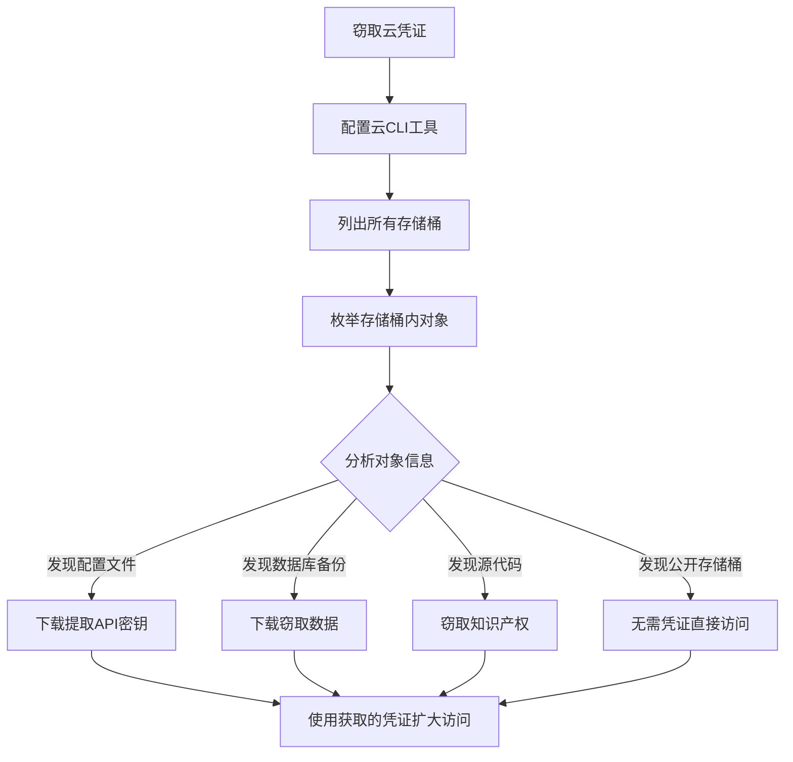

# 云存储对象发现 (T1619)

## 一句话通俗理解

枚举云存储中的对象和文件——攻击者用 `aws s3 ls` 列出云存储桶中的文件，就像小偷翻看仓库里的每个箱子，找值钱的东西。

## 难度等级

- ⭐⭐ 中级（需要一定基础）

## 技术描述

云存储对象发现（T1619）是MITRE ATT&CK框架中的一种发现技术。

**通俗解释：**
云存储（如AWS S3、Azure Blob Storage、GCP Cloud Storage）是企业存放文件的地方——数据库备份、配置文件、日志文件、甚至源代码都可能放在里面。攻击者窃取到云访问凭证后，会用命令行列出存储桶中的所有文件，通过文件名、大小、更新时间等信息判断哪些文件有价值。就像小偷潜入仓库后，逐个查看箱子上的标签，找出装着贵重物品的箱子。

**技术原理：**
1. 在AWS S3中使用 `aws s3 ls` 或 `aws s3api list-objects-v2` 列出存储桶内容
2. 在Azure Blob中使用 `az storage blob list` 或 `Get-AzStorageBlob` 枚举Blob对象
3. 在GCP中使用 `gsutil ls` 或 `storage.objects.list` API
4. 分析对象名称、元数据、标签和大小判断文件价值
5. 检查存储桶是否可公开访问（无需凭证即可读）

**用途与影响：**
云存储对象发现帮助攻击者：定位包含数据库备份的文件（可提取敏感数据）；发现包含API密钥和密码的配置文件；识别源代码和知识产权文件；找到证书和加密密钥文件；评估存储数据的规模和价值（决定勒索金额）。

## 子技术列表

**该技术没有子技术。**

## 攻击流程

### 典型攻击流程

```
获取凭证 --> 列出存储桶 --> 枚举对象 --> 识别高价值文件
```



**步骤详解：**

1. **列出所有存储桶**
   - 通俗描述：查看云账户下有哪些存储空间
   - 技术细节：`aws s3 ls` 列出所有S3存储桶
   - 常用工具：AWS CLI, Azure CLI, gsutil

2. **枚举存储桶内容**
   - 通俗描述：查看存储桶中的文件列表
   - 技术细节：`aws s3 ls s3://<bucket-name>/ --recursive`
   - 常用工具：AWS CLI, az storage blob list

3. **分析文件价值**
   - 通俗描述：通过文件名和元数据判断哪些文件重要
   - 技术细节：搜索包含"backup"、"secret"、"credential"、"production"等关键字的文件
   - 常用工具：grep, Select-String

4. **下载目标文件**
   - 通俗描述：下载识别出的高价值文件
   - 技术细节：`aws s3 cp s3://<bucket>/<file> ./`
   - 常用工具：AWS CLI, Azure CLI

## 真实案例

### 案例1：APT29 - S3存储桶枚举和数据窃取

- **时间**: 2020年-2021年
- **目标**: 云服务提供商、IT软件公司
- **攻击组织**: APT29（Nobelium）
- **手法**: APT29在SolarWinds攻击事件中，利用窃取的OAuth令牌和API凭证访问目标组织的AWS环境。使用 `aws s3api list-buckets` 枚举所有S3存储桶，对发现的每个存储桶运行 `aws s3api list-objects-v2` 列出对象清单。特别关注名称中包含"backup"、"secret"、"config"、"production"关键字的存储桶。分析对象元数据（LastModified、Size）识别最近更新的大型文件，这些文件可能包含数据库备份。
- **影响**: 多个科技公司的源代码和客户数据被窃取
- **参考链接**: [MITRE - APT29](https://attack.mitre.org/groups/G0143/)

### 案例2：Scattered Spider - 云存储中的凭证扫描

- **时间**: 2022年-2023年
- **目标**: 美国电信、游戏和科技企业
- **攻击组织**: Scattered Spider
- **手法**: Scattered Spider通过社交工程获取云平台凭证后，系统性地枚举云存储对象。使用 `aws s3 ls` 列出S3存储桶内容，通过PowerShell的 `Get-AzStorageContainer` 和 `Get-AzStorageBlob` 枚举Azure Blob。特别搜索包含 `.env`、`credentials.json`、`config.js`、`terraform.tfstate` 等文件，这些文件通常包含API密钥和密码。还检查存储对象的版本历史以获取可能已被轮换但仍保留的敏感信息。
- **影响**: 多家大型科技公司被入侵，数据被窃取
- **参考链接**: [MITRE - Scattered Spider](https://attack.mitre.org/groups/G1011/)

### 案例3：TeamTNT - 云存储桶中的挖矿配置发现

- **时间**: 2021年
- **目标**: AWS云环境
- **攻击组织**: TeamTNT
- **手法**: TeamTNT在入侵AWS环境后枚举目标账户下的所有S3存储桶。执行 `aws s3api list-buckets` 获取存储桶列表，对每个存储桶执行 `aws s3api list-objects` 检查文件内容。特别搜索包含Docker镜像配置文件、Kubernetes部署配置和CI/CD管道配置的存储桶。还扫描存储桶中是否存在暴露的SSH公钥文件，将这些公钥添加到EC2实例的authorized_keys中以维持持久化访问。
- **影响**: 大量云服务器被用于加密货币挖矿
- **参考链接**: [MITRE - TeamTNT](https://attack.mitre.org/groups/G0139/)

### 案例4：APT43 (Kimsuky) - 云备份中的凭据收集

- **时间**: 2021年-2022年
- **目标**: 韩国智库、外交机构
- **攻击组织**: APT43（Kimsuky）
- **手法**: APT43在入侵目标网络后，利用受害者已认证的云同步客户端（Google Drive Backup、OneDrive）的访问令牌，通过对应API枚举备份文件。使用Google Drive API的 `files.list` 和OneDrive API枚举云存储中的文件。特别关注浏览器凭据备份文件和邮件导出文件。通过搜索文档MIME类型查找包含敏感业务信息的工作表和文档。
- **影响**: 韩国政府机构敏感信息被窃取
- **参考链接**: [MITRE - APT43](https://attack.mitre.org/groups/G1208/)

## 红队视角

> ⚠️ **免责声明**：以下内容仅用于合法的安全测试、渗透测试和教育目的。未经授权对他人系统进行测试是违法行为。

### 实战技巧

1. **递归列出所有对象**
   `aws s3 ls s3://<bucket-name>/ --recursive` 可以列出存储桶中的所有对象。

2. **搜索特定文件类型**
   结合 `grep` 过滤感兴趣的文件：`aws s3 ls s3://<bucket>/ --recursive | grep -E "\.env|credential|backup|secret"`

3. **检查存储桶权限**
   先尝试 `aws s3 ls s3://<bucket>/` 看是否可公开访问，无需认证即可读取。

### 常用工具

| 工具名称 | 用途 | 平台 | 链接 |
|----------|------|------|------|
| aws s3 ls | 列出S3对象 | 跨平台 | AWS CLI |
| az storage blob list | 列出Azure Blob | 跨平台 | Azure CLI |
| gsutil ls | 列出GCP存储对象 | 跨平台 | GCP SDK |
| Get-AzStorageBlob | PowerShell存储枚举 | Windows | Azure PowerShell |

### 注意事项

- 云存储API调用会被记录在CloudTrail/Audit Logs中
- 某些存储桶启用了版本控制，旧版本可能包含已轮换的凭证
- 公开可读的存储桶是最常被利用的错误配置之一

## 蓝队视角

### 检测要点

1. **异常的存储对象列举**
   - 日志来源：AWS CloudTrail（ListBuckets、ListObjectsV2）
   - 关注字段：来源IP、User-Agent、调用的API
   - 异常特征：非运维角色执行存储对象列举

2. **批量对象下载**
   - 日志来源：CloudTrail（GetObject）
   - 关注字段：短时间内大量GetObject请求
   - 异常特征：单个用户下载大量文件

### 监控建议

- 监控云存储API的 `List*` 操作频率异常激增
- 关注非业务时间段的存储对象枚举和批量下载
- 使用AWS S3 Access Logs检测异常访问模式
- 配置CloudTrail Insights检测异常API调用模式

## 检测建议

### 网络层检测

**检测方法：** 监控云存储对象枚举相关的网络流量，特别关注针对云存储服务（如 AWS S3、Azure Blob、GCS）的批量 List/Get 调用以及匿名存储桶的探测行为。

**具体规则/命令示例：**
```
# 检测针对云存储服务的批量 ListObjectsV2、ListContainers 等枚举操作
# 关注同一用户或 IP 在短时间内对多个存储桶执行对象列表查询的异常模式
# 使用 CloudTrail 或 Azure Storage Analytics 分析存储 API 调用的频率和参数异常
```

### 应用层检测

**AWS CloudTrail关键事件：**
- `ListBuckets`：列举存储桶
- `ListObjectsV2`：列举存储对象
- `GetObject`：下载对象
- `PutObject`：上传对象

**Sigma规则示例：**
```yaml
title: S3 Bucket Object Enumeration
status: experimental
description: Detects S3 bucket object enumeration
logsource:
    product: aws
    service: cloudtrail
detection:
    selection:
        EventName:
            - 'ListBuckets'
            - 'ListObjectsV2'
    condition: selection
level: medium
tags:
    - attack.t1619
```

## 缓解措施

### 优先级1：关键措施

**措施名称：** 实施最小权限IAM

**具体实施步骤：**
1. 仅在必要时授予 `s3:ListBucket` 和 `s3:GetObject` 权限
2. 使用资源级策略限制存储桶访问范围

### 优先级2：重要措施

**措施名称：** 防止公开访问

**具体实施步骤：**
1. 启用S3 Block Public Access
2. 禁用存储桶ACL使用单一访问管理模型

### 优先级3：建议措施

**措施名称：** 加密和审计

**具体实施步骤：**
1. 对所有存储对象实施服务器端加密
2. 启用S3 Access Logs和CloudTrail

### MITRE ATT&CK 缓解措施映射

| 缓解措施ID | 缓解措施名称 | 适用性 | 说明 |
|------------|-------------|--------|------|
| M1026 | Privileged Account Management | 适用 | 限制IAM权限 |
| M1037 | Filter Network Traffic | 适用 | 限制API访问 |
| M1047 | Audit | 适用 | 启用存储审计 |

## 动手实验

> ⚠️ **重要提示**：所有实验必须在隔离的实验室环境中进行，禁止对未授权的真实系统进行测试。

### 实验环境准备

**所需工具：** AWS免费账户

### 实验1：S3存储枚举（初级）

**实验目标：** 学习使用AWS CLI枚举S3存储桶。

**实验步骤：**
1. 配置AWS CLI
2. 执行 `aws s3 ls` 列出存储桶
3. 执行 `aws s3 ls s3://<bucket-name>/` 查看存储桶内容
4. 执行 `aws s3api list-objects-v2 --bucket <bucket-name>` 获取详细对象信息

**预期结果：** 看到S3存储桶中的文件列表和元数据。

**学习要点：** 理解攻击者如何通过CLI枚举云存储对象。

### 实验2：搜索敏感文件（中级）

**实验目标：** 学习在云存储中搜索特定类型的文件。

**实验步骤：**
1. 使用 `aws s3 ls s3://<bucket>/ --recursive | findstr "backup\|secret\|config\|env"` 过滤文件
2. 使用 `aws s3 cp s3://<bucket>/<file> .` 下载目标文件

**预期结果：** 在海量文件中快速定位感兴趣的内容。

## 术语解释

| 术语 | 英文原名 | 通俗解释 |
|------|----------|----------|
| 存储桶 | Bucket | 云上的存储空间容器，用来存放文件对象 |
| 对象 | Object | 云存储中的文件，包括文件本身和元数据 |
| S3 | Simple Storage Service | AWS的云存储服务 |
| Blob | Binary Large Object | Azure的云存储对象 |
| IAM | Identity and Access Management | 身份和访问管理，控制云资源访问权限 |

## 参考资料

### 官方文档

- [MITRE ATT&CK - T1619](https://attack.mitre.org/techniques/T1619/)
- [AWS S3 Documentation](https://docs.aws.amazon.com/AmazonS3/latest/userguide/)
- [Azure Blob Storage Documentation](https://learn.microsoft.com/en-us/azure/storage/blobs/)

### 安全报告

- [MITRE - APT29](https://attack.mitre.org/groups/G0143/)
- [MITRE - Scattered Spider](https://attack.mitre.org/groups/G1011/)
- [MITRE - TeamTNT](https://attack.mitre.org/groups/G0139/)

### 工具与资源

- [AWS S3 Best Practices](https://docs.aws.amazon.com/AmazonS3/latest/userguide/security-best-practices.html)
- [ScoutSuite - Cloud Security Audit](https://github.com/nccgroup/ScoutSuite)
- [CloudSploit](https://cloudsploit.com/)
