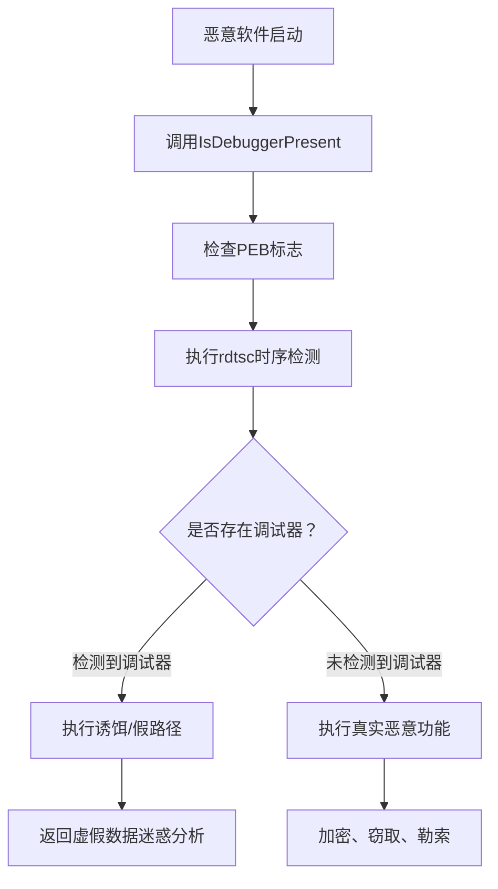

# 调试器规避发现 (T1622)

## 一句话通俗理解

检测是否在被调试器跟踪分析——恶意软件检查有没有调试工具在监控自己，就像小偷在动手前先观察四周有没有便衣警察。

## 难度等级

- ⭐⭐⭐ 高级（需要深入技术知识）

## 技术描述

调试器规避发现（T1622）是MITRE ATT&CK框架中的一种发现技术。

**通俗解释：**
安全分析师会用调试器（如x64dbg、WinDbg）来逐步分析恶意软件的行为，就像科学家用显微镜观察细菌。聪明的恶意软件会主动检查自己是否被"监视"着——比如调用 `IsDebuggerPresent` 这个API来问Windows"有人在调试我吗？"，或者通过测量代码执行时间来判断是否有人在单步跟踪。

**技术原理：**
1. 调用 `IsDebuggerPresent` 检查调试器是否附加到当前进程
2. 调用 `CheckRemoteDebuggerPresent` 检查远程调试器
3. 使用 `NtQueryInformationProcess` 查询进程的调试端口
4. 检查PEB（进程环境块）中的 `BeingDebugged` 标志
5. 使用 `rdtsc` 指令测量代码执行时间差检测单步调试
6. 检查常见调试器进程（x64dbg.exe、windbg.exe、ollydbg.exe）

**用途与影响：**
调试器规避帮助恶意软件：防止被安全分析师逆向分析；延迟或隐藏恶意行为以绕过动态分析；在受控环境中不触发恶意载荷；增加分析成本和时间；保护核心加密算法和payload不被提取。

## 子技术列表

**该技术没有子技术。**

## 攻击流程

### 典型攻击流程

```
启动 --> 检测调试器 --> 判断是否被跟踪 --> 选择执行路径
```



**步骤详解：**

1. **API调试检测**
   - 通俗描述：调用Windows API检查是否有调试器
   - 技术细节：`IsDebuggerPresent()` 检查当前进程的调试状态
   - 常用工具：kernel32.dll API

2. **PEB标志检查**
   - 通俗描述：读取进程环境块中的调试标志
   - 技术细节：检查PEB结构中 `BeingDebugged` 字段（偏移0x02）
   - 常用工具：汇编指令（mov eax, fs:[30h]）

3. **时序检测**
   - 通俗描述：测量代码执行速度判断是否被跟踪
   - 技术细节：使用 `rdtsc` 指令读取CPU周期计数比较时间差
   - 常用工具：rdtsc指令

4. **选择执行路径**
   - 通俗描述：根据检测结果决定执行真实功能还是伪装
   - 技术细节：检测到调试器则执行无害代码路径
   - 常用工具：无（代码逻辑）

## 真实案例

### 案例1：Lazarus Group - VSingle后门的调试器检测

- **时间**: 2019年-2021年
- **目标**: 防务公司、加密货币交易所
- **攻击组织**: Lazarus Group
- **手法**: Lazarus在其VSingle恶意软件中集成了多种调试器检测机制。调用 `IsDebuggerPresent` 和 `CheckRemoteDebuggerPresent` 检查当前进程是否被调试器附加，同时使用 `NtQueryInformationProcess` 查询调试标志。还使用 `rdtsc` 指令进行时序分析，在执行解密例程前后读取CPU周期计数，如果延迟超过预设阈值则判定存在调试器。当检测到调试环境时，执行不同的解码路径返回虚假数据。
- **影响**: 防务公司和加密货币平台敏感数据被窃取
- **参考链接**: [Kaspersky - Lazarus VSingle](https://securelist.com/lazarus-vsingle-malware-debugger-detection/)

### 案例2：APT29 - 延期执行的调试检测

- **时间**: 2020年-2021年
- **目标**: 美国政府机构、IT公司
- **攻击组织**: APT29（Nobelium）
- **手法**: APT29在其TEARDROP后门中包含调试器逃逸技术。通过 `IsDebuggerPresent` API检测调试环境，同时检查 `ProcessDebugFlags` 内核标志。如果检测到调试器，恶意软件不会立即退出，而是进入伪装模式，执行无害的算术运算循环并延迟真正的恶意功能数小时，以规避动态分析沙箱的短时间运行分析。
- **影响**: 多个政府机构网络被长期渗透
- **参考链接**: [Microsoft - TEARDROP](https://www.microsoft.com/security/blog/2020/12/18/analyzing-solorigate-the-compromised-dll-file-that-started-a-sophisticated-cyberattack-and-how-microsoft-defender-helps-protect/)

### 案例3：FIN7 - 多层调试检测

- **时间**: 2017年-2020年
- **目标**: 全球零售、餐饮POS系统
- **攻击组织**: FIN7（Carbanak）
- **手法**: FIN7在其Carbanak后门中实现了多层调试器检测。检查PEB中的 `BeingDebugged` 标志，调用 `CheckRemoteDebuggerPresent` 进行远程调试检测，以及使用 `NtSetInformationThread` 隐藏线程以防止调试器附加子线程。还检测异常处理过滤器的挂钩状态判断是否存在分析工具。如果检测到调试器，会调用 `ExitProcess` 或导致错误弹窗迷惑分析人员。
- **影响**: 数百万张支付卡信息被窃取
- **参考链接**: [FireEye - FIN7](https://www.fireeye.com/blog/threat-research/2018/08/fin7-carbanak-anti-debugging.html)

### 案例4：TrickBot - 沙箱规避的调试检测

- **时间**: 2019年-2021年
- **目标**: 全球企业网络
- **攻击组织**: Wizard Spider（TrickBot）
- **手法**: TrickBot加载器调用 `Sleep` API配合 `NtQueryInformationProcess` 的时序检测，通过模拟长时间空操作来绕过沙箱的超时机制。使用 `GetModuleHandle` 和 `GetProcAddress` 动态解析调试检测函数，避免直接引用敏感API被静态检测。还检查系统制造商字段和特定驱动程序判断虚拟化分析环境。
- **影响**: 大量企业网络被入侵用于部署勒索软件
- **参考链接**: [CrowdStrike - TrickBot](https://www.crowdstrike.com/blog/trickbot-sandbox-evasion-techniques/)

## 红队视角

> ⚠️ **免责声明**：以下内容仅用于合法的安全测试、渗透测试和教育目的。未经授权对他人系统进行测试是违法行为。

### 实战技巧

1. **使用PEB检查调试状态**
   汇编 `mov eax, fs:[0x30]` 获取PEB地址，检查偏移0x02的 `BeingDebugged` 标志。

2. **时序检测**
   使用 `rdtsc` 指令在代码块前后读取CPU时间戳，如果执行时间异常则判定有调试器。

3. **检查调试器窗口**
   使用 `FindWindow` API检查常见调试器的窗口类名（如OLLYDBG、WinDbg）。

### 常用工具

| 工具名称 | 用途 | 平台 | 链接 |
|----------|------|------|------|
 | IsDebuggerPresent | 调试检测API | Windows | kernel32.dll |
| NtQueryInformationProcess | 内核调试查询 | Windows | ntdll.dll |
| rdtsc | CPU时序检测 | 跨平台 | CPU指令 |
| PEB.BeingDebugged | PEB标志检查 | Windows | 进程环境块 |

### 注意事项

- 过于激进的调试检测可能导致合法环境误判
- 高级分析环境会Hook调试检测API返回假值
- 部分调试检测技术（如rdtsc）在不同CPU上结果可能不同

## 蓝队视角

### 检测要点

1. **调试API调用监控**
   - 日志来源：API监控
   - 关注字段：`IsDebuggerPresent`、`CheckRemoteDebuggerPresent` 的调用
   - 异常特征：非开发工具进程调用调试检测API

2. **rdtsc时序检测**
   - 日志来源：ETW（Event Tracing for Windows）
   - 关注字段：`rdtsc` 指令的大量执行
   - 异常特征：非基准测试程序执行CPU时序检测

### 监控建议

- 监控进程对调试检测API的调用
- 审计 `rdtsc` 指令的大量执行
- 关注分析工具进程名被恶意软件扫描的模式
- 使用ETW监控异常进程行为

## 检测建议

### 网络层检测

**检测方法：** 监控调试器规避检测相关的网络流量，特别关注恶意软件在检测调试环境时发出的特征网络请求（如查询特定调试工具的默认端口或已知分析环境 IP）。

**具体规则/命令示例：**
```
# 检测对已知逆向分析工具默认端口（如 IDA 的 23946/tcp）的连接尝试
# 关注恶意样本在运行初期向已知沙箱/分析环境 IP 的探测性连接
# 使用 Zeek 分析 conn 日志，检测非预期主机向分析工具特征端口发起的连接
```

### 主机层检测

**Windows事件ID：**
- 事件ID 4688：进程创建
- Sysmon Event ID 1：进程创建
- ETW：API调用监控

**Sigma规则示例：**
```yaml
title: Debugger Detection API Call
status: experimental
description: Detects calls to debugger detection APIs
logsource:
    category: process_creation
    product: windows
detection:
    selection:
        CommandLine|contains:
            - 'IsDebuggerPresent'
            - 'NtQueryInformationProcess'
    condition: selection
level: medium
tags:
    - attack.t1622
```

## 缓解措施

### 优先级1：关键措施

**措施名称：** 行为分析而非阻止

**具体实施步骤：**
1. 调试器逃逸很难通过传统缓解措施完全防御
2. 重点应用行为分析检测异常API调用序列

### 优先级2：重要措施

**措施名称：** 沙箱增强

**具体实施步骤：**
1. 使用隐藏调试器痕迹的分析环境
2. Hook调试检测API返回假值

### 优先级3：建议措施

**措施名称：** ASR规则

**具体实施步骤：**
1. 启用Windows Defender ASR规则阻止反分析行为
2. 端点执行深度行为分析

### MITRE ATT&CK 缓解措施映射

| 缓解措施ID | 缓解措施名称 | 适用性 | 说明 |
|------------|-------------|--------|------|
| M1040 | Behavior Prevention on Endpoint | 适用 | 行为模式检测 |
| M1041 | Encrypt Sensitive Information | 不适用 | - |
| M1045 | Code Signing | 部分适用 | 限制未签名代码 |

## 动手实验

> ⚠️ **重要提示**：所有实验必须在隔离的实验室环境中进行，禁止对未授权的真实系统进行测试。

### 实验环境准备

**所需工具：** Windows VM + x64dbg

### 实验1：IsDebuggerPresent检测（初级）

**实验目标：** 学习使用调试检测API。

**实验步骤：**
1. 编写调用 `IsDebuggerPresent` 的小程序
2. 在x64dbg中加载并运行程序
3. 观察在不同情况下的返回值变化

**预期结果：** 看到附加调试器时API返回值的差异。

**学习要点：** 理解恶意软件如何使用API检测调试环境。

### 实验2：PEB标志检查（中级）

**实验目标：** 学习通过PEB检测调试器。

**实验步骤：**
1. 在调试器中查看PEB结构
2. 检查 `BeingDebugged` 标志位的值
3. 观察附加/不附加调试器时的差异

**预期结果：** 看到PEB中调试标志在调试状态下的变化。

## 术语解释

| 术语 | 英文原名 | 通俗解释 |
|------|----------|----------|
| 调试器 | Debugger | 用来逐步分析程序运行过程的工具，如x64dbg、WinDbg |
| PEB | Process Environment Block | 进程环境块，Windows存储进程信息的结构 |
| API | Application Programming Interface | 应用程序编程接口 |
| ETW | Event Tracing for Windows | Windows事件跟踪，用于监控系统行为 |
| ASR | Attack Surface Reduction | 攻击面减少，Windows Defender的防护功能 |

## 参考资料

### 官方文档

- [MITRE ATT&CK - T1622](https://attack.mitre.org/techniques/T1622/)
- [Microsoft - IsDebuggerPresent](https://learn.microsoft.com/en-us/windows/win32/api/debugapi/nf-debugapi-isdebuggerpresent)
- [Microsoft - NtQueryInformationProcess](https://learn.microsoft.com/en-us/windows/win32/api/winternl/nf-winternl-ntqueryinformationprocess)

### 安全报告

- [Kaspersky - Lazarus VSingle](https://securelist.com/lazarus-vsingle-malware-debugger-detection/)
- [Microsoft - TEARDROP Analysis](https://www.microsoft.com/security/blog/2020/12/18/analyzing-solorigate-the-compromised-dll-file-that-started-a-sophisticated-cyberattack-and-how-microsoft-defender-helps-protect/)
- [FireEye - FIN7 Anti-Debugging](https://www.fireeye.com/blog/threat-research/2018/08/fin7-carbanak-anti-debugging.html)

### 工具与资源

- [x64dbg](https://x64dbg.com/)
- [WinDbg](https://learn.microsoft.com/en-us/windows-hardware/drivers/debugger/)
- [The "Ultimate" Anti-Debugging Reference](https://anti-debug.checkpoint.com/)
