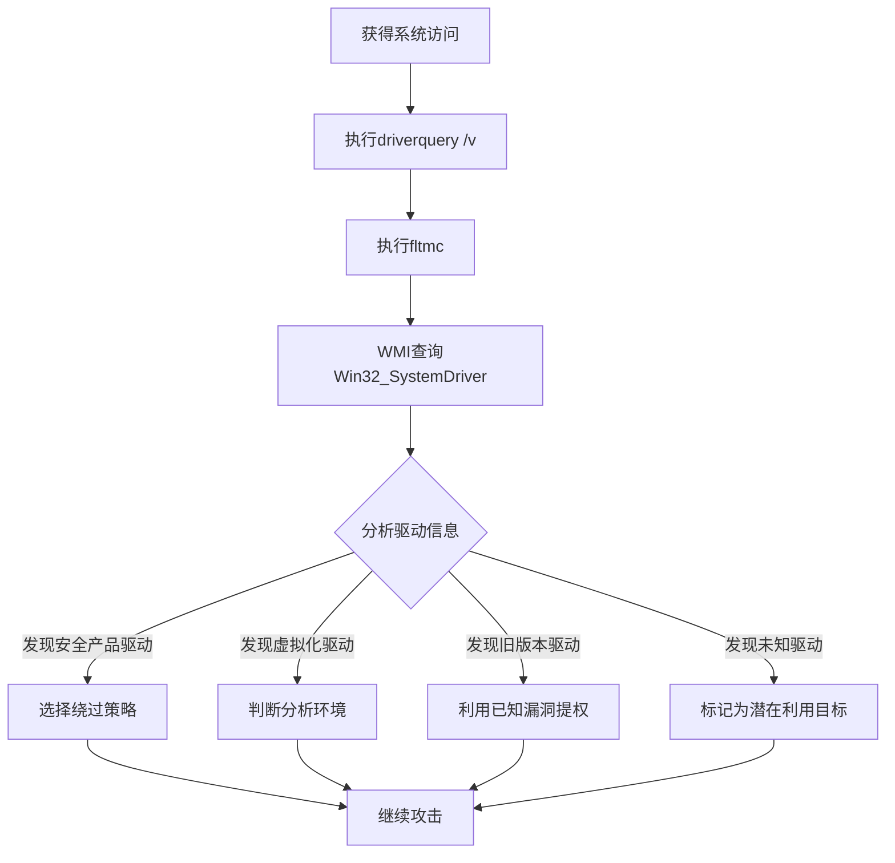

# 设备驱动发现 (T1652)

## 一句话通俗理解

查看系统上安装了哪些驱动程序——攻击者用 `driverquery` 检查系统中的驱动程序，就像查看家里的设备清单，特别关注哪些是监控摄像头。

## 难度等级

- ⭐⭐ 中级（需要一定基础）

## 技术描述

设备驱动发现（T1652）是MITRE ATT&CK框架中的一种发现技术。

**通俗解释：**
设备驱动程序是让操作系统与硬件（如显卡、网卡、硬盘）通信的"翻译官"。攻击者入侵后查看驱动程序列表，主要目的是：检查有没有安全产品的驱动程序（如杀毒软件的底层过滤驱动）、寻找有漏洞的旧版本驱动（可用于权限提升）、检测虚拟化驱动（判断是否在虚拟机中）。就像小偷进入大楼后先看监控系统的品牌和型号，找出盲区。

**技术原理：**
1. 在Windows中使用 `driverquery /v` 列出所有驱动程序详细信息和版本
2. 使用 `fltmc` 列出文件系统过滤器驱动程序（安全产品常用的驱动类型）
3. 使用PowerShell的 `Get-WmiObject Win32_SystemDriver` 枚举系统驱动
4. 查询注册表 `HKLM\SYSTEM\CurrentControlSet\Services` 枚举所有服务驱动
5. 在Linux中使用 `lsmod` 列出已加载的内核模块

**用途与影响：**
设备驱动发现帮助攻击者：识别安全产品的内核模块（如EDR过滤驱动）；发现存在已知漏洞的旧版本驱动（可用于提权）；检测虚拟化驱动判断分析环境；定位可滥用的驱动（如BYOD - 自带易受攻击驱动程序技术）；了解系统的硬件配置。

## 子技术列表

**该技术没有子技术。**

## 攻击流程

### 典型攻击流程

```
枚举驱动 --> 识别安全产品 --> 检测虚拟化 --> 规划攻击
```



**步骤详解：**

1. **枚举所有驱动程序**
   - 通俗描述：查看系统中安装了哪些驱动
   - 技术细节：`driverquery /v` 显示所有驱动的名称、类型、状态和文件路径
   - 常用工具：driverquery.exe

2. **检测过滤器驱动**
   - 通俗描述：查看文件系统过滤器（安全产品常用）
   - 技术细节：`fltmc filters` 列出已注册的文件系统过滤器
   - 常用工具：fltmc.exe

3. **WMI驱动查询**
   - 通俗描述：通过WMI获取更详细的驱动信息
   - 技术细节：`Get-WmiObject Win32_SystemDriver | Select-Object Name, State, StartMode`
   - 常用工具：PowerShell

4. **分析利用**
   - 通俗描述：根据驱动信息调整攻击策略
   - 技术细节：匹配驱动名称与已知安全产品库、查找旧版本驱动的CVE
   - 常用工具：自定义脚本

## 真实案例

### 案例1：APT29 - 安全产品驱动识别

- **时间**: 2020年-2021年
- **目标**: 美国政府机构、IT供应链
- **攻击组织**: APT29（Nobelium）
- **手法**: APT29在SolarWinds攻击活动中使用BEACON后门执行设备驱动发现。通过 `driverquery /v` 列出所有驱动程序的详细信息，特别关注已知安全产品相关的驱动名称和文件路径。通过 `fltmc` 命令列出已注册的文件系统过滤器驱动及其加载顺序，评估目标环境中的安全监控层级。识别出的安全产品信息用于调整后门的持久化策略和横向移动技术以规避检测。
- **影响**: 多个美国政府部门网络被长期渗透
- **参考链接**: [Microsoft - SolarWinds](https://www.microsoft.com/security/blog/2020/12/18/analyzing-solorigate-the-compromised-dll-file-that-started-a-sophisticated-cyberattack-and-how-microsoft-defender-helps-protect/)

### 案例2：FIN7 - 虚拟化驱动检测与沙箱规避

- **时间**: 2017年-2020年
- **目标**: 全球零售、餐饮POS系统
- **攻击组织**: FIN7（Carbanak）
- **手法**: FIN7在其Carbanak后门中通过WMI查询所有驱动程序列表，检查是否存在VMware工具驱动（vmmouse.sys、vm3dmp.sys）、VirtualBox驱动（VBoxGuest.sys）等虚拟化驱动。如果检测到虚拟化驱动程序，恶意软件假设自身处于分析环境而推迟或隐藏恶意活动。还检查注册表中虚拟化适配器驱动的安装痕迹。
- **影响**: 数百万张支付卡信息被窃取
- **参考链接**: [FireEye - FIN7](https://www.fireeye.com/blog/threat-research/2018/08/fin7-anti-virtualization.html)

### 案例3：TrickBot - 过滤器驱动识别安全产品

- **时间**: 2019年-2021年
- **目标**: 全球企业网络
- **攻击组织**: Wizard Spider（TrickBot）
- **手法**: TrickBot维护一个已知安全产品驱动签名数据库，将枚举到的驱动程序名称与已知的安全产品驱动（如Wdfilter.sys、mwac.sys、SymEFASI.sys等）进行匹配。检测到特定安全产品后调整进程注入和持久化策略。还使用 `driverquery` 收集驱动版本信息，发现已被CVE标记的易受攻击驱动程序。
- **影响**: 大量企业网络被入侵用于部署勒索软件
- **参考链接**: [CrowdStrike - TrickBot](https://www.crowdstrike.com/blog/trickbot-driver-discovery/)

### 案例4：Lazarus Group - 内核驱动枚举用于权限提升

- **时间**: 2020年-2022年
- **目标**: 加密货币交易所、科技公司
- **攻击组织**: Lazarus Group
- **手法**: Lazarus使用自定义工具枚举已加载的内核驱动程序，特别关注第三方硬件驱动程序的版本信息。通过 `driverquery /v` 获取驱动版本号和文件路径，与已知的内核漏洞进行对比，识别存在已知漏洞但尚未修补的驱动程序，用于计划内核级权限提升攻击（BYOD技术）。
- **影响**: 多国加密货币平台被入侵
- **参考链接**: [Kaspersky - Lazarus](https://securelist.com/lazarus-driver-enumeration/)

## 红队视角

> ⚠️ **免责声明**：以下内容仅用于合法的安全测试、渗透测试和教育目的。未经授权对他人系统进行测试是违法行为。

### 实战技巧

1. **快速查看安全产品驱动**
   `fltmc filters` 可以直接看到文件系统过滤驱动，安全产品通常以过滤驱动形式存在。

2. **检测VMware驱动**
   检查 `driverquery /v | findstr "vm"` 快速判断是否在VMware中。

3. **注册表驱动查询**
   `Get-ChildItem HKLM:\SYSTEM\CurrentControlSet\Services\ | Where-Object {$_.GetValue('Type') -eq 1}` 枚举所有内核驱动。

### 常用工具

| 工具名称 | 用途 | 平台 | 链接 |
|----------|------|------|------|
| driverquery | 驱动列表查询 | Windows | 内置命令 |
| fltmc | 过滤器驱动查询 | Windows | 内置命令 |
| Get-WmiObject | WMI驱动查询 | Windows | 内置PowerShell |
| lsmod | Linux内核模块 | Linux | 内置命令 |

### 注意事项

- `driverquery` 需要管理员权限才能获取完整信息
- 安全产品可能隐藏自己的驱动信息
- 虚拟化驱动的检测可能被高级沙箱伪造

## 蓝队视角

### 检测要点

1. **异常的driverquery执行**
   - 日志来源：Sysmon Event ID 1
   - 关注字段：`driverquery` / `fltmc` 命令的执行
   - 异常特征：非管理员或非IT运维人员执行驱动查询

2. **WMI驱动枚举**
   - 日志来源：WMI-Activity Event ID 5861
   - 关注字段：对 `Win32_SystemDriver` 的查询
   - 异常特征：非系统进程查询驱动信息

### 监控建议

- 监控 `driverquery` 和 `fltmc` 命令的异常执行
- 审计WMI查询 `Win32_SystemDriver` 的行为
- 关注驱动查询后的恶意驱动加载行为
- 检测BYOD（自带易受攻击驱动程序）技术中加载的已知漏洞驱动

## 检测建议

### 网络层检测

**检测方法：** 监控远程设备驱动枚举的网络流量，特别关注通过 WMI 查询远程系统驱动程序列表的异常行为。

**具体规则/命令示例：**
```
# 检测 WMI 远程查询 Win32_SystemDriver 或 Win32_PnPSignedDriver 的流量
# 关注同一主机对多个远程系统执行驱动枚举查询的横向移动特征
# 使用 Zeek 分析 dce_rpc 日志，检测 WMI 相关 UUID 的频繁远程调用
```

### 主机层检测

**Windows事件ID：**
- 事件ID 4688：进程创建（监控driverquery.exe, fltmc.exe）
- 事件ID 5861：WMI活动
- Sysmon Event ID 1：进程创建

**Sigma规则示例：**
```yaml
title: Device Driver Discovery via driverquery
status: experimental
description: Detects driverquery command execution
logsource:
    category: process_creation
    product: windows
detection:
    selection:
        CommandLine|contains: 'driverquery'
    condition: selection
level: low
tags:
    - attack.t1652
```

## 缓解措施

### 优先级1：关键措施

**措施名称：** 驱动程序签名强制

**具体实施步骤：**
1. 仅允许加载经过认证签名的内核驱动程序
2. 启用Windows Driver Signature Enforcement

### 优先级2：重要措施

**措施名称：** Hypervisor-protected Code Integrity

**具体实施步骤：**
1. 启用HVCI（内存完整性）
2. 使用WDAC限制允许加载的驱动

### 优先级3：建议措施

**措施名称：** 限制管理员权限

**具体实施步骤：**
1. 限制管理员权限的分发
2. 定期更新第三方驱动程序

### MITRE ATT&CK 缓解措施映射

| 缓解措施ID | 缓解措施名称 | 适用性 | 说明 |
|------------|-------------|--------|------|
| M1026 | Privileged Account Management | 适用 | 限制管理员权限 |
| M1038 | Execution Prevention | 部分适用 | WDAC驱动限制 |
| M1045 | Code Signing | 适用 | 驱动签名验证 |

## 动手实验

> ⚠️ **重要提示**：所有实验必须在隔离的实验室环境中进行，禁止对未授权的真实系统进行测试。

### 实验环境准备

**所需工具：** Windows VM

### 实验1：基本驱动枚举（初级）

**实验目标：** 学习使用driverquery查看驱动程序。

**实验步骤：**
1. 执行 `driverquery` 查看驱动列表
2. 执行 `driverquery /v` 查看详细版本信息
3. 执行 `fltmc` 查看文件系统过滤器

**预期结果：** 看到系统中安装的驱动程序和过滤器驱动列表。

**学习要点：** 理解攻击者如何通过驱动信息判断安全产品和分析环境。

### 实验2：Linux内核模块枚举（中级）

**实验目标：** 学习在Linux中查看内核模块。

**实验步骤：**
1. 执行 `lsmod` 查看已加载的内核模块
2. 执行 `lspci -k` 查看PCI设备及关联驱动
3. 读取 `/proc/modules` 查看模块加载状态

**预期结果：** 看到Linux系统中的内核模块和驱动信息。

## 术语解释

| 术语 | 英文原名 | 通俗解释 |
|------|----------|----------|
| 驱动程序 | Device Driver | 操作系统与硬件通信的翻译软件 |
| 内核模块 | Kernel Module | Linux中可动态加载的内核扩展 |
| 过滤器驱动 | Filter Driver | 在文件操作路径上插入监控的驱动，安全产品常使用 |
| BYOD | Bring Your Own Vulnerable Driver | 攻击者利用已签名但有漏洞的驱动提权的技术 |
| HVCI | Hypervisor-protected Code Integrity | 基于虚拟化的代码完整性保护 |

## 参考资料

### 官方文档

- [MITRE ATT&CK - T1652](https://attack.mitre.org/techniques/T1652/)
- [Microsoft - driverquery](https://learn.microsoft.com/en-us/windows-server/administration/windows-commands/driverquery)
- [Microsoft - fltmc](https://learn.microsoft.com/en-us/windows-server/administration/windows-commands/fltmc)

### 安全报告

- [Microsoft - SolarWinds Driver Discovery](https://www.microsoft.com/security/blog/2020/12/18/analyzing-solorigate-the-compromised-dll-file-that-started-a-sophisticated-cyberattack-and-how-microsoft-defender-helps-protect/)
- [FireEye - FIN7 Anti-Virtualization](https://www.fireeye.com/blog/threat-research/2018/08/fin7-anti-virtualization.html)
- [CrowdStrike - TrickBot Driver Discovery](https://www.crowdstrike.com/blog/trickbot-driver-discovery/)

### 工具与资源

- [PowerShell Win32_SystemDriver](https://learn.microsoft.com/en-us/windows/win32/cimwin32prov/win32-systemdriver)
- [Windows Driver Signature Enforcement](https://learn.microsoft.com/en-us/windows-hardware/drivers/install/driver-signing)
