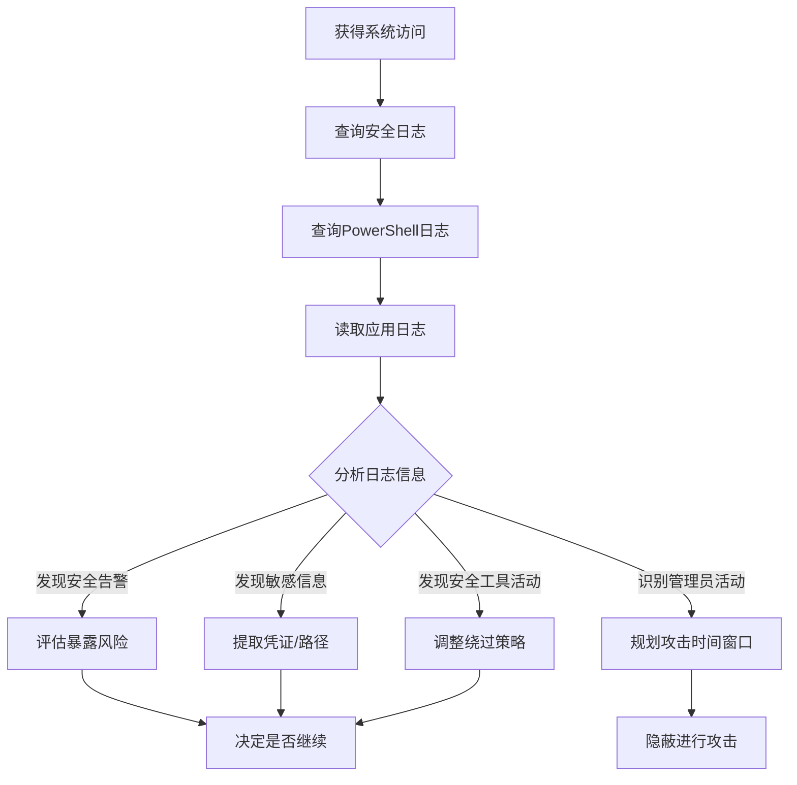

# 日志枚举 (T1654)

## 一句话通俗理解

浏览系统和应用日志寻找信息——攻击者用 `wevtutil` 或阅读日志文件来分析系统活动，就像小偷查看大楼的监控记录，了解保安的巡逻规律。

## 难度等级

- ⭐⭐ 中级（需要一定基础）

## 技术描述

日志枚举（T1654）是MITRE ATT&CK框架中的一种发现技术。

**通俗解释：**
系统和应用程序会记录详细的日志——谁登录了、运行了什么程序、访问了哪些文件。攻击者入侵后会读取这些日志来了解：管理员一般在什么时间工作（选择最佳攻击窗口）、安全团队有没有发现入侵迹象（评估被发现风险）、有哪些高权限用户最近登录过（横向移动目标）。就像小偷查看大楼的访客登记表，了解哪些房间有人、保安什么时候换班。

**技术原理：**
1. 在Windows中使用 `wevtutil qe Security` 查询安全事件日志
2. 使用PowerShell的 `Get-WinEvent` 筛选特定事件ID（如4624登录成功）
3. 在Linux中读取 `/var/log/auth.log`、`/var/log/syslog` 等日志文件
4. 读取Web服务器日志（Apache access.log、Nginx access.log）
5. 查询AWS CloudTrail、Azure Activity Log等云平台审计日志

**用途与影响：**
日志枚举帮助攻击者：评估是否已被安全团队发现（检查安全工具告警）；了解管理员活动模式（选择最佳攻击时间）；发现其他攻击者的竞争痕迹；从错误日志中提取敏感信息（数据库连接字符串、API路径）；追踪域管理员活动目标；查找包含明文密码的错误日志。

## 子技术列表

**该技术没有子技术。**

## 攻击流程

### 典型攻击流程

```
查询日志 --> 分析活动模式 --> 评估风险 --> 规划下一步
```



**步骤详解：**

1. **查询安全事件日志**
   - 通俗描述：查看最近的安全事件记录
   - 技术细节：`wevtutil qe Security /c:20 /rd:true /f:text` 查看最近的安全事件
   - 常用工具：wevtutil.exe, Get-WinEvent

2. **查询PowerShell日志**
   - 通俗描述：查看是否有安全团队执行的调查命令
   - 技术细节：`Get-WinEvent -LogName 'Microsoft-Windows-PowerShell/Operational'`
   - 常用工具：PowerShell

3. **读取应用日志**
   - 通俗描述：查看应用程序日志中的信息
   - 技术细节：检查Web服务器日志、数据库日志等
   - 常用工具：cat, tail, type

4. **分析日志内容**
   - 通俗描述：从日志中提取有用信息
   - 技术细节：关注登录事件ID 4624、进程创建事件ID 4688
   - 常用工具：grep, Select-String

## 真实案例

### 案例1：APT41 - 安全审计日志检查

- **时间**: 2019年-2021年
- **目标**: 全球科技、制药、游戏公司
- **攻击组织**: APT41（Winnti）
- **手法**: APT41在入侵企业网络后系统性地枚举Windows安全日志以评估被发现风险。使用 `wevtutil qe Security` 查询最近的进程创建事件，检查是否有安全工具（EDR代理、杀毒软件扫描进程）的启动记录。还枚举组成员变更事件（Event ID 4728、4732）识别哪些用户账户被添加进管理组。通过这些日志分析目标组织的安全响应态势。
- **影响**: 多家高科技公司敏感数据被窃取
- **参考链接**: [MITRE - APT41](https://attack.mitre.org/groups/G0096/)

### 案例2：Wizard Spider - 用户活动模式分析

- **时间**: 2019年-2022年
- **目标**: 全球企业、医疗机构
- **攻击组织**: Wizard Spider（TrickBot/Conti）
- **手法**: Wizard Spider使用自定义PowerShell脚本枚举安全日志和PowerShell操作日志。特别关注 `Microsoft-Windows-PowerShell/Operational` 中记录的所有PowerShell命令，检查是否存在安全团队响应期间执行的调查性指令。通过 `Microsoft-Windows-Sysmon/Operational` 日志了解安全监控覆盖范围。还枚举远程桌面会话日志追踪管理员活动模式，据此制定隐蔽的数据窃取时间窗口。
- **影响**: 多家大型企业被勒索，损失数千万美元
- **参考链接**: [MITRE - Wizard Spider](https://attack.mitre.org/groups/G0102/)

### 案例3：Lazarus Group - Web服务器日志采集

- **时间**: 2020年-2022年
- **目标**: 加密货币交易所、防务承包商
- **攻击组织**: Lazarus Group
- **手法**: Lazarus在入侵Web服务器后读取Apache和Nginx的访问日志以获取攻击情报。通过分析HTTP访问日志识别安全扫描工具的流量，判断目标Web环境是否被安全工具监控。还分析错误日志中可能泄露的数据库表结构和API路径。在清空前将日志内容打包外传用于离线分析。
- **影响**: 多国加密货币平台被入侵
- **参考链接**: [MITRE - Lazarus](https://attack.mitre.org/groups/G0032/)

### 案例4：APT29 - 邮件和协作平台日志枚举

- **时间**: 2020年-2021年
- **目标**: 美国政府机构、IT供应链
- **攻击组织**: APT29（Nobelium）
- **手法**: APT29通过TEARDROP后门访问受害者的Exchange服务器并枚举邮件传输日志（Get-MessageTrackingLog）。还枚举Azure AD登录日志了解合法用户登录时间和IP范围。通过分析Azure AD审计日志识别具有特权角色的用户账户，确定后续横向移动目标。
- **影响**: 多个政府机构网络被长期渗透
- **参考链接**: [MITRE - APT29](https://attack.mitre.org/groups/G0143/)

## 红队视角

> ⚠️ **免责声明**：以下内容仅用于合法的安全测试、渗透测试和教育目的。未经授权对他人系统进行测试是违法行为。

### 实战技巧

1. **快速查看安全事件**
   `wevtutil qe Security /c:10 /rd:true /f:text` 查看最新的10条安全事件。

2. **PowerShell日志查询**
   `Get-WinEvent -LogName 'Microsoft-Windows-PowerShell/Operational' -MaxEvents 50 | Where-Object {$_.Id -eq 4104}`

3. **Linux日志检查**
   `tail -n 100 /var/log/auth.log | grep "Failed password"` 查看失败的登录尝试。

### 常用工具

| 工具名称 | 用途 | 平台 | 链接 |
|----------|------|------|------|
| wevtutil | 事件日志查询 | Windows | 内置命令 |
| Get-WinEvent | PowerShell日志查询 | Windows | 内置PowerShell |
| tail/grep | Linux日志查看 | Linux | 内置命令 |
| Get-MessageTrackingLog | Exchange日志 | Windows | Exchange PowerShell |

### 注意事项

- 读取安全日志通常需要管理员权限
- 频繁的日志查询本身可能被安全工具记录
- 某些日志文件可能在读取时被锁定

## 蓝队视角

### 检测要点

1. **异常的日志查询行为**
   - 日志来源：Sysmon Event ID 1
   - 关注字段：`wevtutil`、`Get-WinEvent` 的批量执行
   - 异常特征：非安全运维人员查询安全日志

2. **日志清除行为**
   - 日志来源：Event ID 1102（安全日志已清空）
   - 关注字段：日志清除事件
   - 异常特征：非授权的日志清除操作

### 监控建议

- 监控 `wevtutil` 命令对安全日志的批量查询
- 对 `Get-WinEvent` 启用ScriptBlock日志记录
- 监控Linux `/var/log/` 目录下日志文件的批量读取
- 配置日志完整性监控防止日志被篡改

## 检测建议

### 网络层检测

**检测方法：** 监控远程日志枚举的网络流量，特别关注通过 WMI/RPC 远程查询事件日志的异常行为以及日志数据通过网络的批量迁移流量。

**具体规则/命令示例：**
```
# 检测通过 WMI 远程执行 wevtutil 或 Get-WinEvent 查询事件日志的流量
# 关注同一主机对多个远程系统的日志转发或事件订阅流量
# 使用 Zeek 分析 dce_rpc 日志，检测与 Windows Event Log 服务相关的异常 RPC 调用
```

### 主机层检测

**Windows事件ID：**
- 事件ID 4688：进程创建（监控wevtutil.exe）
- 事件ID 1102：安全日志已清空
- 事件ID 4104：PowerShell脚本执行

**Sigma规则示例：**
```yaml
title: Security Log Enumeration via wevtutil
status: experimental
description: Detects wevtutil querying security logs
logsource:
    category: process_creation
    product: windows
detection:
    selection:
        CommandLine|contains|all:
            - 'wevtutil'
            - 'Security'
    condition: selection
level: medium
tags:
    - attack.t1654
```

## 缓解措施

### 优先级1：关键措施

**措施名称：** 日志集中管理

**具体实施步骤：**
1. 将日志集中转发到远程日志服务器
2. 配置Windows Event Forwarding

### 优先级2：重要措施

**措施名称：** 限制日志访问权限

**具体实施步骤：**
1. 限制非管理员用户读取安全日志
2. 启用受保护事件日志记录

### 优先级3：建议措施

**措施名称：** 日志完整性监控

**具体实施步骤：**
1. 配置日志文件完整性监控
2. 使用SIEM检测日志清除行为

### MITRE ATT&CK 缓解措施映射

| 缓解措施ID | 缓解措施名称 | 适用性 | 说明 |
|------------|-------------|--------|------|
| M1026 | Privileged Account Management | 适用 | 限制日志访问 |
| M1047 | Audit | 适用 | 启用日志审计 |
| M1048 | Application Isolation and Sandboxing | 不适用 | - |

## 动手实验

> ⚠️ **重要提示**：所有实验必须在隔离的实验室环境中进行，禁止对未授权的真实系统进行测试。

### 实验环境准备

**所需工具：** Windows VM

### 实验1：Windows事件日志查询（初级）

**实验目标：** 学习使用wevtutil和PowerShell查询事件日志。

**实验步骤：**
1. 执行 `wevtutil el` 列出所有日志通道
2. 执行 `wevtutil qe Security /c:10 /rd:true /f:text` 查看安全事件
3. 使用PowerShell: `Get-WinEvent -LogName Security -MaxEvents 10`

**预期结果：** 看到系统安全日志中的事件记录。

**学习要点：** 理解攻击者如何通过日志分析系统活动。

### 实验2：Linux日志查看（中级）

**实验目标：** 学习在Linux中查看系统日志。

**实验步骤：**
1. 查看 `/var/log/auth.log` 中的登录记录
2. 使用 `grep "Failed password" /var/log/auth.log` 查找失败登录
3. 使用 `last` 命令查看最近登录历史

**预期结果：** 看到系统的登录历史和安全事件。

## 术语解释

| 术语 | 英文原名 | 通俗解释 |
|------|----------|----------|
| 事件日志 | Event Log | Windows系统记录的操作事件，类似飞机的黑匣子 |
| SIEM | Security Information and Event Management | 安全信息和事件管理系统，集中收集分析日志 |
| Sysmon | System Monitor | 微软的高级系统监控工具，记录详细系统活动 |
| WEF | Windows Event Forwarding | Windows事件转发，将日志发送到中央收集器 |
| 审计日志 | Audit Log | 记录谁在什么时间做了什么操作的日志 |

## 参考资料

### 官方文档

- [MITRE ATT&CK - T1654](https://attack.mitre.org/techniques/T1654/)
- [Microsoft - wevtutil](https://learn.microsoft.com/en-us/windows-server/administration/windows-commands/wevtutil)
- [Microsoft - Get-WinEvent](https://learn.microsoft.com/en-us/powershell/module/microsoft.powershell.diagnostics/get-winevent)

### 安全报告

- [MITRE - APT41](https://attack.mitre.org/groups/G0096/)
- [MITRE - Wizard Spider](https://attack.mitre.org/groups/G0102/)
- [MITRE - APT29](https://attack.mitre.org/groups/G0143/)

### 工具与资源

- [Windows Event Logging Best Practices](https://learn.microsoft.com/en-us/windows-server/identity/ad-ds/plan/appendix-e--securing-event-logs)
- [Sysinternals Sysmon](https://learn.microsoft.com/en-us/sysinternals/downloads/sysmon)
- [Linux Log File Analysis](https://linux-audit.com/linux-system-log-files-and-their-uses/)
