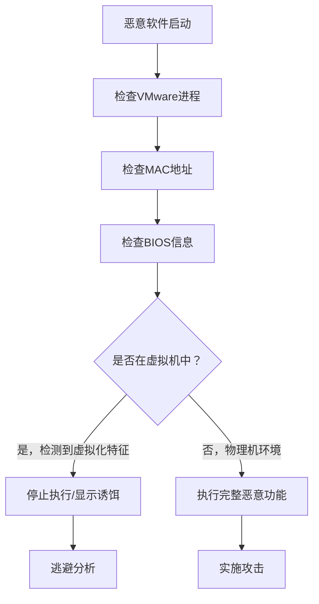

# 虚拟机发现 (T1673)

## 一句话通俗理解

检测当前是否运行在虚拟机中——攻击者检查系统的硬件特征判断是否在VMware/VirtualBox等虚拟机中，就像小偷先确认自己是不是在假扮的样板间里。

## 30秒速查卡

| 维度 | 你需要知道的 |
|------|-------------|
| 这是什么？ | 攻击者检查 VM 进程（vmtoolsd.exe）、MAC 地址前缀（00:50:56/00:0C:29/08:00:27）、BIOS 序列号、虚拟化驱动注册表键来判断是否运行在 VMware/VirtualBox/Hyper-V 中 |
| 为什么危险？ | 恶意软件在沙箱中检测到虚拟化特征后会停止运行或显示无害行为，让安全分析师的动态分析完全失效——这是高级恶意软件的核心反分析能力 |
| 谁需要关心？ | 沙箱运维团队、恶意软件分析师、威胁狩猎团队、EDR运维 |
| 你的第一步防御 | 监控 `wmic bios get serialnumber`、`tasklist` 查找 VM 进程、`ipconfig /all` 检查 MAC 地址前缀的组合调用 |
| 如果只做一件事 | 对进程启动后依次查询 BIOS 信息→MAC 地址→VM 进程的链式行为立即告警——这是恶意软件在"全方位检测虚拟化环境" |

## 难度等级

- ⭐⭐ 中级（需要一定基础）

## 技术描述

虚拟机发现（T1673）是MITRE ATT&CK框架中的一种发现技术。

**通俗解释：**
安全分析师经常把恶意软件放在虚拟机里分析（因为虚拟机可以快速恢复）。攻击者不想被分析，所以会检查自己是否在虚拟机中——检查是否有VMware Tools、检查MAC地址是否以00:50:56开头（VMware特征）、检查BIOS信息、检查特定的虚拟化驱动程序。如果发现自己在虚拟机中，恶意软件就装示弱或停止运行，让分析师白忙一场。

**技术原理：**
1. 检查VMware/VirtualBox工具进程（vmtoolsd.exe、vboxservice.exe）
2. 检查MAC地址前缀（VMware: 00:50:56、00:0C:29; VirtualBox: 08:00:27）
3. 使用WMI查询BIOS信息（`wmic bios get serialnumber` 检测VMware特征序列号）
4. 检查注册表中的虚拟化痕迹（SCSI磁盘标识、虚拟化驱动键值）
5. 在Linux中检查 `/proc/1/cgroup` 和 `dmesg` 输出

**用途与影响：**
虚拟机发现帮助攻击者：判断是否在被分析的虚拟化环境中；在真实物理机上执行恶意行为；规避沙箱和动态分析平台的检测；调整恶意软件行为隐藏真实功能。

## 子技术列表

**该技术没有子技术。**

## 攻击流程

### 典型攻击流程

```
启动 --> 检查虚拟化特征 --> 判断环境 --> 选择行为
```



**步骤详解：**

1. **检查虚拟化进程**
   - 通俗描述：查看是否有虚拟机工具的进程在运行
   - 技术细节：检查 `vmtoolsd.exe`、`vboxservice.exe` 等进程
   - 常用工具：tasklist.exe

2. **检查硬件特征**
   - 通俗描述：查看MAC地址和BIOS信息
   - 技术细节：`wmic bios get serialnumber`、`ipconfig /all`
   - 常用工具：wmic.exe, ipconfig.exe

3. **检查注册表痕迹**
   - 通俗描述：查看注册表中的虚拟化驱动信息
   - 技术细节：检查 `HKLM\HARDWARE\DEVICEMAP\Scsi\` 中的虚拟化标识
   - 常用工具：reg query

4. **判断执行路径**
   - 通俗描述：根据检测结果决定是否执行恶意功能
   - 技术细节：虚拟化环境执行诱饵，物理机执行真实载荷
   - 常用工具：无（代码逻辑）

## 真实案例

### 案例1：REvil (Sodinokibi) - 加密前检测虚拟化环境

- **时间**: 2020年-2022年
- **目标**: 全球MSP（托管服务提供商）、企业IT环境
- **攻击组织**: REvil
- **手法**: REvil勒索软件在部署勒索程序前检测虚拟化环境。通过PowerShell加载VMware PowerCLI模块使用 `Get-VM` cmdlet查询vCenter Server获取完整的虚拟机清单。特别关注虚拟机名称中包含"SQL"、"DC"、"Backup"、"EXCHANGE"、"SAP"等关键词的虚拟机，在加密过程中优先加密高价值系统。还检测ESXi主机上的快照文件，删除快照以增加数据恢复难度。
- **影响**: 全球多家大型企业被勒索
- **参考链接**: [MITRE - REvil](https://attack.mitre.org/software/S0673/)

### 案例2：Conti - 虚拟化基础设施扫描

- **时间**: 2021年-2022年
- **目标**: 全球医疗、政府、制造业企业
- **攻击组织**: Conti
- **手法**: Conti勒索软件系统化地枚举受害者的VMware和Hyper-V基础设施。使用内置的 `Get-VM` PowerShell cmdlet列出Hyper-V主机上的所有运行中虚拟机，配合 `Get-VMHost` 获取宿主机信息。通过WMI查询获取虚拟机状态数据。特别重视枚举vCenter上已关闭电源的VM，这些系统通常缺乏及时的安全补丁更新，成为加密的脆弱目标。
- **影响**: 多家医疗和政府机构被勒索
- **参考链接**: [MITRE - Conti](https://attack.mitre.org/groups/G0130/)

### 案例3：APT29 - vCenter虚拟机测绘

- **时间**: 2021年-2022年
- **目标**: 全球IT服务提供商、咨询公司
- **攻击组织**: APT29（Nobelium）
- **手法**: APT29在其后SolarWinds攻击阶段广泛枚举VMware vCenter环境中的虚拟机。使用VMware PowerCLI连接到vCenter Server获取详细虚拟机清单，包括名称、电源状态、操作系统类型和VMware Tools状态。还枚举vCenter中的虚拟机模板，这些模板可能包含预配置的管理员凭据。
- **影响**: 多个IT服务提供商被渗透
- **参考链接**: [MITRE - APT29](https://attack.mitre.org/groups/G0143/)

### 案例4：Ryuk - Hyper-V虚拟机发现

- **时间**: 2019年-2021年
- **目标**: 全球医疗机构、地方政府
- **攻击组织**: Ryuk
- **手法**: Ryuk勒索软件团队在手动攻击流程中使用PowerShell枚举Hyper-V环境中的虚拟机。远程登录到Hyper-V宿主机后执行 `Get-VM -ComputerName <hyperv_host>` 获取所有虚拟机列表。使用 `Get-VMSnapshot` 检查虚拟机快照配置，预先关闭高价值数据库和邮件服务器虚拟机的快照保护机制后再执行加密。
- **影响**: 全球多家医疗机构被勒索
- **参考链接**: [MITRE - Ryuk](https://attack.mitre.org/software/S0446/)

## 红队视角

> ⚠️ **免责声明**：以下内容仅用于合法的安全测试、渗透测试和教育目的。未经授权对他人系统进行测试是违法行为。

### 实战技巧

1. **快速检测VMware**
   `tasklist /fi "imagename eq vmtoolsd.exe"` 检查VMware Tools进程。

2. **硬件检测**
   `wmic bios get serialnumber` 查看BIOS序列号（VMware虚拟机有特征序列号）。

3. **MAC地址检测**
   `ipconfig /all | findstr "00-50-56"` 快速检测VMware MAC地址前缀。

### 常用工具

| 工具名称 | 用途 | 平台 | 链接 |
|----------|------|------|------|
| wmic | 硬件信息查询 | Windows | 内置命令 |
| tasklist | 进程列表查看 | Windows | 内置命令 |
| ipconfig | 网络配置查看 | Windows | 内置命令 |
| Get-VM | PowerShell虚拟机查询 | Windows | Hyper-V模块 |

### 注意事项

- 高级沙箱会隐藏虚拟化特征来迷惑恶意软件
- 某些物理机也可能具有虚拟化特征（如嵌套虚拟化）
- 虚拟化检测仅是恶意软件反分析的一环

## 蓝队视角

### 检测要点

1. **异常的虚拟化特征查询**
   - 日志来源：Sysmon Event ID 1
   - 关注字段：`wmic bios`、`tasklist` 查找虚拟机进程
   - 异常特征：非管理员查询虚拟化信息

2. **PowerCLI模块加载**
   - 日志来源：PowerShell日志
   - 关注字段：`Import-Module VMware.VimAutomation.Core`
   - 异常特征：非虚拟化管理员的PowerCLI使用

### 监控建议

- 监控 `wmic bios` 和 `tasklist` 中的虚拟机相关查询
- 审计VMware PowerCLI和Hyper-V PowerShell cmdlet的使用
- 关注虚拟化环境中的异常 `Get-VM` 执行
- 监控ESXi主机上的可疑命令执行

## 检测建议

### 网络层检测

**检测方法：** 监控虚拟机检测相关的网络流量，特别关注通过查询虚拟化平台特征端口、VMware Tools 服务以及 hypervisor 特定 API 来判断运行环境的网络行为。

**具体规则/命令示例：**
```
# 检测对 VirtualBox 主机到客户机通信端口（TCP 3389 变体特征）的连接探测
# 关注 DNS 查询中针对 VMWare 相关服务名称（如 vmtoolsd、vmware-svlpor）的异常请求
# 使用 Zeek 分析 conn 日志，检测非 VM 主机向 VM 平台特征端口发起的连接
```

### 主机层检测

**Windows事件ID：**
- 事件ID 4688：进程创建（监控wmic.exe, powershell.exe）
- 事件ID 4104：PowerShell脚本执行
- Sysmon Event ID 1：进程创建

**用人话说：** 这条规则在监控有人用 `wmic bios` 查询 BIOS 信息。恶意软件为什么要查 BIOS？因为虚拟机的 BIOS 序列号有固定特征——VMware 显示 "VMware Virtual"，VirtualBox 显示 "innotek GmbH"，而真实物理机显示的是 Dell、联想等厂商名称。恶意软件启动时会检查这个信息，如果发现是虚拟机就知道自己可能在安全分析师的沙箱里，就会停止运行或只显示无害行为。正常情况下，IT 运维在做资产盘点时可能查这个，但普通用户或后台进程执行就很可疑。

**Sigma规则示例：**
```yaml
title: VM Detection via WMI BIOS Query
status: experimental
description: Detects WMI query for BIOS information
logsource:
    category: process_creation
    product: windows
detection:
    selection:
        CommandLine|contains|all:
            - 'wmic'
            - 'bios'
    condition: selection
level: low
tags:
    - attack.t1673
```

## 缓解措施

### 优先级1：关键措施

**措施名称：** 隐藏虚拟化痕迹

**具体实施步骤：**
1. 在沙箱中修改虚拟化特征（MAC地址、BIOS信息）
2. 使用硬件辅助虚拟化技术

### 优先级2：重要措施

**措施名称：** 限制虚拟化管理访问

**具体实施步骤：**
1. 严格限制vCenter和ESXi的管理访问权限
2. 对PowerCLI和Hyper-V管理cmdlet实施JEA约束

### 优先级3：建议措施

**措施名称：** 审计虚拟化操作

**具体实施步骤：**
1. 为虚拟化管理启用审计日志
2. 配置SIEM告警规则检测异常虚拟机枚举

### MITRE ATT&CK 缓解措施映射

| 缓解措施ID | 缓解措施名称 | 适用性 | 说明 |
|------------|-------------|--------|------|
| M1026 | Privileged Account Management | 适用 | 限制虚拟化管理 |
| M1047 | Audit | 适用 | 启用操作审计 |
| M1040 | Behavior Prevention on Endpoint | 部分适用 | 检测异常行为 |

## 动手实验

> ⚠️ **重要提示**：所有实验必须在隔离的实验室环境中进行，禁止对未授权的真实系统进行测试。

### 实验环境准备

**所需工具：** Windows VM（在VMware中运行）

### 实验1：检测VMware特征（初级）

**实验目标：** 学习在虚拟机中检测虚拟化特征。

**实验步骤：**
1. 执行 `wmic bios get serialnumber` 查看BIOS序列号
2. 执行 `ipconfig /all` 查看MAC地址
3. 执行 `tasklist | findstr "vmware"` 查找VMware进程

**预期结果：** 看到VMware特有的BIOS序列号和MAC地址前缀。

**学习要点：** 理解攻击者如何检测虚拟化环境。

### 实验2：在物理机上对比（中级）

**实验目标：** 对比物理机和虚拟机的特征差异。

**实验步骤：**
1. 在有条件的情况下在物理机上执行相同的查询
2. 对比BIOS信息、MAC地址和系统进程的差异

**预期结果：** 看到虚拟机和物理机的硬件特征差异。

## 术语解释

| 术语 | 英文原名 | 通俗解释 |
|------|----------|----------|
| 虚拟机 | Virtual Machine | 用软件模拟出来的计算机，可以在一台物理机上运行多个 |
| Hypervisor | Hypervisor | 虚拟化管理程序，管理和运行虚拟机的底层软件 |
| vCenter | vCenter Server | VMware的集中管理平台，管理多台ESXi主机和虚拟机 |
| PowerCLI | VMware PowerCLI | VMware的PowerShell管理工具 |
| ESXi | ESXi | VMware的虚拟化操作系统，直接运行在物理硬件上 |
| 快照 | Snapshot | 虚拟机的状态保存，可以随时恢复到这个状态 |

## 参考资料

### 官方文档

- [MITRE ATT&CK - T1673](https://attack.mitre.org/techniques/T1673/)
- [VMware PowerCLI Documentation](https://developer.vmware.com/powercli)
- [Microsoft Hyper-V PowerShell](https://learn.microsoft.com/en-us/powershell/module/hyper-v/)

### 安全报告

- [MITRE - REvil](https://attack.mitre.org/software/S0673/)
- [MITRE - Conti](https://attack.mitre.org/groups/G0130/)
- [MITRE - APT29](https://attack.mitre.org/groups/G0143/)
- [MITRE - Ryuk](https://attack.mitre.org/software/S0446/)

### 工具与资源

- [VMware PowerCLI](https://developer.vmware.com/powercli)
- [Hyper-V Best Practices](https://learn.microsoft.com/en.com/virtualization/hyper-v-on-windows/about/security-best-practices)
- [Pafish - VM Detection Test](https://github.com/a0rtega/pafish)
