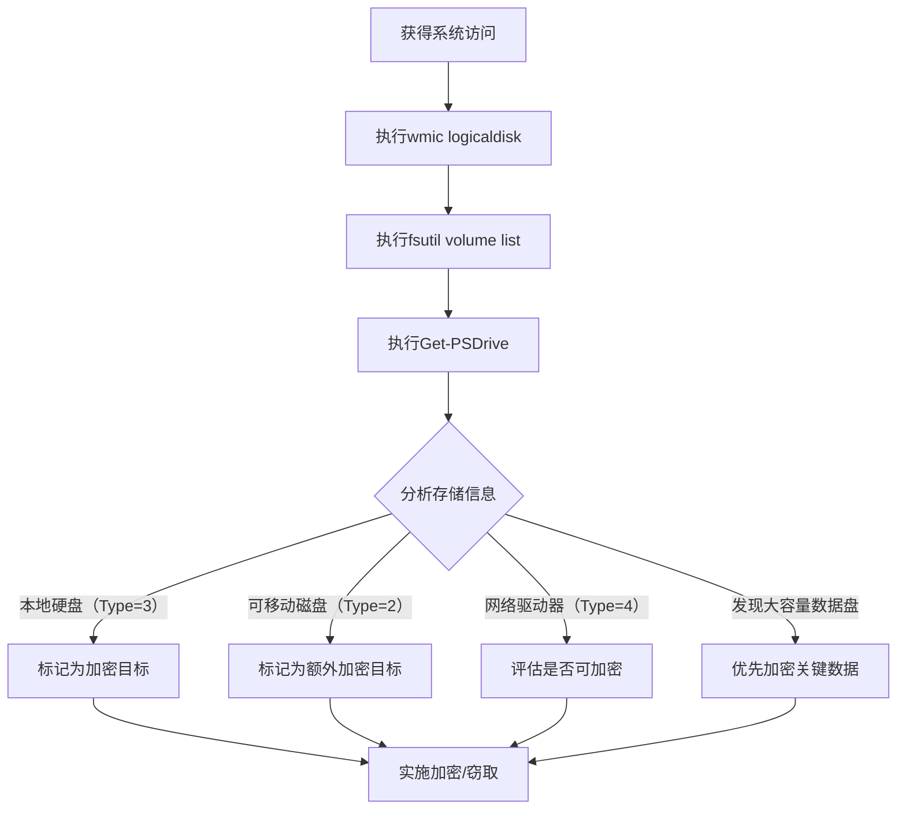

# 本地存储发现 (T1680)

## 一句话通俗理解

查看电脑连接的磁盘和存储设备——攻击者用 `wmic logicaldisk` 列出所有磁盘分区，就像小偷查看屋子里有哪些柜子和抽屉。

## 难度等级

- ⭐ 初级（新手可学）

## 技术描述

本地存储发现（T1680）是MITRE ATT&CK框架中的一种发现技术。

**通俗解释：**
电脑通常有多个磁盘分区（C盘、D盘、E盘等），还有可能插着U盘、移动硬盘、网络映射驱动器。攻击者入侵后会查看所有存储设备：每个盘有多大、还剩多少空间、是什么类型的磁盘。主要目的是：找到存放数据的位置（特别是大容量数据盘）、判断哪些盘可以加密（勒索软件需要知道加密范围）、查找备份盘和USB设备（防止受害者通过外部设备恢复数据）。

**技术原理：**
1. 使用 `wmic logicaldisk get name,description,size,filesystem` 列出所有逻辑驱动器
2. 使用 `fsutil volume list` 显示所有卷信息
3. 使用 `Get-PSDrive -PSProvider FileSystem` 获取文件系统驱动器列表
4. 使用 `diskpart` 查看磁盘和卷的详细信息
5. 在Linux中使用 `lsblk`、`df -h`、`fdisk -l` 查看存储设备

**用途与影响：**
本地存储发现帮助攻击者：定位数据存储位置（识别大容量数据盘）；评估加密范围（需要加密哪些盘才能有效勒索）；检测备份磁盘（防止受害者恢复数据）；发现可移动存储设备（USB、外置硬盘）；判断是否有网络映射驱动器（可能连接着文件服务器）。

## 子技术列表

**该技术没有子技术。**

## 攻击流程

### 典型攻击流程

```
枚举驱动器 --> 分析类型 --> 评估价值 --> 加密或窃取
```



**步骤详解：**

1. **枚举所有逻辑驱动器**
   - 通俗描述：查看电脑有哪些磁盘分区
   - 技术细节：`wmic logicaldisk get name,description,size,filesystem`
   - 常用工具：wmic.exe

2. **查看卷详细信息**
   - 通俗描述：查看每个盘的详细信息和容量
   - 技术细节：`fsutil volume list` 和 `fsutil volume diskfree <drive>:`
   - 常用工具：fsutil.exe

3. **识别驱动器类型**
   - 通俗描述：区分本地硬盘、USB和网络驱动器
   - 技术细节：DriveType=3（本地硬盘）、2（可移动）、4（网络）
   - 常用工具：wmic.exe, PowerShell

4. **评估加密策略**
   - 通俗描述：根据存储信息决定攻击范围
   - 技术细节：排除系统盘避免系统崩溃，优先加密数据盘
   - 常用工具：无（代码逻辑）

## 真实案例

### 案例1：Ryuk - 加密前的系统化卷枚举

- **时间**: 2019年-2021年
- **目标**: 全球医疗系统、地方政府
- **攻击组织**: Ryuk
- **手法**: Ryuk勒索软件团队在手动部署加密载荷前系统化地枚举受害者系统中的所有可用存储卷。使用 `wmic logicaldisk get name,description,size,filesystem` 获取每个逻辑驱动器的详细配置，检查驱动器类型区分本地硬盘和网络映射驱动器。通过 `fsutil volume diskfree` 检查可用空间评估加密耗时。特别关注USB和外部驱动器，将其作为离线备份存储需要额外加密。可用空间超过1TB的卷会被跳过避免触发存储层面告警。
- **影响**: 全球多家医疗机构被勒索
- **参考链接**: [MITRE - Ryuk](https://attack.mitre.org/software/S0446/)

### 案例2：LockBit - 多层级存储发现与选择性加密

- **时间**: 2020年-2023年
- **目标**: 全球制造业、专业服务企业
- **攻击组织**: LockBit
- **手法**: LockBit在其2.0和3.0版本中内置了自动化的本地存储发现功能。在加密前执行 `Get-PSDrive -PSProvider FileSystem` 获取所有文件系统驱动器的详细清单，然后通过 `Get-WmiObject Win32_LogicalDisk` 获取每个驱动器的类型和容量信息。通过DriveType参数区分硬盘类型并根据配置的策略选择性加密。检查卷标中是否包含"BOOT"、"SYSTEM"、"RECOVERY"等关键词确保不加密可能导致系统无法启动的系统分区。
- **影响**: 全球多家制造企业被勒索
- **参考链接**: [MITRE - LockBit](https://attack.mitre.org/software/S0372/)

### 案例3：BlackCat/ALPHV - Rust驱动的存储环境扫描

- **时间**: 2021年-2023年
- **目标**: 全球能源、法律、咨询行业
- **攻击组织**: BlackCat/ALPHV
- **手法**: BlackCat使用Rust开发的自定义模块执行本地存储发现，规避传统的基于PowerShell和WMI的检测规则。在Rust中调用Windows API `GetLogicalDrives()` 和 `GetDriveTypeW()` 枚举所有可用驱动器。在Linux目标上通过读取 `/proc/mounts` 和 `/proc/partitions` 枚举已挂载的文件系统。发现的存储信息通过加密C2信道回传，使操作者远程评估目标价值并调整加密策略。
- **影响**: 多家大型企业被勒索
- **参考链接**: [MITRE - BlackCat](https://attack.mitre.org/software/S0695/)

### 案例4：APT28 - 竞选环境中的存储测绘

- **时间**: 2016年-2020年
- **目标**: 全球政治组织、媒体机构
- **攻击组织**: APT28（Fancy Bear）
- **手法**: APT28在其情报收集活动中使用定制的后门程序枚举受害者系统的本地存储配置。通过 `GetLogicalDrives` API获取所有驱动器字母列表，再对每个驱动器使用 `GetVolumeInformation` 提取文件系统类型和序列号。特别关注可移动媒体驱动器和网络映射驱动器。通过识别映射到邮件服务器的网络驱动器发现了关键的邮件数据库备份路径。
- **影响**: 多国政治组织被渗透
- **参考链接**: [MITRE - APT28](https://attack.mitre.org/groups/G0007/)

## 红队视角

> ⚠️ **免责声明**：以下内容仅用于合法的安全测试、渗透测试和教育目的。未经授权对他人系统进行测试是违法行为。

### 实战技巧

1. **快速查看驱动器类型**
   `wmic logicaldisk get deviceid,drivetype,size,freespace` 一行命令获取所有驱动器信息。

2. **查看网络映射驱动器**
   `net use` 查看所有网络映射驱动器的连接情况。

3. **Linux存储查看**
   `lsblk` 以树状形式查看所有块设备，一目了然。

### 常用工具

| 工具名称 | 用途 | 平台 | 链接 |
|----------|------|------|------|
| wmic logicaldisk | 逻辑驱动器查询 | Windows | 内置命令 |
| fsutil | 卷管理工具 | Windows | 内置命令 |
| Get-PSDrive | PowerShell驱动器查询 | Windows | 内置PowerShell |
| lsblk/df/fdisk | Linux存储查看 | Linux | 内置命令 |

### 注意事项

- 枚举存储设备通常需要管理员权限获取完整信息
- 某些加密的驱动器（如BitLocker）在解锁前无法读取
- 网络驱动器的访问可能受权限限制

## 蓝队视角

### 检测要点

1. **异常的存储枚举命令**
   - 日志来源：Sysmon Event ID 1
   - 关注字段：`wmic logicaldisk`、`fsutil` 的执行
   - 异常特征：非管理员或非备份工具执行存储枚举

2. **卷影副本查询**
   - 日志来源：Event ID 4688
   - 关注字段：`vssadmin list shadows`、`vssadmin list volumes`
   - 异常特征：勒索软件加密前删除卷影副本的行为模式

### 监控建议

- 监控 `wmic logicaldisk`、`Get-PSDrive`、`fsutil` 的异常执行
- 关注勒索软件常见的命令序列（枚举存储 -> 删除卷影副本 -> 加密）
- 监控 `diskpart` 和 `vssadmin` 的批量调用
- 在EDR中配置基于命令序列的检测规则

## 检测建议

### 网络层检测

**检测方法：** 监控远程存储设备枚举的网络流量，特别关注通过 WMI 查询远程系统磁盘分区和卷信息的异常行为。

**具体规则/命令示例：**
```
# 检测通过 WMI 远程执行 Win32_LogicalDisk、Win32_DiskDrive 等存储查询的流量
# 关注同一主机在短时间内对多个远程系统执行磁盘信息枚举的横向移动行为
# 使用 Zeek 分析 dce_rpc 日志，检测 WMI 相关 UUID 的频繁远程调用
```

### 主机层检测

**Windows事件ID：**
- 事件ID 4688：进程创建（监控wmic.exe, vssadmin.exe）
- 事件ID 4104：PowerShell脚本执行
- Sysmon Event ID 1：进程创建

**Sigma规则示例：**
```yaml
title: Local Storage Discovery via wmic
status: experimental
description: Detects wmic logicaldisk enumeration
logsource:
    category: process_creation
    product: windows
detection:
    selection:
        CommandLine|contains|all:
            - 'wmic'
            - 'logicaldisk'
    condition: selection
level: low
tags:
    - attack.t1680
```

## 缓解措施

### 优先级1：关键措施

**措施名称：** 应用白名单

**具体实施步骤：**
1. 阻止非授权进程调用WMIC.exe、diskpart.exe
2. 使用WDAC限制PowerShell脚本执行

### 优先级2：重要措施

**措施名称：** 卷影副本保护

**具体实施步骤：**
1. 限制vssadmin.exe的执行权限
2. 使用受保护的卷影副本

### 优先级3：建议措施

**措施名称：** 存储访问控制

**具体实施步骤：**
1. 对可执行文件实施ACL限制
2. 配置网络访问控制

### MITRE ATT&CK 缓解措施映射

| 缓解措施ID | 缓解措施名称 | 适用性 | 说明 |
|------------|-------------|--------|------|
| M1026 | Privileged Account Management | 适用 | 限制管理员权限 |
| M1038 | Execution Prevention | 适用 | 限制WMIC执行 |
| M1047 | Audit | 适用 | 启用存储访问审计 |

## 动手实验

> ⚠️ **重要提示**：所有实验必须在隔离的实验室环境中进行，禁止对未授权的真实系统进行测试。

### 实验环境准备

**所需工具：** Windows VM

### 实验1：基本存储枚举（初级）

**实验目标：** 学习使用wmic和PowerShell查看存储设备。

**实验步骤：**
1. 执行 `wmic logicaldisk get name,description,size,filesystem` 查看驱动器信息
2. 执行 `Get-PSDrive -PSProvider FileSystem` 查看文件系统驱动器
3. 执行 `fsutil volume list` 查看所有卷

**预期结果：** 看到系统中所有存储设备的详细信息。

**学习要点：** 理解攻击者如何通过简单命令枚举存储设备。

### 实验2：Linux存储查看（初级）

**实验目标：** 学习在Linux中查看存储设备。

**实验步骤：**
1. 执行 `lsblk` 查看块设备
2. 执行 `df -h` 查看文件系统使用情况
3. 执行 `fdisk -l` 查看磁盘分区表

**预期结果：** 看到Linux系统中的存储设备和挂载点。

## 术语解释

| 术语 | 英文原名 | 通俗解释 |
|------|----------|----------|
| 逻辑驱动器 | Logical Disk | 系统分配的盘符（C:、D:等），可以是一个分区或整个硬盘 |
| 卷影副本 | Volume Shadow Copy | Windows的快照功能，可以在加密后恢复文件 |
| 文件系统 | File System | 组织和管理磁盘上文件的方式，如NTFS、FAT32、ext4 |
| BitLocker | BitLocker | Windows的磁盘加密功能，加密整个磁盘 |
| iSCSI | iSCSI | 通过网络连接远程存储设备的技术 |

## 参考资料

### 官方文档

- [MITRE ATT&CK - T1680](https://attack.mitre.org/techniques/T1680/)
- [Microsoft - wmic logicaldisk](https://learn.microsoft.com/en-us/windows/win32/cimwin32prov/win32-logicaldisk)
- [Microsoft - fsutil](https://learn.microsoft.com/en-us/windows-server/administration/windows-commands/fsutil)

### 安全报告

- [MITRE - Ryuk](https://attack.mitre.org/software/S0446/)
- [MITRE - LockBit](https://attack.mitre.org/software/S0372/)
- [MITRE - BlackCat](https://attack.mitre.org/software/S0695/)
- [MITRE - APT28](https://attack.mitre.org/groups/G0007/)

### 工具与资源

- [PowerShell Get-PSDrive](https://learn.microsoft.com/en-us/powershell/module/microsoft.powershell.management/get-psdrive)
- [Linux lsblk - List Block Devices](https://man7.org/linux/man-pages/man8/lsblk.8.html)
- [Volume Shadow Copy Service](https://learn.microsoft.com/en-us/windows-server/storage/file-server/volume-shadow-copy-service)
