# 横向移动 (TA0008)

## 一句话理解

横向移动就像小偷潜入大楼后，从一个房间摸到另一个房间——攻击者攻陷一台电脑后，利用各种手段在网络内部跳来跳去，逐步接近最终目标。

## 战术概述

横向移动（Lateral Movement）是MITRE ATT&CK框架中**连接"立足点"与"目标"的桥梁战术**，编号为TA0008。

**通俗解释：**
想象一下：攻击者通过钓鱼邮件骗过了前台小王，控制了他的办公电脑。但这台电脑上没什么值钱的东西。于是攻击者用小王电脑上保存的VPN密码，连到了财务部的服务器；再从财务服务器上提取了域管理员的密码哈希，最终登录到公司的域控制器——整个公司网络就此沦陷。这种从一台电脑跳到另一台、再跳到下一台的"跳房子"过程，就是横向移动。

**在攻击中的作用：**
横向移动是攻击者从"已入侵"到"达成目标"的必经之路。没有横向移动，攻击者只能困在最初攻陷的那台机器上，无法接触到真正有价值的数据和系统。绝大多数重大安全事件（如勒索软件大范围加密、数据大规模泄露）都离不开横向移动。

**包含的技术类型：**
- **远程服务滥用**（[T1021](T1021-Remote-Services.md)）：用偷来的账号密码，通过RDP、SSH、SMB等远程管理工具登录其他电脑
- **漏洞利用**（[T1210](T1210-Exploitation-of-Remote-Services.md)）：利用远程服务的软件漏洞（如永恒之蓝EternalBlue），不需要密码就能入侵
- **凭证重用**（[T1550](T1550-Use-Alternate-Authentication-Material.md)）：用密码哈希、Kerberos票据等代替明文密码进行认证
- **会话劫持**（[T1563](T1563-Remote-Service-Session-Hijacking.md)）：接管别人已经建好的远程连接
- **工具传输**（[T1570](T1570-Lateral-Tool-Transfer.md)）：把黑客工具从一台机器搬运到另一台
- **内部钓鱼**（[T1534](T1534-Internal-Spearphishing.md)）：用被黑的内部账号给同事发钓鱼邮件
- **共享污染**（[T1080](T1080-Taint-Shared-Content.md)）：在共享文件夹里投放恶意文件
- **USB传播**（[T1091](T1091-Replication-Through-Removable-Media.md)）：通过U盘在隔离网络之间搬运恶意软件
- **部署工具滥用**（[T1072](T1072-Software-Deployment-Tools.md)）：滥用企业的软件分发系统（如SCCM）批量推送恶意软件

## 战术在攻击链中的位置

### 攻击链全景图

```mermaid
graph LR
    A["侦察<br/>TA0043"] --> B["资源开发<br/>TA0042"]
    B --> C["初始访问<br/>TA0001"]
    C --> D["执行<br/>TA0002"]
    D --> E["持久化<br/>TA0003"]
    E --> F["权限提升<br/>TA0004"]
    F --> G["隐蔽<br/>TA0005"]
    G --> H["防御削弱<br/>TA0112"]
    H --> I["凭证访问<br/>TA0006"]
    I --> J["发现<br/>TA0007"]
    J --> K["横向移动<br/>TA0008"]
    K --> L["收集<br/>TA0009"]
    L --> M["命令与控制<br/>TA0011"]
    M --> N["数据窃取<br/>TA0010"]
    N --> O["影响<br/>TA0040"]

    style K fill:#ff6b6b,stroke:#333,stroke-width:3px,color:#fff
```

### 当前战术的角色

横向移动位于攻击链的中后段，是攻击从"局部控制"升级为"全面控制"的关键转折点。攻击者在完成凭证访问（窃取账号密码）和发现（摸清网络拓扑）之后，利用这些信息在网络中跳跃，逐步接近核心目标。

### 前置战术

- **凭证访问（TA0006）**：攻击者需要先窃取账号密码或其他认证材料，才能用它们登录其他系统
- **发现（TA0007）**：攻击者需要先摸清网络结构，知道目标在哪里，才能决定往哪个方向移动

### 后续战术

- **收集（TA0009）**：到达目标系统后，攻击者开始收集有价值的数据
- **命令与控制（TA0011）**：与远程C2服务器通信，接收指令、回传数据
- **数据窃取（TA0010）**：将收集到的数据打包传出网络
- **影响（TA0040）**：最终实施破坏，如加密勒索、数据销毁等

## 技术索引表

| 技术ID | 中文名称 | 难度 | 子技术数 | 一句话理解 | 文档状态 |
|--------|----------|:----:|:--------:|------------|:--------:|
| [T1021](./T1021-Remote-Services.md) | 远程服务 | ⭐⭐ | 8 | 偷到凭据后直接用RDP、SSH等远程管理工具登录其他系统 | ✅ 已完成 |
| [T1051](./T1051-Shared-Webroot.md) | 共享Web根目录 | ⭐⭐ | 0 | 利用Web服务器的共享目录在不同系统间传递文件和执行代码 | ✅ 已完成 |
| [T1072](./T1072-Software-Deployment-Tools.md) | 软件部署工具 | ⭐⭐ | 0 | 滥用企业的软件分发系统（如SCCM），一键推送到所有电脑 | ✅ 已完成 |
| [T1080](./T1080-Taint-Shared-Content.md) | 污染共享内容 | ⭐⭐ | 0 | 在共享文件夹里投放恶意文档，等同事打开就中招 | ✅ 已完成 |
| [T1091](./T1091-Replication-Through-Removable-Media.md) | 通过可移动介质传播 | ⭐⭐ | 0 | 用U盘在隔离网络之间搬运恶意软件 | ✅ 已完成 |
| [T1207](./T1207-Rogue-Domain-Controller.md) | 恶意域控制器 | ⭐⭐⭐ | 0 | 伪造一个域控制器，劫持整个域的认证流量 | ✅ 已完成 |
| [T1210](./T1210-Exploitation-of-Remote-Services.md) | 远程服务漏洞利用 | ⭐⭐⭐ | 0 | 利用远程服务的安全漏洞，无需凭据即可入侵其他系统 | ✅ 已完成 |
| [T1534](./T1534-Internal-Spearphishing.md) | 内部鱼叉式钓鱼 | ⭐⭐ | 0 | 用已入侵的内部账户给同事发钓鱼邮件，利用内部信任扩大攻击 | ✅ 已完成 |
| [T1550](./T1550-Use-Alternate-Authentication-Material.md) | 使用替代认证材料 | ⭐⭐⭐ | 4 | 用密码哈希、Kerberos票据等代替明文密码进行认证 | ✅ 已完成 |
| [T1563](./T1563-Remote-Service-Session-Hijacking.md) | 远程服务会话劫持 | ⭐⭐⭐ | 2 | 接管别人已经登录的远程连接，冒充合法用户操作 | ✅ 已完成 |
| [T1570](./T1570-Lateral-Tool-Transfer.md) | 横向工具传输 | ⭐ | 0 | 把黑客工具从一台机器传到另一台，为后续攻击做准备 | ✅ 已完成 |

## 子技术索引

| 子技术ID | 名称 | 难度 | 一句话理解 | 文档状态 |
|----------|------|:----:|-----------|:--------:|
| [T1021.001](./T1021/T1021.001-Remote Desktop Protocol-Remote Desktop Protocol.md) | Remote Desktop Protocol | ⭐⭐ | 用Windows自带的远程桌面功能连到其他电脑，就像坐在那台电脑前操作一样 | ✅ 已完成 |
| [T1021.002](./T1021/T1021.002-SMB-Windows Admin Shares-SMB-Windows Admin Shares.md) | SMB/Windows Admin Shares | ⭐⭐ | 利用Windows的隐藏共享文件夹（如ADMIN$），远程复制文件和执行命令 | ✅ 已完成 |
| [T1021.003](./T1021/T1021.003-Distributed-Component-Object-Model-Distributed-Component-Object-Model.md) | Distributed Component Object Model | ⭐⭐ | 利用Windows组件模型，在远程系统上创建对象和执行代码 | ✅ 已完成 |
| [T1021.004](./T1021/T1021.004-SSH-SSH.md) | SSH | ⭐⭐ | 通过加密的SSH协议登录远程Linux/Windows系统，或建立隧道穿透防火墙 | ✅ 已完成 |
| [T1021.005](./T1021/T1021.005-VNC-VNC.md) | VNC | ⭐⭐ | 用VNC远程桌面协议控制其他电脑的图形界面 | ✅ 已完成 |
| [T1021.006](./T1021/T1021.006-Windows Remote Management-Windows Remote Management.md) | Windows Remote Management | ⭐⭐ | 利用WinRM通过HTTP/HTTPS远程执行PowerShell命令 | ✅ 已完成 |
| [T1021.007](./T1021/T1021.007-Microsoft-Management-Console-Microsoft-Management-Console.md) | Microsoft Management Console | ⭐⭐ | 利用MMC管理控制台远程连接到其他系统进行管理操作 | ✅ 已完成 |
| [T1021.008](./T1021/T1021.008-Remote Desktop Gateway-Remote Desktop Gateway.md) | Remote Desktop Gateway | ⭐⭐ | 利用RD网关服务器穿透网络边界，访问内部RDP资源 | ✅ 已完成 |
| [T1550.001](./T1550/T1550.001-Application-Access-Token-Application-Access-Token.md) | Application Access Token | ⭐⭐⭐ | 用OAuth令牌、JWT等应用访问令牌绕过登录页面，直接访问云应用和API | ✅ 已完成 |
| [T1550.002](./T1550/T1550.002-Pass the Hash-Pass the Hash.md) | Pass the Hash | ⭐⭐⭐ | 用密码的哈希值代替密码，直接登录远程Windows系统 | ✅ 已完成 |
| [T1550.003](./T1550/T1550.003-Pass the Ticket-Pass the Ticket.md) | Pass the Ticket | ⭐⭐⭐ | 窃取Kerberos票据，冒充已经登录的用户访问网络资源 | ✅ 已完成 |
| [T1550.004](./T1550/T1550.004-Web Session Cookie-Web Session Cookie.md) | Web Session Cookie | ⭐⭐⭐ | 窃取网站的会话Cookie，冒充已登录用户访问Web应用 | ✅ 已完成 |
| [T1563.001](./T1563/T1563.001-SSH Hijacking-SSH Hijacking.md) | SSH Hijacking | ⭐⭐⭐ | 劫持已建立的SSH连接，利用SSH代理转发功能接管会话 | ✅ 已完成 |
| [T1563.002](./T1563/T1563.002-RDP Hijacking-RDP Hijacking.md) | RDP Hijacking | ⭐⭐⭐ | 在Windows上劫持已有的RDP会话，借用管理员的身份操作 | ✅ 已完成 |

### 统计信息

- **技术总数**：11 个
- **子技术总数**：14 个
- **已完成文档**：14 个
- **进行中文档**：0 个
- **待编写文档**：0 个

## 推荐阅读顺序

### 入门阶段（第1-2周）

> 适合零基础的安全爱好者，从最简单、最直观的横向移动技术开始。

**前置知识：** 了解基本的网络概念（IP地址、端口）、会使用Windows系统的基本操作。

**推荐阅读：**

1. **[T1570 横向工具传输](./T1570-Lateral-Tool-Transfer.md)** - 最简单的技术，先理解黑客工具是怎么在网络中搬运的，为后续学习打基础
2. **[T1021 远程服务](./T1021-Remote-Services.md)** - 这是横向移动的核心技术，掌握RDP、SMB、SSH等最常见的横向移动方式
3. **[T1080 污染共享内容](./T1080-Taint-Shared-Content.md)** - 理解"信任传递"的概念——为什么共享文件夹会成为攻击通道

**学习建议：**
- 先理解每个技术是做什么的，不要急于记命令
- 可以在实验环境中用虚拟机构建一个小型网络，手动尝试远程桌面连接

### 进阶阶段（第3-4周）

> 适合有一定基础的学习者，开始接触更复杂、更隐蔽的横向移动技术。

**前置知识：** 熟悉Windows域环境基本概念、了解NTLM和Kerberos认证的基本原理。

**推荐阅读：**

1. **[T1550 使用替代认证材料](./T1550-Use-Alternate-Authentication-Material.md)** - 学会用哈希和票据代替密码，理解Pass the Hash和Pass the Ticket的核心思想
2. **[T1563 远程服务会话劫持](./T1563-Remote-Service-Session-Hijacking.md)** - 学习如何直接接管已有会话，绕过密码验证
3. **[T1534 内部鱼叉式钓鱼](./T1534-Internal-Spearphishing.md)** - 理解内部信任被滥用的原理，以及社会工程学在横向移动中的应用

**学习建议：**
- 在虚拟机环境中实践Mimikatz的常用命令
- 尝试用Pass the Hash攻击登录远程系统的SMB共享

### 高级阶段（第5-6周）

> 适合有较好技术基础的学习者，深入理解漏洞利用和大规模横向移动。

**前置知识：** 了解常见漏洞类型（缓冲区溢出、远程代码执行）、熟悉企业IT管理工具。

**推荐阅读：**

1. **[T1210 远程服务漏洞利用](./T1210-Exploitation-of-Remote-Services.md)** - 深入了解永恒之蓝等经典漏洞，理解无凭据横向移动的原理
2. **[T1072 软件部署工具](./T1072-Software-Deployment-Tools.md)** - 学习SCCM等部署工具如何被滥用，理解大规模横向移动的威力
3. **[T1091 通过可移动介质传播](./T1091-Replication-Through-Removable-Media.md)** - 了解针对气隙网络的特殊攻击手段

**学习建议：**
- 在隔离环境中搭建域环境，模拟完整的横向移动攻击链
- 尝试配置和防御SCCM滥用场景

## 参考资料

### 官方文档

- [MITRE ATT&CK - Lateral Movement](https://attack.mitre.org/tactics/TA0008/)
- [MITRE ATT&CK Enterprise Matrix](https://attack.mitre.org/matrices/enterprise/)

### 学习资源

- [CISA 横向移动检测与防御指南](https://www.cisa.gov/news-events/cybersecurity-advisories) - 美国网络安全和基础设施安全局发布的防御指南
- [SANS 横向移动技术白皮书](https://www.sans.org/white-papers/) - 业界权威的安全培训组织发布的深度分析
- [NCSC Preventing Lateral Movement](https://www.ncsc.gov.uk/guidance/preventing-lateral-movement) - 英国国家网络安全中心发布的横向移动防御指南
- [Zero Networks 10 Common Lateral Movement Techniques](https://zeronetworks.com/blog/10-common-lateral-movement-techniques-how-to-stop-them) - 2025年发布的常见横向移动技术综述

### 相关工具

- [Mimikatz](https://github.com/gentilkiwi/mimikatz) - 最著名的凭证提取和Pass the Hash工具
- [Impacket](https://github.com/fortra/impacket) - 包含多种横向移动工具的Python套件
- [CrackMapExec](https://github.com/byt3bl33d3r/CrackMapExec) - 自动化横向移动和网络评估工具
- [PsExec](https://docs.microsoft.com/en-us/sysinternals/downloads/psexec) - Sysinternals套件中的远程执行工具
