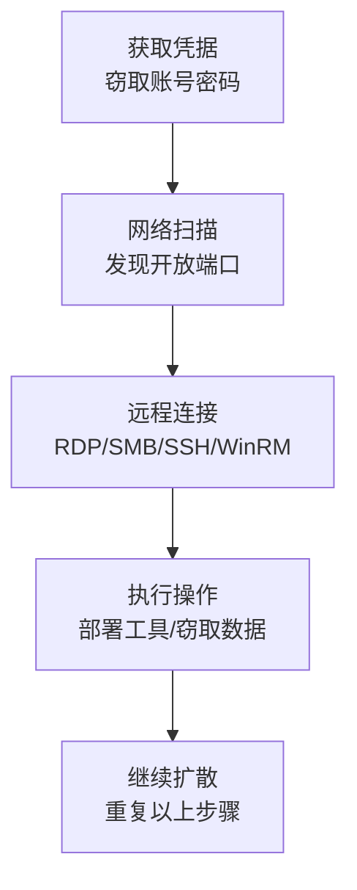

# 远程服务 (T1021)

## 一句话通俗理解

就像小偷偷到了员工的工牌，然后大摇大摆地刷卡进入各个办公室——攻击者偷到账号密码后，直接用RDP、SSH等远程管理工具登录其他电脑。

## 难度等级

- ⭐⭐ 中级（需要一定基础）

## 技术描述

远程服务（T1021）是MITRE ATT&CK框架中横向移动战术下的一种技术。

**通俗解释：**
企业在日常管理中，IT管理员需要用远程桌面（RDP）连到服务器、用SSH连到Linux系统、用SMB共享文件。这些"远程管理工具"就像管理员的一串钥匙。攻击者如果偷到了这些钥匙（账号密码），就可以像合法管理员一样开门进入任何系统。更狡猾的是，这些工具本来就是正常工具，所以攻击者的行为很难被察觉。

**技术原理：**

1. **获取凭据**：攻击者先通过凭证转储（如Mimikatz）、网络嗅探或钓鱼等方式，窃取有效的登录账号密码
2. **扫描目标**：使用网络扫描工具（如nmap）发现内网中开放了远程服务端口的其他系统
3. **建立连接**：使用窃取的凭据，通过RDP、SMB、SSH、WinRM等协议连接到目标系统
4. **执行操作**：在目标系统上部署后门、窃取数据、收集更多凭据，然后重复上述过程

**用途与影响：**
远程服务是横向移动中使用频率最高的技术类别，因为：这些服务在企业中几乎不可能完全禁用；攻击者使用合法凭据登录，行为与正常管理员无异；每种远程服务都有特定的检测盲区，攻击者可交叉使用以规避检测。

## 子技术列表

**该技术共有 8 个子技术：**

| 子技术ID | 中文名称 | 通俗解释 |
|----------|----------|----------|
| T1021.001 | Remote Desktop Protocol | 用Windows自带的远程桌面功能连到其他电脑，就像坐在那台电脑前操作一样 |
| T1021.002 | SMB/Windows Admin Shares | 利用Windows的隐藏共享文件夹（如ADMIN$），远程复制文件和执行命令 |
| T1021.003 | Distributed Component Object Model | 利用Windows组件模型，在远程系统上创建对象和执行代码 |
| T1021.004 | SSH | 通过加密的SSH协议登录远程Linux/Windows系统，或建立隧道穿透防火墙 |
| T1021.005 | VNC | 用VNC远程桌面协议控制其他电脑的图形界面 |
| T1021.006 | Windows Remote Management | 利用WinRM通过HTTP/HTTPS远程执行PowerShell命令 |
| T1021.007 | Microsoft Management Console | 利用MMC管理控制台远程连接到其他系统进行管理操作 |
| T1021.008 | Remote Desktop Gateway | 利用RD网关服务器穿透网络边界，访问内部RDP资源 |

<details>
<summary><strong>展开查看各子技术详细说明</strong></summary>

### T1021.001 - Remote Desktop Protocol

**通俗理解：** 就像用远程遥控器操作另一台电脑的屏幕。

**详细说明：**
RDP是Windows系统内置的远程桌面协议，允许用户通过网络连接到远程计算机并获得完整的图形化桌面界面。攻击者使用窃取的凭据通过RDP登录远程系统后，可以像坐在那台电脑前一样操作——运行程序、访问文件、窃取数据。RDP特别危险的地方在于：它提供完整的桌面访问权限，攻击者可以在RDP会话中绕过许多基于主机的安全控制（如屏幕保护、会话锁定），而且RDP连接通常不会被网络监控工具标记为可疑，因为管理员也天天在用。

### T1021.002 - SMB/Windows Admin Shares

**通俗理解：** 利用Windows系统默认开启的"后门共享文件夹"来传文件和执行命令。

**详细说明：**
Windows系统默认创建了一些隐藏的管理共享（ADMIN$、C$、IPC$），只有管理员才能访问。攻击者可以用`net use`命令映射远程系统的C$共享，然后像操作本地文件一样复制恶意工具；或者通过PsExec等工具，利用SMB协议在远程系统上创建服务并执行命令。SMB横向移动是Windows网络中最常见的方式，因为它使用内置功能、速度极快、且通常不会被防火墙阻止。

### T1021.003 - Distributed Component Object Model

**通俗理解：** 利用Windows的"远程组件调用"功能，让远程电脑帮你执行程序。

**详细说明：**
DCOM允许一台电脑上的程序调用另一台电脑上的程序功能。攻击者可以通过PowerShell在远程系统上创建COM对象（如MMC20.Application），然后调用这个对象的方法来执行任意命令。这种方法的优势是：它使用PowerShell脚本调用，可以绕过基于文件扫描的检测；而且DCOM流量混合在正常的Windows管理流量中，难以识别。

### T1021.004 - SSH

**通俗理解：** 用加密通道安全地登录远程Linux/Unix系统，还可以建立隧道绕过防火墙。

**详细说明：**
SSH是Linux/Unix系统最常用的远程管理协议，也越来越多地用于Windows（通过OpenSSH）。攻击者可以用窃取的SSH密钥或密码登录远程系统，通过SCP/SFTP传输文件，或者建立SSH隧道来访问被网络防火墙隔离的内部系统。SSH流量是加密的，所以安全设备无法检查其内容，这使得SSH成为攻击者最喜欢的横向移动通道之一。

### T1021.005 - VNC

**通俗理解：** 一个跨平台的远程桌面工具，可以远程控制其他电脑的屏幕。

**详细说明：**
VNC是一种跨平台的图形化桌面共享协议。攻击者在已入侵系统上安装VNC服务器，或者使用窃取的VNC凭据连接到其他系统上已有的VNC服务器。VNC在以下场景中被使用：目标环境使用Linux或macOS（VNC在这些平台上比RDP更常见）；攻击者需要避免RDP的检测特征；或者目标环境使用VNC作为合法的远程访问方案。

### T1021.006 - Windows Remote Management

**通俗理解：** 通过HTTP协议在远程Windows系统上执行PowerShell命令，就像远程操作PowerShell一样。

**详细说明：**
WinRM是Microsoft实现的WS-Management协议，是PowerShell远程管理（PowerShell Remoting）的基础。攻击者可以使用`Enter-PSSession`或`Invoke-Command`在远程系统上执行PowerShell命令。WinRM在现代Windows环境中越来越常见，因为：PowerShell Remoting是微软推荐的管理方法；WinRM使用HTTP(S)协议，可以穿过大多数防火墙；WinRM支持Kerberos认证，允许单点登录。

### T1021.007 - Microsoft Management Console

**通俗理解：** 利用Windows管理控制台远程连接到其他系统进行管理操作。

**详细说明：**
MMC提供标准化的管理界面，可以承载各种管理插件（如计算机管理、事件查看器、设备管理器等）。攻击者可以利用MMC的"连接到其他计算机"功能，以管理员的身份远程管理目标系统。这种方法的优势在于使用了合法的Windows管理工具，更难被检测。

### T1021.008 - Remote Desktop Gateway

**通俗理解：** 利用RDP网关服务器作为跳板，穿透网络防火墙连接到内部RDP资源。

**详细说明：**
RD Gateway（远程桌面网关）是一个充当RDP连接代理的服务器角色，位于网络边界，允许外部用户通过HTTPS加密的RDP连接访问内部资源。攻击者如果获取了RD Gateway服务器的访问权限，就可以利用它来访问内部网络中原本受防火墙保护的RDP服务，实现网络边界穿透。

</details>

## 攻击流程

### 典型攻击流程

```
获取凭据 --> 扫描目标 --> 远程连接 --> 执行操作 --> 继续扩散
```



**步骤详解：**

1. **获取凭据**
   - 通俗描述：攻击者用Mimikatz等工具从当前系统内存中提取登录密码或哈希
   - 技术细节：使用`sekurlsa::logonpasswords`从LSASS进程提取凭据，或从本地文件、浏览器中收集保存的密码
   - 常用工具：Mimikatz、LaZagne、ProcDump

2. **网络扫描**
   - 通俗描述：扫描内网IP范围，找出哪些电脑开放了远程管理端口
   - 技术细节：扫描445端口（SMB）、3389端口（RDP）、22端口（SSH）、5985/5986端口（WinRM）
   - 常用工具：nmap、Masscan、PowerShell Test-NetConnection

3. **远程连接**
   - 通俗描述：使用窃取的凭据，通过选定的远程服务协议登录目标系统
   - 技术细节：RDP使用`mstsc.exe`，SMB使用`net use`，SSH使用`ssh`命令，WinRM使用`Enter-PSSession`
   - 常用工具：mstsc、PsExec、ssh、Enter-PSSession

4. **执行操作**
   - 通俗描述：在目标系统上部署后门、提取更多凭据、寻找高价值数据
   - 技术细节：部署Cobalt Strike Beacon、运行Mimikatz提取凭据、扫描网络寻找域控制器
   - 常用工具：Cobalt Strike、PowerShell、Mimikatz

5. **继续扩散**
   - 通俗描述：以新入侵的系统为跳板，继续向网络深处推进
   - 技术细节：重复以上步骤，从新系统继续扫描和连接，逐步接近核心目标
   - 常用工具：同上

## 真实案例

### 案例1：APT29使用多种远程服务在SolarWinds事件中横向移动（2020-2021年）

- **时间**: 2020年至2021年
- **目标**: 美国政府机构、IT公司和网络安全组织
- **攻击组织**: APT29（Cozy Bear，俄罗斯SVR）
- **手法**: APT29在SolarWinds供应链攻击中展示了极高的横向移动水平。通过SUNBURST后门获得初始访问后，他们使用RDP（T1021.001）连接到跳板服务器；使用SMB（T1021.002）将TEARDROP和RAINDROP载荷传播到目标系统；使用WinRM（T1021.006）通过PowerShell Remoting执行远程命令。他们还特别注重使用"工具"而非"恶意软件"进行横向移动，以规避基于签名的检测。在Azure AD和ADFS服务器之间使用RDP会话传递认证Cookie和令牌，成功访问云资源。这次攻击持续了数月之久，直到被发现前，攻击者已在美国政府网络中建立了广泛的横向移动网络。
- **影响**: 影响了超过18,000个组织的SolarWinds客户，包括多个美国联邦机构
- **参考链接**: [Mandiant SolarWinds事件分析](https://www.mandiant.com/resources/blog/sunburst-additional-technical-details)

### 案例2：Black Basta勒索软件使用RDP进行横向移动（2022-2024年）

- **时间**: 2022年至2024年
- **目标**: 全球500+组织，涵盖医疗、制造、政府等12个关键基础设施领域
- **攻击组织**: Black Basta（勒索软件即服务组织）
- **手法**: Black Basta的附属成员广泛使用RDP进行横向移动，联合安全公告（CISA AA24-131A）指出他们使用BITSAdmin和PsExec配合RDP进行横向扩散。攻击者通常通过钓鱼邮件或暴露的RDP服务器获得初始访问，然后用Mimikatz提取凭据，再通过RDP（T1021.001）连接到内网其他系统。他们还使用Cobalt Strike Beacon建立持久通道，通过SMB（T1021.002）传播勒索软件载荷。Black Basta还利用Splashtop和ScreenConnect等远程管理工具作为替代RDP的横向移动通道。截至2024年5月，该组织已攻击超过500个组织，勒索金额超过1.07亿美元。
- **影响**: 超过500个组织受害，勒索金额超1.07亿美元
- **参考链接**: [CISA Black Basta联合公告](https://www.cisa.gov/news-events/alerts/2024/05/10/cisa-and-partners-release-advisory-black-basta-ransomware)

### 案例3：LockBit使用SMB和RDP在制造业网络中横向移动（2022-2024年）

- **时间**: 2022年至2024年
- **目标**: 全球制造业、医疗保健和能源组织
- **攻击组织**: LockBit（勒索软件即服务组织）
- **手法**: LockBit的附属成员被观察到大量使用SMB和RDP进行横向移动。攻击者首先通过钓鱼或漏洞利用获得初始访问，然后使用SMB的ADMIN$共享（T1021.002）将LockBit加密器部署到内网所有可达的Windows系统。他们使用`net use`命令映射远程管理共享，通过PsExec创建远程服务执行恶意代码。LockBit 3.0（Black）还集成了自动传播模块，扫描内网中的SMB服务，利用窃取的凭据自动部署到新系统。在部署勒索软件前，攻击者通过RDP连接到关键服务器进行手动侦察，识别域控制器和备份服务器。LockBit使用了间歇加密技术来加快加密速度，使横向移动更加高效。
- **影响**: LockBit在运营期间攻击了数千个组织，成为全球最活跃的勒索软件家族之一
- **参考链接**: [TrendMicro LockBit分析](https://www.trendmicro.com/vinfo/us/security/news/cybercrime-and-digital-threats/lockbit-ransomware-group-profile)

## 红队视角

> ⚠️ **免责声明**：以下内容仅用于合法的安全测试、渗透测试和教育目的。未经授权对他人系统进行测试是违法行为。

### 实战技巧

1. **交叉使用远程服务规避检测**
   如果SMB（445端口）被防火墙阻止，可以尝试WinRM（5985/5986端口）或RDP（3389端口）。不同远程服务的检测规则不同，交叉使用可以绕过单一协议的监控。

2. **使用RDP受限管理模式**
   在建立RDP连接时使用`/restrictedAdmin`参数，可以防止凭据缓存在远程系统上，减少被其他攻击者窃取凭据的风险。命令示例：`mstsc.exe /restrictedAdmin`

3. **利用SSH隧道穿透网络分段**
   在被入侵的Linux跳板机上建立SSH反向隧道，将内部服务端口映射到攻击者可控的外部服务器，绕过网络分段限制。

### 常用工具

| 工具名称 | 用途 | 平台 | 链接 |
|----------|------|------|------|
| PsExec | 通过SMB在远程系统上执行命令 | Windows | https://docs.microsoft.com/en-us/sysinternals/downloads/psexec |
| Impacket | 包含多种远程服务和横向移动工具的Python套件 | 跨平台 | https://github.com/fortra/impacket |
| CrackMapExec | 自动化远程服务利用和横向移动 | Linux | https://github.com/byt3bl33d3r/CrackMapExec |
| evil-winrm | 通过WinRM进行远程连接的Ruby工具 | Linux | https://github.com/Hackplayers/evil-winrm |
| SharpRDP | 利用RDP执行远程命令的工具 | Windows | https://github.com/0xthirteen/SharpRDP |

### 注意事项

- 合法的渗透测试必须有书面授权，明确测试范围和边界
- 使用远程服务进行横向移动时，注意不要在远程系统上留下过多操作痕迹
- RDP会话可能被蓝队监控（Event ID 4624登录类型10），使用前确认测试环境
- SMB管理共享（ADMIN$、C$）的访问会被Windows安全日志记录

## 蓝队视角

### 检测要点

1. **监控异常的RDP连接**
   - 日志来源：Windows安全日志（Event ID 4624）
   - 关注字段：登录类型=10（远程交互式登录）、源IP地址、登录账户
   - 异常特征：非管理工作站发起的大批量RDP连接；管理员账户从非跳板机直接登录服务器；RDP登录来源IP分布异常

2. **检测SMB管理共享的异常访问**
   - 日志来源：Windows安全日志（Event ID 5145）
   - 关注字段：共享名称（ADMIN$、C$）、源IP、访问权限
   - 异常特征：对多台服务器的ADMIN$共享在短时间内集中访问；非常用管理账户访问管理共享

3. **监控WinRM远程执行活动**
   - 日志来源：Microsoft-Windows-WinRM/Operational（Event ID 6、91、169）
   - 关注字段：远程连接来源、执行命令内容
   - 异常特征：非IT管理员的PowerShell远程会话；来自未知来源的WinRM连接

### 监控建议

- 在SIEM中建立远程服务连接的基线模型，标记偏离基线的异常行为
- 启用PowerShell脚本块日志记录（Event ID 4104）以捕获通过WinRM执行的命令
- 对RDP、SMB和WinRM的日志进行关联分析，建立用户行为画像
- 部署网络流量分析工具，检测异常的SMB和RDP流量模式

## 检测建议

### 网络层检测

**检测方法：** 监控跨网段的远程服务协议流量，标记异常连接模式。

**具体规则/命令示例：**
```
# Zeek检测规则 - 批量SMB连接
event smb::new_connection(c: connection)
{
    if (c$id$orig_h in local_nets && c$id$resp_h in local_nets)
    {
        SMB::log_activity(c);
    }
}
```

**示例（Suricata规则）：**
```
alert smb any any -> $HOME_NET any (msg:"SMB lateral movement - many connections from single source"; threshold: type both, track by_src, count 10, seconds 60; sid:1000001; rev:1;)
```

### 主机层检测

**Windows事件ID：**
- 事件ID 4624（登录类型10）：RDP远程登录成功
- 事件ID 4648：使用显式凭据登录（可能表明Pass the Hash）
- 事件ID 5145：网络共享对象检查（SMB共享访问）
- 事件ID 7045：新服务创建（可能表明PsExec使用）

**具体命令示例：**
```powershell
# 查询RDP登录事件
Get-WinEvent -FilterHashtable @{LogName='Security'; ID=4624} | Where-Object {$_.Properties[8].Value -eq 10}
```

### 应用层检测

**Sigma规则示例：**
```yaml
title: RDP Lateral Movement from Non-Workstation
status: experimental
description: Detects RDP connections originating from non-IT workstation systems
logsource:
    product: windows
    service: security
detection:
    selection:
        EventID: 4624
        LogonType: 10
    condition: selection
level: medium
tags:
    - attack.t1021
```

## 缓解措施

### 优先级1：关键措施

**措施名称：** 实施网络分段和访问控制

**具体实施步骤：**
1. 将网络划分为不同的安全区域（办公区、生产区、管理区）
2. 在区域间部署防火墙，仅允许必要的管理端口通信
3. 限制RDP和SSH连接的源IP范围，只允许跳板机/堡垒机发起管理连接

**配置示例：**
```
# Windows防火墙规则：限制RDP源IP
netsh advfirewall firewall add rule name="Restrict RDP" dir=in protocol=tcp localport=3389 action=allow remoteip=192.168.1.100-192.168.1.120
```

### 优先级2：重要措施

**措施名称：** 配置跳板机/堡垒机集中管理远程访问

**具体实施步骤：**
1. 部署堡垒机作为所有远程管理连接的唯一入口
2. 除堡垒机外的所有系统禁止直接RDP/SSH连接
3. 对堡垒机上的所有操作进行会话审计和录像

### 优先级3：建议措施

**措施名称：** 实施特权访问工作站（PAW）

**具体实施步骤：**
1. 为IT管理员配备专用的管理工作站
2. 管理工作站上禁止浏览网页、收发邮件等日常操作
3. 管理工作站使用单独的管理账户登录域

### MITRE ATT&CK 缓解措施映射

| 缓解措施ID | 缓解措施名称 | 适用性 | 说明 |
|------------|-------------|--------|------|
| M1035 | Limit Access to Resource Over Network | 适用 | 限制对远程服务端口的网络访问 |
| M1030 | Network Segmentation | 适用 | 网络分段限制横向移动范围 |
| M1042 | Disable or Remove Feature or Program | 部分适用 | 禁用不必要的远程服务（如SMBv1） |
| M1026 | Privileged Account Management | 适用 | 管理特权账户的使用和访问 |
| M1018 | User Account Management | 适用 | 实施最小权限原则和账户审计 |

## 动手实验

> ⚠️ **重要提示**：所有实验必须在隔离的实验室环境中进行，禁止对未授权的真实系统进行测试。

### 实验环境准备

**推荐靶场/实验平台：**

| 平台名称 | 类型 | 难度 | 链接 |
|----------|------|------|------|
| TryHackMe - Lateral Movement | 虚拟靶场 | 中级 | https://tryhackme.com |
| Hack The Box - Active Directory | CTF | 高级 | https://www.hackthebox.com |
| Detection Lab | 自建实验室 | 中高级 | https://github.com/clong/DetectionLab |

**所需工具：**
- VirtualBox或VMware：搭建实验网络
- Windows Server 2019/2022：搭建域控制器和成员服务器
- Kali Linux：作为攻击机使用

### 实验1：RDP横向移动（初级）

**实验目标：** 通过RDP使用窃取的管理员凭据登录远程系统。

**实验步骤：**
1. 在实验室中搭建两台Windows虚拟机，加入同一个域
2. 使用Mimikatz从域控制器提取管理员凭据
3. 在普通用户机器上使用`mstsc.exe /v:TARGET_IP`通过RDP连接域控制器
4. 观察Windows安全日志中的登录事件（Event ID 4624）

**预期结果：** 成功通过RDP登录远程系统，并在安全日志中留下登录类型10的记录。

**学习要点：** 理解RDP横向移动的基本原理和日志特征。

### 实验2：SMB横向移动（中级）

**实验目标：** 通过SMB管理共享将工具复制到远程系统并执行命令。

**实验步骤：**
1. 使用`net use \\TARGET_IP\C$ /u:DOMAIN\AdminUser`映射远程管理共享
2. 使用`copy tool.exe \\TARGET_IP\C$\Windows\Temp\`复制文件
3. 使用PsExec在远程系统上执行命令：`psexec \\TARGET_IP -s cmd.exe`

**预期结果：** 成功在远程系统上创建进程，并在事件日志中留下7045和5145记录。

## 术语解释

| 术语 | 英文原名 | 通俗解释 |
|------|----------|----------|
| RDP | Remote Desktop Protocol | Windows自带的远程桌面协议，让用户像坐在电脑前一样操作远程系统 |
| SMB | Server Message Block | Windows系统中用于文件共享、打印机共享的网络协议 |
| WinRM | Windows Remote Management | Windows远程管理服务，通过HTTP/HTTPS执行远程管理命令 |
| SSH | Secure Shell | 加密的远程登录协议，广泛用于Linux/Unix系统的远程管理 |
| DCOM | Distributed Component Object Model | Windows的分布式组件模型，允许程序调用远程电脑上的程序 |
| NLA | Network Level Authentication | RDP的网络级认证，在建立RDP连接前要求用户先通过身份验证 |
| PsExec | PsExec | Windows Sysinternals工具，通过SMB在远程系统上执行命令 |
| 管理共享 | Admin Share | Windows自动创建的隐藏共享（ADMIN$、C$），仅管理员可访问 |

## 参考资料

### 官方文档

- [MITRE ATT&CK - Remote Services](https://attack.mitre.org/techniques/T1021/)
- [Remote Desktop Protocol - Microsoft Docs](https://docs.microsoft.com/en-us/windows/win32/termserv/remote-desktop-protocol)
- [WinRM 文档 - Microsoft](https://docs.microsoft.com/en-us/windows/win32/winrm/portal)

### 安全报告

- [SolarWinds事件横向移动分析 - CrowdStrike](https://www.crowdstrike.com/blog/sunburst-indicators-of-compromise/)
- [CISA Black Basta联合公告 - CISA](https://www.cisa.gov/news-events/alerts/2024/05/10/cisa-and-partners-release-advisory-black-basta-ransomware)
- [FIN6使用DCOM进行横向移动 - Mandiant](https://www.mandiant.com/resources/blog/fin6-navigating-the-digital-payment-ecosystem.html)

### 工具与资源

- [Impacket - GitHub](https://github.com/fortra/impacket) - 横向移动工具套件
- [CrackMapExec - GitHub](https://github.com/byt3bl33d3r/CrackMapExec) - 自动化横向移动工具
- [evil-winrm - GitHub](https://github.com/Hackplayers/evil-winrm) - WinRM远程连接工具

### 学习资料

- [DCOM横向移动技术分析 - Mandiant](https://www.mandiant.com/resources/blog/dcom-lateral-movement)
- [WinRM for Lateral Movement - SpecterOps](https://posts.specterops.io/lateral-movement-using-winrm-and-psremoting-3f46e5e3e386)
- [SSH隧道在横向移动中的应用 - Detect FYI](https://detect.fyi/ssh-lateral-movement-techniques/)
