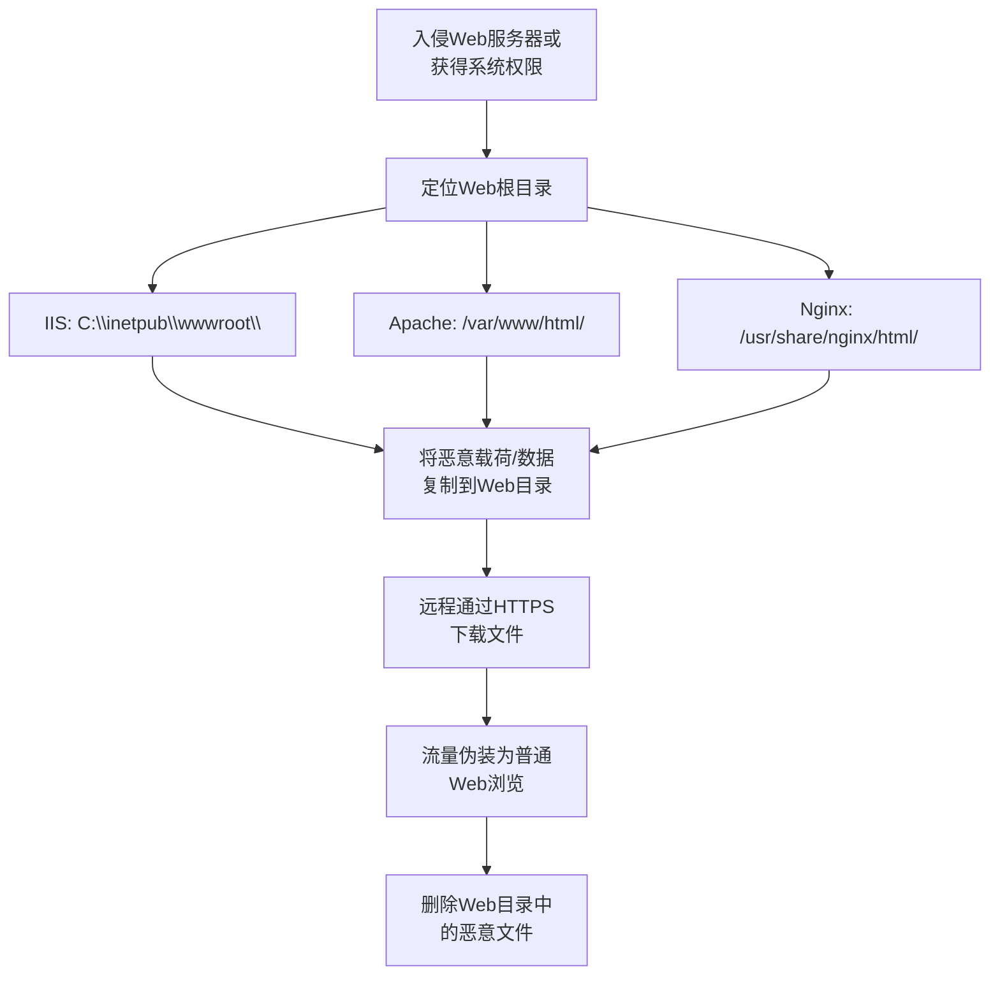

# 共享Web根目录 (T1051)

## 一句话通俗理解

攻击者把恶意文件藏在网站的文件夹里，就像在图书馆的公共书架上偷偷放了一本夹带私货的书——每个来图书馆的人都能看到这本书。

## 30秒速查卡

| 维度 | 你需要知道的 |
|------|-------------|
| 这是什么？ | 攻击者把恶意文件藏在网站的文件夹里，就像在图书馆的公共书架上偷偷放了一本夹带私货的书——每个来图书馆的人都能看到这本书。 |
| 为什么危险？ | 共享Web根目录技术为攻击者提供了一个隐蔽的文件传输通道。由于Web端口（80/443）通常是防火墙允许出站的，攻击者可 |
| 谁需要关心？ | 安全监控团队、SOC分析师 |
| 你的第一步防御 | 监控Web目录中的新文件 |
| 如果只做一件事 | 许多企业使用Web服务器托管内部网站、应用或文件共享 |

## 难度等级

- ⭐⭐ 中级（需要一定基础）

## 技术描述

共享Web根目录（T1051）是MITRE ATT&CK框架中隐蔽战术的一种技术。

**通俗解释：**
许多企业使用Web服务器托管内部网站、应用或文件共享。Web服务器的"根目录"（如C:\inetpub\wwwroot\）下的文件可以通过HTTP/HTTPS协议被访问。攻击者在攻陷系统后，将恶意文件或窃取的数据放置在Web根目录或共享的Web可访问目录中。这样，攻击者可以通过正常的Web端口（80/443）下载这些文件，流量看起来就像普通的网页浏览，不容易被防火墙阻止。

**技术原理：**

1. 攻击者获得目标系统的访问权限后，定位Web服务器的根目录（IIS的wwwroot、Apache的htdocs、Nginx的html等）
2. 将恶意载荷或窃取的数据复制到Web可访问的目录中
3. 攻击者从远程使用HTTP/HTTPS请求下载文件，流量混入正常的Web流量中
4. 利用WebDAV等扩展功能，甚至可以通过Web协议直接管理文件

**用途与影响：**
共享Web根目录技术为攻击者提供了一个隐蔽的文件传输通道。由于Web端口（80/443）通常是防火墙允许出站的，攻击者可以绕过严格的出站过滤规则。同时，文件传输混在正常的HTTPS流量中，难以被深度包检测识别。该技术常用于：在攻击者控制的系统间中转文件、从受害者环境渗出数据、托管恶意软件供其他受害者下载。

## 子技术列表

**该技术没有子技术。**

## 攻击流程

### 典型攻击流程

```
入侵Web服务器 --> 定位Web根目录 --> 放置恶意文件 --> 通过HTTP下载 --> 清除痕迹
```



**步骤详解：**

1. **入侵Web服务器**
   - 通俗描述：攻击者先攻陷系统
   - 技术细节：通过漏洞利用、凭证窃取等方式获得Web服务器权限
   - 常用工具：漏洞扫描器、Webshell

2. **定位Web根目录**
   - 通俗描述：找到网站存放文件的位置
   - 技术细节：IIS默认路径C:\inetpub\wwwroot\，Apache默认路径/var/www/html/
   - 常用工具：文件搜索命令

3. **放置恶意文件**
   - 通俗描述：把恶意程序或偷来的数据放到网站目录下
   - 技术细节：使用copy命令将文件复制到Web目录
   - 常用工具：copy、xcopy、wget、curl

4. **远程下载文件**
   - 通俗描述：通过浏览器或下载工具访问该文件
   - 技术细节：使用HTTP GET请求下载文件
   - 常用工具：浏览器、curl、wget

5. **清除痕迹**
   - 通俗描述：删除留在网站目录中的文件
   - 技术细节：删除文件并清除IIS/Apache访问日志中相关条目
   - 常用工具：del、rm、wevtutil

## 真实案例

### 案例1：Turla使用Web服务器中转文件（2016-2019）

- **时间**: 2016年-2019年
- **目标**: 全球政府机构、大使馆
- **攻击组织**: Turla（Snake、Uroburos）
- **手法**: Turla组织在攻陷的Web服务器上部署后门，利用Web根目录作为文件中转站。他们将收集到的数据编码后写入Web可访问的目录，伪装成CSS或JavaScript文件，然后从远程下载。由于流量从正常的Web服务器发出（端口80/443），受害组织的出站防火墙规则不会阻止这些连接。
- **影响**: 多个政府机构长期数据泄露
- **参考链接**: [MITRE - Turla](https://attack.mitre.org/groups/G0010/)

### 案例2：APT10使用IIS目录托管恶意载荷（2018-2020）

- **时间**: 2018年-2020年
- **目标**: 全球航空航天、科技公司
- **攻击组织**: APT10（Stone Panda）
- **手法**: APT10在攻陷的IIS Web服务器上创建隐蔽的虚拟目录，用于托管恶意载荷。他们将Cobalt Strike Beacon等工具隐藏在Web根目录下的嵌套子目录中，使用随机生成的目录名（如"css/fonts/5839a2/"），然后通过HTTPS下载执行。IT管理员在检查IIS日志时，这些下载记录看起来只是普通的网站资源请求。
- **影响**: 多个企业知识产权被盗
- **参考链接**: [PwC - APT10 Operation](https://www.pwc.com/)

### 案例3：OceanLotus利用WebDAV共享文件（2019-2021）

- **时间**: 2019年-2021年
- **目标**: 东南亚政府机构、制造业
- **攻击组织**: APT32（OceanLotus）
- **手法**: OceanLotus在攻陷的Windows Server上启用WebDAV扩展，使Web根目录支持远程文件管理。攻击者通过WebDAV协议对Web目录中的文件进行读写操作，整个过程完全封装在HTTPS流量中。他们利用这一技术在被攻陷环境中的多台服务器之间中转文件，并最终将窃取的数据通过WebDAV上传到外部服务器。
- **影响**: 多个东南亚政府数据泄露
- **参考链接**: [MITRE - APT32](https://attack.mitre.org/groups/G0057/)

### 案例4：2024年针对托管服务提供商的Web根目录滥用（2024）

- **时间**: 2024年
- **目标**: 全球托管服务提供商
- **攻击组织**: 未知
- **手法**: 攻击者利用托管服务提供商控制面板的漏洞，在共享托管环境中向Web根目录写入恶意PHP webshell。这些webshell通过HTTPS被远程访问，用于执行系统命令、中转文件和窃取数据库凭证。由于所有操作都在正常的Web请求中完成，基于主机的检测很难发现异常。
- **影响**: 数百个托管客户网站数据被窃取
- **参考链接**: [BleepingComputer - Web Hosting Attacks](https://www.bleepingcomputer.com/)

## 红队视角

> ⚠️ **免责声明**：以下内容仅用于合法的安全测试、渗透测试和教育目的。未经授权对他人系统进行测试是违法行为。

### 实战技巧

1. **使用隐蔽的子目录**
   在Web根目录下创建多层嵌套的目录，命名模仿合法资源（如/assets/fonts/icons/），将恶意文件放置在最深层。

2. **文件扩展名伪装**
   将恶意程序扩展名改为.txt、.css、.js等非可执行文件扩展名。下载后使用certutil或其他工具解码还原。

3. **利用HTTPS加密流量**
   确保Web服务器启用了HTTPS，文件传输经过加密后更难被网络检测设备识别。

### 常用工具

| 工具名称 | 用途 | 平台 | 链接 |
|----------|------|------|------|
| curl | 文件下载工具 | 全平台 | https://curl.se/ |
| certutil | Windows证书工具，可用于Base64编解码 | Windows | 系统内置 |
| wget | 命令行下载工具 | Linux/Windows | 系统内置（Linux） |
| PowerShell | Invoke-WebRequest文件下载 | Windows | 系统内置 |
| WebDAV | HTTP文件管理协议 | Windows | 系统内置 |

### 注意事项

- Web目录中的文件可能被搜索引擎或目录扫描工具发现，暴露攻击活动
- 需要确保文件权限设置正确，否则HTTP服务器无法读取
- 使用完成后及时删除文件，避免被Web扫描发现
- Web服务器日志会记录所有文件访问，需清理相关日志条目

## 蓝队视角

### 检测要点

1. **监控Web目录中的新文件**
   - 日志来源：Sysmon Event ID 11（文件创建）、文件完整性监控
   - 关注字段：文件路径、文件类型、创建时间
   - 异常特征：Web根目录下出现非预期的可执行文件或压缩包

2. **检测Web服务器上的异常活动**
   - 日志来源：IIS/Apache/Nginx访问日志
   - 关注字段：URL路径、HTTP方法、文件类型
   - 异常特征：对非正常页面资源的访问、下载大量压缩包

3. **监控Web服务器进程的异常行为**
   - 日志来源：Sysmon Event ID 1（进程创建）
   - 关注字段：w3wp.exe（IIS）或httpd（Apache）启动的进程
   - 异常特征：Web服务器进程启动cmd.exe或PowerShell

### 监控建议

- 部署文件完整性监控（FIM），监控Web根目录的文件变更
- 配置WAF规则检测Web根目录中的异常文件访问
- 定期审计IIS虚拟目录和应用程序映射
- 启用Web服务器日志记录，并集中管理日志数据
- 使用文件哈希校验定期比对Web目录文件状态

## 检测建议

### 网络层检测

**检测方法：** 监控对Web服务器异常路径的HTTP请求。

**具体规则/命令示例：**
```
# 检测Web目录中非预期的文件扩展名请求
# Suricata规则：alert http any any -> $HOME_NET any (msg:"T1051 - Web目录异常文件下载"; content:"GET"; http_method; content:".exe" or content:".zip"; classtype:trojan-activity; sid:1001051; rev:1;)
```

### 主机层检测

**Windows事件ID：**
- 事件ID 4663：文件系统访问（Web目录文件操作）
- 事件ID 11 (Sysmon)：文件创建
- 事件ID 1 (Sysmon)：进程创建
- IIS日志：%SystemDrive%\inetpub\logs\LogFiles\

**Linux日志：**
- 日志文件：/var/log/apache2/access.log 或 /var/log/nginx/access.log
- 关键字段：请求的URL路径、状态码、User-Agent

**具体命令示例：**
```bash
# 查找最近7天Web目录中新建的可执行文件
find /var/www/html/ -name "*.exe" -o -name "*.dll" -mtime -7

# 查看IIS Web根目录文件列表
dir C:\inetpub\wwwroot\ /s /b | findstr /i ".exe .zip .rar"
```

### 应用层检测

**用人话说：**

> 共享Web根目录的攻击手法巧妙又简单：攻击者找到Web服务器的共享目录（如IIS的wwwroot或Apache的/var/www/html），把Web Shell或恶意脚本上传到这个目录，然后通过浏览器访问URL就能在服务器上执行代码。这种手法常用于已经被攻陷的内网——攻击者通过一台机器上的共享访问Web服务器，把冰蝎、蚁剑或哥斯拉的Web Shell文件写进去，然后从外部访问这个URL获取服务器的控制权。检测方法：监控Web根目录下新增的脚本文件（.asp、.aspx、.php、.jsp）、Web日志中突然出现的对陌生路径的GET/POST请求、以及w3wp.exe/httpd进程创建子进程（cmd.exe、powershell.exe）的事件。
>
> **避坑指南**：未启用PowerShell脚本块日志；加密检测阈值设置过高。

**Sigma规则示例：**
```yaml
title: 检测Web目录中的可执行文件创建
status: experimental
description: 检测Web根目录中出现非预期的可执行文件或压缩包
logsource:
    category: file_event
    product: windows
detection:
    selection:
        TargetFilename|startswith:
            - 'C:\inetpub\wwwroot\'
            - 'C:\inetpub\wwwroot\*\'
        TargetFilename|endswith:
            - '.exe'
            - '.dll'
            - '.ps1'
            - '.zip'
            - '.rar'
    condition: selection
level: high
tags:
    - attack.t1051
```

## 缓解措施

### 优先级1：关键措施

**措施名称：** 限制Web目录写入权限

**具体实施步骤：**
1. 将Web根目录权限设置为"只读"，仅允许应用程序池账户读取
2. 使用单独的写操作目录（如upload/），严格限制可上传的文件类型
3. 部署WAF（Web应用防火墙）检测和阻止恶意文件上传

### 优先级2：重要措施

**措施名称：** 文件完整性监控

**具体实施步骤：**
1. 部署FIM工具监控Web根目录的文件变更
2. 建立Web文件基线并定期比对
3. 对Web目录中新增的可执行文件触发即时告警

### 优先级3：建议措施

**措施名称：** 日志审计和异常检测

**具体实施步骤：**
1. 集中收集和分析Web服务器访问日志
2. 配置SIEM规则检测Web目录中的异常文件访问模式
3. 定期审计IIS虚拟目录和应用映射

### MITRE ATT&CK 缓解措施映射

| 缓解措施ID | 缓解措施名称 | 适用性 | 说明 |
|------------|-------------|--------|------|
| M1021 | 限制基于Web的内容 | 适用 | WAF过滤Web请求，检测恶意文件下载 |
| M1038 | 执行预防 | 部分适用 | 限制从Web目录启动可执行文件 |
| M1047 | 审计 | 适用 | 定期审计Web目录文件状态 |
| M1025 | 特权进程监控 | 部分适用 | 监控Web服务器进程的异常子进程创建 |

## 动手实验

> ⚠️ **重要提示**：所有实验必须在隔离的实验室环境中进行，禁止对未授权的真实系统进行测试。

### 实验环境准备

**所需工具：**
- Windows Server或Linux虚拟机
- IIS或Apache/Nginx
- curl/wget

### 实验1：模拟Web根目录文件传输（初级）

**实验目标：** 理解如何通过Web根目录进行文件传输。

**实验步骤：**
1. 在Windows虚拟机上安装IIS并启动默认网站
2. 在C:\inetpub\wwwroot\下创建一个测试文件test.txt
3. 使用另一台机器的浏览器访问http://[服务器IP]/test.txt
4. 查看IIS日志中的访问记录

**预期结果：** 测试文件通过HTTP协议成功下载。

### 实验2：检测Web目录文件变更（中级）

**实验目标：** 使用Sysmon监控Web目录的文件变更。

**实验步骤：**
1. 在实验机上安装Sysmon
2. 在Web目录中创建新文件
3. 查看Sysmon Event ID 11（文件创建）日志
4. 分析文件创建事件的详细信息

**预期结果：** Sysmon记录了Web目录新文件的完整创建信息。

## 术语解释

| 术语 | 英文原名 | 通俗解释 |
|------|----------|----------|
| Web根目录 | Web Root | Web服务器上存放网站文件的根文件夹，如IIS的wwwroot |
| WebDAV | Web Distributed Authoring and Versioning | HTTP协议的扩展，允许通过Web管理服务器上的文件 |
| WAF | Web Application Firewall | Web应用防火墙，专门保护Web服务器免受攻击 |
| FIM | File Integrity Monitoring | 文件完整性监控，检测文件是否被篡改 |
| 虚拟目录 | Virtual Directory | IIS中映射到物理文件夹的虚拟路径 |

## 参考资料

### 官方文档

- [MITRE ATT&CK - T1051](https://attack.mitre.org/techniques/T1051/)
- [IIS Web Server Documentation](https://docs.microsoft.com/en-us/iis/)
- [Apache HTTP Server Documentation](https://httpd.apache.org/docs/)

### 安全报告

- [MITRE - Turla Group](https://attack.mitre.org/groups/G0010/)
- [PwC - APT10 Operation](https://www.pwc.com/)

### 工具与资源

- [Sysinternals Suite](https://docs.microsoft.com/en-us/sysinternals/downloads/sysinternals-suite)
- [IIS Logs Analysis](https://docs.microsoft.com/en-us/iis/manage/provisioning-and-managing-iis/managing-iis-log-file-stores)
