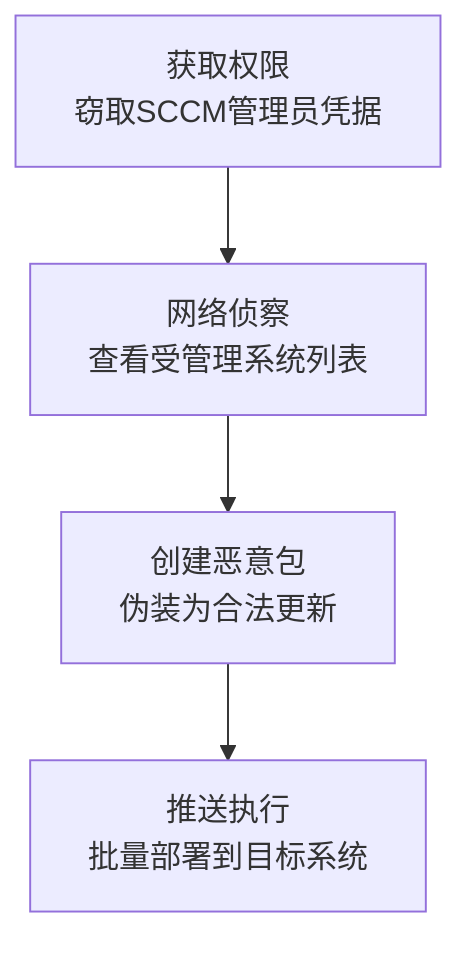

# 软件部署工具 (T1072)

## 一句话通俗理解

就像攻击者收买了公司的快递分发中心——利用企业的软件分发系统（如SCCM），一次操作就能把恶意软件推送到成百上千台电脑。

## 难度等级

- ⭐⭐ 中级（需要一定基础）

## 技术描述

软件部署工具（T1072）是MITRE ATT&CK框架中横向移动战术下的一种技术。

**通俗解释：**
大企业通常有专门的软件分发系统，比如微软的SCCM（System Center Configuration Manager）。IT管理员用这个系统给全公司所有电脑批量安装软件、打补丁。这个系统可以在几分钟内向成百上千台电脑推送软件并自动安装。攻击者如果控制了这套系统——比如偷到了管理员的账号——就能用同样的方式把恶意软件"一键推送"到整个公司网络中的所有电脑。

**技术原理：**

1. **获取访问权限**：攻击者通过窃取管理员凭据或利用管理控制台漏洞，获得对部署系统的访问权
2. **侦察与规划**：利用部署系统的管理界面查看网络拓扑、识别高价值目标（域控制器、数据库服务器）
3. **创建恶意部署包**：创建新的软件部署，或者修改现有的合法部署包，植入恶意代码
4. **分发执行**：通过部署系统将恶意包推送到目标系统，几小时内就能覆盖数百台机器

**用途与影响：**
软件部署工具横向移动的独特之处在于其规模化和自动化特性。与攻击者逐台用RDP连接不同，利用部署工具可以在一次操作中覆盖成百上千台系统。这种技术特别适合勒索软件攻击——攻击者可以在下班前一键推送勒索软件，等第二天上班时整个公司已经瘫痪。

## 子技术列表

该技术没有子技术。

## 攻击流程

### 典型攻击流程

```
获取部署系统访问权限 --> 侦察网络拓扑 --> 创建恶意部署包 --> 推送执行
```



**步骤详解：**

1. **获取部署系统访问权限**
   - 通俗描述：攻击者通过窃取管理员凭据，获得SCCM或其他部署工具的控制台访问权限
   - 技术细节：从被入侵系统中提取域管理员凭据，或针对SCCM服务器进行凭据窃取
   - 常用工具：Mimikatz、RDP、Cobalt Strike

2. **侦察网络拓扑**
   - 通俗描述：登录部署系统管理控制台，查看所有受管理系统的列表和分组
   - 技术细节：使用SCCM控制台的"资产和符合性"功能浏览设备集合，识别高价值系统
   - 常用工具：SCCM管理控制台、PDQ Inventory

3. **创建恶意部署包**
   - 通俗描述：创建一个伪装成软件更新或安全补丁的恶意部署包
   - 技术细节：创建SCCM应用程序部署，设置PowerShell脚本作为部署类型，或修改现有部署包添加恶意代码
   - 常用工具：SCCM Console、PDQ Deploy

4. **推送执行**
   - 通俗描述：将恶意包推送到目标系统并立即执行
   - 技术细节：使用"必需部署"策略强制推送，使用客户端通知功能触发即时执行
   - 常用工具：SCCM Console、PDQ Deploy

## 真实案例

### 案例1：FIN7使用SCCM在企业网络中部署勒索软件（2019-2021年）

- **时间**: 2019年至2021年
- **目标**: 全球零售、酒店和餐饮行业组织
- **攻击组织**: FIN7（Carbon Spider）
- **手法**: FIN7在多次入侵中展示了将SCCM作为横向移动通道的成熟能力。攻击者先通过鱼叉式钓鱼获得初始立足点，然后窃取SCCM管理员的域凭据。使用这些凭据登录SCCM管理控制台后，创建了伪装为合法软件更新的恶意部署包，用于分发Carbanak后门。FIN7利用SCCM的"必需部署"功能，将恶意包强制推送到选定的设备集合中。在勒索软件最终部署阶段，他们利用SCCM的客户端通知功能触发即时执行，在约15分钟内加密了数百台系统。
- **影响**: 直接导致多个组织的POS系统和支付处理服务器被完全控制
- **参考链接**: [Mandiant FIN7 SCCM分析](https://www.mandiant.com/resources/blog/fin7-sccm-lateral-movement)

### 案例2：CISA警告SCCM漏洞CVE-2024-43468被用于攻击（2024-2026年）

- **时间**: 2024年至2026年
- **目标**: 使用Microsoft Configuration Manager的组织
- **攻击组织**: 多个APT组织和网络犯罪团伙
- **手法**: 2024年10月微软修补了SCCM中的一个关键远程代码执行漏洞CVE-2024-43468，由Synacktiv发现并报告。该漏洞允许攻击者在SCCM站点服务器上远程执行代码。2026年2月，CISA将该漏洞加入"已知被利用漏洞"目录，要求美国联邦机构在指定时间内完成修补。攻击者利用此漏洞在受影响的SCCM服务器上获得立足点，然后使用SCCM的管理功能向所有受管理的端点横向移动。SCCM的自动客户端推送和AD系统发现功能被攻击者用于扩展访问范围，一个SCCM管理员账户的沦陷可以导致所有受SCCM管理的系统被攻陷。
- **影响**: 无数使用SCCM的组织面临被批量部署恶意软件的风险
- **参考链接**: [BleepingComputer CISA SCCM漏洞报道](https://www.bleepingcomputer.com/news/security/cisa-flags-microsoft-configmgr-rce-flaw-as-exploited-in-attacks/)

### 案例3：Wizard Spider滥用PDQ Deploy进行勒索软件横向传播（2020-2022年）

- **时间**: 2020年至2022年
- **目标**: 全球医疗、政府和制造业组织
- **攻击组织**: Wizard Spider（Ryuk/Conti运营组织）
- **手法**: Wizard Spider被观察到在入侵活动中滥用PDQ Deploy进行勒索软件横向传播。攻击者通过其他手段（如TrickBot或BazarLoader）获得立足点后，在企业网络中识别出已部署PDQ Deploy的环境。利用窃取的凭据登录PDQ Deploy控制台，创建包含勒索软件可执行文件的部署步骤，立即推送到管理范围内所有系统。PDQ Deploy使用ADMIN$共享和Windows远程服务执行文件传输，其产生的网络连接和进程创建事件往往被安全运营团队视为良性活动。
- **影响**: 通过PDQ Deploy在多个客户环境中成功部署了勒索软件
- **参考链接**: [The DFIR Report Wizard Spider分析](https://thedfirreport.com/2021/08/30/wizard-spider-abusing-pdq-deploy/)

## 红队视角

> ⚠️ **免责声明**：以下内容仅用于合法的安全测试、渗透测试和教育目的。未经授权对他人系统进行测试是违法行为。

### 实战技巧

1. **利用SCCM的集合机制定向部署**
   不要部署到"所有系统"，而是创建针对特定设备集合（如"所有服务器"或"域控制器"）的部署，减少被检测的可能性。

2. **伪装为合法的软件更新**
   将恶意包命名为类似"Security Update KB5034441"的形式，使用合法的公司名称作为发布者，增加可信度。

3. **定时执行避开工作时间**
   将部署计划的执行时间设定在下班后或周末，减少被发现的可能性。

### 常用工具

| 工具名称 | 用途 | 平台 | 链接 |
|----------|------|------|------|
| SCCM Console | Microsoft配置管理器管理控制台 | Windows | https://docs.microsoft.com/en-us/mem/configmgr |
| PDQ Deploy | 面向中小企业的部署工具 | Windows | https://www.pdq.com/pdq-deploy/ |
| Misconfiguration Manager | SCCM安全评估工具 | Windows | https://github.com/subat0mik/Misconfiguration-Manager |

### 注意事项

- 在合法的渗透测试中，使用SCCM进行横向移动必须在授权范围内
- SCCM部署会产生大量日志，操作前需确认测试环境的日志保留策略

## 蓝队视角

### 检测要点

1. **监控SCCM管理控制台的异常访问**
   - 日志来源：SCCM AdminUI.log、Windows安全日志（Event ID 4624）
   - 关注字段：登录账户、源IP地址、登录时间
   - 异常特征：非常用管理账户在非工作时间登录SCCM控制台；从未经授权的工作站登录

2. **检测异常的部署包创建**
   - 日志来源：SCCM SMSProv.log
   - 关注字段：WMI写入事件、包来源、可执行文件名称
   - 异常特征：短时间内创建大量新部署包；部署包来源路径指向可疑位置

### 监控建议

- 将SCCM日志集中到SIEM平台进行分析
- 针对SCCM管理员账户实施MFA和条件访问
- 定期审查SCCM部署包的内容和分发范围

## 检测建议

### 网络层检测

**检测方法：** 监控SCCM管理端口（RPC动态端口、SMB 445）的异常流量模式。

**具体命令示例：**
```
# 查询SCCM管理服务器的异常登录事件
Get-WinEvent -LogName Security | Where-Object { $_.Id -eq 4624 -and $_.Properties[8].Value -eq 2 -and $_.Properties[5].Value -eq "SCCM管理服务器IP" }
```

### 主机层检测

**Windows事件ID：**
- 事件ID 7045：新服务创建（可能是SCCM客户端推送）
- 事件ID 4688：进程创建（监控CcmExec.exe的异常行为）
- 事件ID 5145：网络共享对象检查（对ADMIN$共享的写入）

### 应用层检测

**Sigma规则示例：**
```yaml
title: Suspicious SCCM Application Deployment
status: experimental
description: Detects creation of SCCM deployments with suspicious characteristics
logsource:
    product: windows
    service: sms-provider
detection:
    selection:
        Provider_Name: SMS Provider
        Message: '*Application*Deployment*'
    condition: selection
level: high
tags:
    - attack.t1072
```

## 缓解措施

### 优先级1：关键措施

**措施名称：** 对部署基础设施实施严格的访问控制

**具体实施步骤：**
1. 为SCCM管理控制台启用多因素认证（MFA）
2. 限制可以从哪些工作站访问SCCM控制台（特权访问工作站方案）
3. 定期审查SCCM管理组的成员资格

### 优先级2：重要措施

**措施名称：** 实施部署包签名和完整性验证

**具体实施步骤：**
1. 对所有通过SCCM分发的软件包进行代码签名
2. 配置SCCM仅接受经过签名的部署类型
3. 维护授权软件包的清单

### 优先级3：建议措施

**措施名称：** 网络分段保护部署服务器

**具体实施步骤：**
1. 将SCCM站点服务器部署在独立的管理网段
2. 通过防火墙限制对SCCM管理端口的访问
3. 防止部署服务器直接从互联网访问

### MITRE ATT&CK 缓解措施映射

| 缓解措施ID | 缓解措施名称 | 适用性 |
|------------|-------------|--------|
| M1035 | Limit Access to Resource Over Network | 适用 |
| M1026 | Privileged Account Management | 适用 |
| M1018 | User Account Management | 适用 |
| M1022 | Restrict File and Directory Permissions | 适用 |

## 动手实验

> ⚠️ **重要提示**：所有实验必须在隔离的实验室环境中进行，禁止对未授权的真实系统进行测试。

### 实验环境准备

**推荐靶场：** 使用虚拟机搭建实验环境，包含域控制器、SCCM服务器和若干客户端。

**所需工具：**
- Windows Server评估版（含SCCM试用）
- 若干Windows 10/11客户端虚拟机

### 实验1：识别SCCM部署包变更（初级）

**实验目标：** 学习如何监控和识别SCCM中的部署包变更。

**实验步骤：**
1. 在实验室中部署SCCM环境
2. 创建一个合法的软件部署包
3. 查看SCCM日志（SMSProv.log）中的记录
4. 对比正常部署与异常部署的日志差异

## 术语解释

| 术语 | 英文原名 | 通俗解释 |
|------|----------|----------|
| SCCM | System Center Configuration Manager | 微软的系统管理软件，用于在企业中批量管理电脑和部署软件 |
| PDQ Deploy | PDQ Deploy | 面向中小企业的软件部署工具，可以在多台电脑上同时安装软件 |
| 管理共享 | Admin Share | Windows系统默认的管理员专用隐藏共享文件夹 |
| RaaS | Ransomware as a Service | 勒索软件即服务，一种勒索软件的分发模式 |

## 参考资料

### 官方文档

- [MITRE ATT&CK - Software Deployment Tools](https://attack.mitre.org/techniques/T1072/)
- [Securing Microsoft Configuration Manager - Microsoft](https://learn.microsoft.com/en-us/mem/configmgr/core/understand/security-fundamentals)

### 安全报告

- [FIN7使用SCCM部署勒索软件 - Mandiant](https://www.mandiant.com/resources/blog/fin7-sccm-lateral-movement)
- [CISA SCCM漏洞公告](https://www.bleepingcomputer.com/news/security/cisa-flags-microsoft-configmgr-rce-flaw-as-exploited-in-attacks/)

### 工具与资源

- [Misconfiguration Manager](https://github.com/subat0mik/Misconfiguration-Manager) - SCCM安全评估工具
- [Lateral Movement via SCCM - SpecterOps](https://posts.specterops.io/sccm-lateral-movement-4580ed3f9a4f)
