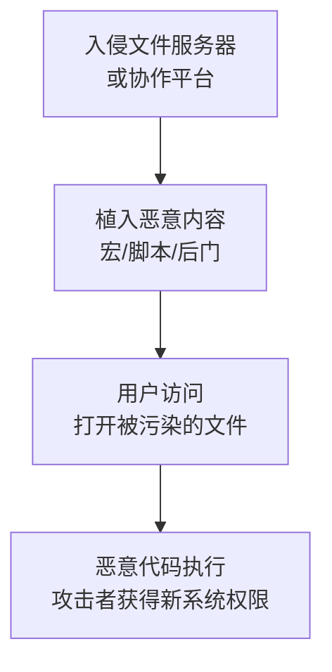

# 污染共享内容 (T1080)

## 一句话通俗理解

就像在公司的共享零食柜里投毒——攻击者在共享文件夹、Wiki页面或软件更新里藏入恶意代码，等待其他人打开时触发。

## 30秒速查卡

| 维度 | 你需要知道的 |
|------|-------------|
| 这是什么？ | 就像在公司的共享零食柜里投毒——攻击者在共享文件夹、Wiki页面或软件更新里藏入恶意代码，等待其他人打开时触发。 |
| 为什么危险？ | 这种技术利用了内部信任——用户天然认为来自内部同事或IT部门的文件是安全的。一旦攻击者污染了共享内容，可以同时影响大量用 |
| 谁需要关心？ | 安全监控团队、SOC分析师 |
| 你的第一步防御 | 监控共享模板文件的异常修改 |
| 如果只做一件事 | 企业里有很多共享资源：文件服务器上的共享文件夹、Wiki协作平台的页面、软件更新服务器上的安装包 |

## 难度等级

- ⭐⭐ 中级（需要一定基础）

## 技术描述

污染共享内容（T1080）是MITRE ATT&CK框架中横向移动战术下的一种技术。

**通俗解释：**
企业里有很多共享资源：文件服务器上的共享文件夹、Wiki协作平台的页面、软件更新服务器上的安装包。同事们通常信任这些共享资源——因为是"内部的"、"同事放的"、"IT部门维护的"。攻击者利用这种信任，在共享资源中植入恶意代码，当其他用户访问这些被污染的内容时，恶意代码就在他们的电脑上执行，攻击者从而获得对新系统的访问权限。

**技术原理：**

1. **入侵共享资源**：攻击者先入侵一个有写入权限的系统（如文件服务器、Wiki服务器）
2. **植入恶意代码**：在共享文档中添加恶意宏、在Wiki页面注入JavaScript、修改自动化脚本
3. **等待触发**：当其他用户打开被污染的文档、访问被污染的页面或执行被修改的脚本时触发
4. **扩大控制**：恶意代码在新系统上执行，攻击者获得对新系统的访问权限

**用途与影响：**
这种技术利用了内部信任——用户天然认为来自内部同事或IT部门的文件是安全的。一旦攻击者污染了共享内容，可以同时影响大量用户，实现大规模横向移动。

## 子技术列表

该技术没有子技术。

## 攻击流程

### 典型攻击流程

```
入侵共享资源 --> 植入恶意代码 --> 等待触发 --> 扩大控制
```



**步骤详解：**

1. **入侵共享资源**
   - 通俗描述：攻击者先控制一台可以写入共享文件夹或协作平台的系统
   - 技术细节：窃取文件服务器管理员凭据，或利用Web应用漏洞入侵协作平台
   - 常用工具：Mimikatz、SQL注入工具

2. **植入恶意内容**
   - 通俗描述：在共享文档中添加恶意宏，或修改共享脚本植入后门
   - 技术细节：修改Office模板（Normal.dotm）添加自动执行宏；修改PowerShell脚本；在Wiki页面注入JavaScript
   - 常用工具：Office宏、PowerShell、VBA

3. **等待触发**
   - 通俗描述：等待其他用户打开被污染的文档或访问被污染的页面
   - 技术细节：诱使用户打开共享文件夹中的文档；或者利用定时任务自动执行
   - 常用工具：社会工程学、计划任务

4. **扩大控制**
   - 通俗描述：通过被污染内容在新系统上建立后门，继续扩展
   - 技术细节：部署C2 Beacon、收集新凭据、重复上述过程
   - 常用工具：Cobalt Strike、PowerShell

## 真实案例

### 案例1：Codoso组织通过污染SMB文件共享传播恶意软件（2021-2022年）

- **时间**: 2021年至2022年
- **目标**: 东亚地区的教育机构和研究机构
- **攻击组织**: Codoso
- **手法**: Codoso组织通过污染组织内部SMB文件共享进行横向移动。攻击者使用被盗凭据获得对文件服务器的写入权限后，在共享目录中替换了Office模板文件（Normal.dotm）。当其他用户打开Office应用程序时，被污染的模板自动加载并在新文档中嵌入恶意宏。与技术依赖用户手动打开特定文档不同，这种模板污染的优势在于——每次受害者打开Word或Excel时，恶意模板都会自动执行。通过这种方法，Codoso在多个教育机构的数百台系统中实现了横向移动。
- **影响**: 数百台教育机构系统被感染
- **参考链接**: [Office模板污染分析](https://posts.specterops.io/office-template-lateral-movement-1f4c2c3a8b5d)

### 案例2：SolarWinds供应链攻击中的共享内容污染（2020年）

- **时间**: 2020年
- **目标**: SolarWinds Orion客户（美国政府机构和财富500强企业）
- **攻击组织**: APT29（Cozy Bear）
- **手法**: 在SolarWinds供应链攻击中，攻击者污染了SolarWinds软件更新服务器上托管的Orion平台更新包。他们入侵了SolarWinds的构建流程，将名为SUNBURST的恶意后门注入到Orion软件的数字签名更新文件中。当客户系统自动下载并安装被污染的更新时，SUNBURST后门被部署到18,000多个组织中。虽然这个案例主要被归类为供应链攻击，但它本质上也是一种"共享内容污染"——将恶意代码植入到合法软件的更新包中，利用用户对软件更新的信任进行传播。
- **影响**: 影响了超过18,000个组织
- **参考链接**: [FireEye SolarWinds分析](https://www.fireeye.com/blog/threat-research/2020/12/evasive-attacker-leverages-solarwinds-supply-chain-compromises-with-sunburst-backdoor.html)

### 案例3：DarkHotel通过污染酒店商务中心打印机和文件共享攻击高管（2014-2016年）

- **时间**: 2014年至2016年
- **目标**: 亚太地区政府官员和国防承包商高管
- **攻击组织**: DarkHotel（Tapaoux）
- **手法**: DarkHotel APT组织通过污染酒店商务中心的共享打印机和文件共享来攻击高价值目标。攻击者先入侵酒店的网络基础设施，然后在商务中心的共享文件夹中放置包含恶意宏的Office文档。这些文档被伪装成会议日程、合同模板或行程安排。当参加高级别会议的外交官或企业高管在商务中心打开这些文档并启用宏时，恶意软件安装到目标系统中。DarkHotel使用的恶意软件从被入侵系统的内存中窃取凭据，并使用这些凭据访问目标的VPN和Webmail账户。
- **影响**: 成功窃取多个政府机构和企业的高价值情报
- **参考链接**: [Kaspersky DarkHotel分析](https://www.kaspersky.com/blog/darkhotel-malware/)

### 案例4：Axios npm 供应链攻击中的共享内容污染（2026年）

- **时间**: 2026年3月31日
- **目标**: JavaScript/Node.js 生态系统的开发者（Axios npm 包，4亿+月下载量）
- **攻击组织**: UNC1069 / Sapphire Sleet（朝鲜国家背景）
- **手法**: 攻击者通过社会工程学手段（伪装成Microsoft Teams错误修复）获取了Axios主要维护者@jasonsaayman的npm凭据。利用长期有效的访问令牌，攻击者绕过了OIDC信任发布流程，发布了两个恶意版本（axios@1.14.1和axios@0.30.4）。恶意版本引入了一个名为plain-crypto-js（伪装crypto-js的异形包）的新依赖，该依赖在安装时触发恶意postinstall脚本，投递跨平台远程访问木马（RAT）。恶意软件还会自我清除痕迹。这本质上是一种"共享内容污染"——攻击者污染了全球开发者信任的npm包注册表，将恶意代码注入到合法的软件依赖中，导致下载该包的开发者系统被控制。攻击者还利用被感染的开发者机器作为跳板，窃取源代码仓库凭证、云凭据和CI/CD流水线访问权限。
- **影响**: 影响了估计数百万个使用Axios的项目，数千个开发者系统被入侵，npm在3小时内下架了恶意版本
- **参考链接**: [BleepingComputer Axios攻击分析](https://www.bleepingcomputer.com/news/security/axios-npm-hack-used-fake-teams-error-fix-to-hijack-maintainer-account/) | [The Hacker News - Google归因](https://thehackernews.com/2026/04/google-attributes-axios-npm-supply.html)

## 红队视角

> ⚠️ **免责声明**：以下内容仅用于合法的安全测试、渗透测试和教育目的。未经授权对他人系统进行测试是违法行为。

### 实战技巧

1. **污染Office模板是最隐蔽的方式**
   修改Normal.dotm（Word全局模板）比修改单个文档更有效——每次用户打开Word都会自动触发。

2. **使用定时后触发而非立即执行**
   设置宏在特定时间或特定条件下执行，避免污染后马上触发引起警觉。

### 常用工具

| 工具名称 | 用途 | 平台 | 链接 |
|----------|------|------|------|
| Office宏/VBA | 在Office文档中嵌入恶意代码 | Windows | Office内置 |
| PowerShell | 编写脚本植入共享目录 | Windows | Windows内置 |
| Metasploit | 生成恶意文档载荷 | 跨平台 | https://www.metasploit.com |

### 注意事项

- 污染共享内容可能影响大量无辜用户，必须确保在授权范围内进行
- 在企业内部测试前，需要提前通知IT和安全团队

## 蓝队视角

### 检测要点

1. **监控共享模板文件的异常修改**
   - 日志来源：Windows安全日志（Event ID 4663）
   - 关注字段：文件路径（Normal.dotm、*.dotx）、修改账户
   - 异常特征：非管理员用户修改共享Office模板；模板文件在非工作时间被修改

2. **检测共享目录中的新创建可执行文件**
   - 日志来源：Windows安全日志（Event ID 5145）
   - 关注字段：共享名称、文件名、写入账户
   - 异常特征：在文档共享目录中创建.exe/.ps1/.vbs文件

### 监控建议

- 实施文件完整性监控（FIM）保护关键共享资源
- 限制对共享文件夹的写入权限，遵循最小权限原则
- 配置Office安全策略，禁用来自网络共享的宏执行

## 检测建议

### 网络层检测

**检测方法：** 监控SMB共享上的文件写入操作，特别是对模板文件和脚本文件的修改。

### 主机层检测

**Windows事件ID：**
- 事件ID 4663：对象访问尝试（监控对共享模板文件的修改）
- 事件ID 5145：网络共享对象检查（检测共享目录中的文件创建）
- 事件ID 4688：进程创建（检测从共享目录启动的进程）

### 应用层检测

**用人话说：**

> 污染共享内容是"守株待兔"式的横向移动——攻击者在公司的共享文件夹里投放带宏病毒的木马文档，等下一个用户打开这个文档时就触发感染。比如攻击者在财务部的共享目录（\\server\share\）里放一个名为"2026年奖金发放表.xlsm"的文件，内置恶意宏代码，当其他财务人员双击打开时，宏自动下载并执行payload。还有更常见的做法：在Windows快捷方式文件中嵌入恶意命令，当用户打开共享目录的图标时自动执行。检测方法：监控共享目录中新增的Office文档存在可疑宏、LNK文件内容包含PowerShell命令、以及Sysmon事件ID 11在共享目录下创建可执行文件或脚本。
>
> **避坑指南**：忽略SMB管理共享异常访问；未区分正常SSH管理连接和异常横向；未启用PowerShell脚本块日志。

**Sigma规则示例：**
```yaml
title: Office Template Modified on Network Share
status: experimental
description: Detects modifications to Office templates on network shares
logsource:
    product: windows
    service: security
detection:
    selection:
        EventID: 4663
        ObjectName: '*.dotm'
    condition: selection
level: high
tags:
    - attack.t1080
```

## 缓解措施

### 优先级1：关键措施

**措施名称：** 配置Office禁用来自共享位置的宏

**具体实施步骤：**
1. 通过组策略配置Office信任中心，禁用所有从网络位置加载的宏
2. 启用Microsoft Office文件验证功能
3. 使用攻击面减少（ASR）规则阻止Office创建子进程

### 优先级2：重要措施

**措施名称：** 实施文件完整性监控

**具体实施步骤：**
1. 对共享文件夹中的模板、脚本和可执行文件实施访问控制审计
2. 使用文件哈希验证确保关键内容未被篡改
3. 设置告警通知关键文件的修改事件

### 优先级3：建议措施

**措施名称：** 限制对共享资源的写入权限

**具体实施步骤：**
1. 遵循最小权限原则，仅必要的管理员具有写入权限
2. 定期审计共享资源的权限配置
3. 对高价值共享资源实施额外的写保护

### MITRE ATT&CK 缓解措施映射

| 缓解措施ID | 缓解措施名称 | 适用性 |
|------------|-------------|--------|
| M1037 | Filter Network Traffic | 适用 |
| M1022 | Restrict File and Directory Permissions | 适用 |
| M1041 | Encrypt Sensitive Information | 部分适用 |
| M1018 | User Account Management | 适用 |

## 动手实验

> ⚠️ **重要提示**：所有实验必须在隔离的实验室环境中进行，禁止对未授权的真实系统进行测试。

### 实验环境准备

**推荐靶场：** 使用Windows Server和Windows 10搭建小型企业网络环境。

### 实验1：Office模板污染模拟（初级）

**实验目标：** 理解Office模板污染的原理。

**实验步骤：**
1. 在文件服务器上创建共享文件夹
2. 在共享文件夹中放置一个包含恶意宏的Word模板
3. 在客户端电脑上打开来自共享的文档
4. 观察宏执行过程和产生的日志

## 术语解释

| 术语 | 英文原名 | 通俗解释 |
|------|----------|----------|
| VBA宏 | VBA Macro | Office文档中的自动执行脚本，可用于自动化操作也可被滥用 |
| FIM | File Integrity Monitoring | 文件完整性监控，检测文件是否被篡改的技术 |
| ASR | Attack Surface Reduction | 攻击面减少，Windows Defender中的安全功能 |
| Normal.dotm | Normal.dotm | Word的默认模板文件，每次启动Word时自动加载 |

## 参考资料

### 官方文档

- [MITRE ATT&CK - Taint Shared Content](https://attack.mitre.org/techniques/T1080/)
- [Office模板横向移动 - SpecterOps](https://posts.specterops.io/office-template-lateral-movement-1f4c2c3a8b5d)
- [恶意宏防护 - Microsoft](https://docs.microsoft.com/en-us/windows/security/threat-protection/intelligence/macro-malware)
