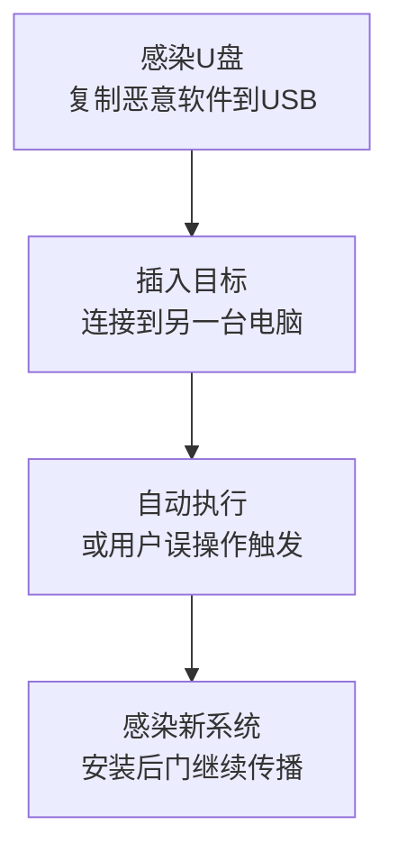

# 通过可移动介质传播 (T1091)

## 一句话通俗理解

就像电影里的特工用U盘偷渡机密数据——攻击者把恶意软件藏在U盘、移动硬盘里，插入哪台电脑就感染哪台。

## 30秒速查卡

| 维度 | 你需要知道的 |
|------|-------------|
| 这是什么？ | 就像电影里的特工用U盘偷渡机密数据——攻击者把恶意软件藏在U盘、移动硬盘里，插入哪台电脑就感染哪台。 |
| 为什么危险？ | 这种技术在针对高安全环境（政府军事网络、工业控制系统、金融核心网络）的攻击中特别有效。虽然现代操作系统（Windows |
| 谁需要关心？ | 安全监控团队、SOC分析师 |
| 你的第一步防御 | 监控USB设备连接事件 |
| 如果只做一件事 | 有些高安全级别的网络（如军事网络、核设施控制系统）不连接互联网，形成了"物理隔离"的网络环境 |

## 难度等级

- ⭐⭐ 中级（需要一定基础）

## 技术描述

通过可移动介质传播（T1091）是MITRE ATT&CK框架中横向移动战术下的一种技术。

**通俗解释：**
有些高安全级别的网络（如军事网络、核设施控制系统）不连接互联网，形成了"物理隔离"的网络环境。这种环境叫"气隙网络"（Air-Gapped Network），黑客无法通过网络远程攻击。但他们可以用一个古老而有效的方法——U盘。攻击者把恶意软件藏在U盘里，利用员工的疏忽或好奇心，让U盘被插入到目标系统中。

**技术原理：**

1. **感染U盘**：攻击者在被入侵的系统上连接一个U盘，将恶意软件复制进去，并设置自动运行机制
2. **传播到新系统**：当U盘插入另一台电脑时，恶意软件通过自动播放功能或用户误操作执行
3. **感染新系统**：恶意软件在新系统上建立后门、收集数据，然后继续感染其他插入该电脑的U盘
4. **重复循环**：如此循环往复，恶意软件在物理隔离的网络中逐步扩散

**用途与影响：**
这种技术在针对高安全环境（政府军事网络、工业控制系统、金融核心网络）的攻击中特别有效。虽然现代操作系统（Windows 10/11）默认禁用了自动播放，但攻击者仍然可以通过社会工程学（如故意在停车场丢下标记有"机密"的U盘）诱使用户手动打开。

## 子技术列表

该技术没有子技术。

## 攻击流程

### 典型攻击流程

```
感染U盘 --> 插入新系统 --> 自动/诱导执行 --> 感染扩散
```



**步骤详解：**

1. **感染U盘**
   - 通俗描述：在被入侵的电脑上插入U盘，将恶意软件复制进去
   - 技术细节：创建隐藏的恶意文件、设置Autorun.inf、或创建恶意的LNK快捷方式文件
   - 常用工具：定制恶意软件、PowerShell脚本

2. **插入目标系统**
   - 通俗描述：将感染后的U盘插入目标电脑
   - 技术细节：攻击者物理接触目标系统插入U盘，或通过社会工程学诱使员工插入被污染的U盘
   - 常用工具：物理访问、社会工程学

3. **触发执行**
   - 通俗描述：恶意软件在目标系统上被执行
   - 技术细节：利用Windows自动播放功能（如已启用）、伪装成合法文件的图标诱使用户双击、利用LNK漏洞（如Stuxnet使用的MS10-046）
   - 常用工具：恶意LNK文件、Autorun.inf

4. **感染扩散**
   - 通俗描述：恶意软件在新系统上安装后门，继续感染其他U盘
   - 技术细节：建立持久化机制、监控USB插入事件、自动感染新连接的U盘
   - 常用工具：Windows服务、计划任务

## 真实案例

### 案例1：Stuxnet通过USB驱动器感染伊朗核设施（2009-2010年）

- **时间**: 2009年至2010年
- **目标**: 伊朗纳坦兹核设施的铀浓缩离心机
- **攻击组织**: 据称由美国和以色列联合开发
- **手法**: Stuxnet是利用可移动介质传播的最著名案例。由于伊朗核设施的离心机控制系统是气隙网络（不连互联网），攻击者设计了通过USB传播的方案。Stuxnet通过感染项目合作者的Windows系统进入设施内网，然后搜索连接的USB驱动器并复制自身。当员工将U盘插入连接到离心机控制系统的工程工作站时，Stuxnet感染这些系统。该恶意软件利用四个零日漏洞（包括LNK漏洞MS10-046）实现无需用户交互的自动传播，并使用伪造的数字签名绕过驱动签名验证。最终，Stuxnet通过修改离心机变频器的运行参数，在数月内物理摧毁了近千台离心机。
- **影响**: 物理摧毁了近千台离心机，严重拖延了伊朗核计划
- **参考链接**: [Symantec Stuxnet Dossier](https://www.symantec.com/content/en/us/enterprise/media/security_response/whitepapers/w32_stuxnet_dossier.pdf)

### 案例2：Agent.BTZ通过USB入侵美国军方网络（2008年）

- **时间**: 2008年
- **目标**: 美国中央司令部（CENTCOM）的军事网络
- **攻击组织**: Turla（也称为Snake）
- **手法**: Agent.BTZ被认为是历史上最成功的USB传播攻击之一。攻击始于一名美军人员在停车场捡到标记为"US CENTCOM"的受感染U盘，并出于好奇将其插入连接军事网络的计算机。恶意软件利用Windows Autorun功能自动执行，在受感染系统上安装后门。Agent.BTZ然后扫描所有连接到该系统的可移动驱动器，在每个驱动器中创建隐藏的Autorun.inf文件。当U盘插入其他系统时，恶意软件传播到新系统。这次攻击最终导致美军全面改革可移动介质政策，甚至全面禁用了军事网络中的USB驱动器和光驱。
- **影响**: 导致美军全面禁用可移动介质的政策变更
- **参考链接**: [USAF Agent.BTZ分析](https://www.af.mil/News/Article-Display/Article/126682/cyber-command-addresses-agentbtz-threat/)

### 案例3：USBferry在气隙网络中的横向移动（2023年）

- **时间**: 2023年
- **目标**: 欧洲和东亚的政府外交机构
- **攻击组织**: 多个APT组织
- **手法**: ESET研究人员发现了一种名为USBferry的USB传播技术，被多个APT组织用于攻击气隙网络。USBferry不依赖Autorun或LNK漏洞，而是通过在受感染系统上植入后台服务来监控USB设备的连接事件。当检测到新USB驱动器插入时，该服务自动将恶意载荷复制到USB驱动器的隐藏区域，并修改驱动器上合法文件的快捷方式。USBferry还使用了一种复杂的UAC绕过技术，确保在Windows 10/11系统上也能自动执行。这种技术在东亚外交机构和欧洲政府网络中传播了至少18个月未被发现。
- **影响**: 在外交机构网络中潜伏超过18个月
- **参考链接**: [ESET USBferry分析](https://www.welivesecurity.com/2023/05/16/usbferry-badusb-attacks-air-gapped-networks/)

## 红队视角

> ⚠️ **免责声明**：以下内容仅用于合法的安全测试、渗透测试和教育目的。未经授权对他人系统进行测试是违法行为。

### 实战技巧

1. **使用BadUSB而非Autorun**
   BadUSB通过模拟键盘输入来自动执行命令，不需要依赖Windows的自动播放功能，可以绕过大多数禁用Autorun的策略。

2. **LNK文件伪装**
   在USB驱动器上创建伪装成文件夹图标的LNK文件，当用户双击"文件夹"时实际执行恶意命令。

### 常用工具

| 工具名称 | 用途 | 平台 | 链接 |
|----------|------|------|------|
| USB Rubber Ducky | 预编程的USB键盘模拟攻击设备 | 硬件 | https://shop.hak5.org/products/usb-rubber-ducky |
| Metasploit | 生成USB自动运行载荷 | 跨平台 | https://www.metasploit.com |
| PowerShell | 编写USB传播脚本 | Windows | Windows内置 |

### 注意事项

- 物理渗透测试需要明确的安全授权
- 使用USB攻击可能违反当地法律，即使在安全测试中也需谨慎
- 在客户环境中留下U盘可能被清洁工或其他非目标人员发现

## 蓝队视角

### 检测要点

1. **监控USB设备连接事件**
   - 日志来源：Microsoft-Windows-Kernel-PnP/Configuration（Event ID 20001, 20003）
   - 关注字段：设备ID、序列号、首次连接时间
   - 异常特征：从未知或未批准的USB设备启动的进程

2. **检测USB驱动器上的LNK文件创建**
   - 日志来源：Windows安全日志（Event ID 4663）
   - 关注字段：文件路径、文件名（.lnk）
   - 异常特征：U盘根目录出现指向可执行文件的快捷方式

### 监控建议

- 实施端点设备控制策略，仅允许批准的加密USB驱动器
- 禁用所有系统的自动播放功能
- 对从USB驱动器启动的进程设置告警

## 检测建议

### 网络层检测

**检测方法：** USB传播本身不产生网络流量，但感染后的C2通信可被检测。

### 主机层检测

**Windows事件ID：**
- 事件ID 20001/20003：USB设备插入/移除
- 事件ID 4663：文件创建（检测U盘上的LNK文件创建）
- 事件ID 4688：进程创建（检测从U盘路径启动的进程）

### 应用层检测

**用人话说：**

> 通过U盘传播是一种"气隙跨越"的横向移动方式——攻击者在已攻陷的机器上等待用户插入U盘，然后自动把恶意软件复制到U盘中，并修改autorun.inf或创建隐藏的恶意LNK文件，当U盘插入下一台电脑时诱导用户点击执行。著名的Stuxnet病毒就是通过U盘传播到伊朗核设施的隔离网络中。现代攻击者还使用更高级的手法：在U盘上放一个看起来是文件夹图标（实际是.exe）的木马，或者利用Windows的自动播放功能。检测方法：监控USB插入事件（事件ID 2003/2100）、U盘路径下创建了隐藏的可执行文件、以及从U盘路径启动的进程（Process start from E:\）。
>
> **避坑指南**：未启用PowerShell脚本块日志；未禁用未授权USB设备接入；加密检测阈值设置过高。

**Sigma规则示例：**
```yaml
title: Executable Started from Removable Media
status: experimental
description: Detects process creation from removable media paths
logsource:
    product: windows
    service: process-creation
detection:
    selection:
        Image: '*\E:\*'
    condition: selection
level: high
tags:
    - attack.t1091
```

## 缓解措施

### 优先级1：关键措施

**措施名称：** 禁用自动播放功能

**具体实施步骤：**
1. 通过组策略配置"关闭自动播放"为"已启用"
2. 在所有驱动器上禁用自动播放
3. 同时禁用"所有驱动器"下的Autorun功能

### 优先级2：重要措施

**措施名称：** 实施USB设备控制

**具体实施步骤：**
1. 使用Windows Defender ATP或BitLocker限制USB设备类型
2. 仅允许批准的加密USB驱动器
3. 监控所有USB设备的插入活动

### 优先级3：建议措施

**措施名称：** 安全意识培训

**具体实施步骤：**
1. 教育员工不要使用来源不明的USB驱动器
2. 不要将捡到的U盘插入工作电脑
3. 建立USB使用报告机制

### MITRE ATT&CK 缓解措施映射

| 缓解措施ID | 缓解措施名称 | 适用性 |
|------------|-------------|--------|
| M1034 | Limit Hardware Installation | 适用 |
| M1029 | Remote Data Storage | 部分适用 |
| M1017 | User Training | 适用 |

## 动手实验

> ⚠️ **重要提示**：所有实验必须在隔离的实验室环境中进行，禁止对未授权的真实系统进行测试。

### 实验环境准备

**推荐靶场：**
- 隔离的虚拟机环境
- 专用测试USB驱动器（不要使用个人U盘）

### 实验1：LNK文件攻击模拟（初级）

**实验目标：** 理解LNK快捷方式攻击的原理。

**实验步骤：**
1. 在USB驱动器上创建一个指向PowerShell命令的LNK文件
2. 将LNK文件图标伪装成文件夹
3. 双击LNK文件观察命令执行
4. 检查Windows安全日志中的记录

## 术语解释

| 术语 | 英文原名 | 通俗解释 |
|------|----------|----------|
| 气隙网络 | Air-Gapped Network | 物理上不连接互联网或其他网络的隔离网络 |
| Autorun | AutoRun | Windows的自动播放功能，插入U盘后自动运行指定的程序 |
| BadUSB | BadUSB | 模拟键盘输入的恶意USB设备，可绕过自动播放禁用策略 |
| LNK漏洞 | LNK Vulnerability | Windows快捷方式文件中的漏洞，可让恶意代码在用户双击时自动执行 |

## 参考资料

### 官方文档

- [MITRE ATT&CK - Replication Through Removable Media](https://attack.mitre.org/techniques/T1091/)
- [USB设备控制 - Microsoft](https://docs.microsoft.com/en-us/windows/security/threat-protection/device-control/control-usb-devices-and-removable-media)

### 安全报告

- [Stuxnet Dossier - Symantec](https://www.symantec.com/content/en/us/enterprise/media/security_response/whitepapers/w32_stuxnet_dossier.pdf)
- [USBferry气隙攻击分析 - ESET](https://www.welivesecurity.com/2023/05/16/usbferry-badusb-attacks-air-gapped-networks/)
- [Agent.BTZ分析 - Army.mil](https://www.army.mil/article/140164/Agent.BTZ)
