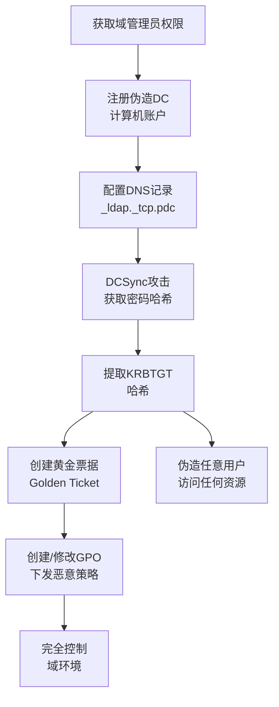

# 恶意域控制器 (T1207)

## 一句话通俗理解

攻击者在你的网络中架设一个假的域控制器，冒充系统管理员控制整个网络——就像小偷在小区里开了一个假的物业管理处，所有保安都听他的指挥。

## 30秒速查卡

| 维度 | 你需要知道的 |
|------|-------------|
| 这是什么？ | 攻击者在你的网络中架设一个假的域控制器，冒充系统管理员控制整个网络——就像小偷在小区里开了一个假的物业管理处，所有保安都 |
| 为什么危险？ | 恶意域控制器是攻击者在域环境中能达到的最高控制级别之一。获得DC级别的控制意味着攻击者可以：获取域中所有用户的密码哈希、 |
| 谁需要关心？ | 安全监控团队、SOC分析师 |
| 你的第一步防御 | DCSync攻击检测 |
| 如果只做一件事 | 域控制器（DC）是Windows域环境的"大脑"——它管理所有电脑和用户的登录认证、分配权限、下发组 |

## 难度等级

⭐⭐⭐ 高级（需要深入理解域环境）

## 技术描述

恶意域控制器（T1207）是MITRE ATT&CK框架中隐蔽战术的一种高级技术。

**通俗解释：**
域控制器（DC）是Windows域环境的"大脑"——它管理所有电脑和用户的登录认证、分配权限、下发组策略。攻击者如果能在网络中部署一个恶意的域控制器，就能完全控制整个域环境。恶意DC会从合法DC同步数据（包括用户密码哈希），然后攻击者就可以用这些数据冒充任何用户、访问任何系统。更可怕的是，恶意DC可以下发恶意组策略，让所有域成员电脑执行攻击者指定的操作。

**技术原理：**
1. **域复制**：恶意DC使用域复制协议（DRSUAPI）从合法DC同步域数据
2. **DCSync攻击**：使用Mimikatz的DCSync功能模拟DC复制行为，获取所有用户密码哈希
3. **DC伪装**：在域中注册伪造的DC计算机账户，配置DNS记录使其看起来是合法DC
4. **组策略篡改**：恶意DC可以创建和修改组策略对象（GPO），下发恶意配置
5. **黄金票据**：利用KRBTGT账户哈希创建黄金票据，获得任意域资源的永久访问权

**用途与影响：**
恶意域控制器是攻击者在域环境中能达到的最高控制级别之一。获得DC级别的控制意味着攻击者可以：获取域中所有用户的密码哈希、创建和管理任意账户、下发恶意组策略、篡改域信任关系、伪造Kerberos票据。这是一种"一锤定音"的攻击——一旦成功，整个域环境都不再安全。

## 子技术列表

该技术没有子技术。

## 攻击流程

### 典型攻击流程

```
获取域管理员权限 --> 注册伪造DC --> 同步域数据 --> 获取KRBTGT哈希 --> 下发恶意GPO
```



**步骤详解：**

1. **获取域管理员权限**
   - 通俗描述：攻击者先要拿到域管理员账号的控制权
   - 技术细节：通过Mimikatz窃取域管凭据、利用漏洞提权、或通过信任关系获取
   - 常用工具：Mimikatz、SharpKatz、Rubeus

2. **注册伪造DC**
   - 通俗描述：在域中注册一个新的"假"域控制器
   - 技术细节：在域中创建计算机账户，设置`userAccountControl`属性为`SERVER_TRUST_ACCOUNT`(0x1000)
   - 常用工具：PowerShell、`Set-ADComputer`

3. **DCSync获取哈希**
   - 通俗描述：模拟域控制器之间的复制，获取所有用户的密码哈希
   - 技术细节：使用Mimikatz的`lsadump::dcsync`模块请求域复制数据
   - 常用工具：Mimikatz DCSync

4. **创建黄金票据**
   - 通俗描述：用KRBTGT哈希伪造永不过期的通行证
   - 技术细节：KRBTGT是域中用于签发Kerberos票据的账户，拥有了它的哈希就能伪造任何票据
   - 常用工具：Mimikatz `kerberos::golden`

5. **下发恶意策略**
   - 通俗描述：通过恶意DC向所有计算机下发恶意设置
   - 技术细节：创建/修改GPO，配置启动脚本下发恶意软件
   - 常用工具：`New-GPO`、`Set-GPPrefRegistryValue`

## 真实案例

### 案例1：Nobelium (APT29) DCSync攻击（2021-2023）

- **时间**: 2021-2023年
- **目标**: 全球政府机构、IT企业
- **攻击组织**: APT29 (Nobelium/Cozy Bear)
- **手法**: APT29在SolarWinds供应链攻击的后续阶段，使用Mimikatz的DCSync功能从目标域控制器中复制所有用户密码哈希和Kerberos票据数据。攻击者通过Cobalt Strike Beacon获得了域管理员级别的访问权限后，执行`lsadump::dcsync /domain:target.com /all /csv`命令提取所有凭据。利用窃取的哈希，攻击者创建黄金票据实现了在域环境中的持久化访问。
- **影响**: 多个美国政府机构的数据被长期窃取
- **参考链接**: [Nobelium DCSync - Microsoft](https://www.microsoft.com/security/blog/)

### 案例2：Conti勒索软件团伙的域控制（2021-2022）

- **时间**: 2021-2022年
- **目标**: 全球企业（医疗、制造、政府）
- **攻击组织**: Conti (Wizard Spider)
- **手法**: Conti勒索软件团伙在部署勒索软件前，会先渗透并控制目标域的域控制器。攻击者通过Cobalt Strike进入网络，使用Mimikatz窃取域管理员凭据，然后登录到域控制器。在控制DC后，Conti团队使用组策略（GPO）在域内所有计算机上批量部署勒索软件。这种方法可以在数小时内加密数千台计算机。
- **影响**: 多个大型企业运营中断，数十次勒索事件
- **参考链接**: [Conti Leaks Analysis](https://www.recordedfuture.com/)

## 红队视角

> ⚠️ **免责声明**：以下内容仅用于合法的安全测试、渗透测试和教育目的。未经授权对他人系统进行测试是违法行为。

### 实战技巧

1. **DCSync最小痕迹操作**
   使用Mimikatz的`/guid`参数只同步特定域控制器的数据，避免触发多DC环境的复制异常告警：`lsadump::dcsync /domain:target.com /dc:dc01.target.com /all`

2. **GPO下发后门**
   创建GPO配置计划任务或启动脚本，在域内所有计算机上执行后门。GPO更新周期默认90分钟，使用`gpupdate /force`可强制立即生效。

3. **黄金票据的隐蔽使用**
   创建黄金票据时，设置票据的`/startoffset`参数使票据在几小时后才开始生效，避免安全团队将票据创建事件与攻击活动关联。

### 常用工具

| 工具名称 | 用途 | 平台 | 链接 |
|----------|------|------|------|
| Mimikatz | DCSync、黄金票据创建 | Windows | https://github.com/gentilkiwi/mimikatz |
| Rubeus | Kerberos操作工具 | Windows | https://github.com/GhostPack/Rubeus |
| PowerView | AD枚举和操作 | Windows | https://github.com/PowerShellMafia/PowerSploit |
| SharpKatz | Mimikatz的.NET实现 | Windows | https://github.com/b4rtik/SharpKatz |

### 注意事项

- DCSync操作会产生大量域复制日志，可能触发安全团队的告警
- 创建伪造DC需要在域中注册计算机账户，可能会被基线监控发现
- 黄金票据虽然永不过期，但密码更改后票据会失效

## 蓝队视角

### 检测要点

1. **DCSync攻击检测**
   - 日志来源：Windows Event ID 4662（目录服务访问）
   - 关注字段：对域目录对象执行`DS-Replication-Get-Changes`和`DS-Replication-Get-Changes-All`操作
   - 异常特征：非域控制器计算机请求域复制权限

2. **伪造DC检测**
   - 日志来源：Windows Event ID 4742（计算机账户修改）
   - 关注字段：新创建的计算机账户设置了`SERVER_TRUST_ACCOUNT`属性
   - 异常特征：非IT运维时间的新DC注册、未知计算机名称

3. **异常GPO修改检测**
   - 日志来源：Windows Event ID 5136（目录服务对象修改）
   - 关注字段：GPO的创建和修改事件、GPO关联到不正常的OU
   - 异常特征：非维护时间的大规模GPO变更、包含可疑启动脚本的GPO

### 监控建议

- 启用域控制器的高级审计策略（特别是目录服务访问审计）
- 监控Event ID 4662中复制权限的分配和使用
- 对域控的管理员登录行为实施严格监控和MFA
- 定期审计域中的DC计算机账户列表

## 检测建议

### 网络层检测

**检测方法：** 监控非域控制器发起的域复制请求（DCSync特征）、异常的DRSUAPI通信，以及非授权计算机的Kerberos认证请求模式。

**具体规则/命令示例：**
```
# 检测DCSync攻击（非DC的域复制请求）
zeek -r traffic.pcap | grep "DRSUAPI" | grep -v "known_dc"

# 检测非DC计算机的异常复制行为
suricata -r traffic.pcap --rule "alert tcp $HOME_NET any -> $HOME_NET 445 (msg:\"Rogue DC Replication Attempt\"; content:\"|05 00 0b 03 10 00 00 00|\"; sid:1000032;)"
```

### 主机层检测

**Windows事件ID：**
- Event ID 4662：目录服务访问（检测DCSync）
- Event ID 4742：计算机账户修改（检测伪造DC）
- Event ID 5136：目录服务对象修改（检测GPO篡改）
- Event ID 4670：对象权限修改

**具体命令示例：**
```powershell
# 检测DCSync攻击（目录复制请求）
Get-WinEvent -FilterHashtable @{LogName='Security'; ID=4662} |
    Where-Object { $_.Message -match '1131f6ad-9c07-11d1-f79f-00c04fc2dcd2' -or 
                   $_.Message -match '1131f6ae-9c07-11d1-f79f-00c04fc2dcd2' }
```

### 应用层检测

**用人话说：**

> 恶意域控制器（Rogue Domain Controller）是横向移动的"王炸"——攻击者利用DCReplication或DCSync攻击，非法复制域控上的所有哈希，然后自己再搭建一个伪造的域控制器向网络宣告自己也是域控。这样攻击者可以响应所有域成员的认证请求，窃取更多凭据、下发组策略中的恶意配置、甚至完全控制整个域。这项技术要求很高，攻击者通常先用Mimikatz的lsadump::dcsync或DCsync功能获取域控数据。检测方法：监控非域控制器计算机发起域复制请求（DSGetNCChanges）、新增的域控制器记录没有对应的IT变更工单、以及事件ID 4662（目录服务访问）中的异常操作。
>
> **避坑指南**：忽略SMB管理共享异常访问；未区分正常SSH管理连接和异常横向；未启用PowerShell脚本块日志。

**Sigma规则示例：**
```yaml
title: DCSync攻击检测
status: experimental
description: 检测非域控制器计算机的域复制请求行为（DCSync攻击）
logsource:
    category: process_creation
    product: windows
detection:
    selection:
        EventID: 4662
        AccessMask|contains: '0x100'
        ObjectType|contains: 'domainDNS'
        Properties|contains:
            - '1131f6ad-9c07-11d1-f79f-00c04fc2dcd2'
            - '1131f6ae-9c07-11d1-f79f-00c04fc2dcd2'
    condition: selection
level: critical
tags:
    - attack.t1207
    - attack.credential_access
```

## 缓解措施

### 优先级1：关键措施

**措施名称：** 域控制器操作审计

**具体实施步骤：**
1. 启用详细的域控制器审计策略
2. 监控所有域复制操作，特别是来自非DC的复制请求
3. 配置SIEM规则检测DCSync攻击的Event ID 4662模式

### 优先级2：重要措施

**措施名称：** 受保护用户组和身份验证策略

**具体实施步骤：**
1. 将所有高权限账户加入"受保护用户"组
2. 配置身份验证策略和身份验证策略定界
3. 对域管理员账户启用智能卡MFA

### 优先级3：建议措施

**措施名称：** 域环境安全加固

**具体实施步骤：**
1. 定期轮换KRBTGT密码（两次重置以确保旧哈希失效）
2. 限制具有域复制权限的账户数量
3. 实施Tiering管理模型分离管理权限

### MITRE ATT&CK 缓解措施映射

| 缓解措施ID | 缓解措施名称 | 适用性 | 说明 |
|------------|-------------|--------|------|
| M1026 | 特权账户管理 | 适用 | 限制具有域复制权限的账户 |
| M1041 | 加密敏感信息 | 适用 | 保护KRBTGT哈希 |
| M1028 | 操作系统配置 | 适用 | 启用高级审计策略 |
| M1018 | 用户账户管理 | 适用 | 定期轮换KRBTGT密码 |

## 动手实验

> ⚠️ **重要提示**：所有实验必须在隔离的实验室环境中进行，禁止对未授权的真实系统进行测试。

### 实验环境准备

**推荐靶场/实验平台：**

| 平台名称 | 类型 | 难度 | 链接 |
|----------|------|:----:|------|
| TryHackMe - AD攻击路径 | 在线靶场 | 高级 | https://tryhackme.com/ |
| Hack The Box - Active Directory | 在线靶场 | 高级 | https://www.hackthebox.com/ |

**所需工具：**
- Windows Server 2019+（域控制器）
- Windows 10（域成员）
- Kali Linux（攻击机）

### 实验1：DCSync模拟（高级）

**实验目标：** 理解DCSync攻击的工作原理和检测方法

**实验步骤：**
1. 搭建AD实验室环境（1台DC + 1台成员机 + 1台Kali）
2. 在Kali上安装Impacket工具集
3. 使用域管理员凭据执行`secretsdump.py`模拟DCSync
4. 检查DC上产生的Event ID 4662日志

**预期结果：** DCSync操作被日志记录，可以看到非DC的复制请求

**学习要点：** 理解DCSync的攻击原理和关键检测指标

## 术语解释

| 术语 | 英文原名 | 通俗解释 |
|------|----------|----------|
| 域控制器 | Domain Controller (DC) | Windows域环境的核心服务器，管理认证和策略 |
| DCSync | DCSync | 一种攻击技术，模拟DC复制获取密码哈希 |
| 黄金票据 | Golden Ticket | 伪造的Kerberos票据，可访问域中任何资源 |
| KRBTGT | KRBTGT Account | 域中用于加密Kerberos票据的账户 |
| GPO | Group Policy Object | 组策略对象，用于集中管理域计算机的配置 |
| DRSUAPI | Directory Replication Service API | 域控制器之间的复制接口 |

## 参考资料

### 官方文档

- [MITRE ATT&CK - T1207 Rogue Domain Controller](https://attack.mitre.org/techniques/T1207/)

### 安全报告

- [DCSync Attack - MITRE](https://attack.mitre.org/techniques/T1207/)
- [Mimikatz DCSync Explained](https://adsecurity.org/?p=1729)
- [Conti Leaks - Recorded Future](https://www.recordedfuture.com/)

### 工具与资源

- [Mimikatz](https://github.com/gentilkiwi/mimikatz) - 凭据提取和DC攻击工具
- [Impacket](https://github.com/SecureAuthCorp/impacket) - AD协议工具集
- [BloodHound](https://github.com/BloodHoundAD/BloodHound) - AD攻击路径分析
