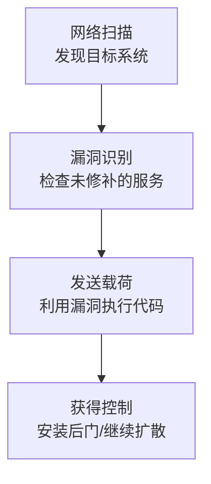

# 远程服务漏洞利用 (T1210)

## 一句话通俗理解

就像用万能钥匙撬锁——攻击者利用远程服务中的安全漏洞，不需要密码也能入侵其他系统。

## 难度等级

- ⭐⭐⭐ 高级（需要深入技术知识）

## 技术描述

远程服务漏洞利用（T1210）是MITRE ATT&CK框架中横向移动战术下的一种技术。

**通俗解释：**
大多数横向移动技术都需要"钥匙"（账号密码），但远程服务漏洞利用不需要。它利用的是远程服务软件本身的缺陷——比如Windows的文件共享服务（SMB）或远程桌面服务（RDP）中的编程错误。攻击者向目标系统发送精心构造的特殊数据包，触发这些缺陷，就能在目标系统上执行任意代码。最著名的例子就是"永恒之蓝"（EternalBlue）漏洞，它可以像蠕虫一样自动在网络上传播，不需要任何密码。

**技术原理：**

1. **发现目标**：攻击者扫描网络，找出哪些系统开放了存在已知漏洞的远程服务
2. **选择漏洞利用**：根据目标系统的操作系统版本和补丁情况，选择合适的漏洞利用代码
3. **发送攻击载荷**：向目标发送特制的网络数据包，触发远程服务中的漏洞
4. **获得执行权限**：漏洞利用成功后，在目标系统上执行恶意代码，获得控制权

**用途与影响：**
这种技术的最大价值在于：不需要任何凭据即可入侵系统。即使企业实施了强密码策略和多因素认证，只要存在漏洞，攻击者就能绕过这些防护。安全界最著名的WannaCry勒索蠕虫和NotPetya擦除工具就是利用SMB漏洞实现了全球性传播。

## 子技术列表

该技术没有子技术。

## 攻击流程

### 典型攻击流程

```
网络扫描 --> 识别漏洞 --> 发送攻击载荷 --> 获得系统控制权
```



**步骤详解：**

1. **网络扫描**
   - 通俗描述：扫描内网IP范围，找出哪些系统开放了445端口（SMB）或3389端口（RDP）
   - 技术细节：使用nmap扫描TCP端口，识别服务版本和操作系统信息
   - 常用工具：nmap、Masscan、Nessus

2. **漏洞识别**
   - 通俗描述：判断目标系统是否未安装关键安全补丁
   - 技术细节：检查SMB协议版本、操作系统版本号，确定是否存在已知漏洞
   - 常用工具：nmap脚本、Nessus、OpenVAS

3. **发送攻击载荷**
   - 通俗描述：向目标发送特制数据包，触发服务漏洞
   - 技术细节：使用Metasploit模块或独立漏洞利用代码，利用缓冲区溢出执行payload
   - 常用工具：Metasploit、Impacket、Cobalt Strike

4. **获得控制权**
   - 通俗描述：漏洞利用成功后，在目标系统上安装后门或执行命令
   - 技术细节：利用获得的SYSTEM/root权限部署Cobalt Strike Beacon、添加管理员账户
   - 常用工具：Cobalt Strike、PowerShell、Mimikatz

## 真实案例

### 案例1：NotPetya使用EternalBlue在全球企业网络中横向传播（2017年）

- **时间**: 2017年6月
- **目标**: 乌克兰及全球企业
- **攻击组织**: Sandworm（APT44）
- **手法**: NotPetya（伪装成勒索软件的擦除工具）利用EternalBlue（MS17-010）和EternalRomance漏洞在内部网络中横向移动。除了凭据窃取和WMIC之外，NotPetya还包含SMB漏洞利用模块，使其能在没有凭据的情况下自动在Windows系统间传播。这种自我传播能力使NotPetya从乌克兰的初始目标（会计软件供应商MEDoc）迅速扩展到全球企业，包括马士基、默克、联邦快递等跨国公司。最终造成超过100亿美元的损失，是历史上破坏性最大的网络攻击之一。
- **影响**: 全球超过100亿美元经济损失
- **参考链接**: [CrowdStrike NotPetya分析](https://www.crowdstrike.com/blog/petya-spreads-in-ukraine-and-beyond/)

### 案例2：LockBit集成EternalRomance进行横向移动（2017-2024年）

- **时间**: 2017年至2024年
- **目标**: 全球各行业组织
- **攻击组织**: LockBit（勒索软件即服务组织）
- **手法**: EternalRomance（MS17-010漏洞套件的一部分）被多个勒索软件家族内置于其横向移动模块中。LockBit 2.0和3.0（Black）包含了扫描内部网络中SMB服务的传播模块，如果发现未打补丁的系统，则使用EternalRomance进行攻击。攻击链包括：使用EternalRomance在远程系统上建立连接；使用SMB协议将勒索软件二进制文件复制到远程系统；使用远程计划任务执行恶意软件。LockBit的附属成员经常将此漏洞利用与其他横向移动技术（如Pass the Hash和RDP滥用）结合使用。
- **影响**: LockBit成为全球最活跃的勒索软件之一，攻击数千个组织
- **参考链接**: [TrendMicro LockBit分析](https://www.trendmicro.com/vinfo/us/security/news/cybercrime-and-digital-threats/lockbit-ransomware-group-profile)

### 案例3：BlueKeep（CVE-2019-0708）被用于RDP横向移动尝试（2019-2020年）

- **时间**: 2019年至2020年
- **目标**: 运行未修补Windows版本的组织的RDP服务器
- **攻击组织**: 多个APT组织和网络犯罪团伙
- **手法**: BlueKeep是RDP协议中的关键远程代码执行漏洞，影响Windows 7和Windows Server 2008 R2。该漏洞存在于RDP驱动的TermDD.sys中，允许未经认证的攻击者向目标发送特制请求执行任意代码。BlueKeep披露后的几个月内，多个APT组织被观察到扫描互联网上的易受攻击的RDP服务器。虽然BlueKeep的利用相对复杂（需要堆喷洒操纵），但多个攻击者发布了可用的利用代码。攻击者在外围RDP服务器上获得初始立足点后，再使用其他横向移动技术扩展到内部网络。
- **影响**: 影响了数百万台未修补的Windows 7/Server 2008系统
- **参考链接**: [Microsoft BlueKeep安全公告](https://msrc.microsoft.com/blog/2019/05/prevent-a-worm-by-updating-remote-desktop-services-cve-2019-0708/)

## 红队视角

> ⚠️ **免责声明**：以下内容仅用于合法的安全测试、渗透测试和教育目的。未经授权对他人系统进行测试是违法行为。

### 实战技巧

1. **结合凭据使用更高效**
   漏洞利用可能触发IDS告警，先用凭据尝试标准远程服务登录（T1021），在凭据无效时再用漏洞利用作为后备方案。

2. **使用EternalBlue的变种绕过防护**
   原始EternalBlue已被大多数EDR标记，可使用修改版（如EternalRomance）或在攻击前先禁用Windows Defender。

### 常用工具

| 工具名称 | 用途 | 平台 | 链接 |
|----------|------|------|------|
| Metasploit | 包含多种远程服务漏洞利用模块 | 跨平台 | https://www.metasploit.com |
| Impacket | 包含SMB漏洞利用工具 | Python | https://github.com/fortra/impacket |
| EternalBlue Scanner | 扫描MS17-010漏洞 | Windows/Linux | Microsoft/SMB工具 |

### 注意事项

- 漏洞利用可能导致服务崩溃或系统蓝屏，在测试环境中先验证
- 使用已公开的漏洞利用代码时注意检查是否包含后门
- 漏洞利用操作应当被视为高风险的攻击手段

## 蓝队视角

### 检测要点

1. **监控SMB协议中的异常流量**
   - 日志来源：网络流量日志、IDS/IPS告警
   - 关注字段：SMB协议中的畸形数据包、非标准协议协商序列
   - 异常特征：指向445端口的大批量入站连接、SMB协议错误频繁

2. **检测漏洞利用后的行为**
   - 日志来源：Windows安全日志（Event ID 4688）
   - 关注字段：由系统账户（如SYSTEM）启动的异常进程
   - 异常特征：spoolsv.exe或svchost.exe发起的网络连接或命令行操作

### 监控建议

- 部署IDS/IPS（如Snort、Suricata）检测已知漏洞利用的签名
- 监控系统崩溃事件（Event ID 1001）——可能表明漏洞利用尝试
- 优先修补已知被利用的远程代码执行漏洞

## 检测建议

### 网络层检测

**检测方法：** 使用IDS签名检测已知SMB/RDP漏洞利用特征。

**示例（Suricata规则）：**
```
alert tcp any any -> $HOME_NET 445 (msg:"ET EXPLOIT MS17-010 EternalBlue SMBv1"; content:"|ff|SMB|25 00 00 00 00 00 00 00 00 00 00 00 00 00 00 00 00 00 00 00|"; sid:2024219; rev:4;)
```

### 主机层检测

**Windows事件ID：**
- 事件ID 1001：Windows错误报告（服务崩溃，可能表明漏洞利用尝试）
- 事件ID 7031：服务意外终止
- 事件ID 4688：异常进程创建（如系统进程启动了cmd.exe）

### Sigma规则示例

**Sigma规则示例：**
```yaml
title: Suspicious Child Process from System Service
status: experimental
description: 检测系统服务进程（svchost.exe、services.exe、spoolsv.exe）创建可疑子进程（cmd、powershell、wscript），可能表明远程服务漏洞利用后的载荷执行
logsource:
    category: process_creation
    product: windows
detection:
    selection:
        ParentImage|endswith:
            - '\svchost.exe'
            - '\services.exe'
            - '\spoolsv.exe'
        Image|endswith:
            - '\cmd.exe'
            - '\powershell.exe'
            - '\wscript.exe'
            - '\cscript.exe'
    condition: selection
level: high
tags:
    - attack.t1210
```

## 缓解措施

### 优先级1：关键措施

**措施名称：** 及时修补已知远程代码执行漏洞

**具体实施步骤：**
1. 优先修补MS17-010（EternalBlue）和CVE-2019-0708（BlueKeep）
2. 建立补丁管理流程，关键漏洞在24小时内修补
3. 在无法立即修补的情况下，应用供应商提供的缓解措施

### 优先级2：重要措施

**措施名称：** 禁用SMBv1协议

**具体实施步骤：**
1. 在所有Windows系统上使用PowerShell命令禁用SMBv1：`Disable-WindowsOptionalFeature -Online -FeatureName SMB1Protocol`
2. 通过组策略在所有域成员上禁用SMBv1

### 优先级3：建议措施

**措施名称：** 网络分段和访问控制

**具体实施步骤：**
1. 通过防火墙限制对管理端口（445、3389、5985/5986）的访问
2. 将易受攻击的旧系统隔离在独立的网段

### MITRE ATT&CK 缓解措施映射

| 缓解措施ID | 缓解措施名称 | 适用性 |
|------------|-------------|--------|
| M1051 | Update Software | 适用 |
| M1030 | Network Segmentation | 适用 |
| M1042 | Disable or Remove Feature or Program | 适用 |

## 动手实验

> ⚠️ **重要提示**：所有实验必须在隔离的实验室环境中进行，禁止对未授权的真实系统进行测试。

### 实验环境准备

**推荐靶场：**
- 使用未打补丁的Windows 7虚拟机（仅在隔离环境）
- Metasploitable 2或类似易受攻击的环境

### 实验1：使用Metasploit利用MS17-010（高级）

**实验目标：** 理解EternalBlue漏洞利用的基本流程。

**实验步骤：**
1. 在隔离的实验室中搭建易受攻击的Windows 7虚拟机
2. 使用nmap扫描确认目标开放445端口
3. 使用Metasploit的`exploit/windows/smb/ms17_010_eternalblue`模块进行利用
4. 观察成功后的系统行为和安全日志

## 术语解释

| 术语 | 英文原名 | 通俗解释 |
|------|----------|----------|
| 缓冲区溢出 | Buffer Overflow | 程序向缓冲区写入超出容量的数据，导致内存被覆盖，攻击者可劫持执行流程 |
| 永恒之蓝 | EternalBlue | MS17-010漏洞的代号，利用SMBv1协议的缓冲区溢出实现远程代码执行 |
| RCE | Remote Code Execution | 远程代码执行，攻击者无需物理接触即可在目标系统上运行任意命令 |
| 漏洞利用 | Exploit | 利用软件缺陷实现攻击的程序或代码 |

## 参考资料

### 官方文档

- [MITRE ATT&CK - Exploitation of Remote Services](https://attack.mitre.org/techniques/T1210/)
- [MS17-010安全更新 - Microsoft](https://docs.microsoft.com/en-us/security-updates/securitybulletins/2017/ms17-010)
- [CVE-2019-0708安全指南](https://msrc.microsoft.com/update-guide/vulnerability/CVE-2019-0708)

### 安全报告

- [EternalBlue横向移动分析 - SANS ISC](https://isc.sans.edu/forums/diary/EternalBlue+Used+for+Lateral+Movement/22698/)
- [NotPetya传播机制分析 - ESET](https://www.welivesecurity.com/2017/07/04/analysis-of-notpetya-internal-distribution-mechanisms/)
- [SMB协议漏洞利用 - Kaspersky](https://www.kaspersky.com/resource-center/threats/smb-vulnerabilities)
