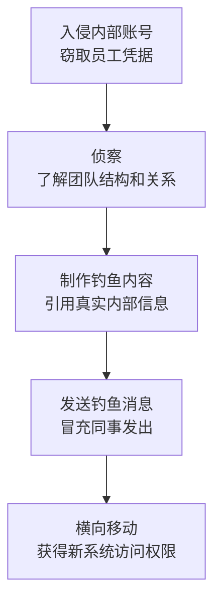

# 内部鱼叉式钓鱼 (T1534)

## 一句话通俗理解

就像攻击者控制了公司的一个员工账号后，用这个账号给其他同事发钓鱼邮件——因为是"内部同事"发的，更容易让人上当。

## 难度等级

- ⭐⭐ 中级（需要一定基础）

## 技术描述

内部鱼叉式钓鱼（T1534）是MITRE ATT&CK框架中横向移动战术下的一种技术。

**通俗解释：**
传统的钓鱼攻击是从外部发送恶意邮件（如假装是银行的邮件）。内部鱼叉式钓鱼不同——攻击者先入侵了一个内部员工的邮箱或即时通讯账号，然后用这个被黑的账号给公司其他人发钓鱼消息。因为消息来自同事（而且是内部的邮箱地址），收件人很自然地会信任它。这种技术利用了"内部信任"——大家通常觉得公司内部的邮件比外部邮件更安全。

**技术原理：**

1. **入侵内部账户**：攻击者通过各种手段（外部钓鱼、密码窃取）先攻陷一个内部员工的账号
2. **侦察内部结构**：读取被入侵账号的邮件和聊天记录，了解团队结构、项目关系、谁管什么
3. **定制钓鱼内容**：根据内部信息制作钓鱼邮件，引用真实项目名称和内部事件
4. **发送钓鱼消息**：用被入侵的账户向目标同事发送包含恶意附件或链接的邮件
5. **横向移动**：当目标打开附件或点击链接后，攻击者获得对新系统的访问权限

**用途与影响：**
内部鱼叉式钓鱼的核心优势在于绕过传统安全防护。外部钓鱼邮件会经过邮件安全网关的过滤，但内部发件人的邮件通常不受同等程度的审查。攻击者可以访问内部通讯录，精确选择钓鱼目标。而且，攻击者可以利用从已入侵账户中获取的内部信息增加邮件的可信度。

## 子技术列表

该技术没有子技术。

## 攻击流程

### 典型攻击流程

```
入侵内部账号 --> 侦察内部结构 --> 定制钓鱼内容 --> 发送消息 --> 扩大访问范围
```



**步骤详解：**

1. **入侵内部账号**
   - 通俗描述：通过外部钓鱼或密码窃取获得一个内部员工的邮箱或即时通讯账号
   - 技术细节：使用密码喷洒或窃取Cookie登录企业邮箱（如Outlook Web Access）
   - 常用工具：Mimikatz、凭证窃取工具

2. **侦察内部结构**
   - 通俗描述：阅读被入侵账号的邮件和聊天记录，了解谁是谁、谁管什么
   - 技术细节：分析邮件中的组织架构、找到IT管理员和关键人员的联系方式
   - 常用工具：Outlook Web Access、PowerShell

3. **定制钓鱼内容**
   - 通俗描述：根据获取的内部信息制作听起来很真实的钓鱼消息
   - 技术细节：引用内部项目名称、模仿同事的写作风格、选择恰当的时机发送
   - 常用工具：社会工程学技巧

4. **发送和执行**
   - 通俗描述：用被入侵的账号发送钓鱼邮件，等待目标上钩
   - 技术细节：邮件中嵌入恶意Office文档（含宏）或链接到内部Web服务器的恶意页面
   - 常用工具：恶意宏、Cobalt Strike

## 真实案例

### 案例1：APT28使用内部鱼叉式钓鱼进行横向移动（2016-2019年）

- **时间**: 2016年至2019年
- **目标**: 全球政府、国防和外交组织
- **攻击组织**: APT28（Fancy Bear，俄罗斯GRU）
- **手法**: APT28在多次针对国防和外交机构的攻击中使用内部鱼叉式钓鱼。攻击者先通过外部钓鱼或密码喷射获得内部低权限账户访问。然后使用该账户进行内部侦察，通过读取被入侵用户的邮件和日历识别关键人员（特别是IT管理员和安全团队）。APT28随后使用被入侵的账户向这些关键人员发送看似来自IT部门的内部邮件，声称需要执行紧急安全更新或验证账户。邮件中包含指向内部Web服务器的链接，该服务器托管了恶意凭据收集页面。当目标输入凭据时，攻击者捕获这些凭据用于访问更高价值的系统。
- **影响**: 成功入侵多个政府机构的内部网络
- **参考链接**: [CrowdStrike APT28分析](https://www.crowdstrike.com/blog/apt28-using-internal-spearphishing/)

### 案例2：OilRig通过被入侵账户发起内部钓鱼（2018-2020年）

- **时间**: 2018年至2020年
- **目标**: 中东地区的金融、能源和政府组织
- **攻击组织**: OilRig（APT34，伊朗关联）
- **手法**: OilRig组织被观察到使用复杂的内部鱼叉式钓鱼技术。攻击者先通过外部钓鱼或暴力破解获得内部用户凭据。登录该用户的OWA或企业邮箱后，OilRig分析被入侵用户的邮件以了解组织结构和信任关系。然后使用被入侵账户向同事发送包含恶意ISO文件的邮件，邮件内容引用实际内部项目名称和事件，使收件人确信来自可信的同事。OilRig使用的恶意软件（POWRUNER和OopsIE）通过这种内部钓鱼方式部署。在一个显著案例中，攻击者冒充IT支持人员，向财务部门员工发送要求安装安全证书的邮件。
- **影响**: 在中东地区多个组织中建立了长期持久访问
- **参考链接**: [FireEye OilRig分析](https://www.fireeye.com/blog/threat-research/2018/10/group5-apt-activity-in-middle-east.html)

### 案例3：UNC2452在SolarWinds事件中使用内部钓鱼（2020年）

- **时间**: 2020年
- **目标**: 受SolarWinds供应链攻击影响的组织
- **攻击组织**: UNC2452（APT29/Cozy Bear，俄罗斯SVR）
- **手法**: 在SolarWinds事件中，UNC2452通过被入侵的Orion系统了解组织的IT团队结构和管理员工作流程。他们使用被入侵的内部邮件账户向IT管理员发送钓鱼邮件，冒充安全团队要求执行特定的PowerShell命令来验证系统完整性——这些命令实际是TEARDROP载荷的投递程序。UNC2452特别选择了发送钓鱼邮件的时间——在真实的系统维护窗口期间——以增加可信度。当IT管理员使用特权账户执行这些命令时，攻击者获得对管理员工作站的访问，进而扩展到域控制器和Azure AD环境。
- **影响**: 成功入侵多个美国联邦机构和IT公司
- **参考链接**: [Mandiant SolarWinds分析](https://www.mandiant.com/resources/blog/sunburst-additional-technical-details)

### 案例4：Gamaredon利用内部鱼叉式钓鱼攻击乌克兰机构（2024年）

- **时间**: 2024年
- **目标**: 乌克兰政府机构、军事单位、关键基础设施
- **攻击组织**: Gamaredon（Trident Ursa，俄罗斯关联APT组织）
- **手法**: Gamaredon在2024年大幅提升了其鱼叉式钓鱼攻击的规模和频率。攻击者首先通过外部钓鱼或恶意文档获取对乌克兰政府网络内一台系统的初始访问权限。然后，他们在被感染的系统上部署VBA模块，专门用于窃取和接管内部Outlook邮箱账户的访问权限。利用这些被劫持的内部邮箱账户，Gamaredon向目标机构内的其他人员发送内部钓鱼邮件——邮件内容引用真实的内部项目名称和同事间的通信风格，由于发件地址是可信的内部邮箱，接收者很难察觉异常。Gamaredon在2024年引入了6种新的恶意软件工具，主要针对隐蔽驻留、持久化和横向移动。这些工具包括升级版的GammaLoad和GammaDrop，使用增强的混淆技术来逃避检测。其中一个显著案例中，攻击者冒充乌克兰安全服务（SBU）的IT支持人员，向政府雇员发送包含恶意附件的内部邮件，声称需要安装紧急安全更新。
- **影响**: 乌克兰多个国家机构遭到入侵，敏感信息持续被窃取
- **参考链接**: [Cyberswissguards Gamaredon 2024分析](https://www.cyberswissguards.com/gamaredon-in-2024-cranking-out-spearphishing-campaigns-against-ukraine-with-an-evolved-toolset/) | [ESET Gamaredon研究报告](https://www.eset.com/us/about/newsroom/research/eset-research-investigates-the-gamaredon-apt-group-cyberespionage-aimed-at-high-profile-targets-in-ukraine-and-nato-countries-1/)

## 红队视角

> ⚠️ **免责声明**：以下内容仅用于合法的安全测试、渗透测试和教育目的。未经授权对他人系统进行测试是违法行为。

### 实战技巧

1. **模仿目标对象的写作风格**
   在发送内部钓鱼邮件前，仔细阅读目标人物的历史邮件，模仿其语气、签名格式和常用表达。

2. **选择最佳发送时间**
   在目标所在时区的工作日上午发送，避开周一早晨和周五下午——这是人们最警惕的时候。

### 常用工具

| 工具名称 | 用途 | 平台 | 链接 |
|----------|------|------|------|
| Gophish | 钓鱼邮件模拟平台 | 跨平台 | https://github.com/gophish/gophish |
| Evilginx2 | 中间人攻击框架用于凭据收集 | Linux | https://github.com/kgretzky/evilginx2 |
| SET | 社会工程学工具包 | Linux | https://github.com/trustedsec/social-engineer-toolkit |

### 注意事项

- 内部钓鱼测试必须明确告知被测试方，获得书面授权
- 测试用钓鱼邮件不应包含真正的恶意软件，仅用于评估员工安全意识

## 蓝队视角

### 检测要点

1. **监控内部邮箱的异常发件行为**
   - 日志来源：Exchange传输日志、Microsoft 365审计日志
   - 关注字段：发件人、收件人数、邮件主题
   - 异常特征：一个账户短时间内向大量收件人发送邮件；包含到可疑内部IP链接的邮件

2. **检测内部账户的异常登录**
   - 日志来源：Windows安全日志（Event ID 4624）、Azure AD登录日志
   - 关注字段：登录IP、登录位置、使用的设备
   - 异常特征：来自异常地理位置或设备的登录；登录后的批量邮件发送活动

### 监控建议

- 对内部邮件实施与外部邮件相同的安全扫描策略
- 监控邮件转发规则的异常创建和修改
- 提供方便的"举报钓鱼"按钮，建立快速响应流程

## 检测建议

### 网络层检测

**检测方法：** 监控内部邮件流中的异常连接，特别是指向内部Web服务器的可疑链接。

### 主机层检测

**Windows事件ID：**
- 事件ID 4624：异常登录事件（来自非常用位置）
- 事件ID 4648：使用显式凭据登录
- Exchange Event ID 104：邮件转发规则变更

### 应用层检测

**Sigma规则示例：**
```yaml
title: Internal Phishing via Compromised Account
status: experimental
description: Detects mass email sends from internal accounts with attachments
logsource:
    product: windows
    service: exchange
detection:
    selection:
        Message: '*sent a message to*'
        Recipients: '*;*;*;*'
    condition: selection
level: medium
tags:
    - attack.t1534
```

## 缓解措施

### 优先级1：关键措施

**措施名称：** 对所有用户启用多因素认证（MFA）

**具体实施步骤：**
1. 为邮箱系统启用MFA
2. 配置条件访问策略，要求从可信设备和网络登录
3. 实施异常登录告警

### 优先级2：重要措施

**措施名称：** 实施内部邮件安全检测

**具体实施步骤：**
1. 对内部邮件执行与外部邮件一致的恶意内容扫描
2. 在邮件安全网关中对内部邮件执行URL重写和附件沙箱分析
3. 配置防止内部域欺骗的检测规则

### 优先级3：建议措施

**措施名称：** 安全意识培训

**具体实施步骤：**
1. 教育员工内部邮件也可能是钓鱼
2. 在执行邮件中的操作前通过其他渠道验证请求
3. 定期进行内部钓鱼模拟测试

### MITRE ATT&CK 缓解措施映射

| 缓解措施ID | 缓解措施名称 | 适用性 |
|------------|-------------|--------|
| M1032 | Multi-factor Authentication | 适用 |
| M1017 | User Training | 适用 |
| M1047 | Audit | 适用 |

## 动手实验

> ⚠️ **重要提示**：所有实验必须在隔离的实验室环境中进行，禁止对未授权的真实系统进行测试。

### 实验环境准备

**推荐靶场：** 使用实验室环境搭建Exchange服务器和客户端。

### 实验1：内部钓鱼模拟（初级）

**实验目标：** 理解内部鱼叉式钓鱼的流程。

**实验步骤：**
1. 搭建包含Exchange服务器的实验室环境
2. 模拟攻陷一个低权限账户
3. 使用被攻陷账户分析内部通信结构
4. 发送模拟钓鱼邮件并观察拦截效果

## 术语解释

| 术语 | 英文原名 | 通俗解释 |
|------|----------|----------|
| 鱼叉式钓鱼 | Spearphishing | 针对特定个人或组织的定向钓鱼攻击，与群发垃圾邮件不同 |
| MFA | Multi-Factor Authentication | 多因素认证，登录时需要两种以上的验证方式 |
| OWA | Outlook Web Access | 微软Exchange的网页版邮件客户端 |
| DMARC | Domain-based Message Authentication | 防止邮件域名被伪造的邮件验证技术 |

## 参考资料

### 官方文档

- [MITRE ATT&CK - Internal Spearphishing](https://attack.mitre.org/techniques/T1534/)
- [CISA企业邮件安全指南](https://www.cisa.gov/secure-business-email)

### 安全报告

- [APT28内部钓鱼分析 - CrowdStrike](https://www.crowdstrike.com/blog/apt28-using-internal-spearphishing/)
- [OilRig内部钓鱼案例 - FireEye](https://www.fireeye.com/blog/threat-research/2018/10/group5-apt-activity-in-middle-east.html)
- [SolarWinds事件内部钓鱼分析 - Mandiant](https://www.mandiant.com/resources/blog/sunburst-additional-technical-details)
