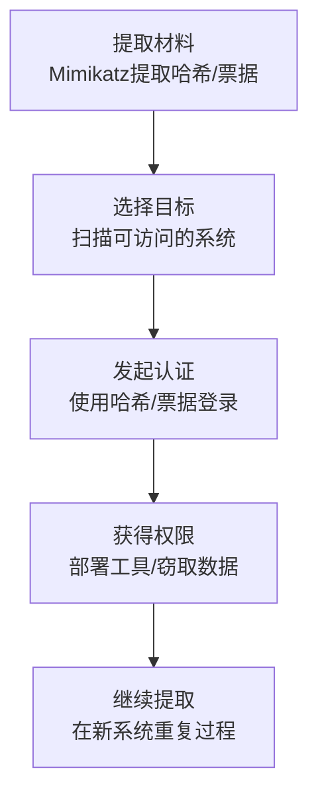

# 使用替代认证材料 (T1550)

## 一句话通俗理解

就像用捡到的工牌复印件代替身份证进门——攻击者用密码的"替代品"（哈希、票据、令牌）登录系统，不需要知道实际密码。

## 30秒速查卡

| 维度 | 你需要知道的 |
|------|-------------|
| 这是什么？ | 就像用捡到的工牌复印件代替身份证进门——攻击者用密码的"替代品"（哈希、票据、令牌）登录系统，不需要知道实际密码。 |
| 为什么危险？ | 这种技术之所以可怕，是因为它绕过了强密码策略和多因素认证。即使用了20位复杂密码、开启了MFA，只要攻击者能提取到密码的 |
| 谁需要关心？ | 安全监控团队、SOC分析师 |
| 你的第一步防御 | 监控LSASS进程的异常访问 |
| 如果只做一件事 | 登录电脑通常需要输入用户名和密码 |

## 难度等级

- ⭐⭐⭐ 高级（需要深入技术知识）

## 技术描述

使用替代认证材料（T1550）是MITRE ATT&CK框架中横向移动战术下的一种技术。

**通俗解释：**
登录电脑通常需要输入用户名和密码。但是Windows和其他系统支持多种"替代认证"方式——比如用密码的"数字指纹"（哈希）、用Kerberos通行证（票据）、或者用会话令牌。攻击者从一台被攻陷的系统中提取这些替代材料，然后直接在另一台系统上使用，完全不需要知道明文密码。最典型的例子就是Pass the Hash（传递哈希）攻击——攻击者用密码的哈希值（而非密码本身）登录远程Windows系统。

**技术原理：**

1. **提取替代认证材料**：攻击者从被入侵系统的内存、文件或注册表中提取密码哈希、Kerberos票据或访问令牌
2. **重放到目标系统**：使用提取的材料直接向其他系统发起认证请求
3. **获得访问权限**：目标系统验证通过后，攻击者获得访问权限
4. **横向移动**：在新系统上继续提取更多认证材料，重复上述过程

**用途与影响：**
这种技术之所以可怕，是因为它绕过了强密码策略和多因素认证。即使用了20位复杂密码、开启了MFA，只要攻击者能提取到密码的哈希值，他们就能用哈希值直接登录远程系统。这也是为什么Mimikatz等凭证窃取工具如此受欢迎的原因。

## 子技术列表

**该技术共有 4 个子技术：**

| 子技术ID | 中文名称 | 通俗解释 |
|----------|----------|----------|
| T1550.001 | Application Access Token | 用OAuth令牌、JWT等应用访问令牌绕过登录页面，直接访问云应用和API |
| T1550.002 | Pass the Hash | 用密码的哈希值代替密码，直接登录远程Windows系统 |
| T1550.003 | Pass the Ticket | 窃取Kerberos票据，冒充已经登录的用户访问网络资源 |
| T1550.004 | Web Session Cookie | 窃取网站的会话Cookie，冒充已登录用户访问Web应用 |

<details>
<summary><strong>展开查看各子技术详细说明</strong></summary>

各子技术详细说明请参阅独立文档：

- [T1550.001 - Application Access Token](./T1550/T1550.001-Application-Access-Token-Application-Access-Token.md) — 偷到云应用的"钥匙卡"，直接刷卡进门，不需要用户名密码。
- [T1550.002 - Pass the Hash](./T1550/T1550.002-Pass the Hash-Pass the Hash.md) — 用密码的"数字指纹"开门——Windows系统只验证你提供的指纹是否正确，不检查你是否真的知道密码原文。
- [T1550.003 - Pass the Ticket](./T1550/T1550.003-Pass the Ticket-Pass the Ticket.md) — 偷到别人的"通行证"——在Windows域中，Kerberos票据就像一张临时通行证，攻击者偷到后可以冒充持票人。
- [T1550.004 - Web Session Cookie](./T1550/T1550.004-Web Session Cookie-Web Session Cookie.md) — 偷到别人登录网站后的"临时通行证"——攻击者窃取浏览器的会话Cookie，直接冒充登录用户。

</details>

## 攻击流程

### 典型攻击流程

```
提取认证材料 --> 选择目标系统 --> 发起认证 --> 获得访问权限 --> 继续提取
```



**步骤详解：**

1. **提取认证材料**
   - 通俗描述：使用Mimikatz等工具从系统内存中提取密码哈希或Kerberos票据
   - 技术细节：以管理员权限运行`sekurlsa::logonpasswords`提取NTLM哈希，或`sekurlsa::tickets`提取Kerberos票据
   - 常用工具：Mimikatz、Impacket secretsdump.py

2. **选择目标系统**
   - 通俗描述：扫描网络找出哪些系统可以到达并尝试使用提取的材料登录
   - 技术细节：扫描开放SMB端口（445）或WinRM端口（5985）的系统
   - 常用工具：nmap、CrackMapExec

3. **发起认证**
   - 通俗描述：用提取的哈希或票据向目标系统发起登录请求
   - 技术细节：PtH使用Impacket psexec.py配合哈希值；PtT使用Mimikatz的`kerberos::ptt`注入票据
   - 常用工具：Impacket、CrackMapExec、evil-winrm

## 真实案例

### 案例1：APT29使用Pass the Ticket在SolarWinds事件中横向移动（2020-2021年）

- **时间**: 2020年至2021年
- **目标**: 美国联邦政府机构、智库和IT公司
- **攻击组织**: APT29（Cozy Bear，俄罗斯SVR）
- **手法**: APT29在SolarWinds供应链攻击中大量使用Pass the Ticket技术进行横向移动。攻击者在获得初步立足点后，使用Mimikatz从被入侵系统中提取Kerberos票据，然后通过PtT注入到其他系统的认证缓存中，以域管理员身份访问高价值目标服务器。他们特别针对Azure AD和ADFS服务器，使用提取的票据访问云资源和窃取签名密钥。APT29还使用Pass the Hash技术配合SMB和WinRM远程服务部署后门。这种混合使用多种替代认证材料的策略使他们能够在网络中长期隐藏不被发现。
- **影响**: 成功入侵数个美国联邦机构，窃取了大量敏感数据
- **参考链接**: [Mandiant SolarWinds事件分析](https://www.mandiant.com/resources/blog/solarwinds-post-compromise-timeline)

### 案例2：Black Basta使用Pass the Hash进行横向移动（2022-2024年）

- **时间**: 2022年至2024年
- **目标**: 全球500+组织，覆盖医疗、制造等关键基础设施
- **攻击组织**: Black Basta（勒索软件即服务组织）
- **手法**: CISA联合安全公告指出Black Basta附属成员广泛使用Pass the Hash技术。攻击者首先通过钓鱼或漏洞利用获得初始访问，然后使用Mimikatz从LSASS内存中提取本地管理员和域用户的NTLM哈希。这些哈希被用于通过SMB协议和Cobalt Strike Beacon登录远程系统。Black Basta特别针对使用相同本地管理员密码的Windows系统——这是许多企业的常见安全弱点。通过Pass the Hash，攻击者可以在不知道明文密码的情况下在整个网络中横向移动，最终部署勒索软件。截至2024年5月，该组织已攻击超过500个组织。
- **影响**: 超过500个组织受害，勒索金额超1.07亿美元
- **参考链接**: [CISA Black Basta联合公告](https://www.cisa.gov/news-events/alerts/2024/05/10/cisa-and-partners-release-advisory-black-basta-ransomware)

### 案例3：FIN7使用Web Session Cookie绕过MFA（2020-2023年）

- **时间**: 2020年至2023年
- **目标**: 全球金融机构、酒店和餐饮业
- **攻击组织**: FIN7（Carbon Spider）
- **手法**: FIN7组织被观察到使用Web会话Cookie窃取技术来绕过MFA。攻击者通过信息窃取恶意软件（Carbanak和Lizar/Tirion）从被入侵员工的浏览器中提取Office 365、Salesforce和其他云应用的会话Cookie。他们将提取的Cookie导入到受控的浏览器环境中，直接访问云应用而无需通过登录和MFA流程。这种技术使FIN7能够长期保持对受害者云环境的访问，即使在密码被重置或MFA设备被更换后仍然有效。
- **影响**: 长期保持对多个金融机构云环境的未授权访问
- **参考链接**: [Mandiant FIN7 Cookie窃取分析](https://www.mandiant.com/resources/blog/fin7-cookie-theft-mfa-bypass)

## 红队视角

> ⚠️ **免责声明**：以下内容仅用于合法的安全测试、渗透测试和教育目的。未经授权对他人系统进行测试是违法行为。

### 实战技巧

1. **使用Mimikatz提取所有可用凭证**
   运行`sekurlsa::logonpasswords`不仅可以提取NTLM哈希，还可以提取明文密码（如果系统配置了WDigest）。运行`sekurlsa::tickets`提取所有Kerberos票据。

2. **Pass the Hash配合SMB共享管理**
   使用Impacket的psexec.py可以通过哈希直接登录远程系统：`impacket-psexec -hashes LM:HASH DOMAIN/User@TargetIP`

### 常用工具

| 工具名称 | 用途 | 平台 | 链接 |
|----------|------|------|------|
| Mimikatz | 凭证提取和PtH/PtT攻击 | Windows | https://github.com/gentilkiwi/mimikatz |
| Impacket | PtH和凭证工具套件 | Python | https://github.com/fortra/impacket |
| CrackMapExec | 自动化凭证测试和横向移动 | Linux | https://github.com/byt3bl33d3r/CrackMapExec |
| Rubeus | Kerberos票据操作工具 | Windows | https://github.com/GhostPack/Rubeus |

### 注意事项

- 合法的渗透测试必须有书面授权
- 在测试环境中，Mimikatz可能会被Windows Defender标记并阻止
- PtH攻击在启用了Credential Guard的Windows 10/11系统上可能无效

## 蓝队视角

### 检测要点

1. **监控LSASS进程的异常访问**
   - 日志来源：Sysmon Event ID 10、Windows安全日志（Event ID 4663）
   - 关注字段：访问LSASS的进程名称和PID
   - 异常特征：非标准工具（如Mimikatz、PowerShell）尝试打开LSASS进程句柄

2. **检测异常的Kerberos票据使用**
   - 日志来源：Windows安全日志（Event ID 4768、4769）
   - 关注字段：服务票据请求数量、目标服务、源IP
   - 异常特征：同一用户从多个IP请求服务票据；短时间内大量TGT请求

### 监控建议

- 启用Windows Defender Credential Guard保护LSASS内存
- 监控Event ID 4776（NTLM认证）中的异常模式
- 实施最小权限原则，减少高价值凭据的暴露

## 检测建议

### 网络层检测

**检测方法：** 监控同一NTLM哈希从多个源IP使用的模式。

### 主机层检测

**Windows事件ID：**
- 事件ID 4663：LSASS进程访问（可能表明凭证提取）
- 事件ID 4768：Kerberos TGT请求
- 事件ID 4769：Kerberos服务票据请求
- 事件ID 4776：NTLM认证

### 应用层检测

**用人话说：**

> 替代认证材料是"无密码横向移动"的核心技术——攻击者不需要知道明文密码，只需要窃取密码哈希（NTLM Hash）或Kerberos票据（TGT/TGS）就能通过网络认证。Windows的认证机制允许直接用密码哈希进行NTLM认证（Pass the Hash），或者用Kerberos票据代替密码（Pass the Ticket）。Mimikatz是这类攻击的首选工具：sekurlsa::logonpasswords提取凭据、sekurlsa::pth用哈希启动进程、kerberos::ptt注入票据。这些技术利用了Windows认证协议的设计特性，不是漏洞，所以补丁无法修复。检测方法：监控同一账号从不同机器同时登录、异常的服务票据请求（事件ID 4769）、以及LSASS进程被非正常访问（事件ID 4663）。
>
> **避坑指南**：忽略SMB管理共享异常访问；未区分正常SSH管理连接和异常横向；未启用PowerShell脚本块日志。

**Sigma规则示例：**
```yaml
title: Mimikatz LSASS Access Detection
status: experimental
description: Detects Mimikatz-like LSASS process access
logsource:
    product: windows
    service: sysmon
detection:
    selection:
        EventID: 10
        TargetImage: '*\lsass.exe'
        SourceImage:
            - '*\mimikatz.exe'
            - '*\procdump.exe'
    condition: selection
level: high
tags:
    - attack.t1550
```

## 缓解措施

### 优先级1：关键措施

**措施名称：** 启用Windows Defender Credential Guard

**具体实施步骤：**
1. 通过组策略启用基于虚拟化的安全（VBS）和Credential Guard
2. 这将阻止Mimikatz等工具从LSASS内存中提取凭据
3. 配置后需要重启系统生效

### 优先级2：重要措施

**措施名称：** 禁用NTLM认证

**具体实施步骤：**
1. 在可能的情况下配置仅使用Kerberos认证
2. 使用组策略限制NTLM出站流量
3. 对于仍需要NTLM的场景，启用NTLM审计以监控使用情况

### 优先级3：建议措施

**措施名称：** 实施最小权限原则

**具体实施步骤：**
1. 限制域管理员账户的使用，仅在真正需要时使用
2. 使用专用管理工作站执行管理操作
3. 避免在普通工作站上保存管理凭据

### MITRE ATT&CK 缓解措施映射

| 缓解措施ID | 缓解措施名称 | 适用性 |
|------------|-------------|--------|
| M1043 | Credential Access Protection | 适用 |
| M1026 | Privileged Account Management | 适用 |
| M1033 | Limit Use of Credentials | 适用 |
| M1018 | User Account Management | 适用 |

## 动手实验

> ⚠️ **重要提示**：所有实验必须在隔离的实验室环境中进行，禁止对未授权的真实系统进行测试。

### 实验环境准备

**推荐靶场：** 搭建包含域控制器的Windows域环境。

### 实验1：Pass the Hash攻击（中级）

**实验目标：** 理解PtH攻击的基本流程。

**实验步骤：**
1. 搭建包含两台Windows成员服务器的域环境
2. 在域控制器上模拟管理员登录
3. 使用Mimikatz提取管理员NTLM哈希
4. 使用Impacket psexec.py配合哈希登录成员服务器

## 术语解释

| 术语 | 英文原名 | 通俗解释 |
|------|----------|----------|
| NTLM哈希 | NTLM Hash | Windows密码的单向加密结果，类似密码的"数字指纹" |
| Kerberos票据 | Kerberos Ticket | Windows域环境中用于认证的临时"电子通行证" |
| TGT | Ticket Granting Ticket | Kerberos体系中的"主票据"，用于申请其他服务票据 |
| LSASS | Local Security Authority Subsystem Service | Windows中管理登录和认证的关键进程 |
| PtH | Pass the Hash | 用密码哈希代替明文密码登录的技术 |

## 参考资料

### 官方文档

- [MITRE ATT&CK - Use Alternate Authentication Material](https://attack.mitre.org/techniques/T1550/)
- [Pass-the-Hash攻击 - Microsoft安全](https://docs.microsoft.com/en-us/windows/security/threat-protection/security-policy-settings/pass-the-hash-attacks)
- [Mimikatz和Pass the Hash - SANS ISC](https://isc.sans.edu/forums/diary/Mimikatz+and+Pass+the+Hash/22934/)

### 安全报告

- [SolarWinds事件横向移动分析 - CrowdStrike](https://www.crowdstrike.com/blog/sunburst-indicators-of-compromise/)
- [Token Theft and MFA Bypass - Mandiant](https://www.mandiant.com/resources/blog/token-theft-mfa-bypass)
- [1-SEC横向移动检测指南 - 2026](https://1-sec.dev/blog/lateral-movement-detection-techniques)
