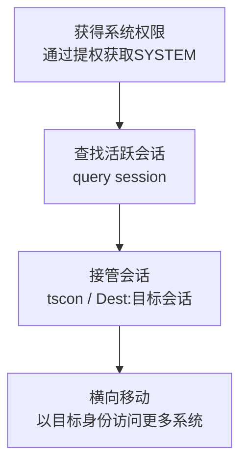

# 远程服务会话劫持 (T1563)

## 一句话通俗理解

就像某人正在远程桌面连接一台电脑时，攻击者偷偷"插队"抢走他的连接——攻击者接管了受害者已经建立好的远程会话，直接借用对方的身份操作。

## 30秒速查卡

| 维度 | 你需要知道的 |
|------|-------------|
| 这是什么？ | 就像某人正在远程桌面连接一台电脑时，攻击者偷偷"插队"抢走他的连接——攻击者接管了受害者已经建立好的远程会话，直接借用对 |
| 为什么危险？ | 这种技术最大的价值在于凭据无关性——攻击者不需要窃取密码、哈希或票据。他们直接借用了已认证会话的身份。由于操作来自合法的 |
| 谁需要关心？ | 安全监控团队、SOC分析师 |
| 你的第一步防御 | 监控tscon.exe的异常使用 |
| 如果只做一件事 | 假设一位管理员用远程桌面（RDP）登录了一台服务器，正在上面进行操作 |

## 难度等级

- ⭐⭐⭐⭐ 专家级（需要深度的系统理解）

## 技术描述

远程服务会话劫持（T1563）是MITRE ATT&CK框架中横向移动战术下的一种技术。

**通俗解释：**
假设一位管理员用远程桌面（RDP）登录了一台服务器，正在上面进行操作。攻击者如果能在这台服务器上获得管理员权限，就可以"接管"这个已建立的远程会话——把管理员"踢出去"或者和他共享会话。攻击者不需要知道管理员的密码，因为会话已经认证过了。这就好比某人正在打电话时，你通过某种方式接过他的电话继续通话，对方完全不知道已经换了人。

**技术原理：**

1. **发现已建立的远程会话**：攻击者在已入侵的系统上通过命令行查看当前活跃的远程会话
2. **获取高权限**：需要系统权限（如SYSTEM或管理员权限），通常通过提权漏洞获得
3. **会话接管**：使用系统工具或API连接到目标会话，模拟该会话的用户身份
4. **横向移动**：劫持后的会话拥有原始用户（可能具有高权限）的访问能力

**用途与影响：**
这种技术最大的价值在于凭据无关性——攻击者不需要窃取密码、哈希或票据。他们直接借用了已认证会话的身份。由于操作来自合法的用户会话，许多安全监控工具不会将其视为异常。该技术对RDP和SSH会话特别有效。在Windows系统中，网络管理员使用的"远程桌面管理"功能本身就支持会话连接和断开，这些功能可能被滥用。

## 子技术列表

**该技术共有 2 个子技术：**

| 子技术ID | 中文名称 | 通俗解释 |
|----------|----------|----------|
| T1563.001 | SSH Hijacking | 劫持已建立的SSH连接，利用SSH代理转发功能接管会话 |
| T1563.002 | RDP Hijacking | 在Windows上劫持已有的RDP会话，借用管理员的身份操作 |

<details>
<summary><strong>展开查看各子技术详细说明</strong></summary>

各子技术详细说明请参阅独立文档：

- [T1563.001 - SSH Hijacking](./T1563/T1563.001-SSH Hijacking-SSH Hijacking.md) — 偷走别人正在使用的SSH隧道——当管理员通过SSH连接到服务器时，攻击者劫持这个连接，就像在半路上接管了车辆的方向盘。
- [T1563.002 - RDP Hijacking](./T1563/T1563.002-RDP Hijacking-RDP Hijacking.md) — 抢走管理员的远程桌面——当管理员通过RDP连接到服务器时，攻击者"霸占"这个远程桌面会话，获得管理员的身份和权限。

</details>

## 攻击流程

### 典型攻击流程

```
获得系统权限 --> 查找活跃会话 --> 接管会话 --> 横向移动
```



**步骤详解：**

1. **获得系统权限**
   - 通俗描述：攻击者需要先在被入侵的系统上获得最高权限（SYSTEM）
   - 技术细节：使用PsExec、服务漏洞利用或凭据窃取提升到SYSTEM权限
   - 常用工具：PsExec、Mimikatz

2. **发现活跃会话**
   - 通俗描述：查看当前谁在远程登录这台系统
   - 技术细节：在命令行输入`query session`查看所有远程桌面会话
   - 常用工具：cmd、PowerShell

3. **会话接管**
   - 通俗描述：攻击者连接到目标会话，接管控制权
   - 技术细节：使用`tscon &lt;SessionID&gt;`命令在SYSTEM权限下连接到目标会话
   - 常用工具：tscon.exe

## 真实案例

### 案例1：APT组织和勒索软件集团使用RDP劫持进行横向移动（2020-2022年）

- **时间**: 2020年至2022年
- **目标**: 全球多个企业组织
- **攻击组织**: 多个APT组织和勒索软件集团
- **手法**: 据Kaspersky分析，多个APT组织在横向移动阶段使用RDP会话劫持技术。攻击者首先通过外部漏洞利用或钓鱼获得对一台服务器的初步访问权限。然后使用Mimikatz或本地提权漏洞获得SYSTEM权限。使用`query session`命令发现管理员正在通过RDP连接的其他服务器。通过`tscon`命令接管管理员会话后，攻击者直接获得了管理员在目标系统上的访问权限——包括文件共享、数据库和管理工具。这种技术在勒索软件攻击中也日益流行，因为可以绕过基于凭据的检测规则。
- **影响**: 攻击者成功在多个组织中扩大访问范围，绕过了MFA和其他认证安全控制
- **参考链接**: [Kaspersky RDP Hijacking分析](https://securelist.com/rdp-hijacking/104300/)

### 案例2：Conti勒索软件使用RDP会话劫持进行横向移动（2021年）

- **时间**: 2021年
- **目标**: 全球医疗、政府和制造业组织
- **攻击组织**: Conti勒索软件集团
- **手法**: Conti勒索软件的横向移动操作手册中明确包含了RDP会话劫持作为主要技术之一。Conti附属成员在受害网络中先通过Cobalt Strike Beacon获得初步访问权限，然后利用Beacon的令牌操作功能提升到SYSTEM权限。使用`query user`和`query session`命令找出当前活跃的RDP会话——特别关注域管理员和IT支持人员的会话。当发现高价值会话后，使用`tscon`命令在SYSTEM上下文中连接到该会话，从而获得管理员的域管理员权限。Conti特别选择在管理员工作时间使用这种技术，以避免会话被断开导致的告警。
- **影响**: Conti集团在2021年攻击了超过400个组织，勒索金额超过1.8亿美元
- **参考链接**: [Conti勒索软件内部手册分析 - Cisco Talos](https://blog.talosintelligence.com/conti-ransomware-leak/)

### 案例3：SSH劫持在供应链攻击中的应用（Kaseya VSA事件，2021年）

- **时间**: 2021年7月
- **目标**: Kaseya VSA客户及下游企业
- **攻击组织**: REvil（Sodinokibi）
- **手法**: 在Kaseya VSA供应链攻击中，REvil集团利用VSA远程管理工具的SSH功能作为跳板。VSA的底层使用SSH连接来管理Linux系统。REvil在攻陷VSA服务器后，利用其内建功能（包括类似SSH连接管理的功能）直接以管理的身份连接到下游客户系统。虽然这不是经典的SSH代理劫持，但它展示了劫持管理连接的价值——攻击者通过劫持合法的管理通道直接获得了对数百个下游系统的访问权限。受影响的管理员日志显示，攻击者在管理会话中执行命令，而这些会话在日志中显示为由合法管理员操作。
- **影响**: 约1,500家企业受到影响，REvil最初要求7,000万美元的赎金
- **参考链接**: [Kaseya VSA事件分析 - Mandiant](https://www.mandiant.com/resources/blog/kaseya-vsa-supply-chain-attack)

### 案例4：Qilin勒索软件利用RDP会话劫持进行横向移动（2024-2025年）

- **时间**: 2024年至2025年
- **目标**: 全球政府、医疗、教育、制造业组织
- **攻击组织**: Qilin（Agenda勒索软件集团）
- **手法**: Qilin勒索软件附属成员在横向移动阶段大量使用RDP会话劫持技术。攻击者首先通过窃取的VPN凭据、钓鱼邮件或漏洞利用获得对目标网络的初始访问。进入内部网络后，Qilin的恶意软件会在被入侵的服务器上枚举RDP认证历史（从Windows注册表中提取已保存的RDP连接记录和凭据），识别出管理员经常远程连接的目标服务器。攻击者特别关注域管理员和IT支持人员的RDP会话。使用Mimikatz或本地提权漏洞获取SYSTEM权限后，通过`query session`和`query user`命令查找活跃的RDP会话，然后使用`tscon`命令在SYSTEM上下文中连接到目标会话——从而获得该管理员的域管理员权限，无需知道密码。Qilin特别选择在管理员工作时间（当地时区的上午）进行会话劫持，以避免因会话断开触发告警。Qilin的Rust编写的勒索软件还专门针对VMware ESXi环境，通过劫持管理控制台会话来加密虚拟化基础设施。
- **影响**: Qilin在2024-2025年攻击了数百个组织，到2025年成为全球最活跃的勒索软件即服务(RaaS)运营之一，仅在2025年就声称超过1000个受害者
- **参考链接**: [MOXFIVE Qilin分析报告](https://www.moxfive.com/blog/qilin-ransomware-2026-ttps-victims-and-defense-guide/) | [KELA Qilin威胁分析](https://www.kelacyber.com/blog/ransomware-threat-actor-profile-qilin/)

## 红队视角

> ⚠️ **免责声明**：以下内容仅用于合法的安全测试、渗透测试和教育目的。未经授权对他人系统进行测试是违法行为。

### 实战技巧

1. **RDP劫持的标准流程**
   - 获取SYSTEM权限后执行`query session`查看活跃会话
   - 使用`tscon `<ID>``连接到目标会话
   - 如果`tscon`直接执行会断开当前用户，可以使用`tscon &lt;ID&gt; /dest:console`

2. **SSH Agent Forwarding劫持**
   - `ls -la /tmp/ssh-*`查找SSH认证代理套接字
   - 使用`SSH_AUTH_SOCK`环境变量指向找到的套接字

### 常用工具

| 工具名称 | 用途 | 平台 | 链接 |
|----------|------|------|------|
| tscon.exe | Windows内置RDP会话切换工具 | Windows | Windows自带 |
| PsExec | 远程执行命令，获取SYSTEM权限 | Windows | https://learn.microsoft.com/en-us/sysinternals/downloads/psexec |
| Mimikatz | 凭证提取和令牌操作 | Windows | https://github.com/gentilkiwi/mimikatz |

### 注意事项

- RDP劫持需要SYSTEM权限，普通管理员权限不够
- 合法的渗透测试必须有书面授权
- 劫持活跃用户的会话可能会被用户发现（屏幕闪烁、鼠标控制权变化）

## 蓝队视角

### 检测要点

1. **监控tscon.exe的异常使用**
   - 日志来源：Windows安全日志（Event ID 4648——使用显式凭据登录）、Sysmon Event ID 1（进程创建）
   - 关注字段：进程命令行中包含"tscon"或"query session"、"query user"
   - 异常特征：非管理员用户或非预期时间执行会话切换命令；从命令行启动的会话切换活动

2. **监控SSH认证代理套接字的异常访问**
   - 日志来源：Linux审计日志（auditd）、进程监控日志
   - 关注字段：访问`/tmp/ssh-*`套接字的进程
   - 异常特征：非SSH进程访问SSH认证代理套接字

### 监控建议

- 监控Event ID 4778和4779（远程桌面会话重新连接和断开）
- 配置Sysmon监控`tscon.exe`和`rwinsta.exe`的执行
- 对SSH跳板机实施增强的会话日志记录

## 检测建议

### 网络层检测

**检测方法：** 监控RDP会话的异常模式，如同一个用户从多个源IP同时建立会话。

### 主机层检测

**Windows事件ID：**
- 事件ID 4778：终端服务会话重新连接（可能表明会话劫持）
- 事件ID 4779：终端服务会话断开
- 事件ID 4648：使用显式凭据登录
- 事件ID 1（Sysmon）：进程创建，监控`tscon.exe`命令行

**Linux审计：**
- auditd规则：监控对SSH认证代理套接字的访问
- `sshd`日志中的异常会话模式

### 应用层检测

**用人话说：**

> 远程服务会话劫持是"搭便车"式横向移动——攻击者不去费劲登录，而是直接接管别人已经建立好的远程连接。比如管理员用RDP登录了服务器A，登录后没断开连接（只锁屏了桌面），攻击者在服务器A上就可以用tscon.exe命令附加到管理员闲置的RDP会话上，从而用管理员的身份操作服务器，不需要知道密码。SSH环境下也有类似攻击：利用SSH agent forwarding，攻击者在跳板机上截获转发的SSH代理连接，冒充用户登录后续目标。检测方法：监控tscon.exe的使用（事件ID 4688中命令行包含tscon）、RDP会话重新连接事件（事件ID 4778）来自非预期用户、以及SSH agent socket文件的异常访问。
>
> **避坑指南**：只监控外部RDP，忽略内网横向RDP；未区分正常SSH管理连接和异常横向；未启用PowerShell脚本块日志。

**Sigma规则示例：**
```yaml
title: RDP Session Hijacking via tscon
status: experimental
description: Detects tscon usage which can be used for RDP session hijacking
logsource:
    product: windows
    service: sysmon
detection:
    selection:
        EventID: 1
        CommandLine:
            - '*tscon*'
            - '*query session*'
            - '*query user*'
    condition: selection
level: high
tags:
    - attack.t1563
```

## 缓解措施

### 优先级1：关键措施

**措施名称：** 启用受限管理模式（Restricted Admin Mode）用于RDP

**具体实施步骤：**
1. 在组策略中启用RDP受限管理模式
2. 通过注册表设置`HKLM\System\CurrentControlSet\Control\Lsa\DisableRestrictedAdmin`
3. 这将阻止无凭据的会话劫持

### 优先级2：重要措施

**措施名称：** 限制具有SeCreateTokenPrivilege权限的用户

**具体实施步骤：**
1. 审查哪些用户和组拥有SeCreateTokenPrivilege和SeTcbPrivilege权限
2. 将这两项权限限制在必要的管理员账户范围内
3. 定期审计权限分配

### 优先级3：建议措施

**措施名称：** SSH安全配置

**具体实施步骤：**
1. 禁用SSH代理转发（设置`AllowAgentForwarding no`）
2. 限制SSH ControlMaster的使用
3. 使用SSH证书认证代替密码和代理认证

### MITRE ATT&CK 缓解措施映射

| 缓解措施ID | 缓解措施名称 | 适用性 |
|------------|-------------|--------|
| M1043 | Credential Access Protection | 适用 |
| M1026 | Privileged Account Management | 适用 |
| M1018 | User Account Management | 适用 |

## 动手实验

> ⚠️ **重要提示**：所有实验必须在隔离的实验室环境中进行，禁止对未授权的真实系统进行测试。

### 实验环境准备

**推荐靶场：** Windows域环境，包含域控制器和至少两台成员服务器。

### 实验1：RDP会话劫持模拟（高级）

**实验目标：** 理解RDP会话劫持的技术流程。

**实验步骤：**
1. 搭建包含两台Windows Server的域环境
2. 管理员通过RDP连接到目标服务器
3. 攻击者在目标服务器上获取SYSTEM权限
4. 使用`query session`查看活跃会话
5. 使用`tscon `<ID>``命令接管会话

## 术语解释

| 术语 | 英文原名 | 通俗解释 |
|------|----------|----------|
| RDP | Remote Desktop Protocol | Microsoft的远程桌面协议，允许用户远程操作另一台Windows电脑 |
| SSH | Secure Shell | 安全的远程命令行连接协议，常用于Linux服务器管理 |
| SYSTEM | SYSTEM Account | Windows中最高的系统级账户，比管理员权限还高 |
| tscon | Terminal Services Console | Windows中切换远程桌面会话的命令行工具 |
| SYSTEM权限 | SYSTEM Privilege | Windows操作系统的最高权限等级，拥有系统全部控制权 |

## 参考资料

### 官方文档

- [MITRE ATT&CK - Remote Service Session Hijacking](https://attack.mitre.org/techniques/T1563/)
- [tscon命令文档 - Microsoft](https://docs.microsoft.com/en-us/windows-server/administration/windows-commands/tscon)
- [远程桌面服务最佳实践 - Microsoft](https://docs.microsoft.com/en-us/windows-server/remote/remote-desktop-services)

### 安全报告

- [Kaspersky RDP劫持分析报告](https://securelist.com/rdp-hijacking/104300/)
- [Conti勒索软件内部手册分析 - Cisco Talos](https://blog.talosintelligence.com/conti-ransomware-leak/)
- [Kaseya VSA事件分析 - Mandiant](https://www.mandiant.com/resources/blog/kaseya-vsa-supply-chain-attack)
