# 收集 (TA0009)

## 一句话理解

攻击者把已经找到的有价值数据打包带走，就像小偷进到屋里翻到值钱的东西后，往自己口袋里装。

## 战术概述

收集（Collection）是MITRE ATT&CK框架中攻击链中段的战术，编号为TA0009。攻击者在这一阶段做的不是"找信息"（那是发现战术的事），而是**把已经确认有价值的数据收集起来**，为后续的渗漏（Exfiltration）做准备。

**通俗解释：**
收集就像小偷已经确认了屋里哪些东西值钱（发现阶段），现在是时候把这些东西装进自己的麻袋里了。攻击者可能截屏你的桌面、录制你的声音、读取你的剪贴板、打包你的文件，或者从邮件服务器、云存储、共享文件夹中批量拉取数据。各种手段只有一个目的：**把数据拿到手**。

**在攻击中的作用：**
收集是攻击者实现最终目标的必经之路——无论是窃密、勒索还是间谍活动，都需要先把目标数据收集到攻击者可控的位置。没有收集阶段，前面所有的入侵和横向移动工作都失去了意义。

**包含的技术类型：**
1. **文件收集**：从本地系统([T1005](T1005-Data-from-Local-System.md))、可移动介质([T1025](T1025-Data-from-Removable-Media.md))、网络共享([T1039](T1039-Data-from-Network-Shared-Drive.md)/[T1602](T1602-Data-from-Network-Shared-Drive.md))中复制敏感文件
2. **屏幕/音视频捕获**：截屏([T1113](T1113-Screen-Capture.md))、录像([T1125](T1125-Video-Capture.md))、录音([T1123](T1123-Audio-Capture.md))
3. **输入捕获**：键盘记录([T1056](T1056-Input-Capture.md))、剪贴板监控([T1115](T1115-Clipboard-Data.md))
4. **应用数据收集**：邮件([T1114](T1114-Email-Collection.md))、信息库([T1213](T1213-Data-from-Information-Repositories.md))、云存储([T1530](T1530-Data-from-Cloud-Storage.md))
5. **数据中间处理**：数据分段([T1074](T1074-Data-Staged.md))、压缩归档([T1560](T1560-Archive-Collected-Data.md))
6. **网络嗅探**：中间人攻击([T1557](T1557-Adversary-in-the-Middle.md))、浏览器会话劫持([T1185](T1185-Browser-Session-Hijacking.md))

## 战术在攻击链中的位置

### 攻击链全景图

```mermaid
graph LR
    A["侦察<br/>TA0043"] --> B["资源开发<br/>TA0042"]
    B --> C["初始访问<br/>TA0001"]
    C --> D["执行<br/>TA0002"]
    D --> E["持久化<br/>TA0003"]
    E --> F["权限提升<br/>TA0004"]
    F --> G["隐蔽<br/>TA0005"]
    G --> H["防御削弱<br/>TA0112"]
    H --> I["凭证访问<br/>TA0006"]
    I --> J["发现<br/>TA0007"]
    J --> K["横向移动<br/>TA0008"]
    K --> L["收集<br/>TA0009"]
    L --> M["命令与控制<br/>TA0011"]
    M --> N["数据窃取<br/>TA0010"]
    N --> O["影响<br/>TA0040"]

    style L fill:#ff6b6b,stroke:#333,stroke-width:3px,color:#fff
```

### 当前战术的角色

收集是攻击链中**数据从受害者环境转移到攻击者控制的关键转折点**。在此之前，攻击者做的是找到入口、获取权限、横向移动。从收集开始，攻击者真正开始拿数据了。没有收集，后面的数据渗漏（Exfiltration）和勒索（Impact）就成了无源之水。

### 前置战术

- **发现（TA0007）**：攻击者需要先发现目标系统中的有价值数据和存储位置，才能针对性地收集
- **横向移动（TA0008）**：攻击者需要先移动到存有目标数据的系统上，才能收集这些数据
- **凭证访问（TA0006）**：很多数据收集需要合法凭据（如邮件、云存储、共享文件夹）

### 后续战术

- **命令与控制（TA0011）**：收集到的数据需要通过C2通道传输出去
- **数据窃取（TA0010）**：将收集打包好的数据最终从目标网络中偷运出去
- **影响（TA0040）**：部分攻击者用收集到的数据进行勒索或破坏

## 技术索引表

| 技术ID | 中文名称 | 难度 | 子技术数 | 一句话理解 | 文档状态 |
|--------|----------|:----:|:--------:|------------|:--------:|
| [T1005](./T1005-Data-from-Local-System.md) | 本地系统数据 | ⭐ | 0 | 直接翻受害者电脑上的文件，像翻抽屉找东西 | ✅ 已完成 |
| [T1025](./T1025-Data-from-Removable-Media.md) | 可移动介质数据 | ⭐ | 0 | 读取插在电脑上的U盘、移动硬盘里的数据 | ✅ 已完成 |
| [T1039](./T1039-Data-from-Network-Shared-Drive.md) | 网络共享数据 | ⭐⭐ | 0 | 访问公司内部共享文件夹里的文件 | ✅ 已完成 |
| [T1056](./T1056-Input-Capture.md) | 输入捕获 | ⭐⭐ | 4 | 记录你敲的每一个键盘按键 | ✅ 已完成 |
| [T1074](./T1074-Data-Staged.md) | 数据分段 | ⭐ | 2 | 把偷来的数据先集中放到一个地方再打包 | ✅ 已完成 |
| [T1113](./T1113-Screen-Capture.md) | 屏幕捕获 | ⭐⭐ | 0 | 偷偷截下受害者电脑屏幕的内容 | ✅ 已完成 |
| [T1114](./T1114-Email-Collection.md) | 邮件收集 | ⭐⭐ | 4 | 翻看受害者的邮箱，获取通信内容 | ✅ 已完成 |
| [T1115](./T1115-Clipboard-Data.md) | 剪贴板数据 | ⭐ | 0 | 读取你复制粘贴的内容（如密码、钱包地址） | ✅ 已完成 |
| [T1119](./T1119-Automated-Collection.md) | 自动收集 | ⭐⭐ | 0 | 设置定时任务让电脑自动上缴数据 | ✅ 已完成 |
| [T1123](./T1123-Audio-Capture.md) | 音频捕获 | ⭐⭐⭐ | 0 | 偷偷打开麦克风录制周围的声音 | ✅ 已完成 |
| [T1125](./T1125-Video-Capture.md) | 视频捕获 | ⭐⭐⭐ | 0 | 偷偷打开摄像头录制视频 | ✅ 已完成 |
| [T1185](./T1185-Browser-Session-Hijacking.md) | 浏览器会话劫持 | ⭐⭐⭐ | 0 | 偷走你浏览器中的登录态，冒充你访问网站 | ✅ 已完成 |
| [T1213](./T1213-Data-from-Information-Repositories.md) | 信息库数据 | ⭐⭐ | 4 | 从公司的Wiki、SharePoint、Git仓库中偷文档和代码 | ✅ 已完成 |
| [T1530](./T1530-Data-from-Cloud-Storage.md) | 云存储数据 | ⭐⭐ | 0 | 从云盘（OneDrive、S3、Google Drive）里偷文件 | ✅ 已完成 |
| [T1557](./T1557-Adversary-in-the-Middle.md) | 中间人攻击 | ⭐⭐⭐ | 3 | 在中间拦截你和服务器的通信，偷听/偷看内容 | ✅ 已完成 |
| [T1560](./T1560-Archive-Collected-Data.md) | 压缩收集的数据 | ⭐ | 3 | 把偷来的数据打包压缩，方便传输 | ✅ 已完成 |
| [T1602](./T1602-Data-from-Network-Shared-Drive.md) | 网络共享驱动数据 | ⭐⭐ | 2 | 从网络设备和文件服务器中收集配置和数据 | ✅ 已完成 |

### 统计信息

- **技术总数**：17 个
- **子技术总数**：18 个
- **已完成文档**：17 个
- **进行中文档**：0 个
- **待编写文档**：0 个

## 推荐阅读顺序

### 入门阶段（第1-2周）

> 适合零基础的安全爱好者，从最简单、最直观的技术开始。

**前置知识：** 了解基本的文件操作、知道什么是压缩包

**推荐阅读：**

1. **[T1005 本地系统数据](./T1005-Data-from-Local-System.md)** - 最基础的"翻文件"技术，所有收集的起点，理解攻击者在你电脑上找什么
2. **[T1560 压缩收集的数据](./T1560-Archive-Collected-Data.md)** - 理解攻击者怎么把偷到的数据打包，这是数据窃取的必经步骤
3. **[T1074 数据分段](./T1074-Data-Staged.md)** - 理解攻击者怎么把分散的数据集中起来
4. **[T1115 剪贴板数据](./T1115-Clipboard-Data.md)** - 一个简单但被严重低估的收集手段

**学习建议：**
- 先在自己的测试机上熟悉文件夹结构和文件搜索命令
- 用7-Zip和PowerShell的Compress-Archive做一次手动打包练习

### 进阶阶段（第3-4周）

> 适合有一定基础的学习者，开始接触更复杂的技术。

**前置知识：** 了解网络协议基础（HTTP、SMB）、操作系统权限概念

**推荐阅读：**

1. **[T1114 邮件收集](./T1114-Email-Collection.md)** - 攻击者最常使用的收集手段之一，理解IMAP/EWS/Graph API的不同收集方式
2. **[T1213 信息库数据](./T1213-Data-from-Information-Repositories.md)** - 现代企业的数据心脏，理解攻击者如何从协作平台偷数据
3. **[T1530 云存储数据](./T1530-Data-from-Cloud-Storage.md)** - 随着企业上云，云存储成为新的数据金矿
4. **[T1056 输入捕获](./T1056-Input-Capture.md)** - 键盘记录和表单劫持的深层原理
5. **[T1119 自动收集](./T1119-Automated-Collection.md)** - 理解攻击者如何用脚本实现"躺平式"数据收集

**学习建议：**
- 搭建一个简单的邮件服务器，用IMAP客户端演示远程邮件收集
- 用rclone工具挂载云存储，模拟数据下载操作

### 高级阶段（第5-6周）

> 适合有较好技术基础的学习者，深入理解复杂技术原理。

**前置知识：** 了解Windows API编程、网络嗅探原理、浏览器安全机制

**推荐阅读：**

1. **[T1557 中间人攻击](./T1557-Adversary-in-the-Middle.md)** - 理解ARP欺骗、LLMNR投毒等网络层数据劫持的完整原理
2. **[T1185 浏览器会话劫持](./T1185-Browser-Session-Hijacking.md)** - 现代攻击中最危险的"无密码入侵"方式
3. **[T1123 音频捕获](./T1123-Audio-Capture.md)** 和 **[T1125 视频捕获](./T1125-Video-Capture.md)** - 了解间谍软件级别的物理环境监控
4. **[T1113 屏幕捕获](./T1113-Screen-Capture.md)** - 理解GDI API和屏幕数据获取的底层机制

**学习建议：**
- 在实验室中用Wireshark实践ARP欺骗抓包
- 用EvilGinx2搭建一个AiTM钓鱼环境测试会话劫持
- 编写一个简单的PowerShell脚本调用Windows API进行截屏

## 参考资料

### 官方文档

- [MITRE ATT&CK - Collection](https://attack.mitre.org/tactics/TA0009/)
- [MITRE ATT&CK Enterprise Matrix](https://attack.mitre.org/matrices/enterprise/)

### 学习资源

- [ATT&CK 收集战术详解 - 红队视角](https://www.microsoft.com/en-us/security/blog/) - Microsoft安全博客中的收集战术分析
- [Sekoia Ransomware Data Exfiltration Report 2024](https://blog.sekoia.io/ransomware-driven-data-exfiltration-techniques-and-implications/) - 勒索软件数据收集和渗漏技术深度报告
- [MITRE ATT&CK 中文社区](https://attack.mitre.org/resources/updates/) - ATT&CK框架更新和资源

### 相关工具

- [rclone](https://rclone.org/) - 云存储同步工具，常被攻击者用于批量下载云数据
- [7-Zip](https://www.7-zip.org/) - 开源压缩工具，攻击者常用其打包窃取的数据
- [EvilGinx2](https://github.com/kgretzky/evilginx2) - AiTM钓鱼框架，用于会话劫持演练
- [Ettercap](https://www.ettercap-project.org/) - 网络中间人攻击测试工具
