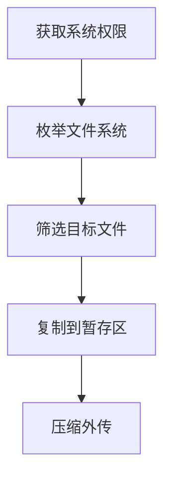

# 本地系统数据 (T1005)

## 一句话通俗理解

就像小偷进到你家后翻箱倒柜找值钱的东西——攻击者在你的电脑上搜索各种文件，把有用的复制带走。

## 30秒速查卡

| 维度 | 你需要知道的 |
|------|-------------|
| 这是什么？ | 就像小偷进到你家后翻箱倒柜找值钱的东西——攻击者在你的电脑上搜索各种文件，把有用的复制带走。 |
| 为什么危险？ | 攻击者收集本地文件可以达到多种目的：窃取企业机密用于竞争或出售、获取数据库连接字符串攻击后端系统、找到内部网络拓扑信息做 |
| 谁需要关心？ | 数据安全团队、SOC分析师 |
| 你的第一步防御 | 异常的文件系统枚举行为 |
| 如果只做一件事 | 想象一下，攻击者已经潜入你的电脑（通过病毒或远程控制），现在他要做的就是翻你的文件夹 |

## 难度等级

⭐ 初级（新手可学）

## 技术描述

本地系统数据收集（T1005）是MITRE ATT&CK框架中收集战术的一种基础技术。

**通俗解释：**
想象一下，攻击者已经潜入你的电脑（通过病毒或远程控制），现在他要做的就是翻你的文件夹。你的"文档"、"桌面"、"下载"文件夹就像家里的抽屉和柜子，攻击者会挨个打开查看，找到他要的文件（合同、报表、密码文件、源代码等）后复制一份带走。

**技术原理：**

1. **扫描文件系统**：攻击者使用`dir /s`（Windows）或`ls -R`（Linux）等命令递归遍历所有目录，了解文件结构
2. **按类型筛选**：通过文件扩展名（`.docx`、`.xlsx`、`.pdf`、`.sql`、`.cs`）锁定感兴趣的文件
3. **关键词搜索**：在文件中搜索"password"、"账号"、"机密"等关键词，快速定位高价值内容
4. **读取特定应用数据**：提取浏览器保存的密码、邮件客户端缓存、即时通讯软件聊天记录
5. **复制打包**：将筛选出的文件复制到临时目录，等待压缩和传输

**用途与影响：**
攻击者收集本地文件可以达到多种目的：窃取企业机密用于竞争或出售、获取数据库连接字符串攻击后端系统、找到内部网络拓扑信息做进一步的横向移动。对于勒索软件攻击者，还会收集文件内容作为赎金谈判的筹码——"不给钱就把你的客户数据公开"。

## 子技术列表

该技术没有子技术。

## 攻击流程

### 典型攻击流程

```
获取系统权限 --> 枚举文件系统 --> 筛选目标文件 --> 复制到暂存区 --> 压缩外传
```



**步骤详解：**

1. **获取系统权限**
   - 通俗描述：攻击者通过漏洞利用、钓鱼邮件或弱口令等方式获得对你电脑的控制权
   - 技术细节：通常获得SYSTEM或管理员级别权限，确保能读取所有用户的文件
   - 常用工具：Cobalt Strike Beacon、Metasploit Meterpreter

2. **枚举文件系统**
   - 通俗描述：在电脑上"逛一圈"，看有哪些文件夹和文件
   - 技术细节：攻击者特别关注`C:\Users\`（用户目录）、`C:\inetpub\`（网站目录）、`C:\ProgramData\`（程序数据目录）
   - 常用工具：`dir /s /b`、`Get-ChildItem -Recurse`、`find . -type f`

3. **筛选目标文件**
   - 通俗描述：只挑"值钱的"文件，不会每个文件都拿
   - 技术细节：按扩展名筛选（`.doc`、`.xls`、`.pdf`、`.sql`、`.cs`、`.py`、`.java`、`.zip`、`.rar`）和关键词匹配
   - 常用工具：`findstr`、`Select-String`、`grep`

4. **复制到暂存区**
   - 通俗描述：把选中的文件集中放到一个临时文件夹里
   - 技术细节：复制到`%TEMP%`或`%APPDATA%`下的隐藏目录，避免在原始位置留下大量操作痕迹
   - 常用工具：`copy`、`xcopy`、`robocopy`、`Copy-Item`

5. **压缩外传**
   - 通俗描述：把文件打包压缩，然后通过网络发送出去
   - 技术细节：使用RAR或ZIP格式加密压缩，通过HTTPS或DNS隧道规避防火墙检测
   - 常用工具：7-Zip、WinRAR、`tar`、`Compress-Archive`

## 真实案例

### 案例1：Salt Typhoon - 电信基础设施文件收集（2024-2025）

- **时间**: 2024年-2025年
- **目标**: 美国AT&T、Verizon、T-Mobile等电信公司
- **攻击组织**: Salt Typhoon（中国背景APT组织）
- **手法**: Salt Typhoon利用Cisco设备零日漏洞(CVE-2023-20198)入侵电信企业网络后，在受感染的服务器上使用自定义PowerShell脚本递归扫描文件系统，搜索包含"password"、"config"、"backup"等关键词的配置文件。攻击者特别关注存储用户元数据、通话记录和合法监听系统配置的目录。通过`Get-ChildItem -Path C:\ -Recurse -Include *.config,*.xml,*.txt`批量筛选敏感配置文件，收集了超过100万用户的通话元数据和监听系统配置信息。
- **影响**: 美国历史上最严重的电信安全事件，涉及数百万用户的通信数据泄露
- **参考链接**: [Salt Typhoon Telecom Hack - TechCrunch 2026](https://techcrunch.com/2026/03/09/salt-typhoon-china-who-has-been-hacked-global-telecom-giants/)

### 案例2：ALPHV/BlackCat勒索软件 - 本地文件勒索双重勒索（2023-2024）

- **时间**: 2023年-2024年
- **目标**: 全球医疗、能源、制造业企业
- **攻击组织**: ALPHV (BlackCat) 勒索软件团伙
- **手法**: ALPHV在加密受害者系统前，使用自定义信息窃取模块扫描本地驱动器中的敏感文件。攻击者通过`vssadmin`获取卷影副本访问权限，绕开正在被使用的文件锁定。收集的目标包括财务记录（`.xlsx`、`.csv`）、客户数据库（`.sql`、`.mdb`）、电子邮件存档（`.pst`）和业务合同（`.pdf`、`.docx`）。ALPHV的收集模块会将文件按类型分类存储，评估总数据量用于确定赎金金额。收集完成后，文件被7-Zip加密压缩并通过rclone上传至MEGA云存储。
- **影响**: 多家大型企业支付了数百万美元赎金，部分受害者的数据在拒绝支付后被公开
- **参考链接**: [ALPHV Ransomware Analysis - CISA](https://www.cisa.gov/news-events/cybersecurity-advisories/aa23-353a)

### 案例3：APT41 - 游戏公司源代码本地收集（2020-2022）

- **时间**: 2020年-2022年
- **目标**: 全球游戏开发公司、科技企业
- **攻击组织**: APT41 (Winnti Group)
- **手法**: APT41在入侵游戏公司后，专注于从本地系统收集源代码文件。攻击者使用`findstr /s /m "password\\|connectionString\\|apiKey" *.cs *.java *.py`在开发人员的本地工作目录中搜索凭证和密钥。他们特别关注`C:\inetpub\wwwroot\`（Web服务器源码）、本地Git仓库（`.git`目录中的完整版本历史）以及IDE工作区中的项目文件。APT41还从`%APPDATA%\Microsoft\Credentials\`目录中提取缓存的Windows凭据，用于横向移动到其他系统。
- **影响**: 多家游戏公司的核心源码被盗，包括未发布游戏的引擎代码和服务器端实现
- **参考链接**: [APT41 Source Code Theft - Mandiant](https://www.mandiant.com/resources/blog/apt41-global-extortion-source-code-theft)

## 红队视角

> ⚠️ **免责声明**：以下内容仅用于合法的安全测试、渗透测试和教育目的。未经授权对他人系统进行测试是违法行为。

### 实战技巧

1. **优先搜索高价值目录**
   不要漫无目的地扫描整个硬盘。攻击者通常按以下优先级搜索：`桌面 > 文档 > 下载 > 最近文件 > `%APPDATA%` > `C:\inetpub\`。桌面和文档文件夹中包含用户最常使用的工作文件，是最快获取价值信息的路径。

2. **利用PowerShell进行无文件扫描**
   使用PowerShell在内存中执行文件搜索，避免在磁盘上留下脚本文件。示例：`Get-ChildItem -Path $env:USERPROFILE -Recurse -Include *.docx,*.xlsx,*.pdf | Where-Object { $_.Length -gt 1024 }`。结合`-EncodedCommand`参数可以绕过部分脚本检测。

3. **关注隐藏数据和临时文件**
   不要忽略`%TEMP%`、`$Recycle.Bin`、`System Volume Information`等目录。用户误删的重要文件、Office自动保存的临时版本、系统备份文件都可能包含高价值数据。

### 常用工具

| 工具名称 | 用途 | 平台 | 链接 |
|----------|------|------|------|
| PowerShell | 内置文件搜索和复制工具 | Windows | 系统内置 |
| findstr | 在文件中搜索文本模式 | Windows | 系统内置 |
| 7-Zip | 压缩和打包收集的文件 | Windows/Linux | https://www.7-zip.org/ |
| robocopy | 批量文件复制，支持多线程 | Windows | 系统内置 |
| grep/find | Linux/Unix文件搜索 | Linux/macOS | 系统内置 |

### 注意事项

- 大量文件操作会产生明显的I/O特征，EDR系统可能会检测到异常的文件读取模式
- 避免在用户活跃时段进行大规模文件扫描，增加被发现的风险
- 收集操作应遵循最小必要原则——只拿需要的文件，减少不必要的操作痕迹
- 注意文件权限：不是所有文件当前用户都能读取，尝试读取无权访问的文件会触发安全事件

## 蓝队视角

### 检测要点

1. **异常的文件系统枚举行为**
   - 日志来源：Windows Event ID 4663（对象访问审计）、Sysmon Event ID 11（文件创建）
   - 关注字段：进程名称、文件路径、访问类型
   - 异常特征：非Explorer.exe进程短时间内访问大量不同目录下的文件，特别是`C:\Users\`下的多用户目录

2. **批量文件复制操作**
   - 日志来源：Sysmon Event ID 11、Windows File System Audit
   - 关注字段：源文件路径、目标文件路径、进程命令行
   - 异常特征：`copy`、`xcopy`、`robocopy`、`Copy-Item`等命令将大量文件从用户目录复制到`%TEMP%`或`%APPDATA%`

3. **PowerShell异常使用**
   - 日志来源：PowerShell Script Block Logging (Event ID 4104)
   - 关注字段：ScriptBlock文本
   - 异常特征：包含`Get-ChildItem -Recurse`、`Select-String`、`Copy-Item`组合的命令行，特别是使用`-EncodedCommand`参数的情况

### 监控建议

- 启用Windows文件系统审计策略，监控对敏感目录（如`C:\Users\`、`C:\inetpub\`）的读取操作
- 部署EDR并配置文件活动基线，对偏离用户正常模式的批量文件访问发起告警
- 开启PowerShell Module Logging和Script Block Logging，记录所有PowerShell文件操作命令
- 在SIEM中建立关联规则：文件枚举 + 文件复制 + 压缩工具启动 = 高疑似数据收集行为

## 检测建议

### 网络层检测

**检测方法：** 监控从内部主机向外部发送的大数据量出站流量，特别是压缩文件格式的传输。

**具体规则/命令示例：**
```
# Zeek/Bro 检测大量出站数据
event file_over_new_connection(f: fa_file) {
    if ( f$source == "SMB" && f$size > 50000000 ) {
        NOTICE([$note=Data_Collection, $msg=fmt("Large file transfer detected: %s", f$name)]);
    }
}
```

**示例（Suricata/IDS规则）：**
```
# 检测本地系统数据批量外传 - 大文件HTTP/HTTPS出站传输
alert tcp $HOME_NET any -> $EXTERNAL_NET $HTTP_PORTS (
    msg:"T1005 - 本地系统数据批量外传 - 大文件出站传输";
    flow:to_server;
    content:"POST";
    http_method;
    dsize:>50000000;
    threshold:type both, track by_src, count 2, seconds 60;
    sid:1000501; rev:1;
)
```

### 主机层检测

**Windows事件ID：**
- 事件ID 4663：尝试访问文件对象（需配置审计策略）
- 事件ID 4656：文件句柄请求（记录谁打开了什么文件）
- Sysmon Event ID 11：文件创建事件
- Sysmon Event ID 1：进程创建（捕获`copy`、`xcopy`、`robocopy`等命令行）

**具体命令示例：**
```bash
# 查看PowerShell Script Block日志中的文件搜索行为
Get-WinEvent -FilterHashtable @{LogName='Microsoft-Windows-PowerShell/Operational'; ID=4104} | 
    Where-Object { $_.Message -match 'Get-ChildItem.*-Recurse' } | 
    Format-Table TimeCreated, Message -Wrap
```

### 应用层检测

**用人话说：**

> 本地系统数据收集是最"直白"的数据窃取手段——攻击者直接在已攻陷的电脑上搜索和复制敏感文件，就像小偷进到屋里翻箱倒柜找值钱的东西。常用的PowerShell命令如Get-ChildItem -Recurse -Include *.docx,*.xlsx,*.pdf C:\Users\ 递归搜索所有用户的文档，然后用Copy-Item复制到暂存目录打包。攻击者还会用findstr搜索包含"密码"、"token"、"密钥"等关键字的文件，或者直接读取浏览器保存的密码文件（%APPDATA%\Google\Chrome\User Data\Login Data）。检测特征：某个进程在短时间内读取了多种不同类型的文件（docx+xlsx+pdf混读），然后全部复制到一个临时目录下。
>
> **避坑指南**：
> - **把正常操作当攻击**：程序员编译代码（VS读几千个.cs/.h文件）、杀毒软件全盘扫描、Windows Search索引、`dir /s` 日常操作都会产生大量文件读取。只看"读了很多文件"就告警会疯的。关键看**行为模式**——正常操作通常访问特定类型文件（如VS只读源代码），而数据收集会读各种类型（docx + xlsx + pdf + sql混着来），且最终会复制到暂存目录。
> - **只盯扩展名不看内容**：很多人只监控 `.docx`、`.xlsx`、`.pdf` 这些"明显敏感"的文件类型，但攻击者也会收集 `.eml`（邮件缓存）、`.pst`（Outlook数据文件）、`.ost`（离线邮件）、浏览器 `Cookies` 和 `Login Data` 文件。忽略了这些"看起来不起眼"的数据源，等于让攻击者从侧门把数据搬走。
> - **只防读不防搜索**：很多检测规则只监控文件的读取操作（ReadFile API），但攻击者常常先用 `findstr` / `Select-String` 搜索内容再精准复制。搜索操作本身不产生文件读取事件，用关键词匹配找到目标后才读具体文件。如果只监控读文件，会漏掉攻击者的"踩点"阶段。
> - **忽略隐藏数据源**：很多防御者只盯着用户的"文档"和"桌面"文件夹。实际上攻击者还会翻 `%APPDATA%`（浏览器密码、聊天记录）、`%TEMP%`（临时缓存中可能包含敏感文件的历史版本）、`$Recycle.Bin`（用户删除但未彻底清除的文件）。"我看了桌面和文档，没有文件被访问"不等于"数据没有被收集"。

**Sigma规则示例：**
```yaml
title: 本地文件批量收集检测
status: experimental
description: 检测攻击者在本地系统上递归搜索和收集敏感文件的行为
logsource:
    category: process_creation
    product: windows
detection:
    selection_powershell:
        Image|endswith: '\powershell.exe'
        CommandLine|contains:
            - 'Get-ChildItem'
            - '-Recurse'
            - 'Select-String'
    selection_copy:
        CommandLine|contains:
            - 'copy '
            - 'xcopy '
            - 'robocopy '
            - 'Copy-Item'
    condition: selection_powershell and selection_copy
level: medium
tags:
    - attack.t1005
    - attack.collection
```

## 缓解措施

### 优先级1：关键措施

**措施名称：** 实施最小权限原则

**具体实施步骤：**
1. 为用户分配正常工作所需的最小文件系统权限
2. 禁止普通用户读取其他用户的目录和系统敏感目录
3. 使用组策略限制`cmd.exe`和`powershell.exe`在非管理员账户下的使用

**配置示例：**
```
# 通过AppLocker限制PowerShell使用
Set-AppLockerPolicy -Local User -RuleType Exe -Path "%SYSTEM32%\WindowsPowerShell\v1.0\powershell.exe" -User Everyone -Action Deny
```

### 优先级2：重要措施

**措施名称：** 启用文件完整性监控（FIM）

**具体实施步骤：**
1. 部署FIM工具监控敏感目录（文档、桌面、`%APPDATA%`）的批量读取模式
2. 配置Windows SACL（系统访问控制列表）审计关键目录
3. 设置告警规则：短时间内大量文件被读取时自动通知安全团队

### 优先级3：建议措施

**措施名称：** 部署数据防泄漏（DLP）方案

**具体实施步骤：**
1. 在终端部署DLP代理，监控文件复制和网络外传行为
2. 配置内容识别规则，检测包含敏感关键词（如"机密"、"密码"）的文件外传
3. 对DLP告警设置自动阻断和人工审核的双重机制

### MITRE ATT&CK 缓解措施映射

| 缓解措施ID | 缓解措施名称 | 适用性 | 说明 |
|------------|-------------|--------|------|
| M0948 | 数据丢失防护（DLP） | 适用 | DLP系统监控文件读取和网络外传 |
| M0929 | 最小权限原则 | 适用 | 限制用户对非必要文件的读取权限 |
| M0922 | 用户行为分析 | 适用 | 建立用户文件操作基线，检测异常 |
| M0940 | 文件完整性监控 | 适用 | 监控敏感目录的批量文件访问 |

## 动手实验

> ⚠️ **重要提示**：所有实验必须在隔离的实验室环境中进行，禁止对未授权的真实系统进行测试。

### 实验环境准备

**推荐靶场/实验平台：**

| 平台名称 | 类型 | 难度 | 链接 |
|----------|------|------|------|
| Detection Lab | 虚拟靶场 | 中级 | https://github.com/clong/DetectionLab |
| Let's Defend | 在线靶场 | 初级 | https://letsdefend.io/ |

**所需工具：**
- Windows 10/11 虚拟机：作为目标系统
- PowerShell：进行文件搜索操作
- Sysinternals Suite：监控文件操作

**环境搭建：**
```powershell
# 在虚拟机中创建模拟敏感文件
New-Item -Path "C:\Users\Public\Documents" -Name "secret_project.docx" -ItemType File
New-Item -Path "C:\Users\Public\Documents" -Name "db_config.sql" -ItemType File
New-Item -Path "C:\Users\Public\Desktop" -Name "financial_report_2026.xlsx" -ItemType File
```

### 实验1：模拟攻击者文件搜索（初级）

**实验目标：** 模拟攻击者使用PowerShell递归搜索敏感文件

**实验步骤：**
1. 以普通用户身份登录Windows虚拟机
2. 打开PowerShell，执行以下命令搜索所有Word文档：
   ```powershell
   Get-ChildItem -Path C:\Users -Recurse -Include *.docx,*.xlsx,*.pdf -ErrorAction SilentlyContinue
   ```
3. 搜索包含"password"关键词的文件：
   ```powershell
   Get-ChildItem -Path C:\Users -Recurse -File | Select-String -Pattern "password" | Select-Object Path
   ```
4. 查看Windows事件查看器中Sysmon的进程创建日志（Event ID 1）

**预期结果：** 可以看到PowerShell进程的执行记录和被访问的文件列表

**学习要点：** 理解攻击者如何快速定位敏感文件，以及这些操作在系统日志中留下的痕迹

### 实验2：模拟检测（中级）

**实验目标：** 配置Sysmon规则检测异常文件搜索行为

**实验步骤：**
1. 在虚拟机中安装Sysmon，使用默认配置文件
2. 执行与实验1相同的大规模文件搜索命令
3. 在Event Viewer中查看Sysmon Event ID 1和11
4. 使用PowerShell提取可疑事件：
   ```powershell
   Get-WinEvent -FilterHashtable @{LogName='Microsoft-Windows-Sysmon/Operational'; ID=1} | 
       Where-Object {$_.Message -match 'Get-ChildItem'} | 
       Format-Table TimeCreated, Message -Wrap
   ```

**预期结果：** 能够从Sysmon日志中还原攻击者的文件搜索行为

**学习要点：** 理解日志分析在检测数据收集行为中的关键作用

## 术语解释

| 术语 | 英文原名 | 通俗解释 |
|------|----------|----------|
| 递归遍历 | Recursive Traversal | 像翻文件夹一样，打开一个文件夹后继续打开里面的子文件夹，直到把所有层级的文件都看一遍 |
| 文件扩展名 | File Extension | 文件名最后面的`.docx`、`.pdf`这种后缀，告诉电脑这是什么类型的文件 |
| 暂存区 | Staging Directory | 临时存放文件的地方，就像搬家时先把东西堆在客厅，再统一装箱 |
| 枚举 | Enumeration | 挨个查看、列出所有项目，就像列购物清单一样逐项列出 |
| 卷影副本 | Volume Shadow Copy | Windows的"时光回溯"功能，可以读取文件的历史版本，即使原文件已被删除或修改 |

## 参考资料

### 官方文档

- [MITRE ATT&CK - T1005](https://attack.mitre.org/techniques/T1005/)

### 安全报告

- [Salt Typhoon Telecom Hack Analysis - TechCrunch 2026](https://techcrunch.com/2026/03/09/salt-typhoon-china-who-has-been-hacked-global-telecom-giants/)
- [ALPHV BlackCat Ransomware Advisory - CISA](https://www.cisa.gov/news-events/cybersecurity-advisories/aa23-353a)
- [Ransomware-driven data exfiltration techniques - Sekoia 2024](https://blog.sekoia.io/ransomware-driven-data-exfiltration-techniques-and-implications/)

### 工具与资源

- [Sysinternals Suite](https://docs.microsoft.com/en-us/sysinternals/downloads/sysinternals-suite) - Windows系统工具集
- [PowerShell Documentation](https://docs.microsoft.com/en-us/powershell/) - PowerShell官方文档
