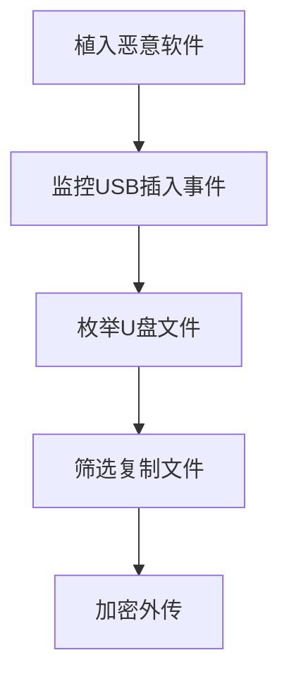

# 可移动介质数据 (T1025)

## 一句话通俗理解

攻击者读取你插在电脑上的U盘、移动硬盘或SD卡里的数据，就像有人趁你手机充电时偷看里面的照片。

## 难度等级

⭐ 初级（新手可学）

## 技术描述

可移动介质数据收集（T1025）是MITRE ATT&CK框架中收集战术的一种技术。

**通俗解释：**
U盘、移动硬盘、SD卡这些"可移动介质"就像你随身携带的文件袋——里面可能装着工作文档、项目备份、重要资料。攻击者在控制了你的电脑后，会检查插在上面的一切外部存储设备，把里面的文件复制走。甚至有些恶意软件会专门等待你插入U盘的瞬间，自动开始窃取数据。

**技术原理：**

1. **检测介质接入**：攻击者通过监控系统事件（如Windows的`RegisterDeviceNotification`或WMI的`Win32_VolumeChangeEvent`）实时感知新设备的插入
2. **枚举介质内容**：一旦检测到新设备，立即使用文件系统API遍历设备中的所有目录和文件
3. **筛选目标文件**：根据预设的文件类型列表（如`.doc`、`.pdf`、`.zip`、`.dwg`）筛选高价值文件
4. **复制到本地**：将选中的文件从可移动介质复制到受感染系统的临时目录
5. **外传数据**：将收集到的数据打包加密后通过C2通道传输出去

**用途与影响：**
这项技术特别常见在"物理隔离"环境中——当目标网络没有互联网连接时，攻击者通过U盘这种"渡船"方式，先把恶意软件带入隔离网络，再把窃取的数据带出来（就像著名的Stuxnet震网病毒）。对于普通用户来说，攻击者可能窃取U盘中的项目文档、设计图纸或备份的密码文件。

## 子技术列表

该技术没有子技术。

## 攻击流程

### 典型攻击流程

```
植入恶意软件 --> 监控USB插入事件 --> 枚举U盘文件 --> 筛选复制文件 --> 加密外传
```



**步骤详解：**

1. **植入恶意软件**
   - 通俗描述：通过钓鱼邮件或软件漏洞让受害者电脑感染恶意程序
   - 技术细节：恶意软件安装USB监控模块，注册设备通知回调函数
   - 常用工具：定制后门、Cobalt Strike

2. **监控USB插入事件**
   - 通俗描述：恶意软件一直盯着USB口，等待你插入U盘
   - 技术细节：通过`RegisterDeviceNotification`注册`GUID_DEVINTERFACE_VOLUME`设备的通知，或轮询WMI的`Win32_LogicalDisk`检查新驱动器
   - 常用工具：Windows API（`RegisterDeviceNotification`）、WMI查询

3. **枚举U盘文件**
   - 通俗描述：一旦发现新U盘插入，马上扫描其中的所有文件
   - 技术细节：递归遍历可移动介质的所有目录，获取文件列表和元数据
   - 常用工具：`Get-ChildItem`、`Directory.GetFiles()`

4. **筛选复制文件**
   - 通俗描述：只复制"值钱"的文件类型，不浪费时间和带宽
   - 技术细节：按扩展名白名单（`.doc`、`.pdf`、`.dwg`、`.psd`）过滤有价值的文件
   - 常用工具：自定义复制脚本、`Copy-Item`

5. **加密外传**
   - 通俗描述：把偷来的文件加密压缩后发送给攻击者
   - 技术细节：使用AES或RC4加密，通过HTTPS或DNS隧道传输
   - 常用工具：自定义加密模块、rclone、MEGA

## 真实案例

### 案例1：Stuxnet - 跨越物理隔离的USB数据窃取（2010年）

- **时间**: 2009年-2010年
- **目标**: 伊朗纳坦兹核设施的铀浓缩离心机
- **攻击组织**: 疑似美国与以色列合作（Operation Olympic Games）
- **手法**: Stuxnet蠕虫利用USB可移动介质突破物理隔离（air-gap）网络。当操作员将U盘插入感染了Stuxnet的Windows系统时，恶意软件自动将收集到的离心机运行状态数据写入U盘的隐藏区域。当该U盘随后被插入到联网系统时，Stuxnet将存储的数据通过互联网上传到位于马来西亚和荷兰的C2服务器。Stuxnet的USB模块使用了两个零日漏洞（CVE-2010-2568快捷方式漏洞和CVE-2010-2772漏洞）确保自动执行。
- **影响**: 成功破坏了伊朗近1000台铀浓缩离心机，被认为是世界上首个国家级网络武器
- **参考链接**: [Stuxnet Analysis - Symantec](https://symantec-enterprise-blogs.security.com/blogs/threat-intelligence/stuxnet-十年)

### 案例2：Emotet - USB传播与数据收集（2019-2023）

- **时间**: 2019年-2023年
- **目标**: 全球政府、金融机构、企业
- **攻击组织**: Emotet僵尸网络
- **手法**: Emotet感染系统后会持续监控USB存储设备的插入事件。一旦检测到新的USB驱动器，Emotet向其中写入恶意的`.lnk`快捷方式和恶意DLL文件。同时，Emotet扫描驱动器中的所有数据文件（`.doc`、`.pdf`、`.xls`），收集文件名、大小和修改日期等元数据。这些元数据被加密压缩后回传至C2服务器，用于评估受害者信息价值。如果发现高价值文件，Emotet会安排后续的数据窃取或勒索攻击。
- **影响**: Emotet一度是全球最活跃的恶意软件家族，感染了数百万台设备，造成数十亿美元损失
- **参考链接**: [Emotet Analysis - CISA](https://www.cisa.gov/news-events/cybersecurity-advisories/aa23-158a)

### 案例3：Turla - USB数据中转窃取（2014-2018）

- **时间**: 2014年-2018年
- **目标**: 东欧政府机构、大使馆、国防组织
- **攻击组织**: Turla (Venomous Bear，俄罗斯背景APT组织)
- **手法**: Turla组织的Carbon后门包含专门的可移动介质数据收集模块。该模块通过`RegisterDeviceNotification`注册USB设备插入通知，一旦检测到新USB存储设备，自动使用底层扇区读取方式获取数据，绕过文件系统的访问控制。Turla还开发了专用工具，可以读取被写保护或隐藏分区中的数据。收集的文件暂存在`%APPDATA%\Microsoft\`目录下，经RC4加密和Base64编码后通过HTTP通信外传。
- **影响**: 多家东欧政府机构的机密文件通过USB介质被窃取
- **参考链接**: [Turla Carbon Malware - Welivesecurity](https://www.welivesecurity.com/2020/06/18/turla-looking-behind-curtain-carbon/)

## 红队视角

> ⚠️ **免责声明**：以下内容仅用于合法的安全测试、渗透测试和教育目的。未经授权对他人系统进行测试是违法行为。

### 实战技巧

1. **利用自动播放功能**
   Windows的自动播放（AutoPlay）功能默认启用，插入U盘时自动打开资源管理器。攻击者可以利用此功能在U盘根目录放置恶意`.lnk`文件和隐藏文件夹，当用户双击打开U盘时触发恶意代码执行和数据收集。

2. **监控设备插入事件**
   使用PowerShell的WMI事件订阅功能实时监控新设备插入：`Register-WmiEvent -Query "SELECT * FROM Win32_VolumeChangeEvent WHERE EventType=2" -Action { ... }`。这种方式不需要管理员权限即可监控新驱动器的出现。

3. **注意U盘写保护**
   部分U盘有物理写保护开关，无法直接写入文件。攻击者需要使用底层驱动级操作（如发送SCSI命令）绕过写保护，或者仅读取数据而不写入。

### 常用工具

| 工具名称 | 用途 | 平台 | 链接 |
|----------|------|------|------|
| USBDeview | 查看系统中所有USB设备历史记录 | Windows | https://www.nirsoft.net/utils/usb_devices_view.html |
| WMI Explorer | 查询WMI事件和系统信息 | Windows | 系统内置 |
| PowerSploit | PowerShell渗透测试框架 | Windows | https://github.com/PowerShellMafia/PowerSploit |

### 注意事项

- 物理隔离网络中的USB收集需要"渡船"方式：需要中间人物理接入USB设备，增加了操作风险
- 现代Windows系统默认禁用自动播放功能，需要使用更复杂的方式触发自动执行
- USB存储设备通常速度较慢，大规模文件复制会持续较长时间，增加被发现的可能性

## 蓝队视角

### 检测要点

1. **USB设备插入后的异常进程活动**
   - 日志来源：Windows Event ID 2003/2100/2102（设备接入事件）
   - 关注字段：设备实例ID、进程启动时间
   - 异常特征：USB设备插入后立即有非用户进程（如cmd.exe、PowerShell）启动并访问该设备

2. **可移动介质批量文件读取**
   - 日志来源：Sysmon Event ID 11（文件创建）、Windows Audit Policy
   - 关注字段：源文件路径（包含`D:`、`E:`等可移动介质盘符）
   - 异常特征：短时间内从可移动介质读取大量文件并复制到`%TEMP%`目录

3. **注册表/系统事件监控**
   - 日志来源：Windows Event ID 4656（文件句柄请求）
   - 关注字段：对象名称（`\Device\HarddiskVolume*`）
   - 异常特征：非预期的进程对底层卷设备的读取操作

### 监控建议

- 使用组策略禁用可移动介质的自动播放功能
- 部署USB设备控制策略，仅允许授权USB设备接入
- 启用Windows事件日志中的USB设备接入审计
- 对从可移动介质到系统盘的数据复制操作进行告警

## 检测建议

### 网络层检测

**检测方法：** 监控从可移动介质收集数据后的外传流量，关注大数据量的出站连接。

**具体规则/命令示例：**
```bash
# 检测USB活动后的异常网络连接
Get-NetTCPConnection | Where-Object { $_.State -eq 'Established' -and $_.RemotePort -eq 443 } | 
    Where-Object { (Get-Process -Id $_.OwningProcess).ProcessName -notin @('chrome', 'firefox', 'edge') }
```

**示例（Suricata/IDS规则）：**
```
# 检测USB介质接入后的异常大流量出站数据传输
alert tcp $HOME_NET any -> $EXTERNAL_NET $HTTP_PORTS (
    msg:"T1025 - USB活动后可疑数据外传 - 可移动介质数据收集";
    flow:to_server;
    content:"POST";
    http_method;
    dsize:>10000000;
    threshold:type both, track by_src, count 3, seconds 300;
    sid:1002501; rev:1;
)
```

### 主机层检测

**Windows事件ID：**
- 事件ID 2003：Windows已准备好使用新设备（USB插入）
- 事件ID 2100：Windows无法识别USB设备
- 事件ID 4656：对象句柄请求（配置SACL后可记录对特定目录的访问）
- Sysmon Event ID 11：文件创建事件（可记录从可移动介质的文件复制）

**具体命令示例：**
```bash
# 查询USB设备插入事件
Get-WinEvent -FilterHashtable @{LogName='System'; ID=2003} | Select-Object TimeCreated, Message
```

### 应用层检测

**Sigma规则示例：**
```yaml
title: USB插入后的自动文件收集检测
status: experimental
description: 检测USB存储设备插入后PowerShell自动开始文件收集的行为
logsource:
    category: process_creation
    product: windows
detection:
    selection:
        ParentImage|endswith: '\svchost.exe'
        Image|endswith: '\powershell.exe'
        CommandLine|contains:
            - 'Get-ChildItem'
            - 'D:\'
            - 'E:\'
    condition: selection
level: medium
tags:
    - attack.t1025
    - attack.collection
```

## 缓解措施

### 优先级1：关键措施

**措施名称：** 禁用USB自动播放并实施设备控制

**具体实施步骤：**
1. 通过组策略禁用所有驱动器的自动播放：
   ```
   计算机配置 > 管理模板 > Windows组件 > 自动播放策略 > 关闭自动播放：启用
   ```
2. 使用Windows Device Guard或第三方设备控制软件，仅允许授权的USB设备接入
3. 在高安全环境中使用组策略完全禁用可移动存储设备

### 优先级2：重要措施

**措施名称：** USB存储加密

**具体实施步骤：**
1. 对所有公司USB存储设备启用BitLocker To Go加密
2. 要求在U盘中存储敏感数据时必须使用加密容器（如VeraCrypt）
3. 在端点安全策略中配置可移动介质强制加密策略

### 优先级3：建议措施

**措施名称：** 用户安全意识培训

**具体实施步骤：**
1. 教育员工不要将不明来源的U盘插入公司电脑
2. 培训员工识别USB相关的社会工程攻击（如故意丢弃带有恶意软件的U盘）
3. 建立USB设备使用的内部管理制度

### MITRE ATT&CK 缓解措施映射

| 缓解措施ID | 缓解措施名称 | 适用性 | 说明 |
|------------|-------------|--------|------|
| M0928 | 设备控制 | 适用 | 限制USB存储设备的接入 |
| M0937 | 自动播放禁用 | 适用 | 防止恶意软件通过自动播放触发 |
| M0940 | 数据加密 | 适用 | BitLocker To Go加密USB内容 |

## 动手实验

> ⚠️ **重要提示**：所有实验必须在隔离的实验室环境中进行，禁止对未授权的真实系统进行测试。

### 实验环境准备

**推荐靶场/实验平台：**

| 平台名称 | 类型 | 难度 | 链接 |
|----------|------|------|------|
| FLARE VM | 恶意软件分析虚拟机 | 中级 | https://github.com/mandiant/flare-vm |

**所需工具：**
- Windows虚拟机
- USB闪存盘（或虚拟USB驱动器）
- PowerShell

### 实验1：模拟USB文件自动收集（初级）

**实验目标：** 编写PowerShell脚本模拟攻击者自动收集USB文件

**实验步骤：**
1. 在虚拟机中插入USB闪存盘或创建虚拟USB驱动器
2. 在USB驱动器中创建一些测试文件
3. 编写并执行以下监控脚本：
   ```powershell
   # 监控新驱动器出现
   $watcher = Register-WmiEvent -Query "SELECT * FROM Win32_VolumeChangeEvent WHERE EventType=2" -Action {
       $drive = $Event.SourceEventArgs.NewEvent.DriveName
       Write-Host "New drive detected: $drive"
       Get-ChildItem -Path $drive -Recurse -Include *.docx,*.pdf,*.xlsx -ErrorAction SilentlyContinue |
           ForEach-Object { Copy-Item $_.FullName -Destination "$env:TEMP\USB_Data\" }
   }
   # 等待事件触发
   while ($true) { Start-Sleep -Seconds 1 }
   ```
4. 手动插入USB驱动器，观察脚本是否自动检测并复制文件

**预期结果：** 脚本检测到新USB设备并自动复制其中的文件到临时目录

**学习要点：** 理解攻击者如何通过WMI事件自动化USB数据收集

## 术语解释

| 术语 | 英文原名 | 通俗解释 |
|------|----------|----------|
| 可移动介质 | Removable Media | 可以随时插拔的存储设备，如U盘、移动硬盘、SD卡 |
| 物理隔离网络 | Air-gapped Network | 完全不连接互联网的独立网络，像与外界隔绝的孤岛 |
| 卷挂载 | Volume Mounting | 操作系统识别并分配盘符给新接入的存储设备的过程 |
| 自动播放 | AutoPlay | Windows在检测到新设备时自动执行预设操作的功能 |
| 底层扇区读取 | Raw Sector Read | 跳过文件系统直接读取存储设备的原始数据块，可以绕过文件权限限制 |

## 参考资料

### 官方文档

- [MITRE ATT&CK - T1025](https://attack.mitre.org/techniques/T1025/)

### 安全报告

- [Stuxnet USB Propagation Analysis - Symantec](https://symantec-enterprise-blogs.security.com/blogs/threat-intelligence/stuxnet-十年)
- [Turla Carbon Malware Analysis - ESET](https://www.welivesecurity.com/2020/06/18/turla-looking-behind-curtain-carbon/)
- [Emotet Malware Analysis - CrowdStrike](https://www.crowdstrike.com/blog/emotet-malware-analysis/)

### 工具与资源

- [USB Device Control Policy](https://docs.microsoft.com/en-us/windows/security/threat-protection/device-guard/enable-virtualization-based-protection-of-code-integrity) - Windows设备控制策略
- [USBDeview](https://www.nirsoft.net/utils/usb_devices_view.html) - USB设备查看工具
