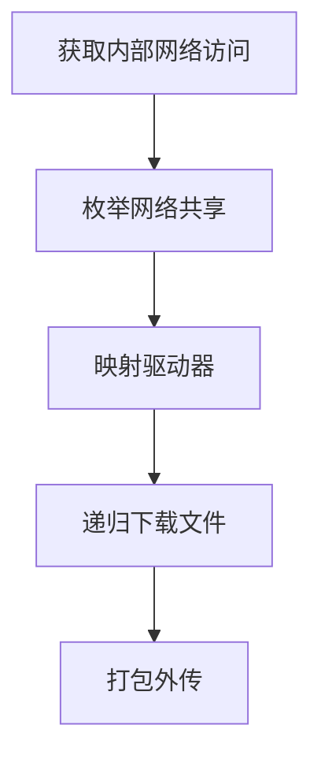

# 网络共享数据 (T1039)

## 一句话通俗理解

攻击者访问你们公司内部共享文件夹（就像部门公用的网盘），把里面的文件全部下载走。

## 难度等级

⭐⭐ 中级（需要一定基础）

## 技术描述

网络共享数据收集（T1039）是MITRE ATT&CK框架中收集战术的一种技术。

**通俗解释：**
公司内部通常会有"共享文件夹"——员工可以访问的公共存储空间，用来存放团队文档、项目资料、备份文件等。攻击者在渗透进公司内部网络后，会像员工一样访问这些共享文件夹，把里面的文档、表格、数据库备份全部复制到自己的机器上。这些共享文件夹往往包含公司最核心的数据资产。

**技术原理：**

1. **发现共享资源**：攻击者使用网络发现命令（如`net view`）枚举网络中的所有可用共享
2. **映射网络驱动器**：通过`net use`命令将网络共享映射为本地驱动器（如Z盘）
3. **递归枚举文件**：使用`dir /s`或`Get-ChildItem -Recurse`遍历共享中的所有目录
4. **批量复制文件**：使用`robocopy`、`xcopy`等工具将文件批量复制到本地系统
5. **压缩外传**：将收集的文件打包压缩后通过C2通道传输

**用途与影响：**
网络共享是企业的数据金矿——财务数据、客户信息、产品设计、源代码备份、运维脚本等往往都存在共享服务器上。攻击者从共享中收集的数据可用于勒索、间谍活动或身份盗窃。

## 子技术列表

该技术没有子技术。

## 攻击流程

### 典型攻击流程

```
获取内部网络访问 --> 枚举网络共享 --> 映射驱动器 --> 递归下载文件 --> 打包外传
```



**步骤详解：**

1. **获取内部网络访问**
   - 通俗描述：攻击者通过VPN、钓鱼邮件或漏洞进入公司内网
   - 技术细节：获得一个内部IP地址，能与其他内网系统通信
   - 常用工具：Cobalt Strike、VPN、SSH隧道

2. **枚举网络共享**
   - 通俗描述：查看内网上有哪些共享文件夹可以访问
   - 技术细节：使用`net view \\<server>`查询指定服务器上的共享资源
   - 常用工具：`net view`、`net share`、SMB扫描器

3. **映射驱动器**
   - 通俗描述：把远程共享文件夹映射成自己电脑上的一个盘符
   - 技术细节：使用`net use Z: \\server\share [密码] /user:[用户名]`建立SMB会话
   - 常用工具：`net use`、`New-PSDrive`

4. **递归下载文件**
   - 通俗描述：像翻文件夹一样一层层打开所有目录，把所有文件复制过来
   - 技术细节：使用`robocopy \\server\share C:\temp /E /COPY:DAT`递归复制
   - 常用工具：`robocopy`、`xcopy`、`Copy-Item -Recurse`

5. **打包外传**
   - 通俗描述：把下载的文件压缩加密后发送给攻击者
   - 技术细节：使用7-Zip创建加密的ZIP压缩包，通过HTTPS上传
   - 常用工具：7-Zip、rclone、WinSCP

## 真实案例

### 案例1：Ryuk勒索软件 - 网络共享数据勒索（2019-2021）

- **时间**: 2019年-2021年
- **目标**: 全球医疗、制造、教育行业企业
- **攻击组织**: Ryuk勒索软件团伙（Wizard Spider关联）
- **手法**: Ryuk在加密受害者文件前，先使用`net view /domain`枚举域中的所有服务器和共享资源。攻击者通过`net use`将发现的共享映射为本地驱动器，使用`robocopy \\file-server\share$ C:\temp\stolen /E`递归复制所有文件。Ryuk特别关注财务部门的共享目录（"Finance"、"Accounting"、"Invoices"）和数据库备份文件。收集的数据被用于评估受害组织的财务价值和谈判上限，加密后勒索赎金高达数百万美元。
- **影响**: 多家医院在疫情期间因勒索攻击瘫痪，被迫取消手术和急诊服务
- **参考链接**: [Ryuk Ransomware Analysis - CrowdStrike](https://www.crowdstrike.com/blog/ryuk-ransomware-analysis/)

### 案例2：Maze勒索软件 - NAS设备数据收集（2019-2021）

- **时间**: 2019年-2021年
- **目标**: 全球法律、会计、建筑行业企业
- **攻击组织**: Maze勒索软件团伙
- **手法**: Maze在入侵企业后，扫描内部网络（192.168.x.x和10.x.x.x）中开放445端口（SMB端口）的系统。攻击者使用窃取的域管理员凭据挂载发现的Synology和QNAP NAS设备的SMB共享。Maze的收集脚本递归遍历NAS中的所有子目录，特别关注包含"合同"、"客户"、"项目"、"财务报表"等关键词的文件夹。收集的工程设计文件、合同文档和客户数据被压缩加密后上传至攻击者控制的服务器。Maze使用"不付钱就公开数据"的策略迫使受害者支付赎金。
- **影响**: Maze是首个采用"双重勒索"（加密+数据泄露）策略的勒索软件家族
- **参考链接**: [Maze Ransomware - MITRE ATT&CK](https://attack.mitre.org/software/S0530/)

### 案例3：APT29/Nobelium - SolarWinds后的网络共享收集（2020-2021）

- **时间**: 2020年-2021年
- **目标**: 美国政府机构、IT企业、智库
- **攻击组织**: APT29 (Cozy Bear / Nobelium，俄罗斯背景)
- **手法**: APT29在SolarWinds供应链攻击后，使用Cobalt Strike的SMB扫描模块发现内部文件服务器的共享资源。攻击者使用PowerShell命令`Copy-Item -Path \\<server>\<share>\* -Destination C:\temp\staging -Recurse`批量将共享中的敏感文件复制到中间系统。APT29特别关注研发文档、项目管理文件和与SolarWinds相关的内部代码共享。收集的数据经过加密、分段压缩后逐步渗漏至攻击者C2基础设施。
- **影响**: 美国多家政府机构（包括财政部、商务部、能源部）的敏感数据被窃取
- **参考链接**: [SolarWinds Supply Chain Attack - Mandiant](https://www.mandiant.com/resources/evasive-attacker-leverages-solarwinds-supply-chain-compromises)

## 红队视角

> ⚠️ **免责声明**：以下内容仅用于合法的安全测试、渗透测试和教育目的。未经授权对他人系统进行测试是违法行为。

### 实战技巧

1. **利用SMB命名管道**
   使用`net view`命令时，如果域环境不可用，可以尝试直接查询已知服务器：`net view \\fileserver`、`net view \\nas-01`。配合常用的共享名称（`share$`、`docs`、`data`、`backup`）进行枚举。

2. **绕过访问限制**
   如果当前用户没有权限访问某个共享，尝试使用窃取的其他凭据：`net use \\server\share /user:DOMAIN\admin Password123`。使用不同的凭据挂载共享是常见的横向移动技术。

3. **隐蔽复制技巧**
   使用`robocopy`时添加`/R:0 /W:0`参数禁用重试和等待，减少操作时间；使用`/XJ`参数跳过目录连接点，避免无限循环。

### 常用工具

| 工具名称 | 用途 | 平台 | 链接 |
|----------|------|------|------|
| net view | 枚举网络共享资源 | Windows | 系统内置 |
| robocopy | 多线程批量文件复制 | Windows | 系统内置 |
| SMBExec | 通过SMB执行命令和文件操作 | Linux | https://github.com/byt3bl33d3r/CrackMapExec |
| smbclient | Linux下访问SMB共享 | Linux | 系统内置 |

### 注意事项

- SMB流量在大型网络环境中可能会被IDS/IPS检测，特别是大量的文件枚举和复制操作
- 现代Windows环境可能启用SMB签名（SMB Signing），阻止未经签名的SMB会话
- 枚举共享时可能触发Windows Event ID 5140/5145告警，需要评估被检测的风险

## 蓝队视角

### 检测要点

1. **异常的SMB枚举行为**
   - 日志来源：Windows Event ID 5140（文件共享被访问）
   - 关注字段：源IP地址、目标共享路径
   - 异常特征：同一源IP在短时间内访问多个不同服务器上的共享资源

2. **批量文件复制操作**
   - 日志来源：Windows Event ID 5145（网络共享访问检查）
   - 关注字段：访问数量、文件类型
   - 异常特征：短时间内从共享驱动器批量读取大量文件

3. **异常的net use/net view使用**
   - 日志来源：Sysmon Event ID 1（进程创建）
   - 关注字段：命令行参数
   - 异常特征：非IT管理员用户的`net view \\`、`net use \\`命令执行

### 监控建议

- 配置文件服务器审计策略，监控批量文件访问事件
- 在SIEM中建立SMB异常行为基线，标记偏离正常模式的共享访问
- 监控`robocopy`、`xcopy`等批量复制工具的非预期使用

## 检测建议

### 网络层检测

**检测方法：** 监控SMB协议中的批量文件读取操作。

**具体规则/命令示例：**
```bash
# Zeek SMB日志分析 - 检测大量文件访问
cat smb_files.log | zeek-cut ts uid name action size | grep -E "SMB::FILE_READ" | wc -l
# 短时间内大量SMB文件读取应触发告警
```

**示例（Suricata/IDS规则）：**
```
# 检测SMB共享文件批量读取 - 大量SMB READ请求
alert tcp $HOME_NET any -> $HOME_NET 445 (
    msg:"T1039 - 网络共享数据 - SMB批量文件读取";
    flow:to_server;
    content:"|ff|SMB|2e 00 00 00 00 00 00 00 00 00 00 00 00 00|";
    dsize:>200;
    threshold:type both, track by_src, count 50, seconds 60;
    sid:1003901; rev:1;
)
```

### 主机层检测

**Windows事件ID：**
- 事件ID 5140：网络共享对象被访问
- 事件ID 5145：网络共享访问检查
- 事件ID 4656：文件句柄请求（对共享中的文件）

**具体命令示例：**
```bash
# 查询5140事件（网络共享访问日志）
Get-WinEvent -FilterHashtable @{LogName='Security'; ID=5140} | 
    Where-Object { $_.Message -match '\\\\' } |
    Select-Object TimeCreated, Message
```

### 应用层检测

**Sigma规则示例：**
```yaml
title: 网络共享批量数据收集检测
status: experimental
description: 检测攻击者通过net use和PowerShell从网络共享批量收集数据
logsource:
    category: process_creation
    product: windows
detection:
    selection:
        CommandLine|contains:
            - 'net use'
            - 'net view'
            - 'robocopy'
            - 'Copy-Item'
        CommandLine|contains|all:
            - '\\\\'
            - 'Recurse'
    condition: selection
level: medium
tags:
    - attack.t1039
    - attack.collection
```

## 缓解措施

### 优先级1：关键措施

**措施名称：** 网络分段与访问控制

**具体实施步骤：**
1. 将文件服务器隔离在独立的VLAN中，限制不必要的SMB访问
2. 仅允许需要访问共享的用户/系统IP访问文件服务器
3. 在防火墙上限制SMB端口（TCP 445）的跨网段通信

### 优先级2：重要措施

**措施名称：** 最小权限原则

**具体实施步骤：**
1. 定期审计网络共享的访问权限，移除过度授权的用户
2. 对敏感共享使用基于访问的枚举（ABE），防止未授权用户看到共享名称
3. 对财务、人事等敏感部门的数据共享单独设置权限

### 优先级3：建议措施

**措施名称：** 启用SMB审计和签名

**具体实施步骤：**
1. 在文件服务器上启用SMB审计策略
2. 配置SMB签名（SMB Signing）防止SMB中继攻击
3. 对敏感共享启用SMB加密

### MITRE ATT&CK 缓解措施映射

| 缓解措施ID | 缓解措施名称 | 适用性 | 说明 |
|------------|-------------|--------|------|
| M0935 | 网络分段 | 适用 | 限制SMB跨网段通信 |
| M0929 | 最小权限原则 | 适用 | 限制共享访问权限 |
| M0941 | SMB签名 | 适用 | 防止SMB中继攻击 |

## 动手实验

> ⚠️ **重要提示**：所有实验必须在隔离的实验室环境中进行，禁止对未授权的真实系统进行测试。

### 实验环境准备

**推荐靶场/实验平台：**

| 平台名称 | 类型 | 难度 | 链接 |
|----------|------|------|------|
| Hack The Box | 渗透测试靶场 | 中级 | https://www.hackthebox.com/ |

**所需工具：**
- Windows Server虚拟机（作为文件服务器）
- Windows客户端虚拟机
- PowerShell

### 实验1：模拟网络共享枚举与收集（初级）

**实验目标：** 模拟攻击者从网络共享中收集文件

**实验步骤：**
1. 在Windows Server虚拟机上创建一个共享文件夹，放入一些测试文件
2. 从客户端虚拟机执行以下命令：
   ```cmd
   net view \\SERVER-NAME
   net use Z: \\SERVER-NAME\SharedDocs
   dir Z: /s
   robocopy Z: C:\temp\collected /E
   ```
3. 在文件服务器上查看安全日志中的5140事件

**预期结果：** 成功从客户端访问服务器共享并复制文件

**学习要点：** 理解攻击者如何通过网络共享窃取企业内部数据

## 术语解释

| 术语 | 英文原名 | 通俗解释 |
|------|----------|----------|
| SMB | Server Message Block | Windows文件共享协议，就像网络版的"文件复制粘贴"协议 |
| NAS | Network Attached Storage | 网络附加存储设备，一种专门提供文件共享服务的硬件 |
| 共享 | Network Share | 网络上的一个可以公开或授权访问的文件夹 |
| 映射驱动器 | Map Network Drive | 把网络上的共享文件夹虚拟成一个本地盘符 |
| 枚举 | Enumeration | 挨个列出所有可用的资源，就像查看菜单上的所有菜品 |

## 参考资料

### 官方文档

- [MITRE ATT&CK - T1039](https://attack.mitre.org/techniques/T1039/)

### 安全报告

- [Ryuk Ransomware Analysis - CrowdStrike](https://www.crowdstrike.com/blog/ryuk-ransomware-analysis/)
- [Maze Ransomware Analysis - MITRE ATT&CK](https://attack.mitre.org/software/S0530/)
- [SolarWinds Supply Chain Attack - Mandiant](https://www.mandiant.com/resources/evasive-attacker-leverages-solarwinds-supply-chain-compromises)

### 工具与资源

- [SMB安全配置指南 - Microsoft](https://docs.microsoft.com/en-us/windows-server/storage/file-server/file-server-smb-overview)
- [CrackMapExec](https://github.com/byt3bl33d3r/CrackMapExec) - SMB网络枚举工具
