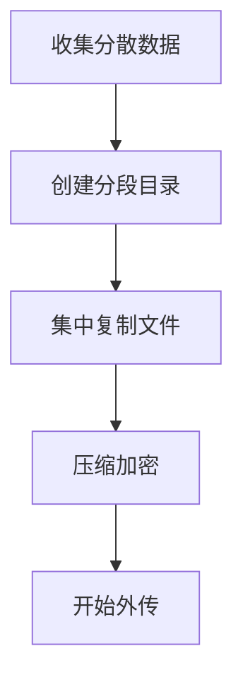

# 数据分段 (T1074)

## 一句话通俗理解

攻击者把从各个地方偷来的文件先集中放到一个临时地方，就像搬家前把所有东西堆在客厅再统一打包。

## 难度等级

⭐ 初级（新手可学）

## 技术描述

数据分段（T1074）是MITRE ATT&CK框架中收集战术的一种技术。

**通俗解释：**
想象一下你从房间的各个角落收集要搬走的物品——书桌上的文件、抽屉里的资料、床底下的箱子——你会先把它们都堆到客厅地板上，再统一装进纸箱。攻击者也是这么做的：他们从多个位置（本地磁盘、网络共享、邮件系统）收集到数据后，先集中复制到同一个临时目录，再进行压缩、加密和传输。这个"先集中再处理"的过程就是数据分段。

**技术原理：**

1. **数据汇聚**：将分散在不同目录、不同驱动器甚至不同主机上的敏感文件，全部复制到一个统一的位置
2. **分段存储**：根据文件类型或来源进行分类存放，便于后续处理
3. **暂存管理**：在临时目录中维护文件列表，确保所有需要外传的数据都在
4. **预处理**：在分段位置完成文件重命名、格式转换等准备工作

**用途与影响：**
数据分段本身不直接造成数据泄露，但它是数据窃取的"传送带"——没有分段，攻击者就很难高效地组织和传输大量数据。分段操作留下的临时文件是取证分析的重要线索。

## 子技术列表

**该技术共有 2 个子技术：**

| 子技术ID | 中文名称 | 通俗解释 |
|----------|----------|----------|
| T1074.001 | 本地数据分段 | 在本地文件系统创建临时目录，把数据集中存放在本地 |
| T1074.002 | 远程数据分段 | 在远程系统或网络共享上创建分段目录，跨主机集中数据 |

<details>
<summary><strong>展开查看各子技术详细说明</strong></summary>

### T1074.001 - 本地数据分段

**通俗理解：** 在自己电脑上建一个临时文件夹，所有偷来的东西先存在这里再处理。

**详细说明：**
攻击者在本地文件系统创建隐藏的分段目录，通常选择在用户活动频繁的目录（如`%TEMP%`、`%APPDATA%`、`%PROGRAMDATA%`）中，目录名模仿系统文件夹（如"Windows Update"、"Microsoft"）以降低被发现的风险。文件按类型或优先级排序存放。

### T1074.002 - 远程数据分段

**通俗理解：** 在内网的另一台服务器上建一个中转站，把各处的数据集中到那里。

**详细说明：**
攻击者在远程系统或网络共享上创建分段目录，用于跨主机集中收集的数据。这种方式可以绕过本地磁盘空间限制，也能在多个系统间分散操作痕迹。常用的远程分段位置包括可写的网络共享、中间跳板机（Jump Box）等。

</details>

## 攻击流程

### 典型攻击流程

```
收集分散数据 --> 创建分段目录 --> 集中复制文件 --> 压缩加密 --> 开始外传
```



**步骤详解：**

1. **收集分散数据**
   - 通俗描述：从各个系统和目录中找到的敏感文件
   - 技术细节：从本地磁盘、共享驱动器、数据库服务器等处枚举文件
   - 常用工具：PowerShell、find、dir

2. **创建分段目录**
   - 通俗描述：在选定位置建立一个用于存放文件的"临时仓库"
   - 技术细节：在`%TEMP%`或网络共享上创建隐藏目录，名称伪装成系统文件夹
   - 常用工具：`mkdir`、`New-Item`

3. **集中复制文件**
   - 通俗描述：把分散各处的文件统一复制到分段目录
   - 技术细节：使用`xcopy`、`robocopy`、`Copy-Item`将文件从源位置复制到分段目录
   - 常用工具：`robocopy`、`xcopy`、`Copy-Item`

4. **压缩加密**
   - 通俗描述：把分段目录中的文件打包压缩，方便传输
   - 技术细节：使用7-Zip创建加密压缩包，或自定义打包工具
   - 常用工具：7-Zip、WinRAR、`Compress-Archive`

5. **开始外传**
   - 通俗描述：把压缩包通过网络发送出去
   - 技术细节：通过HTTPS、FTP或云存储API上传到攻击者控制的位置
   - 常用工具：rclone、cURL、PowerShell

## 真实案例

### 案例1：INC勒索软件 - 使用S3分段中转数据（2026年2月）

- **时间**: 2026年2月
- **目标**: 企业基础设施
- **攻击组织**: INC勒索软件附属组织
- **手法**: Huntress SOC分析发现，INC勒索攻击者在入侵后通过PSEXEC横向移动到文件服务器，创建计划任务"Recovery Diagnostics"执行PowerShell脚本。该脚本将网络共享映射为F盘，使用`restic`备份工具（一种开源备份软件）配合AWS S3凭证，将分段收集的数据直接备份到攻击者控制的Wasabi云存储中。攻击者设置了环境变量`RESTIC_REPOSITORY='s3:s3.wasabisys.com/[REDACTED]'`，实现了远程数据分段和直接外传的一体化操作。
- **影响**: 受害者的文件服务器数据在被加密前已被完整备份到攻击者控制的云存储
- **参考链接**: [INC Ransomware Data Exfiltration - Huntress 2026](https://www.huntress.com/blog/data-exfiltration-threat-actor-infrastructure-exposed)

### 案例2：FIN7 - 本地数据分段用于支付卡数据（2017-2020）

- **时间**: 2017年-2020年
- **目标**: 全球零售、餐饮、酒店行业
- **攻击组织**: FIN7（Carbanak关联组织）
- **手法**: FIN7将窃取的支付卡数据（PCI数据）从POS终端和内存抓取工具中提取后，在本地创建隐藏分段目录（如`C:\ProgramData\Microsoft\DeviceSync\`），将所有收集的数据集中存放。分段目录使用系统隐藏属性，文件名模仿系统DLL命名风格（如`ntdll_data.bin`）以逃避手动检查。数据聚集到一定规模后（通常累积到几百MB），FIN7使用自定义打包工具进行加密和压缩，再通过HTTP上传至C2服务器。
- **影响**: 数亿张支付卡信息被盗，造成数十亿美元损失
- **参考链接**: [FIN7 Operations - MITRE](https://attack.mitre.org/groups/G0046/)

### 案例3：Carbanak - 远程数据分段（2013-2018）

- **时间**: 2013年-2018年
- **目标**: 全球银行和金融机构
- **攻击组织**: Carbanak（又名Anunak）
- **手法**: Carbanak组织在入侵银行网络后，使用远程数据分段策略将多台受感染服务器上的数据库导出文件和日志集中到一台中间服务器上。攻击者首先在各分支机构的受感染系统上自动收集数据并存储到本地分段目录（Local Data Staging），然后通过SMB或FTP将数据累计发送到网络中的跳板机（Remote Data Staging），统一进行压缩和加密后经C2通道外传。该策略显著减少了直接外传出网的流量特征，任何一台机器上都不会有完整的待传输数据集。
- **影响**: 全球超过100家银行被盗，总损失超过10亿欧元
- **参考链接**: [Carbanak APT Analysis - Kaspersky](https://www.kaspersky.com/blog/carbanak-apt/)

## 红队视角

> ⚠️ **免责声明**：以下内容仅用于合法的安全测试、渗透测试和教育目的。未经授权对他人系统进行测试是违法行为。

### 实战技巧

1. **选择合适的分段位置**
   `%TEMP%`虽然常用但容易被监控。更好的选择是`%LOCALAPPDATA%\Microsoft\WindowsApps\`或`%PROGRAMDATA%\Microsoft\Crypto\`等目录中创建子目录，因为系统进程的正常活动也会访问这些目录。

2. **文件命名伪装**
   将分段目录中的文件命名为常见的系统文件名（如`ntoskrnl.exe.bin`、`drivers.sys.cache`），或使用随机扩展名（`.tmp`、`.cache`）混入正常的临时文件中。

3. **分片存储降低风险**
   不要在单个分段目录中存放所有数据。将数据分散在多个位置（如`%TEMP%`中放一部分，`%APPDATA%`中放一部分），降低被一锅端的风险。

### 常用工具

| 工具名称 | 用途 | 平台 | 链接 |
|----------|------|------|------|
| robocopy | 多线程文件复制 | Windows | 系统内置 |
| restic | 加密备份到云存储 | 跨平台 | https://restic.net/ |
| rclone | 云存储同步 | 跨平台 | https://rclone.org/ |

### 注意事项

- 分段目录中的数据安全性取决于目录权限——其他用户或进程可能发现这些文件
- 数据在分段目录中停留的时间越长，被检测到的风险越高
- 分段操作会产生大量的文件系统I/O，是EDR检测的重要特征

## 蓝队视角

### 检测要点

1. **异常目录中的批量文件创建**
   - 日志来源：Sysmon Event ID 11（文件创建）
   - 关注字段：目标目录路径
   - 异常特征：`%TEMP%`、`%APPDATA%`等目录中短时间内出现大量文件

2. **隐藏目录创建**
   - 日志来源：Sysmon Event ID 11（文件创建）
   - 关注字段：目录属性（隐藏、系统）
   - 异常特征：非系统进程创建了具有隐藏或系统属性的新目录

3. **跨主机的文件集中复制**
   - 日志来源：Windows Event ID 5140/5145
   - 关注字段：源IP、目标共享
   - 异常特征：多台主机向同一共享目录复制文件

### 监控建议

- 监控文件系统中大量文件被复制到单一目录的行为
- 对`%TEMP%`、`%APPDATA%`、`%PROGRAMDATA%`等目录设置文件创建告警
- 监控`robocopy`、`xcopy`等批量复制工具的使用

## 检测建议

### 网络层检测

**网络流量特征：**
- 监控短时间内大量数据传输到同一目标IP的行为（C2分段服务器）
- 检测非标准端口上的大流量数据传输（如高端口上的大量出站数据）
- 监控SMB/CIFS协议中的批量文件复制操作（跨网络的大规模文件移动）
- 检测ICMP隧道或DNS隧道等隐蔽数据传输方式

**具体命令示例：**
```bash
# 检测到单个目标IP的异常大流量出站连接数
Get-NetTCPConnection | Where-Object { $_.State -eq 'Established' } | Group-Object RemoteAddress | Where-Object { $_.Count -gt 20 } | Sort-Object Count -Descending
```

**示例（Suricata/IDS规则）：**
```
# 检测数据分段上传 - 单目标IP的大量并发连接
alert tcp $HOME_NET any -> $EXTERNAL_NET $HTTP_PORTS (
    msg:"T1074 - 数据分段 - 单目标大量并发出站连接";
    flow:to_server;
    content:"POST";
    http_method;
    dsize:>1000000;
    threshold:type both, track by_src, count 10, seconds 60;
    sid:1007401; rev:1;
)
```

### 主机层检测

**Windows事件ID：**
- Sysmon Event ID 11：文件创建（检测分段目录的创建和文件写入）
- Sysmon Event ID 1：进程创建（检测robocopy、xcopy的执行）
- 事件ID 4656：文件句柄请求

**具体命令示例：**
```bash
# 检测TEMP目录中短时间内的大量文件创建
Get-WinEvent -FilterHashtable @{LogName='Microsoft-Windows-Sysmon/Operational'; ID=11} |
    Where-Object { $_.Message -match 'C:\\\\Users.*\\\\AppData\\\\Local\\\\Temp' } |
    Group-Object { $_.TimeCreated.ToString("yyyy-MM-dd HH:mm") } |
    Where-Object { $_.Count -gt 50 }
```

### 应用层检测

**Sigma规则示例：**
```yaml
title: 数据分段-临时目录批量文件创建检测
status: experimental
description: 检测在临时目录中批量创建文件的行为，可能为数据分段
logsource:
    category: file_event
    product: windows
detection:
    selection:
        TargetFilename|contains:
            - '\AppData\Local\Temp\'
            - '\AppData\Roaming\'
        Image|endswith:
            - '\powershell.exe'
            - '\cmd.exe'
            - '\explorer.exe'
    condition: selection | count() > 20 by Image within 5m
level: medium
tags:
    - attack.t1074
    - attack.t1074.001
```

## 缓解措施

### 优先级1：关键措施

**措施名称：** 文件系统审计和监控

**具体实施步骤：**
1. 启用Windows文件系统审计策略，监控关键目录的文件创建活动
2. 部署EDR检测临时目录和隐藏目录中的异常文件批量操作
3. 对文件服务器的写入权限实施严格管控

### 优先级2：重要措施

**措施名称：** 限制临时目录的使用

**具体实施步骤：**
1. 通过组策略限制普通用户在`%TEMP%`中创建大量文件
2. 设置磁盘配额限制临时目录的最大使用空间
3. 定期清理临时目录中的文件

### 优先级3：建议措施

**措施名称：** 网络共享写入权限管控

**具体实施步骤：**
1. 限制网络共享的匿名写入权限
2. 对跨主机的文件复制行为设置告警
3. 实施DLP策略，监控敏感文件向非授权目录的移动

### MITRE ATT&CK 缓解措施映射

| 缓解措施ID | 缓解措施名称 | 适用性 | 说明 |
|------------|-------------|--------|------|
| M0940 | 文件完整性监控 | 适用 | 监控敏感目录的文件创建 |
| M0929 | 最小权限原则 | 适用 | 限制目录写入权限 |
| M0948 | 数据丢失防护 | 部分适用 | DLP可监控文件集中复制行为 |

## 动手实验

> ⚠️ **重要提示**：所有实验必须在隔离的实验室环境中进行，禁止对未授权的真实系统进行测试。

### 实验环境准备

**所需工具：**
- Windows虚拟机
- PowerShell

### 实验1：模拟数据分段操作（初级）

**实验目标：** 手动模拟攻击者的数据分段操作

**实验步骤：**
1. 在Windows虚拟机中创建模拟敏感文件
2. 创建隐藏分段目录：
   ```powershell
   $stagingDir = "$env:LOCALAPPDATA\Microsoft\WindowsApps\cache"
   New-Item -Path $stagingDir -ItemType Directory -Hidden
   ```
3. 复制文件到分段目录：
   ```powershell
   Copy-Item -Path C:\Users\*.docx -Destination $stagingDir -Recurse
   Copy-Item -Path C:\Users\*.xlsx -Destination $stagingDir
   ```
4. 使用`dir /a`查看隐藏目录内容

**预期结果：** 成功创建隐藏目录并将文件复制到其中

**学习要点：** 理解攻击者如何使用隐藏目录集中管理窃取的文件

## 术语解释

| 术语 | 英文原名 | 通俗解释 |
|------|----------|----------|
| 分段 | Staging | 把分散的东西集中到一处暂时存放的过程 |
| 跳板机 | Jump Box / Jump Host | 网络中的中间服务器，攻击者通过它跳转到其他系统 |
| 暂存区 | Staging Directory | 临时存放文件的目录，相当于快递中转站 |
| I/O特征 | I/O Pattern | 文件输入/输出操作的模式，如短时间内大量读写 |

## 参考资料

### 官方文档

- [MITRE ATT&CK - T1074](https://attack.mitre.org/techniques/T1074/)
- [MITRE ATT&CK - T1074.001](https://attack.mitre.org/techniques/T1074/001/)
- [MITRE ATT&CK - T1074.002](https://attack.mitre.org/techniques/T1074/002/)

### 安全报告

- [INC Ransomware Analysis - Huntress 2026](https://www.huntress.com/blog/data-exfiltration-threat-actor-infrastructure-exposed)
- [Carbanak APT Analysis - Kaspersky](https://www.kaspersky.com/blog/carbanak-apt/)
- [FIN7 Group Analysis - MITRE](https://attack.mitre.org/groups/G0046/)

### 工具与资源

- [Sysinternals Suite](https://docs.microsoft.com/en-us/sysinternals/downloads/sysinternals-suite)
- [restic backup](https://restic.net/) - 加密备份工具
