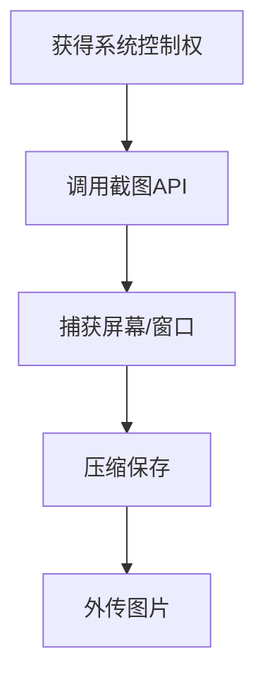

# 屏幕捕获 (T1113)

## 一句话通俗理解

攻击者偷偷给你的电脑屏幕截图或录像，就像有人在你背后偷偷拍下你电脑上显示的内容。

## 30秒速查卡

| 维度 | 你需要知道的 |
|------|-------------|
| 这是什么？ | 攻击者偷偷给你的电脑屏幕截图或录像，就像有人在你背后偷偷拍下你电脑上显示的内容。 |
| 为什么危险？ | 屏幕捕获让攻击者能够"亲眼看到"受害者屏幕上的内容，绕过所有基于文本的监控措施。即使数据在显示时被加密（如只读网页），截 |
| 谁需要关心？ | 数据安全团队、SOC分析师 |
| 你的第一步防御 | GDI API异常调用 |
| 如果只做一件事 | 想象一下你正在电脑上处理机密文件，而桌面上有一个你看不见的"间谍"在不断地按截屏键——你看到的每一个 |

## 难度等级

⭐⭐ 中级（需要一定基础）

## 技术描述

屏幕捕获（T1113）是MITRE ATT&CK框架中收集战术的一种技术。

**通俗解释：**
想象一下你正在电脑上处理机密文件，而桌面上有一个你看不见的"间谍"在不断地按截屏键——你看到的每一个页面、输入的每一行字都被拍了下来。这就是屏幕捕获攻击：攻击者通过恶意软件在后台偷偷截取你的屏幕内容，把截获的图片传回给攻击者。无论是你正在查看的内部系统、即时通讯聊天记录还是邮件内容，都能被完整记录下来。

**技术原理：**

1. **调用系统截图API**：在Windows上通过`BitBlt`和`GetDC`获取设备上下文的像素数据，在macOS上使用`CGDisplay`系列API，在Linux上使用`XGetImage`
2. **捕获桌面图像**：获取整个桌面或特定窗口的位图数据
3. **压缩编码**：将原始位图数据压缩为JPEG或PNG格式以减少大小
4. **存储或传输**：将截图保存到本地文件或直接通过网络发送

**用途与影响：**
屏幕捕获让攻击者能够"亲眼看到"受害者屏幕上的内容，绕过所有基于文本的监控措施。即使数据在显示时被加密（如只读网页），截图仍然能捕获显示的内容。勒索软件使用屏幕捕获了解受害者的网络拓扑和管理控制台。

## 子技术列表

该技术没有子技术。

## 攻击流程

### 典型攻击流程

```
获得系统控制权 --> 调用截图API --> 捕获屏幕/窗口 --> 压缩保存 --> 外传图片
```



**步骤详解：**

1. **获得系统控制权**
   - 通俗描述：攻击者通过远程控制木马控制了你的电脑
   - 技术细节：在受感染系统上部署了后门或RAT（远程访问木马）
   - 常用工具：Cobalt Strike、Meterpreter、DarkComet

2. **调用截图API**
   - 通俗描述：恶意软件调用Windows的截图功能
   - 技术细节：调用`BitBlt`、`GetDC`、`CreateCompatibleDC`等GDI API获取屏幕图像数据
   - 常用工具：Windows GDI API、`CaptureScreen`库

3. **捕获屏幕/窗口**
   - 通俗描述：截取整个桌面或特定程序窗口的画面
   - 技术细节：支持全屏捕获、活动窗口捕获、选定区域捕获
   - 常用工具：`PrintWindow`、`Desktop Duplication API`

4. **压缩保存**
   - 通俗描述：把截取的图片压缩成JPEG格式，减小文件大小
   - 技术细节：使用JPEG编码压缩，质量设为50%-70%平衡大小和可读性
   - 常用工具：GDI+、`System.Drawing.Imaging`

5. **外传图片**
   - 通俗描述：把压缩的图片通过网络发送给攻击者
   - 技术细节：通过HTTPS加密通道传输，或将图片隐藏在HTTP请求中
   - 常用工具：HTTP POST、DNS隧道

## 真实案例

### 案例1：SolarMarker后门 - 定期间隔截屏（2024-2025）

- **时间**: 2024年-2025年
- **目标**: 美国律师事务所、金融机构
- **攻击组织**: SolarMarker（又名Deimos）后门
- **手法**: SolarMarker是一种.NET编写的后门恶意软件，包含定时屏幕捕获功能。攻击者通过C2配置截屏间隔（通常为30-60秒），受感染系统上的后门模块调用`.NET`的`System.Drawing.Graphics.CopyFromScreen`方法捕获当前桌面内容。截取的屏幕以JPEG格式编码后，通过HTTPS POST请求发送到C2服务器。SolarMarker的屏幕捕获模块特别设计为在用户空闲时执行（通过检测`GetLastInputInfo`），以减少被用户发现的可能性。
- **影响**: 多家企业的敏感文档和系统截图被窃取
- **参考链接**: [SolarMarker Backdoor Analysis - Red Canary](https://redcanary.com/blog/solarmarker/)

### 案例2：DarkHotel - Phantom RAT屏幕监控（2014-2018）

- **时间**: 2014年-2018年
- **目标**: 亚太地区企业高管、政府官员
- **攻击组织**: DarkHotel（APT组织）
- **手法**: DarkHotel使用名为"Phantom"的远程访问工具（RAT）进行屏幕监控。该RAT支持全屏捕获、活动窗口捕获和选定区域三种截图模式。攻击者可以按预设间隔自动捕获屏幕（每5-60秒），并通过加密通道回传。DarkHotel还将屏幕捕获与键盘记录结合使用，完整记录受害者的操作行为，从中提取有价值的情报。该组织特别关注目标用户查看涉密文档时的屏幕画面。
- **影响**: 大量亚太地区高价值目标的情报被窃取
- **参考链接**: [DarkHotel APT - MITRE](https://attack.mitre.org/groups/G0019/)

### 案例3：Lazarus - 加密货币交易屏幕实时监控（2017-2023）

- **时间**: 2017年-2023年
- **目标**: 全球金融机构、加密货币交易所
- **攻击组织**: Lazarus Group（Hidden Cobra）
- **手法**: Lazarus在AppleJeus行动中使用自定义屏幕捕获模块`jsscreen.dll`定时捕获屏幕截图。在针对加密货币交易所的攻击中，攻击者使用`BitBlt` API捕获交易界面和钱包管理界面的截图。Lazarus还利用VNC远程桌面的截图功能实时捕获受害者屏幕，了解受害者的操作流程和账户信息。捕获的交易界面截图被攻击者用于分析交易流程、API密钥位置和钱包地址。
- **影响**: 加密货币交易所损失了数亿美元的数字资产
- **参考链接**: [Lazarus AppleJeus - Welivesecurity](https://www.welivesecurity.com/2020/04/06/lazarus-human-operator.html)

## 红队视角

> ⚠️ **免责声明**：以下内容仅用于合法的安全测试、渗透测试和教育目的。未经授权对他人系统进行测试是违法行为。

### 实战技巧

1. **使用PowerShell实现无文件截屏**
   使用.NET的`System.Drawing`和`System.Windows.Forms`命名空间在内存中完成截屏，无需额外工具：
   ```powershell
   Add-Type -AssemblyName System.Drawing
   $bounds = [System.Windows.Forms.Screen]::PrimaryScreen.Bounds
   $bmp = New-Object System.Drawing.Bitmap $bounds.Width, $bounds.Height
   $graphics = [System.Drawing.Graphics]::FromImage($bmp)
   $graphics.CopyFromScreen($bounds.Location, [System.Drawing.Point]::Empty, $bounds.Size)
   $bmp.Save("$env:TEMP\screen.jpg", [System.Drawing.Imaging.ImageFormat]::Jpeg)
   ```

2. **选择性截图减少风险**
   只截取特定窗口的客户区域，避免全屏截图产生大量无关数据。使用`GetForegroundWindow`和`PrintWindow`只捕获活动窗口。

3. **利用Windows Desktop Duplication API**
   Windows 8+提供的Desktop Duplication API比传统的`BitBlt`更高效，也支持捕获硬件加速的DirectX内容，但需要管理员权限。

### 常用工具

| 工具名称 | 用途 | 平台 | 链接 |
|----------|------|------|------|
| PowerShell | 通过.NET实现无文件截屏 | Windows | 系统内置 |
| Cobalt Strike | 渗透测试框架，内置screenshot命令 | 跨平台 | https://www.cobaltstrike.com/ |
| Metasploit | 渗透测试框架，内置screenshot模块 | 跨平台 | https://www.metasploit.com/ |

### 注意事项

- 截屏操作会产生明显的GPU/CPU使用率变化，EDR可以检测到
- 现代Windows可以通过组策略禁止非交互式服务的屏幕捕获
- 在RDP会话中执行截屏可能被服务器端的组策略限制

## 蓝队视角

### 检测要点

1. **GDI API异常调用**
   - 日志来源：Sysmon、EDR API监控
   - 关注字段：`BitBlt`、`GetDC`、`CreateDC` API的调用
   - 异常特征：非预期进程调用屏幕捕获相关的GDI API组合

2. **桌面复制API使用**
   - 日志来源：EDR行为监控
   - 关注字段：`DXGIOutputDuplication`接口的使用
   - 异常特征：后台服务或非用户态进程使用Desktop Duplication API

3. **屏幕分辨率和显示设置异常查询**
   - 日志来源：API监控
   - 关注字段：`GetDeviceCaps`、`EnumDisplaySettings`
   - 异常特征：短时间内频繁查询屏幕参数

### 监控建议

- 监控`BitBlt` API在非预期进程中的调用
- 检测`CopyFromScreen`方法在PowerShell脚本中的使用
- 对非交互式会话中出现的屏幕分辨率查询行为进行告警

## 检测建议

### 网络层检测

**网络流量特征：**
- 监控RDP会话中的屏幕抓取行为：检测`udrd.dll`（RDP屏幕捕获DLL）加载对应的网络连接
- 检测VNC协议流量（端口5900+）的特征指纹
- 监控远程桌面会话期间的异常高带宽出站流量（图像数据传输）
- 检测第三方远程控制工具（TeamViewer、AnyDesk、Splashtop）在非预期时段的流量

**具体命令示例：**
```bash
# 检测VNC服务的监听端口
Get-NetTCPConnection -LocalPort 5900,5901,5902 -State Listen 2>$null

# 检测RDP会话中的大量图像数据传输
Get-NetTCPConnection | Where-Object { $_.RemotePort -eq 3389 -and $_.State -eq 'Established' }
```

**示例（Suricata/IDS规则）：**
```
# 检测RDP会话中截屏数据外传 - RDP图像数据传输异常
alert tcp $HOME_NET any -> $EXTERNAL_NET 3389 (
    msg:"T1113 - 屏幕捕获 - RDP会话图像数据异常出站";
    flow:to_server;
    dsize:>500000;
    threshold:type both, track by_src, count 5, seconds 60;
    sid:1011301; rev:1;
)
```

### 主机层检测

**Windows事件ID：**
- Sysmon Event ID 1：进程创建（检测截屏工具的执行）
- Sysmon Event ID 10：进程间访问（检测对桌面窗口的访问）
- Sysmon Event ID 7：DLL加载（检测GDI相关DLL的加载）

**具体命令示例：**
```bash
# 检测使用截屏API的进程
Get-Process | Where-Object { $_.Modules.ModuleName -contains 'gdi32.dll' -and $_.ProcessName -notin @('explorer','chrome','firefox') }
```

### 应用层检测

**用人话说：**

> 屏幕捕获（Screen Capture）是攻击者"看你的屏幕"的技术——定期截取受害者的桌面屏幕图像并回传给攻击者。这比文件窃取更直接：截屏能捕获屏幕上显示的所有信息，包括打开的机密文档内容、聊天记录、系统配置界面、甚至是用户正在输入的密码（如果密码不显示掩码的话）。攻击者通过调用Windows GDI API（BitBlt、CreateDC）或使用.NET的Graphics.CopyFromScreen方法进行截屏，保存为PNG/JPG后通过C2通道回传。检测方法：监控进程对BitBlt、GetDC、CreateCompatibleBitmap等GDI函数的调用、非图形图像处理软件（如cmd.exe、powershell.exe）加载GDI32.dll并频繁调用绘图API、以及$env:TEMP目录下出现大量截图文件。
>
> **避坑指南**：只监控外部RDP，忽略内网横向RDP；未启用PowerShell脚本块日志；未监控异常会话令牌使用。

**Sigma规则示例：**
```yaml
title: 屏幕捕获API调用检测
status: experimental
description: 检测非预期进程调用BitBlt进行屏幕捕获
logsource:
    category: process_creation
    product: windows
detection:
    selection:
        Image|endswith: '.exe'
        CommandLine|contains|all:
            - 'CopyFromScreen'
            - 'System.Drawing'
    condition: selection
level: high
tags:
    - attack.t1113
    - attack.collection
```

## 缓解措施

### 优先级1：关键措施

**措施名称：** 限制非交互进程的屏幕访问

**具体实施步骤：**
1. 使用Windows组策略中的"终端服务"设置，限制远程桌面会话中的屏幕捕获
2. 在敏感系统上禁用不必要的远程桌面服务
3. 对RDP连接实施网络级认证（NLA）和会话超时策略

### 优先级2：重要措施

**措施名称：** 端点检测和响应（EDR）

**具体实施步骤：**
1. 部署EDR方案监控屏幕数据的异常捕获和外传
2. 配置告警规则检测GDI截图API的异常调用模式
3. 对非交互式应用程序使用截屏API设置自动阻断

### 优先级3：建议措施

**措施名称：** 物理防护措施

**具体实施步骤：**
1. 在物理安全敏感区域使用屏幕隐私滤镜
2. 对高安全环境实施屏幕防拍摄涂层
3. 配置系统在锁屏后自动关闭显示器

### MITRE ATT&CK 缓解措施映射

| 缓解措施ID | 缓解措施名称 | 适用性 | 说明 |
|------------|-------------|--------|------|
| M0934 | 应用程序隔离 | 适用 | 限制非交互进程的屏幕访问 |
| M0938 | 远程会话限制 | 适用 | 限制RDP截屏 |
| M0929 | 最小权限原则 | 部分适用 | 限制GDI API访问 |

## 动手实验

> ⚠️ **重要提示**：所有实验必须在隔离的实验室环境中进行，禁止对未授权的真实系统进行测试。

### 实验环境准备

**所需工具：**
- Windows虚拟机
- PowerShell ISE

### 实验1：PowerShell模拟屏幕捕获（初级）

**实验目标：** 使用PowerShell调用.NET API捕获当前屏幕

**实验步骤：**
1. 在Windows虚拟机中打开PowerShell ISE（管理员）
2. 执行以下脚本捕获桌面屏幕：
   ```powershell
   Add-Type -AssemblyName System.Windows.Forms
   Add-Type -AssemblyName System.Drawing
   
   $screen = [System.Windows.Forms.Screen]::PrimaryScreen
   $bounds = $screen.Bounds
   $bmp = New-Object System.Drawing.Bitmap $bounds.Width, $bounds.Height
   $g = [System.Drawing.Graphics]::FromImage($bmp)
   $g.CopyFromScreen($bounds.X, $bounds.Y, 0, 0, $bounds.Size)
   $bmp.Save("$env:USERPROFILE\Desktop\capture.png")
   $g.Dispose()
   $bmp.Dispose()
   ```

**预期结果：** 桌面上出现名为"capture.png"的屏幕截图文件

**学习要点：** 理解攻击者如何使用系统中已存在的工具和API实现屏幕捕获

## 术语解释

| 术语 | 英文原名 | 通俗解释 |
|------|----------|----------|
| GDI | Graphics Device Interface | Windows的图形设备接口，负责在屏幕上绘制图像 |
| 位图 | Bitmap | 一种图像格式，用像素点阵描述图像，文件通常较大 |
| 设备上下文 | Device Context (DC) | Windows中用于在设备（如屏幕、打印机）上绘制的"画布" |
| RAT | Remote Access Trojan | 远程访问木马，一种让攻击者远程控制受害者电脑的恶意软件 |
| Desktop Duplication API | 桌面复制API | Windows 8+提供的捕获屏幕变化的高效率API |

## 参考资料

### 官方文档

- [MITRE ATT&CK - T1113](https://attack.mitre.org/techniques/T1113/)

### 安全报告

- [SolarMarker Backdoor Analysis - Red Canary](https://redcanary.com/blog/solarmarker/)
- [DarkHotel APT Analysis - MITRE](https://attack.mitre.org/groups/G0019/)
- [Lazarus Group AppleJeus - Welivesecurity](https://www.welivesecurity.com/2020/04/06/lazarus-human-operator.html)

### 工具与资源

- [PowerShell Screen Capture](https://docs.microsoft.com/en-us/dotnet/api/system.drawing.graphics.copyfromscreen) - .NET截图API文档
- [Desktop Duplication API](https://docs.microsoft.com/en-us/windows/win32/direct3ddxgi/desktop-dup-api) - Windows桌面复制API
