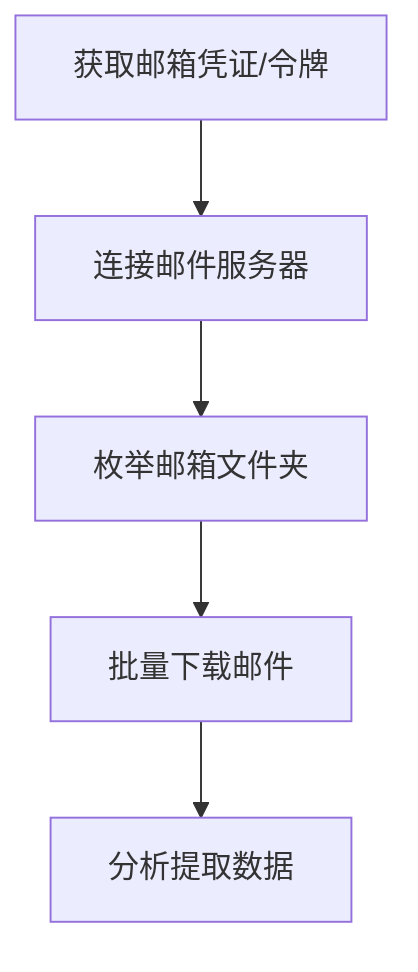

# 邮件收集 (T1114)

## 一句话通俗理解

攻击者偷看你的邮箱，就像有人把你的私人信件全部打开看了一遍。

## 30秒速查卡

| 维度 | 你需要知道的 |
|------|-------------|
| 这是什么？ | 攻击者偷看你的邮箱，就像有人把你的私人信件全部打开看了一遍。 |
| 为什么危险？ | 邮件是企业通信的核心，包含合同、内部决策、客户信息、系统密码等大量敏感内容。攻击者通过邮件收集可以：了解组织架构和人员角 |
| 谁需要关心？ | 数据安全团队、SOC分析师 |
| 你的第一步防御 | 异常的远程邮件访问 |
| 如果只做一件事 | 电子邮件就像你的"数字信箱"——工作往来、合同文件、系统通知、密码重置邮件，全都在里面 |

## 难度等级

⭐⭐ 中级（需要一定基础）

## 技术描述

邮件收集（T1114）是MITRE ATT&CK框架中收集战术的一种技术。

**通俗解释：**
电子邮件就像你的"数字信箱"——工作往来、合同文件、系统通知、密码重置邮件，全都在里面。攻击者一旦获得了你邮箱的访问权限（通过窃取密码或会话令牌），就可以像你一样登录邮箱，把收件箱里的邮件全部下载走。更隐蔽的是，他们还可以设置"自动转发"规则，把你的新邮件自动转发到攻击者的邮箱，而你完全察觉不到。

**技术原理：**

1. **本地邮件缓存访问**：读取邮件客户端（Outlook、Thunderbird）本地存储的邮件数据文件（.pst、.ost、mbox）
2. **远程邮件协议访问**：使用IMAP、POP3协议通过互联网直接连接邮件服务器下载邮件
3. **邮件API调用**：通过Microsoft Graph API、Gmail API等程序化接口批量获取邮件
4. **自动转发规则**：在邮箱设置中创建转发规则，将新邮件自动转发到攻击者控制的邮箱

**用途与影响：**
邮件是企业通信的核心，包含合同、内部决策、客户信息、系统密码等大量敏感内容。攻击者通过邮件收集可以：了解组织架构和人员角色、寻找敏感文件附件、提取密码重置邮件、监控业务往来。APT组织经常将邮件收集作为情报收集的主要手段。

## 子技术列表

**该技术共有 4 个子技术：**

| 子技术ID | 中文名称 | 通俗解释 |
|----------|----------|----------|
| T1114.001 | 本地邮件收集 | 直接读取Outlook等邮件客户端在电脑上缓存的邮件文件 |
| T1114.002 | 远程邮件收集 | 通过网络（IMAP/POP3）直接连接邮件服务器下载邮件 |
| T1114.003 | 邮件API收集 | 通过微软Graph API、Gmail API等接口程序化获取邮件 |
| T1114.004 | 自动邮件转发 | 设置邮件转发规则，让服务器自动把邮件转发给攻击者 |

<details>
<summary><strong>展开查看各子技术详细说明</strong></summary>

各子技术详细说明请参阅独立文档：

- [T1114.001 - 本地邮件收集](./T1114/T1114.001-Local Email Collection-本地邮件收集.md) — 翻看Outlook在你电脑上留下的邮件缓存文件。
- [T1114.002 - 远程邮件收集](./T1114/T1114.002-Remote Email Collection-远程邮件收集.md) — 像你用手机收邮件一样，攻击者用你的密码登录邮箱服务器下载所有邮件。
- [T1114.003 - 邮件API收集](./T1114/T1114.003-Email API Collection-邮件API收集.md) — 通过邮件服务提供的"接口"以程序方式批量下载邮件，就像用爬虫抓取网页。
- [T1114.004 - 自动邮件转发](./T1114/T1114.004-Email Forwarding Rule-自动邮件转发.md) — 攻击者在你的邮箱设置里设了一个"邮件自动转寄"，新邮件直接送到攻击者手里。

</details>

## 攻击流程

### 典型攻击流程

```
获取邮箱凭证/令牌 --> 连接邮件服务器 --> 枚举邮箱文件夹 --> 批量下载邮件 --> 分析提取数据
```



**步骤详解：**

1. **获取邮箱凭证/令牌**
   - 通俗描述：通过键盘记录、钓鱼或窃取会话令牌获得邮箱访问权限
   - 技术细节：可能通过键盘记录器捕获密码、AiTM钓鱼获取会话Cookie，或窃取OAuth刷新令牌
   - 常用工具：EvilGinx2、键盘记录器、Lumma Stealer

2. **连接邮件服务器**
   - 通俗描述：像正常的邮件客户端一样连接到邮件服务器
   - 技术细节：使用IMAP（端口143/993）、POP3（端口110/995）或Exchange Web Services（EWS）连接
   - 常用工具：PowerShell、OpenSSL s_client、Python的imaplib

3. **枚举邮箱文件夹**
   - 通俗描述：查看邮箱中有哪些文件夹（收件箱、已发送、草稿等）
   - 技术细节：使用IMAP `LIST`命令列出所有文件夹，或通过Graph API枚举`mailFolders`
   - 常用工具：`curl`、PowerShell、`Microsoft Graph PowerShell SDK`

4. **批量下载邮件**
   - 通俗描述：把邮箱中的所有邮件下载到本地
   - 技术细节：使用IMAP `FETCH`命令或Graph API `GET /messages`逐批下载，通常按日期范围分批次
   - 常用工具：`Get-MgUserMessage`、自定义脚本、`offlineimap`

5. **分析提取数据**
   - 通俗描述：从下载的邮件中提取有价值的信息
   - 技术细节：搜索包含关键词（如密码、账号、机密）的邮件，提取附件
   - 常用工具：`grep`、`Select-String`、邮件解析库

## 真实案例

### 案例1：ZIRCONIUM (ACTINIUM) - AiTM钓鱼劫持Microsoft 365邮件（2022-2024）

- **时间**: 2022年-2024年
- **目标**: 全球政府机构、国防组织、NGO
- **攻击组织**: ZIRCONIUM（与俄罗斯政府关联的APT组织）
- **手法**: ZIRCONIUM使用AiTM（中间人攻击）钓鱼工具包拦截目标的Microsoft 365认证流量和邮件数据。攻击者在钓鱼页面和目标真实登录页面之间部署反向代理，当用户在伪造的登录页面中输入凭据后，代理将其转发到真实的Microsoft登录服务器。认证完成后，代理捕获了MFA会话令牌和认证后的`session` Cookie。利用捕获的会话令牌，攻击者直接访问了目标邮箱的全部内容（T1114.002），持续收集邮件数据数周而不触发新的认证事件。
- **影响**: 多家政府机构的外交和国防相关邮件被窃取
- **参考链接**: [ZIRCONIUM AiTM Phishing - Microsoft](https://www.microsoft.com/security/blog/2022/11/16/token-tactics-how-to-prevent-detect-and-respond-to-cloud-token-theft/)

### 案例2：Storm-2372 - 设备代码钓鱼劫持Microsoft 365邮件（2024-2025）

- **时间**: 2024年-2025年
- **目标**: 全球政府机构、NGO、国防承包商、电信和能源企业
- **攻击组织**: Storm-2372（俄罗斯国家背景APT）
- **手法**: Storm-2372利用设备代码认证（Device Code Auth）钓鱼技术获取Microsoft 365访问令牌。攻击者通过第三方即时通讯应用伪造身份，以在线会议邀请为诱饵，诱导目标完成设备代码认证（RFC 8628），从而获得OAuth访问令牌和刷新令牌。获取令牌后，Storm-2372立即通过Microsoft Graph API进行邮件窃取（T1114.003），使用关键字搜索（如"username"、"password"、"admin"、"credentials"、"secret"、"ministry"、"gov"）自动筛选高价值邮件。攻击者还将获取的刷新令牌用于注册攻击者控制的设备到目标的Entra ID租户中，获得主刷新令牌（PRT），实现对邮箱资源的长期持续访问而不触发重新认证事件。Volexity还发现另外两个俄罗斯关联集群（UTA0304和UTA0307）使用相同技术。
- **影响**: 欧洲、北美、非洲和中东的多国政府及国防承包商邮件被长期窃取
- **参考链接**: [Storm-2372 Device Code Phishing - Microsoft](https://www.microsoft.com/en-us/security/blog/2025/02/13/storm-2372-conducts-device-code-phishing-campaign/)

### 案例3：Kimsuky - Outlook COM自动化本地邮件导出（2021-2024）

- **时间**: 2021年-2024年
- **目标**: 韩国智库、外交机构、统一事务研究院
- **攻击组织**: Kimsuky (Velvet Chollima，朝鲜背景APT)
- **手法**: Kimsuky使用AutoIt脚本和PowerShell通过COM接口操作本地Outlook客户端（T1114.001）。攻击者通过创建Outlook.Application对象，调用`GetNamespace("MAPI").GetDefaultFolder(6)`访问收件箱，枚举所有邮件并导出到本地文件。Kimsuky还配置了邮件转发规则（T1114.004），将包含"朝鲜"、"统一"、"外交"等关键词的邮件自动转发到攻击者控制的外部邮箱。转发规则在Exchange服务器端生效，用户不会察觉邮件被转发。
- **影响**: 朝鲜半岛相关政策的外交邮件被长期监控
- **参考链接**: [Kimsuky Email Collection - Volexity](https://www.volexity.com/blog/2021/08/23/kimsuky-abuses-browsers-compromises-think-tanks/)

## 红队视角

> ⚠️ **免责声明**：以下内容仅用于合法的安全测试、渗透测试和教育目的。未经授权对他人系统进行测试是违法行为。

### 实战技巧

1. **IMAP批量下载最大化**
   IMAP协议支持使用`UID SEARCH`和`FETCH`命令高效地批量下载邮件。使用Python的`imaplib`库可以编写高效的批量下载脚本，支持断点续传和增量同步。

2. **Graph API的隐蔽收集**
   使用Microsoft Graph API时，可以通过增量查询（`delta`函数）只获取新增或修改的邮件，减少API调用次数和审计日志量。示例：`GET /users/{id}/mailFolders/inbox/messages/delta`。

3. **转发规则的隐蔽创建**
   创建邮件转发规则时，可以设置条件触发规则（如只转发包含特定关键词的邮件），而不是转发所有邮件。在Exchange Online中使用PowerShell创建规则时，使用`New-InboxRule`并设置`-ForwardTo`参数。

### 常用工具

| 工具名称 | 用途 | 平台 | 链接 |
|----------|------|------|------|
| Microsoft Graph PowerShell SDK | 通过API管理Microsoft 365 | 跨平台 | https://learn.microsoft.com/en-us/powershell/microsoftgraph/ |
| imaplib (Python) | IMAP协议邮件收集 | 跨平台 | Python标准库 |
| Get-MgUserMessage | Graph API获取邮件 | 跨平台 | Microsoft Graph PowerShell |
| MailRead | APT29使用的邮件收集工具 | Windows | 定制工具 |

### 注意事项

- 远程邮件收集（IMAP/POP3）会产生明显的登录日志，可能触发条件访问策略
- 大量邮件下载会被邮件服务器的速率限制（Rate Limiting）阻止
- 启用MFA的邮箱即使凭证泄露也需要额外步骤绕过认证

## 蓝队视角

### 检测要点

1. **异常的远程邮件访问**
   - 日志来源：Exchange/Office 365登录日志（Azure AD Sign-in Logs）
   - 关注字段：客户端IP、用户代理（User-Agent）、认证协议
   - 异常特征：来自不常见地理位置或ASN的IMAP/POP3连接，或非标准邮件客户端的大量同步

2. **批量邮件下载行为**
   - 日志来源：Exchange Mailbox Audit Log
   - 关注字段：操作类型（MailItemsAccessed、Send）、访问的邮件数量
   - 异常特征：单次会话中访问超过正常基线的邮件数量

3. **邮件转发规则的异常创建/修改**
   - 日志来源：Azure AD Audit Log、Exchange Admin Audit Log
   - 关注字段：操作（Set-Mailbox、New-InboxRule）、目标转发地址
   - 异常特征：非预期的转发规则创建，特别是转发到外部域名

### 监控建议

- 启用邮箱审计日志并监控`MailItemsAccessed`和`Send`操作
- 监控邮件转发规则到外部域名的创建和修改事件
- 使用条件访问策略（Conditional Access）对远程邮件访问要求MFA
- 在SIEM中建立用户邮件行为基线，标记异常的大量邮件下载

## 检测建议

### 网络层检测

**检测方法：** 监控邮件协议流量中的异常连接模式，包括非标准客户端的大规模IMAP/POP3同步、异常的Graph API调用频率，以及设备代码认证（Device Code Auth）流量的异常激增。

**具体规则/命令示例：**

```
# 检测异常的IMAP批量下载流量模式（基于Zeek日志）
# 关注短时间内大量UID FETCH命令的IMAP会话
cat imap.log | awk '$9 ~ /FETCH/ {print $4, $9}' | sort | uniq -c | sort -rn | head -20
```

**示例（Zeek检测规则）：**
```
# 检测同一IMAP会话中的大量邮件获取
event imap_request(c: connection, tag: string, arg: string)
{
    if (tag == "FETCH" && /^UID/ in arg)
    {
        # 单个会话超过100次FETCH请求触发告警
        local count = ++c$imap$fetch_count;
        if (count > 100)
            NOTICE([$note=IMAP_Mass_Fetch, $msg=fmt("高频率IMAP邮件获取: %s", c$id$orig_h), $conn=c]);
    }
}
```

**示例（检测Graph API的异常邮件读取）：**
```
# 检测非预期的大量Graph API邮件读取操作
# 关注User-Agent和客户端IP的异常组合
GET /v1.0/users/*/messages
Host: graph.microsoft.com
# 异常特征：
# 1. 来自非托管设备或VPN的Graph API调用
# 2. 短时间内遍历多个用户的mailFolders
# 3. 使用非Microsoft官方库的User-Agent（如python-requests）
```

**示例（Suricata/IDS规则）：**
```
# 检测异常IMAP批量邮件下载 - 大量FETCH请求
alert tcp $HOME_NET any -> $EXTERNAL_NET 143 (
    msg:"T1114 - 邮件收集 - IMAP批量邮件下载";
    flow:to_server;
    content:"FETCH";
    nocase;
    threshold:type both, track by_src, count 100, seconds 60;
    sid:1011401; rev:1;
)
```

### 主机层检测

**Windows事件ID：**
- Sysmon Event ID 1：进程创建（检测Outlook COM自动化调用）
- PowerShell Event ID 4104：Script Block Logging
- Event ID 4663：文件访问（访问本地的.pst/.ost文件）

**具体命令示例：**
```bash
# 检测非预期的PowerShell连接Exchange Online
Get-WinEvent -FilterHashtable @{LogName='Microsoft-Windows-PowerShell/Operational'; ID=4104} |
    Where-Object { $_.Message -match 'ExchangeOnline' -or $_.Message -match 'Connect-ExchangeOnline' }
```

### 应用层检测

**用人话说：**

> 邮件收集是攻击者获取企业情报的高价值目标——邮箱里包含了业务往来、合同、财务数据、内部决策等敏感信息。攻击者通过三种方式收集邮件：1）本地读取：直接打开Outlook PST/OST文件或用MAPI接口读取缓存的邮件；2）远程登录：用窃取的邮箱密码通过IMAP/POP3直接连接Exchange服务器下载所有邮件；3）API调用：通过Microsoft Graph API或Gmail API程序化拉取邮件。攻击者还可能设置自动转发规则，将所有邮件自动转发到外部邮箱。检测方法：监控异常IMAP FETCH行为、非预期的Graph API调用、以及邮件转发规则的新增或修改事件。
>
> **避坑指南**：未区分正常SSH管理连接和异常横向；未启用PowerShell脚本块日志；未监控异常会话令牌使用。

**Sigma规则示例：**
```yaml
title: 邮件转发规则异常创建检测
status: experimental
description: 检测在Exchange Online中创建转发到外部域名的邮件规则
logsource:
    category: process_creation
    product: windows
detection:
    selection:
        CommandLine|contains:
            - 'New-InboxRule'
            - 'Set-Mailbox'
            - 'ForwardTo'
            - 'ForwardingSmtpAddress'
    condition: selection
level: high
tags:
    - attack.t1114
    - attack.t1114.004
```

## 缓解措施

### 优先级1：关键措施

**措施名称：** 实施多因素认证（MFA）

**具体实施步骤：**
1. 对所有邮箱账户强制启用MFA
2. 对IMAP/POP3/SMTP等传统认证协议禁用基本认证
3. 实施条件访问策略，对来自非信任位置的邮件访问要求额外验证

### 优先级2：重要措施

**措施名称：** 邮件转发规则管控

**具体实施步骤：**
1. 通过邮件流规则（Mail Flow Rule）禁止自动转发到外部域
2. 定期审计所有邮箱的转发规则
3. 对转发规则的创建和修改设置管理员审批

### 优先级3：建议措施

**措施名称：** 邮箱审计和基线监控

**具体实施步骤：**
1. 启用Exchange邮箱审计日志
2. 建立正常的邮件访问模式基线
3. 配置告警规则检测异常的大量邮件下载

### MITRE ATT&CK 缓解措施映射

| 缓解措施ID | 缓解措施名称 | 适用性 | 说明 |
|------------|-------------|--------|------|
| M0932 | 多因素认证 | 适用 | 防止凭证泄露后的未授权访问 |
| M0930 | 基本认证禁用 | 适用 | 禁用IMAP/POP3基本认证 |
| M0927 | 邮件流规则 | 适用 | 限制邮件自动转发 |

## 动手实验

> ⚠️ **重要提示**：所有实验必须在隔离的实验室环境中进行，禁止对未授权的真实系统进行测试。

### 实验环境准备

**推荐靶场/实验平台：**

| 平台名称 | 类型 | 难度 | 链接 |
|----------|------|------|------|
| Microsoft 365 Developer | 开发测试租户 | 中级 | https://developer.microsoft.com/en-us/microsoft-365/dev-program |

**所需工具：**
- Microsoft 365测试租户
- Python
- PowerShell

### 实验1：使用IMAP模拟远程邮件收集（中级）

**实验目标：** 使用Python通过IMAP协议下载邮箱邮件

**实验步骤：**
1. 准备Microsoft 365测试邮箱（启用IMAP）
2. 编写Python脚本连接IMAP并下载邮件：
   ```python
   import imaplib
   import email
   
   mail = imaplib.IMAP4_SSL("outlook.office365.com")
   mail.login("test@contoso.com", "password")
   mail.select("inbox")
   
   status, messages = mail.search(None, "ALL")
   for num in messages[0].split():
       status, data = mail.fetch(num, "(RFC822)")
       msg = email.message_from_bytes(data[0][1])
       print(f"From: {msg['From']}, Subject: {msg['Subject']}")
   mail.logout()
   ```

**预期结果：** 成功从远程邮箱下载所有邮件

**学习要点：** 理解攻击者如何通过IMAP协议批量获取邮件

### 实验2：使用Microsoft Graph API模拟远程邮件收集（中级）

**实验目标：** 使用Graph API通过OAuth令牌访问和下载邮箱邮件

**实验步骤：**
1. 在Microsoft 365开发租户中注册一个应用，授予`Mail.Read`权限
2. 获取OAuth访问令牌：
   ```bash
   # 使用OAuth 2.0客户端凭证流获取令牌
   curl -X POST https://login.microsoftonline.com/{tenant-id}/oauth2/v2.0/token \
     -H "Content-Type: application/x-www-form-urlencoded" \
     -d "client_id={app-id}&client_secret={secret}&scope=https://graph.microsoft.com/.default&grant_type=client_credentials"
   ```
3. 使用令牌调用Graph API读取邮件：
   ```bash
   # 获取收件箱中的邮件列表
   curl -H "Authorization: Bearer {access_token}" \
     "https://graph.microsoft.com/v1.0/users/user@contoso.com/mailFolders/inbox/messages?`$top=10&`$select=subject,from,receivedDateTime"
   ```
4. 使用增量查询只获取新邮件：
   ```bash
   curl -H "Authorization: Bearer {access_token}" \
     "https://graph.microsoft.com/v1.0/users/user@contoso.com/mailFolders/inbox/messages/delta"
   ```

**预期结果：** 成功通过Graph API获取邮箱邮件列表和内容

**学习要点：** 理解攻击者如何使用API接口进行隐蔽的邮件批量收集

## 术语解释

| 术语 | 英文原名 | 通俗解释 |
|------|----------|----------|
| IMAP | Internet Message Access Protocol | 互联网邮件访问协议，可以在邮件服务器上管理邮件而不用下载到本地 |
| POP3 | Post Office Protocol 3 | 邮局协议第3版，将邮件从服务器下载到本地 |
| OAuth令牌 | OAuth Token | 一种授权凭证，允许应用代表用户访问资源 |
| Graph API | Microsoft Graph API | 微软提供的统一REST API，用于访问Microsoft 365数据 |
| EWS | Exchange Web Services | Exchange Web服务，访问Exchange邮件、日历等功能的SOAP/XML协议 |

## 参考资料

### 官方文档

- [MITRE ATT&CK - T1114](https://attack.mitre.org/techniques/T1114/)
- [MITRE ATT&CK - T1114.001](https://attack.mitre.org/techniques/T1114/001/)
- [MITRE ATT&CK - T1114.002](https://attack.mitre.org/techniques/T1114/002/)
- [MITRE ATT&CK - T1114.003](https://attack.mitre.org/techniques/T1114/003/)
- [MITRE ATT&CK - T1114.004](https://attack.mitre.org/techniques/T1114/004/)

### 安全报告

- [Token Tactics - Microsoft Security](https://www.microsoft.com/security/blog/2022/11/16/token-tactics-how-to-prevent-detect-and-respond-to-cloud-token-theft/)
- [Storm-2372 Device Code Phishing - Microsoft 2025](https://www.microsoft.com/en-us/security/blog/2025/02/13/storm-2372-conducts-device-code-phishing-campaign/)
- [Kimsuky Email Collection - Volexity](https://www.volexity.com/blog/2021/08/23/kimsuky-abuses-browsers-compromises-think-tanks/)
- [EvilTokens PhaaS - Sekoia 2026](https://blog.sekoia.io/new-widespread-eviltokens-kit-device-code-phishing-as-a-service-part-1/)

### 工具与资源

- [Microsoft Graph PowerShell SDK](https://learn.microsoft.com/en-us/powershell/microsoftgraph/)
- [IMAP协议说明](https://tools.ietf.org/html/rfc3501)
