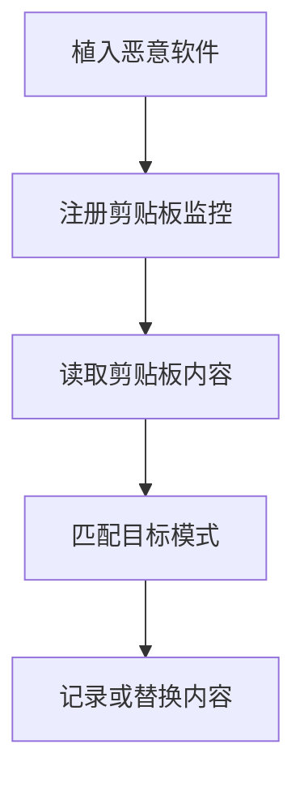

# 剪贴板数据 (T1115)

## 一句话通俗理解

攻击者偷偷读取你复制粘贴的内容——你刚才复制密码、钱包地址或机密信息时，已经被截获了。

## 难度等级

⭐ 初级（新手可学）

## 技术描述

剪贴板数据（T1115）是MITRE ATT&CK框架中收集战术的一种技术。

**通俗解释：**
你复制（Ctrl+C）一段文字时，它被临时保存在电脑的"剪贴板"中。攻击者的恶意软件可以随时读取剪贴板的内容——你复制的密码、银行卡号、加密货币钱包地址、机密文本，全部暴露无遗。更危险的是，有一种"剪贴板劫持"攻击：恶意软件（称为Clipper）检测到你复制了加密货币地址，会自动把地址替换成攻击者的地址，导致你转账时把钱打给了攻击者。

**技术原理：**

1. **读取剪贴板**：调用操作系统API（Windows的`GetClipboardData`、macOS的`NSPasteboard`）获取当前剪贴板中的文本内容
2. **监控剪贴板变化**：通过`SetClipboardViewer`注册剪贴板查看器窗口，在剪贴板内容变化时自动获取新数据
3. **轮询比较**：定期轮询剪贴板内容并与上次记录的值比较，检测变化
4. **替换劫持**：检测到特定模式（如加密货币地址、密码字段）时，用攻击者控制的地址替换剪贴板内容

**用途与影响：**
剪贴板数据收集通常用于窃取用户复制的密码（尤其是密码管理器中的密码）、加密货币钱包地址、财务信息和其他敏感信息。Clipper恶意软件可以直接造成经济损失——通过替换钱包地址将加密货币转入攻击者的账户。

## 子技术列表

该技术没有子技术。

## 攻击流程

### 典型攻击流程

```
植入恶意软件 --> 注册剪贴板监控 --> 读取剪贴板内容 --> 匹配目标模式 --> 记录或替换内容
```



**步骤详解：**

1. **植入恶意软件**
   - 通俗描述：通过钓鱼邮件或恶意下载安装剪贴板监控恶意软件
   - 技术细节：通常作为信息窃取木马（Infostealer）的一个模块分发
   - 常用工具：Lumma Stealer、Vidar、TrickBot

2. **注册剪贴板监控**
   - 通俗描述：恶意软件告诉操作系统"剪贴板内容变化时通知我"
   - 技术细节：在Windows中调用`SetClipboardViewer`或`AddClipboardFormatListener`注册监控
   - 常用工具：Windows API、.NET的`Clipboard`类

3. **读取剪贴板内容**
   - 通俗描述：每次剪贴板变化时读取其中保存的数据
   - 技术细节：在回调函数中调用`GetClipboardData(CF_TEXT)`或`GetClipboardData(CF_UNICODETEXT)`获取文本
   - 常用工具：Windows API、PowerShell

4. **匹配目标模式**
   - 通俗描述：检查剪贴板内容是否是想要的目标（如钱包地址）
   - 技术细节：使用正则表达式匹配比特币/以太坊等加密货币地址格式
   - 常用工具：正则表达式库、自定义模式匹配

5. **记录或替换内容**
   - 通俗描述：如果是密码就记录发送，如果是钱包地址就替换成攻击者的
   - 技术细节：将匹配到的数据加密保存，或使用`SetClipboardData`替换剪贴板内容
   - 常用工具：Windows API、自定义Clipper模块

## 真实案例

### 案例1：MassJacker - 77万加密货币钱包地址劫持（2025年3月）

- **时间**: 2025年3月（发现时间）
- **目标**: 全球加密货币用户
- **攻击组织**: MassJacker运营者（疑似单个威胁团伙）
- **手法**: CyberArk发现了一个名为MassJacker的大规模Clipper恶意软件活动，利用778,531个加密货币钱包地址进行剪贴板劫持。该恶意软件使用正则表达式检测Windows剪贴板中的加密货币地址，在用户复制地址时将其替换为攻击者控制的地址。分析发现423个与活动直接关联的钱包中有约$95,300美元（但历史数据表明实际损失可能远超$300,000）。MassJacker使用一致的文件名和加密密钥，表明是单个威胁团伙在运营，但也不排除MaaS（恶意软件即服务）模式的可能。
- **影响**: 大规模加密货币用户资金被盗，影响范围遍及全球
- **参考链接**: [MassJacker Malware Analysis - CyberArk 2025](https://www.cyberark.com/resources/threat-research-blog/captain-massjacker-sparrow-uncovering-the-malwares-buried-treasure)

### 案例2：Efimer Trojan - WordPress传播的剪贴板劫持（2024-2025）

- **时间**: 2024年10月-2025年7月
- **目标**: 全球5000+ Windows用户
- **攻击组织**: Efimer木马运营者
- **手法**: Efimer木马通过被入侵的WordPress网站、恶意种子文件和伪装成法律通知的钓鱼消息传播。该木马持续监控Windows剪贴板中的加密货币钱包地址和种子短语。一旦检测到匹配模式，立即使用`SetClipboardData`将地址替换为攻击者控制的地址。Efimer使用多层混淆机制对抗防病毒检测，感染超过5000人，分布在全球多个国家。
- **影响**: 加密货币用户在转账时资金被劫持，总损失估计达数百万美元
- **参考链接**: [Efimer Trojan Analysis - ChangeNOW 2025](https://changenow.io/blog/crypto-copy-paste-risk)

### 案例3：Lumma Stealer - 剪贴板数据窃取模块（2025-2026）

- **时间**: 2025年-2026年
- **目标**: 全球Windows用户
- **攻击组织**: Lumma Stealer（MaaS平台运营者）
- **手法**: Lumma Stealer作为恶意软件即服务平台，包含完整的剪贴板数据窃取模块。该恶意软件通过钓鱼邮件和仿冒软件分发后，使用.NET的`System.Windows.Forms.Clipboard`类持续监控剪贴板变化。Lumma不仅窃取复制的密码和凭证，还专门针对加密货币钱包地址和私钥进行劫持。2025年5月，微软和FBI联合取缔了2300多个Lumma C2域名，但该活动很快反弹到攻击前水平。Lumma还绕过了Chrome 127引入的App-Bound Encryption保护，继续窃取浏览器Cookie和密码。
- **影响**: 全球数百万用户受影响，被盗数据被用于凭证填充和加密货币盗窃
- **参考链接**: [Lumma Stealer Analysis - Genians 2025](https://www.genians.co.kr/blog/threat_intelligence/lumma-infostealer)

## 红队视角

> ⚠️ **免责声明**：以下内容仅用于合法的安全测试、渗透测试和教育目的。未经授权对他人系统进行测试是违法行为。

### 实战技巧

1. **无文件PowerShell剪贴板读取**
   使用一行PowerShell命令读取当前剪贴板内容，无需额外工具：
   ```powershell
   Add-Type -AssemblyName System.Windows.Forms; [System.Windows.Forms.Clipboard]::GetText()
   ```

2. **定期轮询提高效率**
   使用`System.Windows.Forms.Timer`设置定时器，每200-500毫秒检查一次剪贴板内容变化，平衡CPU占用和响应速度。

3. **只监控特定模式减少噪音**
   使用正则表达式过滤不需要的内容（如只监控比特币地址、以太坊地址或特定格式的密码），减少需要处理和传输的数据量。

### 常用工具

| 工具名称 | 用途 | 平台 | 链接 |
|----------|------|------|------|
| PowerShell | 通过.NET读取和写入剪贴板 | Windows | 系统内置 |
| ClipX | 剪贴板历史管理器（可用于测试） | Windows | https://bluemars.org/clipx/ |
| NirSoft Clipboard Viewer | 查看和管理剪贴板内容 | Windows | https://www.nirsoft.net/utils/clipboard_viewer.html |

### 注意事项

- 现代浏览器提供了"复制时不通知扩展"的选项，限制了网页扩展对剪贴板的自动访问
- 很多EDR解决方案已经开始检测频繁的`GetClipboardData`调用
- 在Linux上读取剪贴板需要访问X11的CLIPBOARD选择或Wayland的wl-clipboard

## 蓝队视角

### 检测要点

1. **异常的剪贴板API调用**
   - 日志来源：Sysmon、EDR API监控
   - 关注字段：`GetClipboardData`、`OpenClipboard`、`SetClipboardViewer` API调用
   - 异常特征：非用户交互的后台进程频繁调用剪贴板读取API

2. **剪贴板查看器链异常注册**
   - 日志来源：Windows API调用日志
   - 关注字段：`SetClipboardViewer`调用
   - 异常特征：非预期进程注册为剪贴板查看器，加入剪贴板查看器链

3. **PowerShell剪贴板访问**
   - 日志来源：PowerShell Script Block Logging (Event ID 4104)
   - 关注字段：`[System.Windows.Forms.Clipboard]`类的使用
   - 异常特征：包含`Clipboard::GetText()`或`Clipboard::SetText()`的PowerShell命令

### 监控建议

- 监控进程对`GetClipboardData`、`OpenClipboard`等剪贴板API的调用
- 配置PowerShell Script Block Logging检测剪贴板访问命令
- 对剪贴板内容被替换的行为（特别是加密货币地址模式）进行告警

## 检测建议

### 网络层检测

**网络流量特征：**
- 监控RDP剪贴板重定向流量：检测MS-RDPECLIP协议的数据交换
- 检测剪贴板数据通过即时通讯工具或协作平台自动上传的网络特征
- 监控剪贴板同步工具（如Ditto网络同步、KDE Klipper）产生的跨网络流量
- 检测剪贴板内容被复制到远程桌面会话时的数据传输模式

**具体命令示例：**
```bash
# 检测RDP剪贴板通道的活动连接
Get-NetTCPConnection | Where-Object { $_.LocalPort -eq 3389 -and $_.State -eq 'Established' }

# 检测剪贴板内容对应的HTTP POST流量
# Get-NetTCPConnection | Where-Object { $_.State -eq 'Established' -and $_.RemotePort -eq 443 }
```

**示例（Suricata/IDS规则）：**
```
# 检测RDP剪贴板重定向流量 - MS-RDPECLIP协议数据交换
alert tcp $HOME_NET any -> $HOME_NET 3389 (
    msg:"T1115 - 剪贴板数据 - RDP剪贴板重定向传输";
    flow:to_server;
    content:"|03 00 00 00|";  # CLIPRDR_HEADER
    dsize:>100;
    sid:1011501; rev:1;
)
```

### 主机层检测

**Windows事件ID：**
- Sysmon Event ID 1：进程创建
- PowerShell Event ID 4104：Script Block Logging
- Event ID 4656：文件句柄请求（剪贴板设备访问）

**具体命令示例：**
```bash
# 检测PowerShell中的剪贴板访问
Get-WinEvent -FilterHashtable @{LogName='Microsoft-Windows-PowerShell/Operational'; ID=4104} |
    Where-Object { $_.Message -match 'Clipboard::GetText' }
```

### 应用层检测

**Sigma规则示例：**
```yaml
title: 剪贴板数据读取检测
status: experimental
description: 检测进程通过PowerShell或.NET读取剪贴板内容
logsource:
    category: process_creation
    product: windows
detection:
    selection:
        CommandLine|contains:
            - 'Clipboard::GetText'
            - 'GetClipboardData'
    condition: selection
level: medium
tags:
    - attack.t1115
    - attack.collection
```

## 缓解措施

### 优先级1：关键措施

**措施名称：** 限制剪贴板API访问

**具体实施步骤：**
1. 使用应用程序控制策略限制非必要进程访问剪贴板API
2. 对敏感系统禁用RDP剪贴板重定向功能
3. 在浏览器中禁用不必要的扩展权限

### 优先级2：重要措施

**措施名称：** 使用安全输入方法

**具体实施步骤：**
1. 使用密码管理器的自动填充功能减少复制粘贴敏感信息
2. 转移加密货币时，手动输入地址的前几位和后几位进行验证
3. 使用硬件钱包的验证功能确认转账地址

### 优先级3：建议措施

**措施名称：** EDR和防剪贴板窃取方案

**具体实施步骤：**
1. 部署EDR方案监控剪贴板访问行为
2. 安装安全浏览器扩展，检测和阻止剪贴板劫持
3. 对用户进行安全意识培训，避免复制粘贴敏感信息到非信任环境

### MITRE ATT&CK 缓解措施映射

| 缓解措施ID | 缓解措施名称 | 适用性 | 说明 |
|------------|-------------|--------|------|
| M0934 | 应用程序隔离 | 适用 | 限制非必要进程访问剪贴板 |
| M0937 | 应用程序控制 | 适用 | AppLocker可限制剪贴板访问权限 |
| M0922 | 用户培训 | 适用 | 教育用户注意剪贴板安全 |

## 动手实验

> ⚠️ **重要提示**：所有实验必须在隔离的实验室环境中进行，禁止对未授权的真实系统进行测试。

### 实验环境准备

**所需工具：**
- Windows虚拟机
- PowerShell ISE

### 实验1：使用PowerShell读取和监控剪贴板（初级）

**实验目标：** 使用PowerShell读取当前剪贴板内容并监控变化

**实验步骤：**
1. 在Windows虚拟机中打开PowerShell ISE
2. 创建一个简单的剪贴板监控脚本：
   ```powershell
   Add-Type -AssemblyName System.Windows.Forms
   
   # 读取当前剪贴板内容
   $currentContent = [System.Windows.Forms.Clipboard]::GetText()
   Write-Host "当前剪贴板内容: $currentContent"
   
   # 监控剪贴板变化
   while ($true) {
       $newContent = [System.Windows.Forms.Clipboard]::GetText()
       if ($newContent -ne $currentContent) {
           Write-Host "剪贴板已更新: $newContent"
           $currentContent = $newContent
       }
       Start-Sleep -Milliseconds 500
   }
   ```
3. 手动复制一些文本（Ctrl+C），观察脚本的输出

**预期结果：** 脚本实时显示剪贴板内容的变化

**学习要点：** 理解攻击者如何通过简单的API调用监控用户的剪贴板操作

## 术语解释

| 术语 | 英文原名 | 通俗解释 |
|------|----------|----------|
| 剪贴板 | Clipboard | 操作系统中的一块临时内存区域，用于在应用之间传递数据 |
| Clipper | Clipper | 一种专门替换剪贴板中加密货币地址的恶意软件 |
| 剪贴板查看器 | Clipboard Viewer | 可以查看当前剪贴板内容的程序和功能 |
| 轮询 | Polling | 定期检查某个值是否变化的方法 |
| 正则表达式 | Regular Expression | 一种用符号模式匹配文本的方法，可以精确识别特定格式的字符串 |

## 参考资料

### 官方文档

- [MITRE ATT&CK - T1115](https://attack.mitre.org/techniques/T1115/)

### 安全报告

- [MassJacker Malware Analysis - CyberArk 2025](https://www.cyberark.com/resources/threat-research-blog/captain-massjacker-sparrow-uncovering-the-malwares-buried-treasure)
- [Lumma Stealer Analysis - Genians 2025](https://www.genians.co.kr/blog/threat_intelligence/lumma-infostealer)
- [Clipboard Hijacking Explained - ChangeNOW](https://changenow.io/blog/crypto-copy-paste-risk)

### 工具与资源

- [Clipboard API文档 - Microsoft](https://docs.microsoft.com/en-us/windows/win32/dataxchg/clipboard)
- [.NET Clipboard Class](https://docs.microsoft.com/en-us/dotnet/api/system.windows.forms.clipboard)
