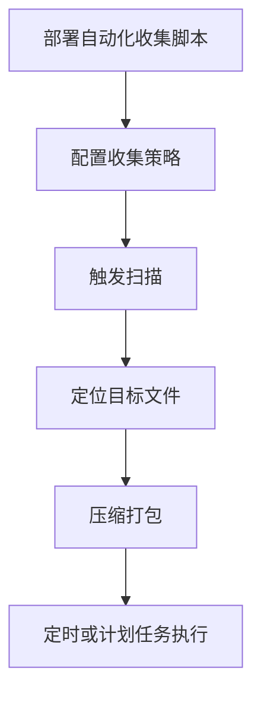

# 自动化收集 (T1119)

## 一句话通俗理解

攻击者编写脚本定期替你"备份"电脑上的所有敏感文件——你不给，它自己每隔几分钟自动来拿一次。

## 30秒速查卡

| 维度 | 你需要知道的 |
|------|-------------|
| 这是什么？ | 攻击者编写脚本定期替你"备份"电脑上的所有敏感文件——你不给，它自己每隔几分钟自动来拿一次。 |
| 为什么危险？ | 自动化收集比人工收集更彻底、更隐蔽。攻击者设置好策略后可以"释放不管"，系统自动持续窃取数据。它特别适合：长期潜伏的AP |
| 谁需要关心？ | 数据安全团队、SOC分析师 |
| 你的第一步防御 | 批量文件读取行为 |
| 如果只做一件事 | 想象一下，你的电脑上装了一个"自动小偷"——它不是偷一次就收手，而是每隔固定时间自动搜索并复制你电脑 |

## 难度等级

⭐⭐ 中级（需要一定基础）

## 技术描述

自动化收集（T1119）是MITRE ATT&CK框架中收集战术的一种技术。

**通俗解释：**
想象一下，你的电脑上装了一个"自动小偷"——它不是偷一次就收手，而是每隔固定时间自动搜索并复制你电脑上新出现的敏感文件。今天你刚下载了一个合同文档，它悄悄备份了一份；明天你新建了一个密码表格，它也自动复制了一份。这就是自动化收集：攻击者在你的系统上部署一个脚本或程序，定时自动寻找并收集有价值的数据。

**技术原理：**

1. **全盘扫描查找目标文件**：递归遍历文件系统，查找符合特定扩展名或文件名的文档（.docx、.xlsx、.pdf等）
2. **监视文件系统变化**：使用`ReadDirectoryChangesW`或FileSystemWatcher监控文件创建和修改事件
3. **自动压缩和导出**：找到目标文件后自动进行压缩打包，准备外传
4. **增量收集机制**：每次只收集新增或修改过的文件，避免重复

**用途与影响：**
自动化收集比人工收集更彻底、更隐蔽。攻击者设置好策略后可以"释放不管"，系统自动持续窃取数据。它特别适合：长期潜伏的APT攻击（数月甚至数年的数据收集）、定期从受感染系统抽取新产生的数据、批量收集大量终端上的特定文件类型。

## 子技术列表

该技术没有子技术。

## 攻击流程

### 典型攻击流程

```
部署自动化收集脚本 --> 配置收集策略 --> 触发扫描 --> 定位目标文件 --> 压缩打包 --> 定时或计划任务执行
```



**步骤详解：**

1. **部署自动化收集脚本**
   - 通俗描述：攻击者在受感染电脑上放入一个自动找文件的脚本
   - 技术细节：通过远程控制通道部署PowerShell或VBScript脚本
   - 常用工具：PowerShell、VBScript、批处理文件

2. **配置收集策略**
   - 通俗描述：设置要偷什么类型的文件和多久偷一次
   - 技术细节：配置搜索路径（如桌面、文档目录）、文件扩展名、最小文件大小
   - 常用工具：XML配置文件、脚本内的硬编码参数

3. **触发扫描**
   - 通俗描述：按预定时间或计划任务开始找文件
   - 技术细节：通过Windows Task Scheduler设置定时触发，或使用WMI事件订阅
   - 常用工具：`schtasks`、`Register-ScheduledJob`

4. **定位目标文件**
   - 通俗描述：在指定目录下搜索所有符合要求的文件
   - 技术细节：使用`Get-ChildItem -Recurse`递归遍历目录，按Extension过滤
   - 常用工具：PowerShell cmdlet、`.NET DirectoryInfo`

5. **压缩打包**
   - 通俗描述：把找到的文件打包成一个压缩包，方便传输
   - 技术细节：使用`Compress-Archive`或System.IO.Compression创建ZIP文件
   - 常用工具：PowerShell `Compress-Archive`、7-Zip命令行

6. **定时或计划任务执行**
   - 通俗描述：脚本每隔一小时自动运行一次，持续偷文件
   - 技术细节：创建计划任务每小时运行一次，或使用`SetTimer`间歇运行
   - 常用工具：Task Scheduler、`Register-ScheduledTask`

## 真实案例

### 案例1：DragonForce APT - 全盘文件自动化收集（2025年3月）

- **时间**: 2025年3月（发现时间）
- **目标**: 东南亚、东亚政府机构和军事组织
- **攻击组织**: DragonForce（疑似朝鲜背景APT组织）
- **手法**: DragonForce APT组织在其攻击活动中部署了名为`dragon_harvest.ps1`的自动化收集脚本。该脚本通过`Get-ChildItem -Recurse`递归扫描用户文档目录、桌面、下载文件夹和OneDrive目录，收集的文件类型包括：`.docx`、`.xlsx`、`.pptx`、`.pdf`、`.txt`和`.zip`。脚本通过Windows Task Scheduler设置为每30分钟执行一次，只收集上次扫描后新创建或修改的文件（使用`LastWriteTime`参数），并将收集到的文件打包后通过HTTPS上传到C2服务器。
- **影响**: 大量政府文件、军事计划被持续窃取
- **参考链接**: [DragonForce APT Analysis - SOCRadar 2025](https://socradar.io/dragonforce-apt-threat-actor-profile/)

### 案例2：APT10 (Stone Panda) - 自动化文档收集（2018-2020）

- **时间**: 2018年-2020年
- **目标**: 全球航空航天、国防、科技公司
- **攻击组织**: APT10 (Stone Panda)
- **手法**: APT10使用名为"RedLeaves"的木马实施自动化文档收集。木马中包含一个文件枚举模块，使用自定义算法遍历全部分区，根据预定义的扩展名列表（.doc、.docx、.xls、.xlsx、.pdf、.ppt、.pptx、.rtf等）搜索文档文件。收集的文档通过重命名的ZIP文件上传到C2。APT10还对搜索结果使用哈希比较，确保同一文件不会被重复上传。该自动化收集模块在受感染系统上持续运行，定期进行全盘扫描，持续窃取新创建的文档。
- **影响**: 多个国家的国防和科技企业遭受大规模数据窃取
- **参考链接**: [APT10 RedLeaves Analysis - Accenture](https://www.accenture.com/us-en/blogs/security/apt10-operation-cloud-hopper)

### 案例3：Tick Group - 定时批量文件搜索与窃取（2021-2023）

- **时间**: 2021年-2023年
- **目标**: 东亚国家（日本、韩国等）制造业和科技企业
- **攻击组织**: Tick Group (APT组织)
- **手法**: Tick Group使用定制化后门Valefor进行自动化文件收集。Valefor使用`FindFirstFile`/`FindNextFile` API递归遍历文件系统，按扩展名和文件大小过滤目标文件。脚本特别排除了Windows系统目录，只在用户文件和共享目录中搜索。收集过程通过计划任务每小时执行一次，每次扫描后生成文件列表，然后使用HTTP分段上传到C2服务器。为减少网络流量和检测风险，Valefor在文件收集前先上传文件哈希，由C2决定是否需要实际上传文件内容。
- **影响**: 东亚制造业的知识产权和技术文档被持续窃取
- **参考链接**: [Tick Group Valefor - Cybersecurity.ie](https://www.cybersecurity.ie/case-study/tick-group-analysis/)

## 红队视角

> ⚠️ **免责声明**：以下内容仅用于合法的安全测试、渗透测试和教育目的。未经授权对他人系统进行测试是违法行为。

### 实战技巧

1. **使用PowerShell实现无文件自动化收集**
   在不写入磁盘的前提下使用PowerShell脚本完成文件搜索、压缩和上传，减少取证痕迹：
   ```powershell
   # 找最近24小时内修改过的文档
   $targets = Get-ChildItem -Path $env:USERPROFILE -Recurse -Include *.docx,*.xlsx,*.pdf |
       Where-Object { $_.LastWriteTime -gt (Get-Date).AddHours(-24) }
   # 压缩到内存流并上传
   ```

2. **增量收集减少噪音**
   维护一个已收集文件列表，每次只收集新增文件。使用文件哈希值（MD5/SHA256）跟踪，而不是只用文件名和修改时间。

3. **利用打印后台处理程序收集**
   不是标准收集方法，但可以用`Print Spooler` API捕获用户打印的文档内容，收集打印操作产生的文件流。

### 常用工具

| 工具名称 | 用途 | 平台 | 链接 |
|----------|------|------|------|
| PowerShell | 脚本化文件搜索和收集 | 跨平台 | 系统内置 |
| 7-Zip | 命令行压缩支持 | 跨平台 | https://www.7-zip.org/ |
| Task Scheduler | Windows计划任务调度 | Windows | 系统内置 |

### 注意事项

- 全盘递归搜索会产生明显的磁盘I/O增加，可能触发EDR告警
- 大量小文件打包压缩会消耗CPU，容易被性能监控检测
- 计划任务的创建会被Windows事件日志记录（Event ID 4698）

## 蓝队视角

### 检测要点

1. **批量文件读取行为**
   - 日志来源：Sysmon Event ID 11（FileCreate）
   - 关注字段：大量文档文件在短时间内被访问
   - 异常特征：非用户交互的进程在短时间内读取了大量文档文件

2. **异常的计划任务创建**
   - 日志来源：Event ID 4698（计划任务创建）
   - 关注字段：任务名称、触发的可执行文件路径、重复间隔
   - 异常特征：新创建的定期执行任务指向脚本解释器（PowerShell、wscript、cscript）

3. **大量文件被压缩成ZIP**
   - 日志来源：Sysmon Event ID 11（FileCreate）
   - 关注字段：新创建的ZIP/RAR文件，特别是位于临时目录中
   - 异常特征：临时目录中出现大量一次性打包的ZIP文件

### 监控建议

- 监控PowerShell脚本执行过程中的递归文件搜索操作（`Get-ChildItem -Recurse`）
- 检测短时间内大量文档文件被访问的行为模式
- 监控异常的计划任务创建，特别是以短间隔（如30分钟）重复执行的脚本任务
- 检测临时目录中大量压缩包文件的创建

## 检测建议

### 网络层检测

**网络流量特征：**
- 检测定时任务触发的周期性网络连接模式（如每小时整点的出站连接峰值）
- 监控脚本进程（PowerShell、cmd、Python、WScript）建立的批量出站连接
- 检测单一进程在短时间内建立大量HTTP/S连接进行文件上传的行为
- 监控自动化脚本引发的非交互式出站流量（无用户输入时的网络活动）

**具体命令示例：**
```bash
# 检测脚本进程的大量出站网络连接
Get-Process | Where-Object { $_.ProcessName -match 'powershell|python|cmd|wscript' } | ForEach-Object {
    Get-NetTCPConnection -OwningProcess $_.Id -ErrorAction SilentlyContinue
} | Group-Object OwningProcess | Where-Object { $_.Count -gt 10 }
```

**示例（Suricata/IDS规则）：**
```
# 检测自动化脚本的周期性批量数据上传
alert tcp $HOME_NET any -> $EXTERNAL_NET $HTTP_PORTS (
    msg:"T1119 - 自动收集 - 脚本进程批量数据出站";
    flow:to_server;
    content:"POST";
    http_method;
    dsize:>100000;
    threshold:type both, track by_src, count 10, seconds 3600;
    sid:1011901; rev:1;
)
```

### 主机层检测

**Windows事件ID：**
- Sysmon Event ID 11：FileCreate（监控大量新文件创建）
- Event ID 4698：计划任务创建
- PowerShell Event ID 4104：Script Block Logging
- Sysmon Event ID 1：进程创建

**具体命令示例：**
```bash
# 检测新创建的每小时执行计划任务
Get-WinEvent -FilterHashtable @{LogName='Security'; ID=4698} |
    Where-Object { $_.Message -match 'Repetition' -and $_.Message -match 'PT30M' }
```

### 应用层检测

**用人话说：**

> 自动化收集是攻击者设置好后就"躺平收数据"的懒人模式——通过计划任务或定时脚本，自动执行文件搜索和复制操作。比如攻击者创建一个每天凌晨2点触发的计划任务，运行一个PowerShell脚本递归搜索所有用户的Documents和Desktop文件夹，把新修改的docx/xlsx/pdf文件复制到暂存目录。这种"一次部署、持续窃取"的方式减少了攻击者的交互频率，降低了被发现的风险。攻击者用schtasks.exe /create创建计划任务，或者用WMI的__EventFilter在特定条件触发时执行收集脚本。检测方法：监控计划任务的创建和修改事件（事件ID 4698）、定时任务调用的脚本内容包含文件搜索和复制命令、以及非工作时间段的规律性文件访问模式（如每天凌晨2点准时的大量文件读取）。
>
> **避坑指南**：未启用PowerShell脚本块日志；未监控云存储API异常调用。

**Sigma规则示例：**
```yaml
title: 自动化文件收集脚本检测
status: experimental
description: 检测通过PowerShell递归搜索并压缩文档文件的行为
logsource:
    category: process_creation
    product: windows
detection:
    selection:
        CommandLine|contains|all:
            - 'Get-ChildItem'
            - '-Recurse'
            - 'Compress-Archive'
    condition: selection
level: high
tags:
    - attack.t1119
    - attack.collection
```

## 缓解措施

### 优先级1：关键措施

**措施名称：** 应用程序控制（AppLocker）

**具体实施步骤：**
1. 配置AppLocker策略限制非管理员的脚本执行
2. 限制PowerShell脚本从网络位置下载和执行
3. 启用Windows Defender Application Control（WDAC）

### 优先级2：重要措施

**措施名称：** 计划任务审计

**具体实施步骤：**
1. 启用对计划任务创建事件的审计
2. 建立计划任务基线，标记新增的可疑任务
3. 限制非管理员用户创建计划任务的权限

### 优先级3：建议措施

**措施名称：** 数据防泄漏（DLP）

**具体实施步骤：**
1. 实施端点DLP策略，监控批量文件复制行为
2. 对压缩包文件的创建设置告警
3. 对大量文档文件在短时间内被读取设置速率限制

### MITRE ATT&CK 缓解措施映射

| 缓解措施ID | 缓解措施名称 | 适用性 | 说明 |
|------------|-------------|--------|------|
| M0945 | 应用程序控制 | 适用 | 限制未授权脚本执行 |
| M0937 | 计划任务控制 | 适用 | 限制计划任务的创建 |
| M0938 | 数据防泄漏 | 适用 | 监控和限制数据外传 |

## 动手实验

> ⚠️ **重要提示**：所有实验必须在隔离的实验室环境中进行，禁止对未授权的真实系统进行测试。

### 实验环境准备

**所需工具：**
- Windows虚拟机
- PowerShell ISE

### 实验1：使用PowerShell模拟自动化文件收集（中级）

**实验目标：** 创建一个自动化文件收集脚本并观察运行效果

**实验步骤：**
1. 在Windows虚拟机中，在桌面创建几个测试文档（test.docx, data.xlsx）
2. 打开PowerShell ISE并创建自动收集脚本：
   ```powershell
   # 搜索桌面和文档目录中的Office文件
   $targetDirs = @(
       "$env:USERPROFILE\Desktop",
       "$env:USERPROFILE\Documents"
   )
   
   $results = @()
   foreach ($dir in $targetDirs) {
       $results += Get-ChildItem -Path $dir -Recurse -Include *.docx,*.xlsx,*.pdf -ErrorAction SilentlyContinue |
           Where-Object { $_.Length -gt 1000 }  # 过滤太小的文件
   }
   
   # 显示找到的文件
   $results | Select-Object Name, Length, LastWriteTime
   ```

**预期结果：** 脚本输出桌面上测试文档的列表（文件名、大小和最后修改时间）

**学习要点：** 理解攻击者如何自动搜索和定位敏感文档

## 术语解释

| 术语 | 英文原名 | 通俗解释 |
|------|----------|----------|
| 递归遍历 | Recursive Traversal | 一个目录下查找，如果遇到子目录就进入子目录继续找 |
| 增量收集 | Incremental Collection | 每次只收集自上次之后新创建或修改的文件 |
| 计划任务 | Scheduled Task | Windows中的定时执行程序的功能，像闹钟一样到点自动运行 |
| 哈希比较 | Hash Comparison | 通过计算文件的数字指纹来比较文件是否相同 |
| DLP | Data Loss Prevention | 数据防泄漏系统，防止敏感数据被未经授权地外传 |

## 参考资料

### 官方文档

- [MITRE ATT&CK - T1119](https://attack.mitre.org/techniques/T1119/)

### 安全报告

- [DragonForce APT Analysis - SOCRadar 2025](https://socradar.io/dragonforce-apt-threat-actor-profile/)
- [APT10 Operation Cloud Hopper - Accenture](https://www.accenture.com/us-en/blogs/security/apt10-operation-cloud-hopper)
- [Tick Group Analysis](https://www.cybersecurity.ie/case-study/tick-group-analysis/)

### 工具与资源

- [PowerShell Get-ChildItem](https://docs.microsoft.com/en-us/powershell/module/microsoft.powershell.management/get-childitem) - 文件搜索cmdlet
- [PowerShell Compress-Archive](https://docs.microsoft.com/en-us/powershell/module/microsoft.powershell.archive/compress-archive) - 压缩模块
- [Windows Task Scheduler](https://docs.microsoft.com/en-us/windows/win32/taskschd/task-scheduler-start-page) - 计划任务
