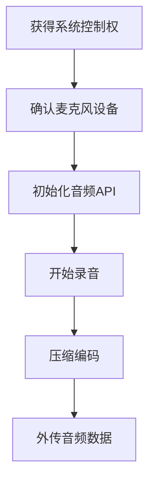

# 音频捕获 (T1123)

## 一句话通俗理解

攻击者偷偷打开你电脑的麦克风，远程监听你的周围环境——你说的话、开会的内容、周围的声响都被录下来。

## 30秒速查卡

| 维度 | 你需要知道的 |
|------|-------------|
| 这是什么？ | 攻击者偷偷打开你电脑的麦克风，远程监听你的周围环境——你说的话、开会的内容、周围的声响都被录下来。 |
| 为什么危险？ | 音频捕获用于监控受害者的环境对话，获取会议内容、电话交谈等语音敏感信息。攻击者可以选择"触发式录音"——只在检测到人声时 |
| 谁需要关心？ | 数据安全团队、SOC分析师 |
| 你的第一步防御 | 音频设备访问的异常进程 |
| 如果只做一件事 | 你的电脑、手机和平板上都有麦克风——这是用于视频会议、语音输入和语音助手的 |

## 难度等级

⭐⭐⭐ 高级（需要一定经验）

## 技术描述

音频捕获（T1123）是MITRE ATT&CK框架中收集战术的一种技术。

**通俗解释：**
你的电脑、手机和平板上都有麦克风——这是用于视频会议、语音输入和语音助手的。但如果恶意软件接管了麦克风权限，它就可以在没有指示灯提示的情况下开始录音。你开会谈论的商业机密、和客户讲的价格策略、甚至在家里说的私事，全都被录下来发给攻击者。这不是科幻电影的情节，而是真实存在的攻击手段。

**技术原理：**

1. **访问音频设备**：调用操作系统的音频API（如Windows上的WASAPI、macOS上的CoreAudio）打开麦克风设备
2. **设置录音格式**：配置音频采样率（通常8kHz-44.1kHz）、位深度（16位）和声道数（单声道）
3. **开始录音**：启动音频捕获会话，将音频数据流写入缓冲区
4. **编码压缩**：将原始PCM音频数据压缩为MP3、AAC或Opus等格式，减小文件大小
5. **保存或传输**：将压缩后的音频保存为文件或通过实时音频流直接传输

**用途与影响：**
音频捕获用于监控受害者的环境对话，获取会议内容、电话交谈等语音敏感信息。攻击者可以选择"触发式录音"——只在检测到人声时开始录制，减少存储和传输需求。APT组织使用音频捕获进行情报收集，了解目标组织的内部讨论和决策过程。

## 子技术列表

该技术没有子技术。

## 攻击流程

### 典型攻击流程

```
获得系统控制权 --> 确认麦克风设备 --> 初始化音频API --> 开始录音 --> 压缩编码 --> 外传音频数据
```



**步骤详解：**

1. **获得系统控制权**
   - 通俗描述：攻击者通过木马远程控制了你的电脑
   - 技术细节：部署RAT（远程访问木马）获得远程控制权限
   - 常用工具：Cobalt Strike、Metasploit、DarkComet

2. **确认麦克风设备**
   - 通俗描述：检查电脑上有没有可用的麦克风
   - 技术细节：枚举系统音频输入设备，检查设备状态是否为可用
   - 常用工具：Windows Audio API、`WaveInGetNumDevs`、`MMDeviceEnumerator`

3. **初始化音频API**
   - 通俗描述：打开麦克风连接，准备录音
   - 技术细节：打开音频流，设置回调函数处理音频缓冲数据
   - 常用工具：WASAPI（Windows Audio Session API）、CoreAudio（macOS）

4. **开始录音**
   - 通俗描述：开始往内存中写入音频数据
   - 技术细节：启动音频捕获循环，将PCM数据写入循环缓冲区
   - 常用工具：`IAudioCaptureClient`（WASAPI）、`AudioQueue`（macOS）

5. **压缩编码**
   - 通俗描述：把录音数据压缩变小，方便网络传输
   - 技术细节：使用LAME MP3编码器或Opus编码器压缩原始音频
   - 常用工具：FFmpeg、LAME、libopus

6. **外传音频数据**
   - 通俗描述：通过网络把压缩后的录音发给攻击者
   - 技术细节：将音频数据块加密后通过HTTPS传输，或分段写入文件后上传
   - 常用工具：HTTP POST、DNS隧道、自定义加密协议

## 真实案例

### 案例1：CrystalRAT - 带音频捕获的定制化RAT（2026年2月）

- **时间**: 2026年2月（发现时间）
- **目标**: 全球政府机构和金融企业员工
- **攻击组织**: CrystalRAT运营者（疑似国家背景APT）
- **手法**: CrystalRAT是一款使用Java编写的跨平台远程访问木马，其音频捕获功能是其核心监视模块之一。CrystalRAT使用操作系统底层的音频API直接访问麦克风，支持按预设的时间段（如工作日的9:00-17:00）自动开始录音，避开非工作时间以减少数据量。录制的声音使用Opus编码器（48kHz采样率）实时压缩，通过加密的WebSocket连接流式传输到C2服务器。该木马还集成了语音活动检测（VAD），只在实际有人说话时录制，显著减少传输带宽和存储需求。
- **影响**: 多国政府机构的内部会议和电话交谈被窃听
- **参考链接**: [CrystalRAT Analysis - Kaspersky 2026](https://securelist.com/crystalrat-analysis/)

### 案例2：InvisiRing - 不依赖URL的音频监听（2025年5月）

- **时间**: 2025年5月（发现时间）
- **目标**: 全球Windows用户（特别是韩语和阿拉伯语用户）
- **攻击组织**: InvisiRing运营者（疑似APT37关联）
- **手法**: InvisiRing是一种信息窃取恶意软件，使用Socket通信（不依赖URL）在受害者系统上持续监听。作为新型恶意软件家族，InvisiRing包含Windows音频设备枚举和录音功能模块。攻击者可以在受感染系统上远程启动录音会话，通过命令控制通道实时获取音频流数据。该恶意软件会在后台持续运行，即使系统重启后也能自动启动。InvisiRing特别针对使用了韩语和阿拉伯语键盘的用户，表明其目标可能是特定地区和行业的组织。
- **影响**: 特定语言用户的机密对话被长期监听
- **参考链接**: [InvisiRing Malware Analysis - AhnLab 2025](https://asec.ahnlab.com/en/70449/)

### 案例3：Fancy Bear (APT28) - 酒店WiFi劫持与Skype音频监听（2018年）

- **时间**: 2018年
- **目标**: 欧洲和美国外交官、军事人员
- **攻击组织**: Fancy Bear (APT28, Sofacy Group)
- **手法**: APT28在多家欧洲酒店部署了受感染的WiFi网络，专门针对参加北约峰会和外交会议的代表团。当目标人员的设备连接到被劫持的WiFi后，APT28部署了带有音频捕获模块的恶意软件。该恶意软件使用Windows CoreAudio API捕获Skype通话的音频数据，支持在通话过程中自动录音。录制的音频经过Opus压缩后，通过RTP（实时传输协议）流式传输到攻击者的监听服务器。AP28还利用该技术监听酒店房间内智能设备（如Amazon Echo、Google Home）的麦克风。
- **影响**: 北约外交和军事机密通话被监听
- **参考链接**: [APT28 Hotel WiFi Attack - The Guardian](https://www.theguardian.com/technology/2018/feb/16/hotel-wi-fi-attack-russian-spies-apt28)

## 红队视角

> ⚠️ **免责声明**：以下内容仅用于合法的安全测试、渗透测试和教育目的。未经授权对他人系统进行测试是违法行为。

### 实战技巧

1. **使用低品质采样减少数据量**
   将采样率设为8kHz（电话质量而不是CD质量），可以显著减小音频文件大小和带宽需求。8kHz的单声道16位PCM只需要128kbps带宽，而44.1kHz的立体声需要1411kbps。

2. **语音活动检测（VAD）提高效率**
   集成简单的VAD算法，只在检测到人声时录制。使用能量阈值检测（短时能量>阈值）是最简单的方法，更精确的可以使用WebRTC VAD模块。

3. **触发式录音减少检测风险**
   不要持续录音，而是通过C2命令触发录音会话，或者设置在特定时间段（如会议时间）录音。这减少了CPU使用率和网络流量，降低被EDR检测的可能性。

### 常用工具

| 工具名称 | 用途 | 平台 | 链接 |
|----------|------|------|------|
| FFmpeg | 音频录制、编码和转换 | 跨平台 | https://ffmpeg.org/ |
| SoX | 音频处理工具集 | 跨平台 | http://sox.sourceforge.net/ |
| PowerShell | 通过.NET访问音频设备 | Windows | 系统内置 |
| Cobalt Strike | 渗透测试框架，支持麦克风访问 | 跨平台 | https://www.cobaltstrike.com/ |

### 注意事项

- 录音会显著增加CPU和内存使用率，可能被性能监控工具检测到
- 大多数操作系统在后台应用访问麦克风时会有托盘图标或指示灯提示
- 现代浏览器在不活动标签页中限制了音频访问，但原生应用不受此限制
- Windows 10+的麦克风隐私设置可以阻止非UWP应用的麦克风访问

## 蓝队视角

### 检测要点

1. **音频设备访问的异常进程**
   - 日志来源：Windows Audio API调用、EDR行为监控
   - 关注字段：打开音频输入设备的进程，非预期的应用访问麦克风
   - 异常特征：后台进程（尤其是SVCHost以外的进程）持续访问麦克风

2. **音频数据的网络外传**
   - 日志来源：网络流量监控、代理日志
   - 关注字段：大块连续的上传数据、音频MIME类型
   - 异常特征：与外部IP建立的持续连接，传输的数据特征与音频流一致

3. **音频相关API调用**
   - 日志来源：API监控（如Sysmon）
   - 关注字段：`waveInOpen`、`WASAPI`、`CoreAudio`的调用
   - 异常特征：非多媒体应用调用音频捕获API

### 监控建议

- 监控非多媒体应用对Windows音频设备API的访问
- 检测非预期的音频数据上传行为
- 使用麦克风访问日志（Windows Privacy Settings）检查异常麦克风使用
- 利用端点音频采样率监控检测异常的持续录音

## 检测建议

### 网络层检测

**网络流量特征：**
- 监控RTP/RTSP流媒体协议到未知外部IP的出站连接
- 检测稳定持续的UDP小流量传输（音频编码特征：50-128kbps恒定码率）
- 监控正常通信工具（Skype、Teams、Zoom）之外的进程建立音频流网络连接
- 检测通过DNS隧道或HTTP chunked编码隐蔽传输音频数据的异常行为

**具体命令示例：**
```bash
# 检测非标准端口上的持续UDP流量（音频编码特征）
Get-NetUDPEndpoint | Where-Object { $_.LocalPort -notin @(53,123,443,3389) } | Group-Object RemotePort | Sort-Object Count -Descending

# 检测长时间稳定UDP流（通过性能监视器）
# Get-Counter "\UDPv4\Datagrams/sec" -SampleInterval 5 -MaxSamples 12
```

**示例（Suricata/IDS规则）：**
```
# 检测音频数据外传 - 稳态小流量UDP出站连接
alert udp $HOME_NET any -> $EXTERNAL_NET any (
    msg:"T1123 - 音频捕获 - 稳态UDP小流量外传";
    dsize:50-500;
    threshold:type both, track by_src, count 60, seconds 60;
    sid:1011231; rev:1;
)
```

### 主机层检测

**Windows事件ID：**
- Event ID 6400：设备接入（检测麦克风设备启动）
- PowerShell Event ID 4104：Script Block Logging
- Sysmon Event ID 7：DLL加载（检测`winmm.dll`、`audioeng.dll`的加载）

**具体命令示例：**
```bash
# 检查哪些进程打开了麦克风设备
Get-WmiObject Win32_PnPEntity | Where-Object {$_.Name -match "microphone|mic"}
```

### 应用层检测

**用人话说：**

> 音频捕获是把受害者的电脑变成"窃听器"的技术——攻击者通过木马调用操作系统的音频录制API，开启麦克风录制周围环境的声音会议内容。在Windows上通过waveInOpen、waveInStart等API录制音频，或者使用.NET的System.Media.SoundRecorder类。录制得到的WAV/MP3文件通过C2通道回传给攻击者。这类攻击在APT活动中常用于窃取会议室讨论的战略决策、电话会议中的商业机密。检测方法：监控进程加载音频捕获相关的DLL（如winmm.dll、msacm32.drv）、麦克风设备被非预期的应用打开（Windows的隐私设置会记录麦克风使用情况）、以及临时目录中出现音频文件但用户并未使用任何录音软件。
>
> **避坑指南**：未启用PowerShell脚本块日志；未监控异常会话令牌使用；加密检测阈值设置过高。

**Sigma规则示例：**
```yaml
title: 音频捕获API调用检测
status: experimental
description: 检测非多媒体进程调用音频捕获API
logsource:
    category: process_creation
    product: windows
detection:
    selection:
        Image|endswith: '.exe'
        CommandLine|contains|all:
            - 'waveInOpen'
            - 'WASAPI'
    condition: selection
level: high
tags:
    - attack.t1123
    - attack.collection
```

## 缓解措施

### 优先级1：关键措施

**措施名称：** 麦克风权限管控

**具体实施步骤：**
1. 在Windows设置中限制非必要应用的麦克风权限
2. 在敏感区域使用物理麦克风遮挡（如笔记本摄像头盖可以选带麦克风遮挡的型号）
3. 操作系统层面禁用麦克风设备（通过设备管理器或组策略）

### 优先级2：重要措施

**措施名称：** 端点检测方案

**具体实施步骤：**
1. 部署EDR方案监控音频设备API的异常使用
2. 配置行为监控规则检测非用户交互的进程访问麦克风
3. 在SIEM中建立音频数据外传的检测规则

### 优先级3：建议措施

**措施名称：** 物理环境控制

**具体实施步骤：**
1. 在高安全会议室内部署音频干扰设备或白噪声发生器
2. 在敏感区域禁止携带智能手机等带有麦克风的设备
3. 建立定期检查制度，确认终端设备麦克风状态

### MITRE ATT&CK 缓解措施映射

| 缓解措施ID | 缓解措施名称 | 适用性 | 说明 |
|------------|-------------|--------|------|
| M0934 | 应用程序隔离 | 适用 | 限制音频设备访问 |
| M0928 | 权限管理 | 部分适用 | 控制麦克风驱动程序权限 |
| M0937 | 数据外传限制 | 部分适用 | 监控音频数据外传 |

## 动手实验

> ⚠️ **重要提示**：所有实验必须在隔离的实验室环境中进行，禁止对未授权的真实系统进行测试。

### 实验环境准备

**所需工具：**
- Windows虚拟机（带麦克风或虚拟音频设备）
- Visual Studio 或 PowerShell ISE
- FFmpeg（可选）

### 实验1：使用PowerShell通过.NET录制音频（高级）

**实验目标：** 使用PowerShell调用.NET API录制一段麦克风音频

**实验步骤：**
1. 在Windows虚拟机上打开PowerShell（管理员）
2. 创建一个使用`System.Media`命名空间录音的简单脚本：
   ```powershell
   # 加载音频相关.NET程序集
   Add-Type -AssemblyName System.Core
   Add-Type -AssemblyName System.Runtime.WindowsRuntime
   
   # 使用Windows.Media.Capture API获取麦克风设备
   $mediaCapture = New-Object Windows.Media.Capture.MediaCapture
   $settings = New-Object Windows.Media.Capture.MediaCaptureInitializationSettings
   $settings.StreamingCaptureMode = [Windows.Media.Capture.StreamingCaptureMode]::Audio
   $mediaCapture.InitializeAsync($settings)
   ```
3. （完整的录音实现需要UWP权限，此实验为概念验证）

**预期结果：** 成功获取麦克风设备引用

**学习要点：** 理解攻击者调用操作系统音频API的基本原理

## 术语解释

| 术语 | 英文原名 | 通俗解释 |
|------|----------|----------|
| PCM | Pulse Code Modulation | 脉冲编码调制，音频未压缩的原始数据格式 |
| WASAPI | Windows Audio Session API | Windows音频会话API，访问音频设备的标准接口 |
| 采样率 | Sample Rate | 每秒采集音频样本的次数，越高声音越清晰但数据量越大 |
| VAD | Voice Activity Detection | 语音活动检测，判断当前音频中是否有人说话的技术 |
| Opus | Opus Codec | 一种高压缩比的音频编解码器，适合实时传输 |

## 参考资料

### 官方文档

- [MITRE ATT&CK - T1123](https://attack.mitre.org/techniques/T1123/)

### 安全报告

- [CrystalRAT Analysis - Kaspersky 2026](https://securelist.com/crystalrat-analysis/)
- [InvisiRing Malware Analysis - AhnLab 2025](https://asec.ahnlab.com/en/70449/)
- [APT28 Hotel WiFi Attack - The Guardian](https://www.theguardian.com/technology/2018/feb/16/hotel-wi-fi-attack-russian-spies-apt28)

### 工具与资源

- [Windows WASAPI Documentation](https://docs.microsoft.com/en-us/windows/win32/coreaudio/wasapi) - Windows音频API
- [FFmpeg Audio Capture](https://trac.ffmpeg.org/wiki/Capture/Desktop) - FFmpeg音频录制
- [WebRTC VAD](https://webrtc.org/) - WebRTC语音活动检测
