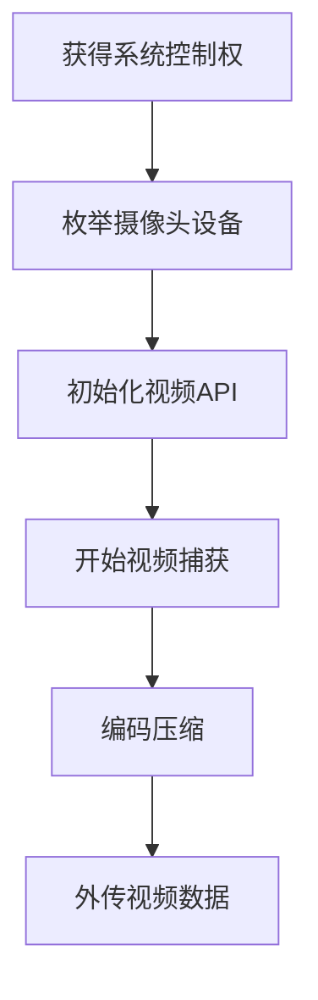

# 视频捕获 (T1125)

## 一句话通俗理解

攻击者偷偷打开你电脑的摄像头，远程监视你——你做了什么、周围环境什么样，攻击者都能看到。

## 30秒速查卡

| 维度 | 你需要知道的 |
|------|-------------|
| 这是什么？ | 攻击者偷偷打开你电脑的摄像头，远程监视你——你做了什么、周围环境什么样，攻击者都能看到。 |
| 为什么危险？ | 视频捕获可以获取比音频更丰富的信息——观察受害者的操作方式、桌面布局、物理环境和被访问的文件。结合键盘记录使用，攻击者甚 |
| 谁需要关心？ | 数据安全团队、SOC分析师 |
| 你的第一步防御 | 摄像头设备的异常访问 |
| 如果只做一件事 | 你笔记本上的摄像头除了用来开视频会议，也可能成为攻击者的"眼睛" |

## 难度等级

⭐⭐⭐ 高级（需要一定经验）

## 技术描述

视频捕获（T1125）是MITRE ATT&CK框架中收集战术的一种技术。

**通俗解释：**
你笔记本上的摄像头除了用来开视频会议，也可能成为攻击者的"眼睛"。恶意软件可以在不点亮摄像头指示灯的情况下（在某些硬件上）打开摄像头，录制你工作、开会甚至在家中的视频画面。攻击者可以看到你的脸、你周围的环境、你桌子上文件的内容、甚至你的键盘操作。有些恶意软件还会结合音频捕获，同时录制视频和声音，实现完整的视听监控。

**技术原理：**

1. **枚举视频设备**：通过系统API（DirectShow、Media Foundation、AVFoundation）查找已连接的摄像头
2. **获取视频帧**：打开摄像头设备，启动视频流，逐帧捕获视频数据
3. **编码压缩**：将原始视频帧序列编码为H.264、MPEG-4或Motion JPEG格式
4. **保存或流式传输**：保存为视频文件或实时流式传输到服务器

**用途与影响：**
视频捕获可以获取比音频更丰富的信息——观察受害者的操作方式、桌面布局、物理环境和被访问的文件。结合键盘记录使用，攻击者甚至可以"看到"受害者输入的密码。APT组织使用视频捕获监控关键目标的工作环境，了解其日常工作模式和接触到的人员。

## 子技术列表

该技术没有子技术。

## 攻击流程

### 典型攻击流程

```
获得系统控制权 --> 枚举摄像头设备 --> 初始化视频API --> 开始视频捕获 --> 编码压缩 --> 外传视频数据
```



**步骤详解：**

1. **获得系统控制权**
   - 通俗描述：通过木马或后门完全控制目标电脑
   - 技术细节：部署RAT获得system或管理员权限
   - 常用工具：Cobalt Strike、Metasploit、njRAT

2. **枚举摄像头设备**
   - 通俗描述：检查电脑上有没有摄像头，型号是什么
   - 技术细节：使用`SetupAPI`或`WMI`查询连接到系统的摄像头设备
   - 常用工具：`wmic path Win32_PnPEntity`、`Device Manager`

3. **初始化视频API**
   - 通俗描述：打开摄像头的连接，准备录像
   - 技术细节：创建视频捕获过滤器图或Media Foundation会话，配置视频帧格式和分辨率
   - 常用工具：DirectShow (`IMediaControl`)、Media Foundation (`IMFMediaSource`)

4. **开始视频捕获**
   - 通俗描述：开始从摄像头获取每一帧画面
   - 技术细节：启动视频流，在回调函数中处理每一帧，将帧数据写入循环缓冲区
   - 常用工具：`Sample Grabber`、`IMFSourceReader`

5. **编码压缩**
   - 通俗描述：把原始图像压缩成视频格式，减小文件大小
   - 技术细节：使用H.264编码器压缩视频帧，设置比特率（如500kbps）平衡画质和大小
   - 常用工具：FFmpeg、x264编码器、Windows Media Encoder

6. **外传视频数据**
   - 通俗描述：把压缩的视频通过网络发送给攻击者
   - 技术细节：将视频文件分块，通过HTTPS POST请求逐步上传，或使用RTP流式传输
   - 常用工具：HTTP上传、FTP、自定义加密通道

## 真实案例

### 案例1：njRAT - 远程摄像头监控（2013-2025持续活跃）

- **时间**: 2013年至今
- **目标**: 全球个人用户、中小企业
- **攻击组织**: njRAT运营者（多个威胁团伙）
- **手法**: njRAT（又名Bladabindi）是一款功能强大的RAT工具，其核心功能之一就是远程摄像头监控。攻击者在受感染系统上部署njRAT后，可以通过C2面板直接发送命令打开摄像头。njRAT使用DirectShow API枚举视频输入设备，然后启动视频预览流。捕获的视频帧以JPEG格式编码（每秒5-15帧），通过持续的控制通道流式传输到攻击者端。njRAT还支持摄像头指示灯控制——在某些Webcam型号上尝试关闭LED指示灯以实现隐蔽监控。
- **影响**: 数百万用户被远程监控，个人隐私严重泄露
- **参考链接**: [njRAT Analysis - Malpedia](https://malpedia.caad.fkie.fraunhofer.de/details/win.njrat)

### 案例2：DarkComet - 摄像头捕获模块（2012-2024年）

- **时间**: 2012年-2024年
- **目标**: 全球政治活动家、记者和普通用户
- **攻击组织**: DarkComet使用者（覆盖多个黑客组织）
- **手法**: DarkComet是一款基于Delphi开发的RAT，在2012年后成为最广泛使用的远程监控工具之一。其摄像头捕获模块可以：实时预览摄像头画面、按需单帧捕获、录制视频片段。捕获的媒体文件临时存储在受害者系统的`%TEMP%`目录中，攻击者可以随时下载。DarkComet使用VFW（Video for Windows）API获取视频帧，支持几乎所有兼容Windows的USB摄像头。
- **影响**: 全球范围内大规模的隐私侵犯事件
- **参考链接**: [DarkComet Analysis](https://www.sentinelone.com/blog/darkcomet-rat-analysis/)

### 案例3：BlackShades RAT - 大规模摄像头监控网络（2011-2019年）

- **时间**: 2011年-2019年
- **目标**: 全球超过50万台电脑的用户
- **攻击组织**: BlackShades RAT运营者（已被执法行动打击）
- **手法**: BlackShades RAT是一款商业化出售的恶意软件（售价约$40），包含完整的摄像头监控功能。该RAT使用DirectX API直接从摄像头捕获视频帧，而非传统的VFW API，提高了性能和兼容性。攻击者可以通过C2面板同时查看多个受害者的摄像头画面。BlackShades的摄像头模块支持"偷拍模式"——捕获的画面不会在受害者屏幕上显示任何预览窗口，并且尝试禁用摄像头LED指示灯。2014年FBI主导的Operation Gameover行动摧毁了BlackShades的基础设施。
- **影响**: 全球超过50万台电脑被远程监控
- **参考链接**: [BlackShades RAT - FBI](https://www.fbi.gov/news/stories/Operation-Gameover)

## 红队视角

> ⚠️ **免责声明**：以下内容仅用于合法的安全测试、渗透测试和教育目的。未经授权对他人系统进行测试是违法行为。

### 实战技巧

1. **低分辨率降低检测风险**
   使用320x240或640x480分辨率代替全高清（1920x1080），显著减少带宽和存储需求。低分辨率画面虽然不够清晰，但足够识别环境和人员活动。

2. **运动触发录制节省资源**
   在视频帧间进行像素差异检测，只在画面中有运动时录制。使用帧差法计算连续帧的像素变化率，当变化率超过阈值时开始录制。

3. **结合屏幕捕获双重监控**
   同时打开摄像头和截屏功能，可以同时获取受害者的面部画面和屏幕内容，提供完整的活动记录。

### 常用工具

| 工具名称 | 用途 | 平台 | 链接 |
|----------|------|------|------|
| FFmpeg | 视频录制、编码和流式传输 | 跨平台 | https://ffmpeg.org/ |
| VLC | 视频播放和设备预览 | 跨平台 | https://www.videolan.org/ |
| OpenCV | 摄像头访问和视频处理库 | 跨平台 | https://opencv.org/ |

### 注意事项

- 现代操作系统（Windows 10+、macOS、Linux）对摄像头访问有明确的权限控制
- 大多数笔记本摄像头打开时会有LED指示灯亮起，无法被软件关闭
- 摄像头是系统资源独占设备，一个应用使用时其他应用无法同时使用
- 视频数据的网络外传会产生明显的带宽消耗，容易被网络监控检测

## 蓝队视角

### 检测要点

1. **摄像头设备的异常访问**
   - 日志来源：Windows Audit Log、摄像头驱动日志
   - 关注字段：`CM_Open_Device`、摄像头设备的访问记录
   - 异常特征：后台进程或非预期进程访问摄像头

2. **视频编码模块的异常加载**
   - 日志来源：Sysmon DLL加载日志
   - 关注字段：视频编码相关的DLL加载（`mf.dll`、`qedit.dll`、`vidcap.ax`）
   - 异常特征：非多媒体应用加载视频编码模块

3. **视频数据的外传流量**
   - 日志来源：网络流量分析（NTA）
   - 关注字段：持续的大容量上传流量
   - 异常特征：长时间稳定的视频流上传流量模式

### 监控建议

- 监控非预期进程对摄像头驱动程序的访问
- 检测异常的视频编码库加载（如`qedit.dll`被非多媒体软件加载）
- 配置网络流量分析规则，检测RTP或实时视频流特征

## 检测建议

### 网络层检测

**网络流量特征：**
- 监控RTP/RTSP/WebRTC视频流到外部IP的出站流量
- 检测大带宽持续出站UDP流量（视频流特征：1-10Mbps持续速率）
- 监控异常进程通过MJPEG over HTTP或HLS分段传输的视频数据
- 检测摄像头流媒体在非视频会议场景下的网络传输行为

**具体命令示例：**
```bash
# 检测高带宽持续出站流量（视频流候选）
Get-NetAdapterStatistics | Where-Object { $_.SentBytes -gt 1048576 }

# 检测摄像头相关进程的网络连接
Get-Process | Where-Object { $_.Modules.ModuleName -contains 'mfplat.dll' } | ForEach-Object {
    Get-NetTCPConnection -OwningProcess $_.Id -ErrorAction SilentlyContinue
}
```

**示例（Suricata/IDS规则）：**
```
# 检测视频数据外传 - 大带宽持续UDP出站流量
alert udp $HOME_NET any -> $EXTERNAL_NET any (
    msg:"T1125 - 视频捕获 - 大带宽持续UDP出站";
    dsize:>1000;
    threshold:type both, track by_src, count 100, seconds 60;
    sid:1011251; rev:1;
)
```

### 主机层检测

**Windows事件ID：**
- Event ID 6416：新外部设备接入（检测摄像头驱动加载）
- Sysmon Event ID 7：DLL加载（检测`qedit.dll`、`mfplat.dll`的异常加载）
- Sysmon Event ID 1：进程创建

**具体命令示例：**
```bash
# 检查最近访问过摄像头的应用
Get-WinEvent -FilterHashtable @{LogName='Microsoft-Windows-DeviceSetupManager/Operational'; ID=131}
```

### 应用层检测

**用人话说：**

> 视频捕获是攻击者"通过你的眼睛看世界"的间谍技术——偷偷打开摄像头录制视频，可能是有针对性地在目标工作时间录制屏幕前的活动，或者利用摄像头监控物理环境。在Windows上通过capCreateCaptureWindow或DirectShow API控制摄像头，调用CreateWindow创建视频预览窗口后录制帧数据。在macOS上，Trojan会请求摄像头权限（但用户可能误点允许）。这类攻击比音频捕获更危险，因为摄像头能捕捉屏幕上的内容、键盘输入动作、以及身边的人和环境。检测方法：监控摄像头设备被打开（Windows的隐私设置日志中有Webcam的访问记录）、摄像头指示灯异常亮起（物理层面）、加载摄像头相关DLL（如avicap32.dll、opencv）的非视频通话软件。
>
> **避坑指南**：未监控异常会话令牌使用；未禁用未授权USB设备接入；加密检测阈值设置过高。

**Sigma规则示例：**
```yaml
title: 视频捕获API调用检测
status: experimental
description: 检测非多媒体应用进程加载摄像头访问相关DLL
logsource:
    category: image_load
    product: windows
detection:
    selection:
        ImageLoaded|endswith:
            - '\qedit.dll'
            - '\vidcap.ax'
            - '\mf.dll'
        Image|endswith:
            - '\svchost.exe'
            - '\explorer.exe'
    condition: selection
level: high
tags:
    - attack.t1125
    - attack.collection
```

## 缓解措施

### 优先级1：关键措施

**措施名称：** 摄像头物理遮挡

**具体实施步骤：**
1. 在所有笔记本摄像头安装物理遮挡片（摄像头盖）
2. 在敏感区域的工作站上，使用不透明胶带或专用摄像头盖遮挡镜头
3. 将物理摄像头遮挡纳入安全培训，让员工作为日常习惯

### 优先级2：重要措施

**措施名称：** 摄像头权限管控

**具体实施步骤：**
1. 通过Windows隐私设置限制非必要应用的摄像头访问权限
2. 使用组策略禁用连接摄像头设备的即插即用功能
3. 对USB摄像头实施设备白名单控制

### 优先级3：建议措施

**措施名称：** 端点检测与监控

**具体实施步骤：**
1. 部署EDR方案监控摄像头API的异常使用
2. 配置网络流量分析检测视频流上传特征
3. 定期检查摄像头驱动日志中的异常访问记录

### MITRE ATT&CK 缓解措施映射

| 缓解措施ID | 缓解措施名称 | 适用性 | 说明 |
|------------|-------------|--------|------|
| M0934 | 应用程序隔离 | 适用 | 限制摄像头设备访问 |
| M0928 | 权限管理 | 适用 | 控制摄像头驱动程序权限 |
| M0937 | 数据外传限制 | 部分适用 | 限制视频数据外传 |

## 动手实验

> ⚠️ **重要提示**：所有实验必须在隔离的实验室环境中进行，禁止对未授权的真实系统进行测试。

### 实验环境准备

**所需工具：**
- Windows虚拟机（带摄像头或虚拟摄像头设备）
- OBS Studio 或 FFmpeg

### 实验1：使用FFmpeg测试摄像头访问（高级）

**实验目标：** 使用FFmpeg命令行工具调用摄像头录制一段视频

**实验步骤：**
1. 在Windows虚拟机上安装FFmpeg（并添加到PATH）
2. 打开命令提示符，使用以下命令录制5秒摄像头视频：
   ```
   ffmpeg -f dshow -i video="USB Camera" -t 5 -c:v libx264 -preset ultrafast test_capture.mp4
   ```
   （根据实际摄像头名称调整`video="..."`参数）

**预期结果：** 生成一个5秒的H.264编码视频文件`test_capture.mp4`

**学习要点：** 理解攻击者如何通过命令行工具获取摄像头访问权限

## 术语解释

| 术语 | 英文原名 | 通俗解释 |
|------|----------|----------|
| DirectShow | DirectShow | Windows上的多媒体框架，用于捕获和播放视频 |
| Media Foundation | Media Foundation | Windows Vista+的下一代多媒体框架 |
| 帧率 | Frame Rate (FPS) | 每秒捕获的画面数量，越高视频越流畅但也越大 |
| 比特率 | Bitrate | 视频压缩时每秒使用的数据量，越高画质越好但也越大 |
| RTP | Real-time Transport Protocol | 实时传输协议，用于在网络上传输音视频流 |

## 参考资料

### 官方文档

- [MITRE ATT&CK - T1125](https://attack.mitre.org/techniques/T1125/)

### 安全报告

- [njRAT Analysis - Malpedia](https://malpedia.caad.fkie.fraunhofer.de/details/win.njrat)
- [DarkComet RAT Analysis](https://www.sentinelone.com/blog/darkcomet-rat-analysis/)
- [BlackShades RAT Takeover - FBI](https://www.fbi.gov/news/stories/Operation-Gameover)

### 工具与资源

- [FFmpeg Documentation](https://ffmpeg.org/documentation.html) - 视频处理工具
- [DirectShow Capture Documentation](https://docs.microsoft.com/en-us/windows/win32/directshow/video-capture) - Windows视频捕获
- [OpenCV Camera Access](https://docs.opencv.org/master/dd/d43/tutorial_py_video_display.html) - 摄像头Python库
