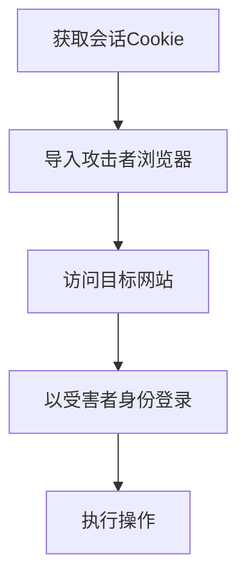

# 浏览器会话劫持 (T1185)

## 一句话通俗理解

攻击者盗用了你浏览器中登录状态的"通行证"——不需要密码，直接冒充你登录各种网站。

## 难度等级

⭐⭐⭐ 高级（需要一定经验）

## 技术描述

浏览器会话劫持（T1185）是MITRE ATT&CK框架中收集战术的一种技术。

**通俗解释：**
你登录网站后，浏览器会保存一个"会话令牌"或"Cookie"——就像你进入游乐园时手上盖的荧光章，工作人员看到这个章就知道你已经买过票了。攻击者如果拿到了你的会话Cookie，就可以冒充你登录网站而完全不需要密码。你登录了公司系统、Gmail、社交媒体，攻击者把这些Cookie一偷，就可以以自己的浏览器冒充你，做任何你能做的事情。更糟糕的是，如果盗窃发生时你正在管理控制台操作，攻击者立刻就能获得你当前的管理权限。

**技术原理：**

1. **窃取浏览器Cookie数据库**：浏览器将Cookie存储在SQLite数据库中（Windows上Chrome的`Cookies`文件、Firefox的`cookies.sqlite`），攻击者通过读取这些文件获取会话Cookie
2. **窃取浏览器本地存储**：读取Local Storage、Session Storage中的认证令牌
3. **实时会话劫持**：通过在受感染浏览器中注入JavaScript代码，实时捕获认证后的HTTP请求中的会话令牌
4. **中间人攻击（AiTM）**：在钓鱼页面和目标网站之间部署反向代理，捕获认证后的Cookie

**用途与影响：**
会话劫持允许攻击者绕过MFA（多因素认证），因为"你已经认证过了"。攻击者通过窃取的会话Cookie可以访问受害者的所有Web应用——包括企业SaaS应用、财务系统、内部管理平台等。这是目前最高效的绕过认证的攻击方式之一，因为用户可能已经养成了每次都正确登录的习惯。

## 子技术列表

该技术没有子技术。

## 攻击流程

### 典型攻击流程

```
获取会话Cookie --> 导入攻击者浏览器 --> 访问目标网站 --> 以受害者身份登录 --> 执行操作
```



**步骤详解：**

1. **获取会话Cookie**
   - 通俗描述：从你的浏览器中偷出代表"已登录"的凭证
   - 技术细节：从Chrome的`AppData\Local\Google\Chrome\User Data\Default\Cookies` SQLite数据库中提取Cookie
   - 常用工具：Lumma Stealer、Vidar、Mimikatz（部分功能）

2. **导入攻击者浏览器**
   - 通俗描述：攻击者把偷到的Cookie装进自己的浏览器
   - 技术细节：使用EditThisCookie等浏览器扩展或直接编辑浏览器的Cookie数据库文件
   - 常用工具：EditThisCookie、Cookie Editor、`curl -b "cookie=value"`

3. **访问目标网站**
   - 通俗描述：攻击者直接打开受害者登录的网站
   - 技术细节：使用窃取的域名和路径直接访问目标Web应用
   - 常用工具：普通浏览器访问

4. **以受害者身份登录**
   - 通俗描述：攻击者被当作已登录用户直接进入系统
   - 技术细节：网站收到伪造的Cookie后会认为当前请求来自已认证用户，直接返回登录后的页面内容
   - 常用工具：无特殊工具，浏览器自动附带Cookie

5. **执行操作**
   - 通俗描述：冒充受害者查看、下载或操作数据
   - 技术细节：访问邮件、下载文件、查看账单、更改设置等
   - 常用工具：浏览器操作、自动化脚本

## 真实案例

### 案例1：Lumma Stealer - Chrome App-Bound加密绕过会话窃取（2025-2026）

- **时间**: 2025年-2026年
- **目标**: 全球Windows用户
- **攻击组织**: Lumma Stealer（MaaS恶意软件即服务平台）
- **手法**: Lumma Stealer是一种订阅制的信息窃取恶意软件，2025年因成功绕过Chrome 127引入的App-Bound Encryption保护而备受关注。Chrome 127通过调用Windows的DPAPI加密Cookie数据库，要求只有Chrome浏览器进程才能解密。Lumma通过代码注入（Code Injection）到Chrome进程中，在Chrome的上下文中调用DPAPI解密Cookie，从而绕过保护。窃取的Cookie包括所有已登录网站的会话令牌（Google、Microsoft、GitHub、AWS等），攻击者获得Cookie后立即登录受害者账户进行数据窃取和凭证填充攻击。
- **影响**: 全球大量Chrome用户的会话Cookie被窃取，攻击者通过窃取的会话访问了多个企业SaaS系统
- **参考链接**: [Lumma Stealer Bypasses Chrome App-Bound Encryption 2025](https://www.bleepingcomputer.com/news/security/lumma-stealer-now-bypasses-chromes-new-app-bound-encryption/)

### 案例2：CrystalRAT - 跨平台浏览器会话Cookie窃取（2026年2月）

- **时间**: 2026年2月（发现时间）
- **目标**: 全球政府机构和金融企业
- **攻击组织**: CrystalRAT运营者
- **手法**: CrystalRAT是一款使用Java编写的信息窃取木马，具备跨平台运行能力（支持Windows、macOS、Linux）。其会话劫持模块针对Chrome、Firefox、Edge和Safari浏览器的Cookie存储进行了优化。CrystalRAT使用操作系统级代码注入技术，从浏览器内存中直接提取认证令牌和会话Cookie，而不是从磁盘文件中读取（因为磁盘文件可能被加密）。在Windows上，CrystalRAT通过APC注入到浏览器进程中，在浏览器的内存空间中执行解密操作。窃取的Cookie通过加密的WebSocket通道传输到C2服务器。
- **影响**: 多个政府机构的云服务账户被入侵
- **参考链接**: [CrystalRAT Analysis - Kaspersky 2026](https://securelist.com/crystalrat-analysis/)

### 案例3：MFA中间人钓鱼 - 会话Cookie实时劫持（2024-2025年普及化）

- **时间**: 2024年-2025年
- **目标**: Microsoft 365用户的全球企业客户
- **攻击组织**: 多个犯罪团伙（包括Scattered Spider、ZIRCONIUM等）
- **手法**: 攻击者使用中间人攻击（AiTM）钓鱼工具（如EvilGinx2、Modlishka）在目标用户和真实登录服务器之间建立反向代理。受害者通过伪造的钓鱼页面（如`login.microsoftonline.com.evil.com`）输入凭据，代理将流量转发到真实的Microsoft登录页面，完成MFA认证后，代理捕获了认证后的会话Cookie。攻击者立即使用捕获的Cookie在自己的浏览器中加载目标邮箱或SaaS应用。这种攻击的主要特点是：即使受害者输入了正确的MFA验证码，也无法防止劫持，因为"认证已经完成了"——攻击者拿到的是认证后的凭证。
- **影响**: 数千家企业被入侵，攻击者通过劫持的会话访问了Microsoft 365邮件和Teams聊天
- **参考链接**: [AiTM Phishing Kits Rising - Microsoft 2024](https://www.microsoft.com/security/blog/2024/06/15/aitm-phishing-kits-rise/)

## 红队视角

> ⚠️ **免责声明**：以下内容仅用于合法的安全测试、渗透测试和教育目的。未经授权对他人系统进行测试是违法行为。

### 实战技巧

1. **使用EditThisCookie导入导出Cookie**
   EditThisCookie是Chrome的浏览器扩展，可以一键导出当前网站的所有Cookie为JSON格式，也可以导入Cookie实现会话劫持的模拟。在红队操作中可以用来演示会话劫持的严重性。

2. **无头浏览器自动化利用**
   使用Puppeteer或Playwright加载窃取的Cookie，实现自动化操作：
   ```javascript
   const puppeteer = require('puppeteer');
   const browser = await puppeteer.launch();
   const page = await browser.newPage();
   await page.setCookie(...stolenCookies);
   await page.goto('https://outlook.office.com');
   ```

3. **钓鱼+会话Cookie组合攻击**
   通过基于WebRTC的端口扫描和反向代理，可以验证目标是否正在使用特定应用，然后精确劫持。

### 常用工具

| 工具名称 | 用途 | 平台 | 链接 |
|----------|------|------|------|
| EditThisCookie | Cookie管理浏览器扩展 | 跨平台 | Chrome Web Store |
| EvilGinx2 | AiTM钓鱼反向代理 | 跨平台 | https://github.com/kgretzky/evilginx2 |
| Modlishka | 中间人钓鱼工具 | 跨平台 | https://github.com/drk1wi/Modlishka |
| Lumma Stealer | 信息窃取（Cookie窃取） | Windows | MaaS |
| Puppeteer | 无头浏览器自动化 | 跨平台 | https://pptr.dev/ |

### 注意事项

- Chrome 127+的App-Bound加密对Cookie数据库进行了额外保护，需要从浏览器内存中窃取
- 会话Cookie通常有有效期限，过期后无法使用
- 某些应用在每次HTTP请求中验证用户代理和IP地址，会话劫持后可能被拒绝访问
- HttpOnly和Secure标志的Cookie无法通过JavaScript访问，但可以从浏览器内存或SQLite数据库中提取

## 蓝队视角

### 检测要点

1. **异常的Cookie使用行为**
   - 日志来源：Web应用日志、Azure AD Sign-in Logs
   - 关注字段：IP地址、用户代理、地理位置
   - 异常特征：同一个会话Cookie从不同地理位置或设备同时使用

2. **不常见的用户代理**
   - 日志来源：HTTP请求日志
   - 关注字段：User-Agent头的变化
   - 异常特征：用户正常使用的浏览器User-Agent突然改变

3. **无MFA触发的登录**
   - 日志来源：认证日志
   - 关注字段：认证类型、MFA状态
   - 异常特征：登录过程中不需要输入MFA验证码（因为使用了之前认证的会话令牌）

### 监控建议

- 启用条件访问策略中的"会话风险"检测
- 监控同一个会话令牌在短时间内从多个IP地址同时使用
- 配置异常登录行为告警（如地理跳跃、设备变化）
- 启用令牌绑定（Token Binding）将认证令牌绑定到特定的TLS会话

## 检测建议

### 网络层检测

**网络流量特征：**
- 检测反向代理类型的HTTP流量模式（evilginx/Muraena等工具代理流量的特征）
- 监控TLS证书指纹与目标站点不匹配的HTTPS连接（自签名证书或LetsEncrypt证书代理合法站点）
- 检测OAuth/SSO重定向流量中的`redirect_uri`指向攻击者控制的仿冒域名
- 监控浏览器Cookie在HTTP头中的异常传输（非浏览器进程发送Cookie到第三方域名）
- 检测仿冒域名的DNS请求（相似域名、typosquatting、同形异义字符域名）

**具体命令示例：**
```bash
# 检测异常TLS连接（JA3指纹黑名单检测）
# 获取TLS连接信息
netsh wlan show peers

# 检测DNS请求中的仿冒域名模式
# 通过DNS日志匹配已知品牌名称+可疑域名后缀
Get-WinEvent -FilterHashtable @{LogName='DNS Server'; ID=256} |
    Where-Object { $_.Message -match 'login|account|verify|auth' -and $_.Message -match '\.xyz|\.top' }
```

**示例（Suricata/IDS规则）：**
```
# 检测浏览器会话劫持 - 仿冒域名代理流量
alert http $HOME_NET any -> $EXTERNAL_NET any (
    msg:"T1185 - 浏览器会话劫持 - 仿冒域名代理流量";
    flow:to_server;
    content:"login|2e|";
    http_uri;
    pcre:"/(login|account|verify|auth)\.[a-z]{2,}\.(xyz|top|club)/Ri";
    sid:1011851; rev:1;
)
```

### 主机层检测

**Windows事件ID：**
- Event ID 4688：进程创建（检测浏览器Cookie窃取进程）
- Sysmon Event ID 1：进程创建
- Sysmon Event ID 10：进程间访问（检测代码注入到浏览器进程）

**具体命令示例：**
```bash
# 检测对Chrome Cookie数据库的访问
Get-WinEvent -FilterHashtable @{LogName='Microsoft-Windows-Sysmon/Operational'; ID=11} |
    Where-Object { $_.Message -match 'Cookies' -and $_.Message -match '\.sqlite' }
```

### 应用层检测

**Sigma规则示例：**
```yaml
title: 会话Cookie窃取工具检测
status: experimental
description: 检测浏览器Cookie数据库被非浏览器进程访问
logsource:
    category: file_access
    product: windows
detection:
    selection:
        Image|endswith:
            - '\chrome.exe'
            - '\firefox.exe'
            - '\msedge.exe'
    exclusion:
        Image|endswith:
            - '\chrome.exe'
            - '\firefox.exe'
            - '\msedge.exe'
    condition: selection and not exclusion
level: high
tags:
    - attack.t1185
    - attack.collection
```

## 缓解措施

### 优先级1：关键措施

**措施名称：** 设置Cookie安全属性

**具体实施步骤：**
1. 确保所有Web应用为Cookie设置了`HttpOnly`、`Secure`和`SameSite=Strict`属性
2. 设置较短的会话超时时间，减少Cookie被窃取后的利用窗口
3. 启用令牌绑定（Token Binding）防止会话Cookie被离线重放

### 优先级2：重要措施

**措施名称：** 风险基础的认证

**具体实施步骤：**
1. 启用条件访问策略，对每次敏感操作重新认证
2. 配置"登录频率"策略要求定期重新认证
3. 启用地标识别（地理位置异常检测）

### 优先级3：建议措施

**措施名称：** 浏览器安全配置

**具体实施步骤：**
1. 保持浏览器更新到最新版本（特别是Chrome 127+的App-Bound加密）
2. 禁用不必要的浏览器扩展
3. 实施浏览器安全策略（如Chrome的GPO策略）

### MITRE ATT&CK 缓解措施映射

| 缓解措施ID | 缓解措施名称 | 适用性 | 说明 |
|------------|-------------|--------|------|
| M0932 | 多因素认证 | 限制适用 | 会话劫持可绕过MFA，但仍需推荐 |
| M0926 | 会话管理 | 适用 | 实施短有效期和重新认证策略 |
| M0928 | 令牌安全 | 适用 | 实施令牌绑定和Cookie安全标志 |

## 动手实验

> ⚠️ **重要提示**：所有实验必须在隔离的实验室环境中进行，禁止对未授权的真实系统进行测试。

### 实验环境准备

**推荐靶场/实验平台：**

| 平台名称 | 类型 | 难度 | 链接 |
|----------|------|------|------|
| PortSwigger Web Security Academy | Web安全训练 | 中级 | https://portswigger.net/web-security |

**所需工具：**
- Burp Suite
- 浏览器
- EditThisCookie扩展

### 实验1：使用Burp Suite演示会话Cookie劫持（高级）

**实验目标：** 通过Burp Suite捕获并重放Cookie模拟会话劫持

**实验步骤：**
1. 访问任意需要登录的Web应用（使用测试环境）
2. 使用Burp Suite作为代理捕获登录后的HTTP请求
3. 记录Cookie头中的会话标识符
4. 在另一个浏览器或Incognito窗口中，使用Burp的Repeater工具发送相同的请求（附带窃取的Cookie）
5. 观察能否成功获取到登录后的页面

**预期结果：** 即使不使用密码，通过重放窃取的Cookie也能访问登录后的页面

**学习要点：** 理解会话劫持的核心原理——服务器只认Cookie，不认用户

## 术语解释

| 术语 | 英文原名 | 通俗解释 |
|------|----------|----------|
| 会话Cookie | Session Cookie | 网站用来标识"你已经登录"的临时凭证，通常有效期较短 |
| AiTM | Adversary-in-the-Middle | 中间人攻击，攻击者插入在用户和目标网站之间 |
| 反向代理 | Reverse Proxy | 一台中转服务器，将请求转发到后面的实际服务器 |
| App-Bound加密 | App-Bound Encryption | Chrome 127引入的安全机制，只有Chrome进程能解密Cookie数据库 |
| 会话重放 | Session Replay | 将捕获到的会话请求重新发送给服务器以执行操作 |

## 参考资料

### 官方文档

- [MITRE ATT&CK - T1185](https://attack.mitre.org/techniques/T1185/)

### 安全报告

- [Lumma Stealer Bypasses Chrome App-Bound Encryption](https://www.bleepingcomputer.com/news/security/lumma-stealer-now-bypasses-chromes-new-app-bound-encryption/)
- [CrystalRAT Analysis - Kaspersky 2026](https://securelist.com/crystalrat-analysis/)
- [AiTM Phishing Kits Rise - Microsoft 2024](https://www.microsoft.com/security/blog/2024/06/15/aitm-phishing-kits-rise/)

### 工具与资源

- [EvilGinx2](https://github.com/kgretzky/evilginx2) - 中间人钓鱼框架
- [EditThisCookie](https://www.editthiscookie.com/) - Cookie管理扩展
- [PortSwigger Session Hijacking Lab](https://portswigger.net/web-security/session-hijacking)
