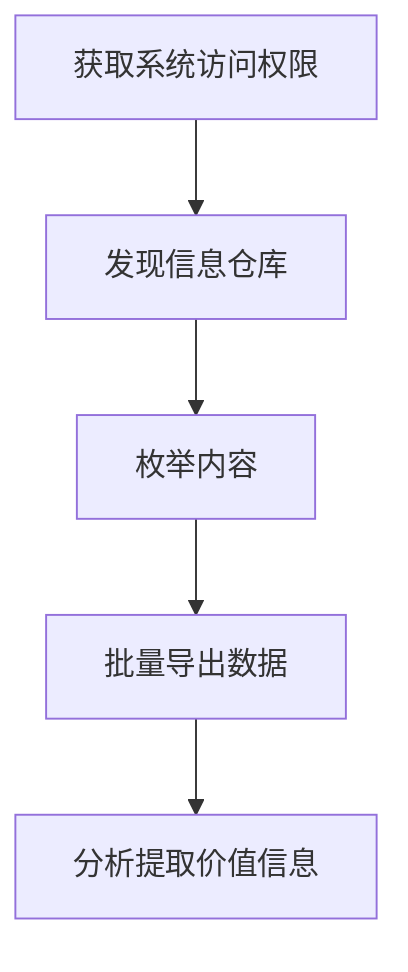

# 从信息仓库收集数据 (T1213)

## 一句话通俗理解

攻击者偷偷翻看你公司内部的"百宝箱"——Wiki、Confluence、SharePoint、Git仓库里的机密文档和数据。

## 30秒速查卡

| 维度 | 你需要知道的 |
|------|-------------|
| 这是什么？ | 攻击者偷偷翻看你公司内部的"百宝箱"——Wiki、Confluence、SharePoint、Git仓库里的机密文档和数 |
| 为什么危险？ | 信息仓库是企业知识的集散地，通常包含大量高价值的敏感数据。攻击者从信息仓库获取的数据可能包括：源代码和API密钥、客户数 |
| 谁需要关心？ | 数据安全团队、SOC分析师 |
| 你的第一步防御 | 异常的批量数据访问 |
| 如果只做一件事 | 几乎每家公司都有内部的"知识库"——Confluence用于写技术文档，SharePoint用于共享 |

## 难度等级

⭐⭐ 中级（需要一定基础）

## 技术描述

从信息仓库收集数据（T1213）是MITRE ATT&CK框架中收集战术的一种技术。

**通俗解释：**
几乎每家公司都有内部的"知识库"——Confluence用于写技术文档，SharePoint用于共享文件，GitLab/GitHub用于存放代码，Jira用于跟踪项目进度。这些系统里包含了公司的核心资产：技术方案、源代码、客户数据、产品设计、内部流程。攻击者一旦入侵了公司内部网络或窃取了某个员工的凭据，就可以登录这些信息仓库，像翻阅"敌情资料库"一样获取大量敏感信息。

**技术原理：**

1. **利用有效的凭据登录**：使用窃取的用户名和密码或OAuth令牌直接登录信息仓库系统
2. **通过API批量获取数据**：调用系统提供的REST API或CLI工具批量搜索和下载文档、代码仓库和数据
3. **利用配置错误的公开仓库**：直接访问配置为公开或未正确设置权限的信息仓库
4. **利用内部信任关系**：一旦内网某台机器被控制，利用同一凭据或令牌访问多个信息仓库系统

**用途与影响：**
信息仓库是企业知识的集散地，通常包含大量高价值的敏感数据。攻击者从信息仓库获取的数据可能包括：源代码和API密钥、客户数据和PII、系统架构文档和网络拓扑、管理流程和凭据登录信息、产品设计和商业模式。

## 子技术列表

**该技术共有 4 个子技术：**

| 子技术ID | 中文名称 | 通俗解释 |
|----------|----------|----------|
| T1213.001 | 从Confluence/Wiki收集 | 从Confluence或企业Wiki中搜索和导出知识库文档 |
| T1213.002 | 从SharePoint收集 | 从Microsoft SharePoint或OneDrive中下载共享文件和文档 |
| T1213.003 | 从代码仓库收集 | 从GitHub、GitLab、Bitbucket等代码仓库克隆代码库 |
| T1213.004 | 从Jira收集 | 从Jira等项目管理工具中获取项目信息和关联文档 |

<details>
<summary><strong>展开查看各子技术详细说明</strong></summary>

各子技术详细说明请参阅独立文档：

- [T1213.001 - 从Confluence/Wiki收集](./T1213/T1213.001-Confluence-Wiki Data-从Confluence-Wiki收集.md) — 攻击者登录你们公司的Confluence，把技术文档和设计文档全部下载走。
- [T1213.002 - 从SharePoint收集](./T1213/T1213.002-SharePoint Data-从SharePoint收集.md) — 攻击者登录你们公司的SharePoint，把共享文件夹中的所有文件下载走。
- [T1213.003 - 从代码仓库收集](./T1213/T1213.003-Code Repository Data-从代码仓库收集.md) — 攻击者克隆(下载)你们公司的私有代码仓库，把源代码全部偷走。
- [T1213.004 - 从Jira收集](./T1213/T1213.004-Jira Data-从Jira收集.md) — 攻击者登录你们公司的Jira，查看所有的项目计划和敏感讨论。

</details>

## 攻击流程

### 典型攻击流程

```
获取内部系统访问权限 --> 发现信息仓库 --> 枚举内容 --> 批量导出数据 --> 分析提取价值信息
```



**步骤详解：**

1. **获取系统访问权限**
   - 通俗描述：通过窃取的员工凭证登录公司内部系统
   - 技术细节：从LSASS内存中提取凭据，或从浏览器Cookie中获取SaaS应用令牌
   - 常用工具：Mimikatz、Lumma Stealer、浏览器Cookie提取器

2. **发现信息仓库**
   - 通俗描述：扫描内网找到Confluence、SharePoint等系统的地址
   - 技术细节：通过DNS枚举、Web扫描或浏览用户的浏览器书签发现信息仓库URL
   - 常用工具：`curl`、浏览器历史分析、内网扫描

3. **枚举内容**
   - 通俗描述：查看信息仓库中有哪些空间、站点或仓库
   - 技术细节：列出Confluence的所有空间、SharePoint的站点集合、GitLab的项目列表
   - 常用工具：各系统REST API、`git ls-remote`

4. **批量导出数据**
   - 通俗描述：将找到的所有文档、代码或文件打包下载
   - 技术细节：使用API批量导出，或直接克隆整个代码仓库
   - 常用工具：`git clone`、`curl`管道、PowerShell脚本

5. **分析提取价值信息**
   - 通俗描述：从下载的数据中找出密码、API密钥、客户信息等
   - 技术细节：搜索代码提交历史中的硬编码凭据、分析含有关键词的文档
   - 常用工具：`grep`、`truffleHog`、`GitLeaks`

## 真实案例

### 案例1：Scattered Spider (UNC3944) - SaaS信息仓库大规模数据窃取（2025年）

- **时间**: 2025年
- **目标**: 美国多家科技和金融企业
- **攻击组织**: Scattered Spider (UNC3944)
- **手法**: Scattered Spider以社会工程学手段著称，在2025年的大规模攻击中，他们通过SIM交换和社会工程学呼叫获取了多个企业员工的Okta管理员权限。一旦获得Okta超级管理员访问权限，他们可以绕过MFA登录所有集成了SSO的SaaS应用。攻击者随后登录了受害企业的Confluence（T1213.001）和SharePoint（T1213.002），使用Confluence REST API和Microsoft Graph API批量导出了数以万计的文档。窃取的数据包括网络安全架构图、客户合同、内部流程文档和源代码仓库链接。攻击者还利用获得的凭据登录了GitHub Enterprise（T1213.003），克隆了多个包含API密钥的私有仓库。
- **影响**: 多家企业的核心知识产权和客户数据被窃取，部分企业遭受勒索
- **参考链接**: [Scattered Spider SaaS Attacks - CrowdStrike 2025](https://www.crowdstrike.com/blog/scattered-spider-targets-saas-applications/)

### 案例2：Lapsus$ - 从内部Git仓库窃取源代码（2021-2022年）

- **时间**: 2021年-2022年
- **目标**: Microsoft、Nvidia、Samsung、Okta等科技巨头
- **攻击组织**: Lapsus$ (黑客组织)
- **手法**: Lapsus$通过窃取员工的VPN凭据和MFA会话令牌进入目标公司的内部网络。进入后，攻击者立即搜索并访问内网中的Git仓库和Confluence实例。Lapsus$使用`git clone`命令克隆了包括Microsoft的Bing Maps、Cortana源代码，Nvidia的GPU驱动源代码，以及Samsung的生物识别算法源码在内的大量代码仓库（T1213.003）。攻击者还从Confluence中导出了内部架构文档和API密钥。Lapsus$使用Telegram频道公开部分窃取的源代码，造成目标企业的品牌和声誉损失。Lapsus$事后声称"不需要高级利用，只需要凭据"。
- **影响**: 多家科技巨头的核心源代码被泄露，品牌声誉严重受损
- **参考链接**: [Lapsus$ Cyber Attack Analysis - Mandiant 2022](https://www.mandiant.com/resources/uncategorized/lapsus-attribution)

### 案例3：APT29 (Cozy Bear) - SharePoint和代码仓库收集（2020-2023）

- **时间**: 2020年-2023年
- **目标**: 美国政府部门、国防承包商
- **攻击组织**: APT29 (Cozy Bear / Nobelium)
- **手法**: APT29在SolarWinds攻击事件后，继续利用获得的初始访问权限渗透目标组织的内部网络。攻击者使用名为"MagicWeb"和"FoggyWeb"的后门工具，冒充合法管理员登录了目标的SharePoint和GitHub Enterprise。在SharePoint中（T1213.002），APT29使用Microsoft Graph API搜索包含"密码"、"凭据"、"VPN"等关键词的文档。在GitHub Enterprise中（T1213.003），攻击者搜索代码提交历史中的硬编码凭据（使用`git log -p | grep password`）和配置文件。攻击者还从Jira（T1213.004）中导出了项目任务和Bug报告，了解目标的安全漏洞修复进度。
- **影响**: 美国政府承包商的项目计划和供应链安全信息被窃取
- **参考链接**: [APT29 Post-SolarWinds Activities - Microsoft 2021](https://www.microsoft.com/security/blog/2021/05/28/breaking-down-nobeliums-latest-activity/)

## 红队视角

> ⚠️ **免责声明**：以下内容仅用于合法的安全测试、渗透测试和教育目的。未经授权对他人系统进行测试是违法行为。

### 实战技巧

1. **使用Confluence REST API批量导出**
   使用Confluence API可以快速列出并导出所有空间的内容：
   ```bash
   # 列出所有空间
   curl -u username:token "https://confluence.example.com/rest/api/space"
   # 导出指定空间的所有页面
   curl -u username:token "https://confluence.example.com/rest/api/content?spaceKey=DEV&expand=body.storage&limit=100"
   ```

2. **使用Microsoft Graph API导出SharePoint文件**
   ```powershell
   # 连接Graph API
   Connect-MgGraph -Scopes "Sites.Read.All"
   # 列出所有SharePoint站点
   Get-MgSite | Select-Object Id, DisplayName, WebUrl
   # 下载站点中的文件
   Get-MgDriveItem -DriveId $driveId -ItemId $itemId
   ```

3. **使用GitLeaks扫描历史提交中的凭据**
   克隆仓库后使用GitLeaks自动化扫描硬编码凭据：
   ```bash
   gitleaks detect --source ./cloned-repo --report-path report.json
   ```

### 常用工具

| 工具名称 | 用途 | 平台 | 链接 |
|----------|------|------|------|
| Microsoft Graph PowerShell | SharePoint/Exchange Online操作 | 跨平台 | Microsoft官方 |
| GitLeaks | Git仓库硬编码凭据扫描 | 跨平台 | https://github.com/gitleaks/gitleaks |
| truffleHog | Git仓库敏感数据搜索 | 跨平台 | https://github.com/trufflesecurity/trufflehog |
| git | 代码仓库克隆和操作 | 跨平台 | https://git-scm.com/ |
| curl | HTTP API请求工具 | 跨平台 | 系统内置 |

### 注意事项

- 大规模API导出会产生大量的日志和流量，可能会触发SOC告警
- 信息仓库系统通常有API速率限制，过快请求会被阻断
- 很多系统提供了审计日志功能，记录谁在什么时间访问了什么内容
- 代码仓库的克隆行为会产生明显的网络流量（特别是大仓库）

## 蓝队视角

### 检测要点

1. **异常的批量数据访问**
   - 日志来源：Confluence/SHarePoint/GitLab的审计日志
   - 关注字段：API调用频率、导出的页面/文件数量、查询类型
   - 异常特征：单个账户在短时间内查询了大量空间或页面，频率远超正常使用行为

2. **多个系统的帐户异常访问**
   - 日志来源：IAM系统、IdP日志（如Okta、Azure AD）
   - 关注字段：用户在多个系统（Confluence + SharePoint + GitLab）的登录时间
   - 异常特征：同一账户在非工作时间从同一设备登录多个信息仓库系统

3. **代码仓库的未知克隆**
   - 日志来源：GitHub/GitLab/Lab audit log
   - 关注字段：`git clone`操作、仓库访问者IP
   - 异常特征：非预期的仓库克隆，特别是完整仓库的首次克隆操作

### 监控建议

- 启用Confluence、SharePoint、GitLab的审计日志并发送到SIEM
- 配置异常下载告警（如在短时间内下载超过50个文档或文件）
- 监控代码仓库的克隆操作，识别非预期的仓库克隆
- 对信息仓库系统的API调用进行速率分析和异常检测

## 检测建议

### 网络层检测

**网络流量特征：**
- 监控Confluence/Jira/SharePoint API的调用频率峰值和下载流量突增
- 检测Git数据包（Git PACK files）的大规模传输：单个clone操作远超正常仓库大小的流量
- 监控单一用户在短时间内从Wiki或SharePoint批量导出页面的网络流量模式
- 检测基于Graph API的异常大规模邮件/文件枚举的HTTP请求频率
- 分析网络代理日志中针对协作平台API的异常访问来源IP和User-Agent

**具体命令示例：**
```bash
# 检测Confluence API的批量下载模式（通过代理日志或NetFlow分析）
# tshark -Y "http.request.uri contains '/rest/api/content' and http.request.uri contains 'limit=100'" -T fields -e ip.src -e http.request.full_uri

# 检测Git大规模clone的数据包特征
# tshark -Y "tcp.port == 9418 or tcp.port == 22" -T fields -e frame.len -e ip.src | awk '$1 > 10000' | wc -l
```

**示例（Suricata/IDS规则）：**
```
# 检测Confluence/SharePoint API批量数据下载
alert http $HOME_NET any -> $EXTERNAL_NET any (
    msg:"T1213 - 信息库数据 - API批量数据下载";
    flow:to_server;
    content:"/rest/api/content";
    http_uri;
    content:"limit=";
    http_uri;
    threshold:type both, track by_src, count 50, seconds 60;
    sid:1012131; rev:1;
)
```

### 主机层检测

**Windows事件ID：**
- Event ID 4688：进程创建（检测`git clone`等操作）
- PowerShell Event ID 4104：Script Block Logging
- Sysmon Event ID 3：网络连接（检测对Confluence/SharePoint API的连接）

**具体命令示例：**
```bash
# 检测Confluence API的PowerShell调用
Get-WinEvent -FilterHashtable @{LogName='Microsoft-Windows-PowerShell/Operational'; ID=4104} |
    Where-Object { $_.Message -match 'confluence' -and $_.Message -match '/rest/api' }
```

### 应用层检测

**用人话说：**

> 信息仓库是企业的"知识金矿"——Confluence/Wiki存有项目文档和技术方案、SharePoint存有公司政策和部门报告、Git仓库存有源代码和CI/CD配置、Jira存有项目管理和工单数据。攻击者利用窃取到的API Token或OAuth授权，通过REST API批量导出这些平台的数据。比如使用Confluence的/csv或/pdf导出功能批量拉取页面，或者git clone整个代码仓库。这类收集通常不涉及恶意软件，攻击者用curl、wget或Postman就能完成。检测方法：监控API调用的异常频率和范围（如一个用户在5分钟内导出了50个Confluence页面）、代码仓库的git clone操作的来源IP和用户不属于开发团队。
>
> **避坑指南**：未区分正常SSH管理连接和异常横向；未启用PowerShell脚本块日志；未监控异常会话令牌使用。

**Sigma规则示例：**
```yaml
title: 批量信息仓库导出检测
status: experimental
description: 检测用户通过API批量导出Confluence或SharePoint内容
logsource:
    category: process_creation
    product: windows
detection:
    selection:
        CommandLine|contains|all:
            - 'Get-MgSite'
            - 'Get-MgDriveItem'
    condition: selection
level: high
tags:
    - attack.t1213
    - attack.collection
```

## 缓解措施

### 优先级1：关键措施

**措施名称：** 最小权限原则和访问控制

**具体实施步骤：**
1. 对信息仓库实施基于角色的访问控制（RBAC）
2. 限制用户只能访问其工作相关的空间/站点/仓库
3. 定期审计用户权限，移除不必要的访问权限

### 优先级2：重要措施

**措施名称：** API访问控制和速率限制

**具体实施步骤：**
1. 对信息仓库的API访问实施速率限制
2. 禁用或限制个人访问令牌的使用，使用应用程序权限代替
3. 启用条件访问策略，要求在非信任位置额外验证

### 优先级3：建议措施

**措施名称：** 敏感数据发现和标记

**具体实施步骤：**
1. 部署数据分类工具对Confluence/SharePoint中的敏感内容进行识别和标记
2. 在Git仓库中使用预提交钩子（pre-commit hooks）防止硬编码凭据提交
3. 定期使用GitLeaks扫描内部Git仓库中的硬编码凭据

### MITRE ATT&CK 缓解措施映射

| 缓解措施ID | 缓解措施名称 | 适用性 | 说明 |
|------------|-------------|--------|------|
| M0935 | 最小权限原则 | 适用 | 限制信息仓库的访问权限 |
| M0926 | API安全 | 适用 | API速率限制和令牌管理 |
| M0928 | 凭据安全 | 部分适用 | 防止硬编码凭据 |

## 动手实验

> ⚠️ **重要提示**：所有实验必须在隔离的实验室环境中进行，禁止对未授权的真实系统进行测试。

### 实验环境准备

**推荐靶场/实验平台：**

| 平台名称 | 类型 | 难度 | 链接 |
|----------|------|------|------|
| Hack The Box | 渗透测试训练平台 | 中级 | https://www.hackthebox.com/ |
| TryHackMe | 网络安全学习平台 | 初级-中级 | https://tryhackme.com/ |

**所需工具：**
- curl / PowerShell
- Git

### 实验1：使用公开API探索Confluence数据（中级）

**实验目标：** 使用Confluence REST API浏览和导出空间内容

**实验步骤：**
1. 访问Atlassian的公共Confluence测试实例（https://confluence.atlassian.com/）
2. 使用REST API列出空间列表：
   ```bash
   curl -s "https://confluence.atlassian.com/rest/api/space" | jq '.results[] | {key, name}'
   ```
3. 列出指定空间中的页面：
   ```bash
   curl -s "https://confluence.atlassian.com/rest/api/content?spaceKey=~username" | jq '.results[] | {id, title}'
   ```

**预期结果：** 成功列出Confluence空间和页面

**学习要点：** 理解攻击者如何使用公开的REST API遍历知识库内容

## 术语解释

| 术语 | 英文原名 | 通俗解释 |
|------|----------|----------|
| REST API | RESTful API | 通过HTTP请求操作数据的编程接口 |
| 空间 | Space | Confluence中的顶级组织单元，相当于一个项目的所有文档 |
| 仓库 | Repository | Git中存储源代码和版本历史的地方 |
| OAuth令牌 | OAuth Token | 一种授权凭证，允许应用代表用户访问资源 |
| RBAC | Role-Based Access Control | 基于角色的访问控制，根据用户角色分配权限 |

## 参考资料

### 官方文档

- [MITRE ATT&CK - T1213](https://attack.mitre.org/techniques/T1213/)
- [MITRE ATT&CK - T1213.001](https://attack.mitre.org/techniques/T1213/001/)
- [MITRE ATT&CK - T1213.002](https://attack.mitre.org/techniques/T1213/002/)
- [MITRE ATT&CK - T1213.003](https://attack.mitre.org/techniques/T1213/003/)
- [MITRE ATT&CK - T1213.004](https://attack.mitre.org/techniques/T1213/004/)

### 安全报告

- [Scattered Spider SaaS Attacks - CrowdStrike 2025](https://www.crowdstrike.com/blog/scattered-spider-targets-saas-applications/)
- [Lapsus$ Cyber Attack Analysis - Mandiant](https://www.mandiant.com/resources/uncategorized/lapsus-attribution)
- [APT29 Post-SolarWinds - Microsoft](https://www.microsoft.com/security/blog/2021/05/28/breaking-down-nobeliums-latest-activity/)

### 工具与资源

- [Confluence REST API Documentation](https://developer.atlassian.com/cloud/confluence/rest/)
- [Microsoft Graph API for SharePoint](https://learn.microsoft.com/en-us/graph/api/resources/sharepoint)
- [GitLeaks](https://github.com/gitleaks/gitleaks) - Git仓库凭据扫描
- [GitHub Audit Log API](https://docs.github.com/en/rest/orgs/orgs#get-audit-log)
