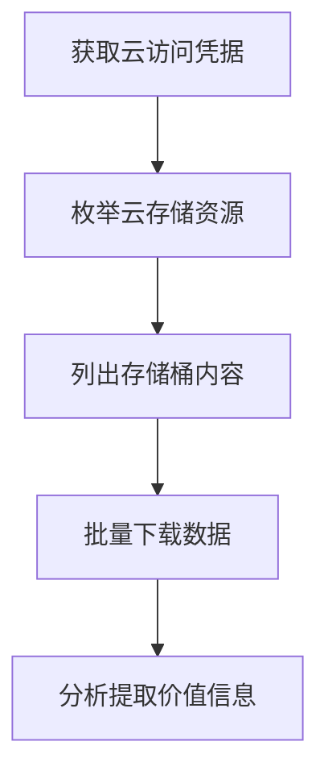

# 从云存储收集数据 (T1530)

## 一句话通俗理解

攻击者翻看你公司放在云上的"共享文件夹"——S3存储桶、Azure Blob、Google Cloud Storage里的数据。

## 难度等级

⭐⭐ 中级（需要一定基础）

## 技术描述

从云存储收集数据（T1530）是MITRE ATT&CK框架中收集战术的一种技术。

**通俗解释：**
很多公司把文件和数据存在云存储服务上——Amazon S3、Azure Blob Storage、Google Cloud Storage、阿里云OSS。这些存储桶（Bucket）就像放在云上的共享文件夹。如果配置不当或凭据泄露，攻击者可以直接访问这些云存储桶，把里面的数据全部下载走。更糟糕的是，很多存储桶默认配置为"公开可读"——任何人都可以访问，不需要密码。攻击者会专门扫描互联网上配置错误的云存储桶。

**技术原理：**

1. **利用泄露的云凭据**：使用窃取的AWS Access Key、Azure SAS Token或GCP Service Account Key直接访问云存储
2. **利用错误配置**：直接访问配置为公开读写的云存储桶（Bucket Policy错误配置）
3. **利用IAM权限漏洞**：通过IAM角色传递（Role Chaining）或权限提升获得对存储桶的访问权限
4. **扫描公开存储桶**：使用自动化工具扫描公开的S3存储桶名称（Bucket Name Brute Force）

**用途与影响：**
云存储通常存储着各种数据——数据库备份、日志文件、用户上传的文件、静态资源。一次云存储数据的泄露可能导致数百万用户的个人信息被曝光，造成严重的合规风险（GDPR、CCPA等）。

## 子技术列表

该技术没有子技术。

## 攻击流程

### 典型攻击流程

```
获取云访问凭据 --> 枚举云存储资源 --> 列出存储桶内容 --> 批量下载数据 --> 分析提取价值信息
```



**步骤详解：**

1. **获取云访问凭据**
   - 通俗描述：从代码仓库、环境变量或内存中窃取云服务凭据
   - 技术细节：AWS Access Key、Azure SAS Token、GCP Service Account JSON Key
   - 常用工具：GitLeaks、truffleHog、环境变量读取

2. **枚举云存储资源**
   - 通俗描述：找出云账户中有哪些存储桶/容器
   - 技术细节：使用`aws s3 ls`列出所有S3存储桶，或使用Azure CLI的`az storage container list`
   - 常用工具：AWS CLI、Azure CLI、GCloud CLI

3. **列出存储桶内容**
   - 通俗描述：查看存储桶中有哪些文件
   - 技术细节：使用`aws s3 ls s3://bucket-name/ --recursive`递归列出文件
   - 常用工具：AWS CLI、Cloud Storage Browser、自定义脚本

4. **批量下载数据**
   - 通俗描述：将存储桶中的所有文件下载到本地
   - 技术细节：使用`aws s3 sync s3://bucket-name/ ./download/`同步全部内容
   - 常用工具：`aws s3 sync`、`az storage blob download-batch`、`gsutil cp -r`

5. **分析提取价值信息**
   - 通俗描述：从下载的数据中找出密码、个人信息、API密钥等
   - 技术细节：搜索配置文件中包含的凭据、解析CSV/JSON格式的用户数据
   - 常用工具：Python脚本、`jq`、`grep`

## 真实案例

### 案例1：INC Ransomware - AWS S3数据大规模窃取（2025年2月）

- **时间**: 2025年2月
- **目标**: 全球医疗、教育机构
- **攻击组织**: INC Ransomware
- **手法**: INC勒索软件团伙使用泄露的AWS Access Key入侵受害者的AWS账户，访问了S3存储桶（T1530）。攻击者使用`aws s3 ls`命令枚举所有S3存储桶，然后使用`aws s3 sync`将存储桶中的全部数据同步到攻击者控制的环境中。窃取的数据包括医疗记录、学生信息、财务数据等超过1TB的敏感信息。INC Ransomware随后对窃取的数据进行双重勒索——先加密系统再威胁公开窃取的数据。美国卫生与公众服务部（HHS）在2025年2月发布警告，确认INC Ransomware的攻击活动。
- **影响**: 多家医疗和教育机构的患者信息和学生数据被窃取并公开勒索
- **参考链接**: [INC Ransomware Warning - HHS 2025](https://www.hhs.gov/about/agencies/asa/hec-ransomware/inc-ransomware-guidance.html)

### 案例2：Attila - 公开S3存储桶中的医疗数据泄露（2024年8月）

- **时间**: 2024年8月（发现时间）
- **目标**: 美国多个医疗相关企业
- **攻击组织**: Attila安全研究员（漏洞披露而非恶意攻击）
- **手法**: 安全研究员Attila利用自动化扫描技术发现了数千个配置错误的公开S3存储桶。攻击面包括因Bucket Policy配置为`Principal: "*"`且`Effect: "Allow"`而公开可读的存储桶。发现的数据包括：明火数据（Open Fire Data）项目中数万医疗记录、电信公司VoIP通话记录（包含电话号码和会话详情）、中国存储提供商基础设施漏洞泄露的数万条记录。这些存储桶不需要任何身份验证或API密钥即可访问。
- **影响**: 暴露了超过5000万条用户记录，包括医疗数据和通话记录
- **参考链接**: [Attila S3 Bucket Misconfigurations 2024](https://www.kitploit.com/2024/08/one-scan-5000-confidential-records-unsecured-s3-bucket-misconfiguration.html)

### 案例3：Lazada - 阿里云OSS配置错误导致数据泄露（2024年9月）

- **时间**: 2024年9月
- **目标**: Lazada（东南亚电商平台）
- **攻击组织**: 外部发现者（白帽）
- **手法**: 东南亚电商Lazada因阿里云OSS（对象存储服务）配置错误，导致大量内部数据被公开访问。配置错误的存储桶包含Lazada的移动应用源代码、员工和客户信息、内部API文档、以及用于开发和测试的Dynatrace监控令牌。攻击者不需要任何凭据即可读取存储桶内容。Lazada事后确认此事件是由于内部系统配置错误导致的，并修复了相关配置。
- **影响**: 敏感内部数据被公开访问，包含客户信息和内部API凭据
- **参考链接**: [Lazada OSS Leak - Cyber News 2024](https://cybernews.com/security/lazada-source-code-leak-alibaba-oss/)

## 红队视角

> ⚠️ **免责声明**：以下内容仅用于合法的安全测试、渗透测试和教育目的。未经授权对他人系统进行测试是违法行为。

> ⚠️ **免责声明**：以下内容仅用于合法的安全测试、渗透教育和授权渗透测试。

### 实战技巧

1. **使用AWS CLI批量下载**
   ```bash
   # 配置窃取的AWS凭据
   aws configure set aws_access_key_id AKIAXXXXXXXXXX
   aws configure set aws_secret_access_key xxxxxxxxxxxxx
   # 枚举所有S3存储桶
   aws s3 ls
   # 下载指定存储桶的全部内容
   aws s3 sync s3://target-bucket ./target-data/
   ```

2. **使用S3Scanner发现公开存储桶**
   使用S3Scanner工具对常见单词列表进行暴力枚举，发现公开的S3存储桶：
   ```bash
   s3scanner scan --buckets-file bucket-names.txt --dump
   ```

3. **利用临时安全令牌访问**
   如果找到AWS STS的临时凭据，使用`AWS_SESSION_TOKEN`环境变量配合Access Key访问：
   ```bash
   export AWS_ACCESS_KEY_ID=...
   export AWS_SECRET_ACCESS_KEY=...
   export AWS_SESSION_TOKEN=...
   aws s3 ls
   ```

### 常用工具

| 工具名称 | 用途 | 平台 | 链接 |
|----------|------|------|------|
| AWS CLI | AWS服务命令行操作 | 跨平台 | https://aws.amazon.com/cli/ |
| Azure CLI | Azure服务命令行操作 | 跨平台 | https://learn.microsoft.com/en-us/cli/azure/ |
| GCloud CLI | GCP服务命令行操作 | 跨平台 | https://cloud.google.com/sdk |
| S3Scanner | 公开S3存储桶扫描 | 跨平台 | https://github.com/sa7mon/S3Scanner |
| Cloud Storage Browser | 云存储图形化管理 | 跨平台 | 第三方工具 |

### 注意事项

- 大规模下载云存储桶会产生巨额传输费用（Egress Cost），可能被账单告警捕获
- 云服务提供商会记录所有API请求到CloudTrail（AWS）或Activity Log（Azure）
- IAM角色临时凭据有过期时间（通常为1小时），过期后需要重新获取
- 某些存储桶启用了版本控制，需要额外遍历历史版本

## 蓝队视角

### 检测要点

1. **异常的S3/Blob API调用**
   - 日志来源：AWS CloudTrail、Azure Activity Log
   - 关注字段：`ListBuckets`、`GetObject`、`ListObjects`操作的SourceIP和UserAgent
   - 异常特征：来自不常用地理位置或IP的大量S3 API请求

2. **大规模数据下载**
   - 日志来源：AWS CloudTrail、VPC Flow Logs
   - 关注字段：`GetObject`调用的数量和对象大小
   - 异常特征：在短时间内对同一存储桶的多个`GetObject`调用

3. **公开存储桶访问**
   - 日志来源：S3 Server Access Logs
   - 关注字段：匿名请求（`requester: Anonymous`）
   - 异常特征：非AWS服务来源的公共访问请求

### 监控建议

- 启用AWS CloudTrail或Azure Activity Log记录所有存储操作
- 配置异常API调用告警（如在非工作时间大量`GetObject`请求）
- 定期使用S3 Scanner等工具测试自己的存储桶是否公开可读
- 监控存储桶策略的变化（`PutBucketPolicy`事件）

## 检测建议

### 网络层检测

**网络流量特征：**
- 监控云存储API（S3 ListObjectsV2、GetObject、OneDrive Graph API）的高频请求
- 检测从云存储到非预期外部IP或新地域IP的大规模数据传输
- 监控基于OAuth token认证的云存储访问流量中的异常访问模式
- 分析CloudTrail或云存储访问日志中的异常下载量、来源IP地理分布和User-Agent
- 检测存储桶（Bucket）大量列举操作的网络请求特征（连续的HEAD/GET请求）

**具体命令示例：**
```bash
# 通过CloudTrail检测S3异常下载（AWS CLI）
# aws cloudtrail lookup-events --lookup-attributes AttributeKey=EventName,AttributeValue=GetObject --start-time $(date -d '1 hour ago' +%Y-%m-%dT%H:%M:%S) --query 'Events[?contains(CloudTrailEvent,`"bytes":1048576`)].Username' --output text

# 检测存储桶列举操作频率
# aws cloudtrail lookup-events --lookup-attributes AttributeKey=EventName,AttributeValue=ListObjectsV2 --max-results 50
```

**示例（Suricata/IDS规则）：**
```
# 检测云存储批量文件下载 - S3 GetObject高频请求
alert http $HOME_NET any -> $EXTERNAL_NET 443 (
    msg:"T1530 - 云存储数据 - S3/Blob批量对象下载";
    flow:to_server;
    content:"s3|2e|";
    http_header;
    content:"GET";
    http_method;
    content:".xml";
    http_uri;
    threshold:type both, track by_src, count 100, seconds 60;
    sid:1015301; rev:1;
)
```

### 主机层检测

**Windows事件ID：**
- 主要依赖云服务审计日志（非Windows原生审计）
- Sysmon Event ID 3：网络连接（检测对AWS S3的API连接）
- PowerShell Event ID 4104：Script Block Logging

**具体命令示例：**
```bash
# 通过AWS CLI检查S3存储桶权限
aws s3api get-bucket-acl --bucket target-bucket
# 通过CloudTrail日志检测大规模下载
aws cloudtrail lookup-events --lookup-attributes AttributeKey=EventName,AttributeValue=GetObject
```

### 应用层检测

**Sigma规则示例：**
```yaml
title: 异常S3存储桶数据下载检测
status: experimental
description: 检测从S3存储桶中下载大量对象的API调用模式
logsource:
    category: aws_cloudtrail
    product: aws
detection:
    selection:
        eventSource: 's3.amazonaws.com'
        eventName: 'GetObject'
    condition: |-
      // 在短时间(5分钟内)对20个以上不同对象的GetObject操作
      // 需要SIEM中的聚合和基线分析支持
level: high
tags:
    - attack.t1530
    - attack.collection
```

## 缓解措施

### 优先级1：关键措施

**措施名称：** 云存储桶配置审计

**具体实施步骤：**
1. 启用AWS S3的公有访问阻止设置（Block Public Access）
2. 使用AWS Config或Azure Policy自动检测公开可读的存储桶
3. 对所有存储桶应用最小权限的Bucket Policy
4. 定期使用`aws s3api get-bucket-policy-status`检查公开访问状态

### 优先级2：重要措施

**措施名称：** 云凭据管理

**具体实施步骤：**
1. 使用临时凭据（AWS STS、Azure Managed Identity）代替长期Access Key
2. 实施IAM最小权限原则，限制对存储桶的访问
3. 定期轮换Access Key，监控凭据泄露

### 优先级3：建议措施

**措施名称：** 加密和数据保护

**具体实施步骤：**
1. 对S3存储桶启用服务器端加密（SSE-S3/SSE-KMS）
2. 启用S3版本控制以在数据泄露后可以溯源
3. 启用S3 Server Access Logs记录所有访问

### MITRE ATT&CK 缓解措施映射

| 缓解措施ID | 缓解措施名称 | 适用性 | 说明 |
|------------|-------------|--------|------|
| M0935 | 最低权限原则 | 适用 | 限制对云存储桶的访问权限 |
| M0923 | 云配置管理 | 适用 | 自动化检测公开配置 |
| M0926 | 凭据管理 | 适用 | 使用临时凭据代替永久凭据 |

## 动手实验

> ⚠️ **重要提示**：所有实验必须在隔离的实验室环境中进行，禁止对未授权的真实系统进行测试。

### 实验环境准备

**所需工具：**
- AWS免费账户（Free Tier）
- AWS CLI

### 实验1：使用AWS CLI探索S3存储桶（中级）

**实验目标：** 学习使用AWS CLI列出存储桶并下载文件

**实验步骤：**
1. 创建AWS免费账户并配置AWS CLI
2. 创建一个测试S3存储桶并上传一些测试文件
3. 练习API调用：
   ```bash
   # 列出所有存储桶
   aws s3 ls
   
   # 列出存储桶中的文件
   aws s3 ls s3://your-test-bucket/
   
   # 下载存储桶中的文件
   aws s3 sync s3://your-test-bucket/ ./downloaded-files/
   ```

**预期结果：** 成功使用AWS CLI列出存储桶内容并下载文件

**学习要点：** 理解攻击者如何使用AWS CLI操作S3存储桶

## 术语解释

| 术语 | 英文原名 | 通俗解释 |
|------|----------|----------|
| S3 | Simple Storage Service | AWS的对象存储服务，用于存储和检索任意数据 |
| 存储桶 | Bucket | S3中的容器，相当于一个文件夹，存放各种数据文件 |
| Access Key | AWS Access Key ID/Secret | 访问AWS API的凭据对，相当于用户名和密码 |
| CloudTrail | AWS CloudTrail | AWS的API审计日志服务，记录所有云操作 |
| IAM | Identity and Access Management | AWS的身份和访问管理服务，控制谁能访问什么资源 |

## 参考资料

### 官方文档

- [MITRE ATT&CK - T1530](https://attack.mitre.org/techniques/T1530/)

### 安全报告

- [INC Ransomware Warning - HHS 2025](https://www.hhs.gov/about/agencies/asa/hec-ransomware/inc-ransomware-guidance.html)
- [Attila S3 Bucket Misconfigurations 2024](https://www.kitploit.com/2024/08/one-scan-5000-confidential-records-unsecured-s3-bucket-misconfiguration.html)
- [Lazada OSS Leak - Cyber News 2024](https://cybernews.com/security/lazada-source-code-leak-alibaba-oss/)

### 工具与资源

- [AWS CLI Documentation](https://aws.amazon.com/cli/)
- [S3Scanner](https://github.com/sa7mon/S3Scanner) - 公开S3存储桶扫描工具
- [AWS S3 Security Best Practices](https://docs.aws.amazon.com/AmazonS3/latest/userguide/security-best-practices.html)
