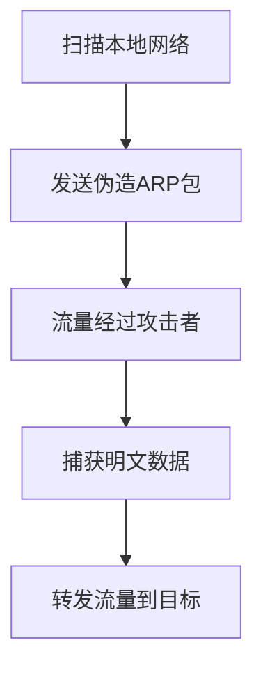

# 中间人攻击 (T1557)

## 一句话通俗理解

攻击者站在你和网站之间，假装是网站骗你输入密码，同时又假装是你从网站获取信息——你在中间看到的全是假的。

## 30秒速查卡

| 维度 | 你需要知道的 |
|------|-------------|
| 这是什么？ | 攻击者站在你和网站之间，假装是网站骗你输入密码，同时又假装是你从网站获取信息——你在中间看到的全是假的。 |
| 为什么危险？ | 中间人攻击用于窃取登录凭据和会话Cookie、监听和修改通信内容、注入恶意内容（如恶意脚本或广告）、绕过加密保护、绕过M |
| 谁需要关心？ | 数据安全团队、SOC分析师 |
| 你的第一步防御 | ARP缓存不一致 |
| 如果只做一件事 | 想象你去银行办理业务，一个穿着假制服的人在大门口拦住你说"把身份证给我，我帮你代办"——你信以为真就 |

## 难度等级

⭐⭐⭐ 高级（需要一定经验）

## 技术描述

中间人攻击（T1557）是MITRE ATT&CK框架中收集战术的一种技术。

**通俗解释：**
想象你去银行办理业务，一个穿着假制服的人在大门口拦住你说"把身份证给我，我帮你代办"——你信以为真就把证件给了他。他拿着你的证件进入银行处理完业务后出来说"办好了，这是你的回执"。从头到尾你以为他是银行的人，银行以为他是你，他则从中截获了你的全部信息。这就是中间人攻击（AiTM）：攻击者插入在你和你要访问的网站之间，你的所有流量都被他过目一遍，他可以读取、修改甚至拦截你的登录凭据。

**技术原理：**

1. **ARP欺骗**：在本地网络中发送伪造的ARP响应，将自己伪装成网关，使受害者的流量经过攻击者的机器
2. **DNS欺骗**：篡改DNS解析结果，将合法域名指向攻击者控制的服务器
3. **WiFi中间人**：设置恶意WiFi热点（Evil Twin），诱使用户连接后劫持所有流量
4. **代理中间人**：部署反向代理服务器，在认证流程中捕获凭据和会话令牌
5. **SSL/TLS剥离**：将受害者的HTTPS连接降级为HTTP，即使证书验证通过也能捕获明文流量

**用途与影响：**
中间人攻击用于窃取登录凭据和会话Cookie、监听和修改通信内容、注入恶意内容（如恶意脚本或广告）、绕过加密保护、绕过MFA认证。2024-2025年间，AiTM钓鱼工具包（如EvilGinx2）的使用量增长了近5倍，成为企业数据窃取的主要威胁之一。

## 子技术列表

**该技术共有 3 个子技术：**

| 子技术ID | 中文名称 | 通俗解释 |
|----------|----------|----------|
| T1557.001 | LLMNR/NBT-NS中毒和SMB中继 | 利用Windows网络协议漏洞，将自己伪装成目标服务器，捕获凭据 |
| T1557.002 | ARP缓存中毒 | 在局域网内发送伪造ARP包，让受害者的网络流量经过攻击者 |
| T1557.003 | DHCP欺骗 | 篡改DHCP响应，让受害者使用攻击者控制的DNS服务器 |

<details>
<summary><strong>展开查看各子技术详细说明</strong></summary>

各子技术详细说明请参阅独立文档：

- [T1557.001 - LLMNR/NBT-NS中毒和SMB中继](./T1557/T1557.001-LLMNR-NBT-NS Poisoning and SMB Relay-LLMNR-NBT-NS中毒和SMB中继.md) — 当受害者输错文件名时，攻击者在局域网里假装说"我知道这个文件在哪"，然后捕获受害者的登录密码。
- [T1557.002 - ARP缓存中毒](./T1557/T1557.002-ARP Cache Poisoning-ARP缓存中毒.md) — 攻击者在局域网中喊"我是网关"，受害者的网络流量就被改道到了攻击者那里。
- [T1557.003 - DHCP欺骗](./T1557/T1557.003-DHCP Spoofing-DHCP欺骗.md) — 攻击者假装成网络的"地址分配员"，给受害者分配一个"特殊的"网络配置，让所有网络流量都经过攻击者。

</details>

## 攻击流程

### 典型攻击流程（以ARP缓存中毒为例）

```
扫描本地网络 --> 发送伪造ARP包 --> 流量经过攻击者 --> 捕获明文数据 --> 转发流量到目标
```



**步骤详解：**

1. **扫描本地网络**
   - 通俗描述：攻击者查看当前局域网中有哪些设备
   - 技术细节：使用ARP扫描发现内网活跃主机
   - 常用工具：`arp-scan`、`nmap`、`Bettercap`

2. **发送伪造ARP包**
   - 通俗描述：发送伪造的ARP响应，告诉受害者"我才是网关"
   - 技术细节：周期性地发送伪造ARP响应，将网关IP映射到攻击者的MAC地址
   - 常用工具：`arpspoof`、Bettercap、`ettercap`

3. **流量经过攻击者**
   - 通俗描述：受害者发往互联网的所有数据先经过攻击者的电脑
   - 技术细节：攻击者机器启用IP转发（`sysctl net.ipv4.ip_forward=1`）
   - 常用工具：Linux IP转发、`iptables`

4. **捕获明文数据**
   - 通俗描述：攻击者读取和记录流过其电脑的所有数据
   - 技术细节：使用抓包工具捕获HTTP、FTP、SMTP等明文协议的数据
   - 常用工具：Wireshark、`tcpdump`、`Bettercap`、`mitmproxy`

5. **转发流量到目标**
   - 通俗描述：攻击者将数据转发给真正的目标，不中断受害者的网络使用
   - 技术细节：修改`iptables`规则实现透明转发
   - 常用工具：`iptables` NAT规则

## 真实案例

### 案例1：EvilGinx AiTM钓鱼工具包 – 绕过MFA的大规模钓鱼攻击（2024-2025）

- **时间**: 2024年-2025年
- **目标**: Microsoft 365用户全球企业客户
- **攻击组织**: 多个威胁团伙（包括Scattered Spider、APT29等）
- **手法**: EvilGinx2（以及后续变种）是开源的AiTM钓鱼框架，部署在攻击者的服务器上作为反向代理。攻击者向目标发送伪装成登录页更新的钓鱼链接。受害者点击链接后访问了攻击者控制的服务器（如`login.microsoftonline.com.evilsite.com`）。EvilGinx2将受害者的请求反向代理到真实的Microsoft登录页面，同时记录了全部流量。当受害者输入用户名、密码和MFA验证码后，EvilGinx2捕获了认证后的会话Cookie（`session` Cookie）。攻击者立即使用捕获的Cookie登录受害者的Microsoft 365账户。2025年报告显示，AiTM钓鱼工具包的攻击量比上一年增长了488%。
- **影响**: 数千家企业用户的Microsoft 365账户被入侵，邮件和Teams数据被窃取
- **参考链接**: [EvilGinx2 AiTM Phishing Growth - Zscaler 2025](https://www.zscaler.com/blogs/research/evilginx-aitm-phishing-kits-growth-2025)

### 案例2：Evil Twin WiFi攻击 – 酒店和机场公共WiFi劫持（2023-2025）

- **时间**: 2023年-2025年
- **目标**: 商务旅客和政府官员
- **攻击组织**: 多个犯罪团伙
- **手法**: 攻击者在酒店大厅、机场候机区和咖啡厅部署名为"Free_WiFi"、"Hotel-Guest"等名字的恶意WiFi热点（Evil Twin Attack）。当受害者的设备自动连接或主动选择此热点后，攻击者使用ARP中毒（T1557.002）和DNS欺骗（T1557.003）劫持了受害者的所有网络流量。受害者访问银行网站时，攻击者使用SSL剥离技术将HTTPS连接降级为HTTP，捕获了受害者的银行登录凭据。2025年欧洲刑警组织（Europol）警告，酒店WiFi已成为商务间谍活动的主要目标，攻击者专门针对参加展会和论坛的企业高管部署Evil Twin。
- **影响**: 大量商务旅客的敏感信息被窃取，包括企业VPN凭据和银行账户
- **参考链接**: [Europol Hotel WiFi Warning 2025](https://www.europol.europa.eu/media-press/newsroom/news/hotel-wi-fi-cyber-threats)

### 案例3：CrystalRAT - 集成中间人功能的跨平台RAT（2026年2月）

- **时间**: 2026年2月（发现时间）
- **目标**: 特定区域的政府机构和金融企业
- **攻击组织**: CrystalRAT运营者
- **手法**: CrystalRAT木马集成了中间人攻击功能，可以对受感染系统进行本地网络层面的AiTM拦截。CrystalRAT在受感染主机上部署了本地代理服务器，自动配置浏览器的代理设置（通过修改注册表或PAC文件）。所有HTTP/HTTPS流量经过本地代理时，CrystalRAT使用自签名证书进行SSL拦截（使用mitmproxy库），读取和修改HTTPS传输中的数据。该木马特别针对银行交易页面，可以实时修改页面内容（如修改转账金额和收款人账户）。
- **影响**: 受感染企业员工的银行交易被篡改，大量资金被盗
- **参考链接**: [CrystalRAT Analysis - Kaspersky 2026](https://securelist.com/crystalrat-analysis/)

## 红队视角

> ⚠️ **免责声明**：以下内容仅用于合法的安全测试、渗透测试和教育目的。未经授权对他人系统进行测试是违法行为。

### 实战技巧

1. **使用Bettercap进行本地AiTM**
   Bettercap是全功能的网络攻击框架，支持ARP欺骗、DNS欺骗和HTTPS拦截：
   ```bash
   # 启动ARP欺骗
   bettercap -eval "set arp.spoof.targets 192.168.1.100; arp.spoof on"
   # 启动HTTP/HTTPS拦截
   bettercap -eval "set https.proxy.script /path/to/hook.js; https.proxy on"
   ```

2. **使用EvilGinx2进行远程AiTM钓鱼测试**
   EvilGinx2使用Nginx反向代理配置实现钓鱼页面的部署，包含预配置的钓鱼模板（Microsoft 365、Google等）。

3. **使用mitmproxy进行HTTPS流量分析**
   mitmproxy支持交互式分析HTTP/HTTPS流量，可以实时查看和修改请求和响应。

### 常用工具

| 工具名称 | 用途 | 平台 | 链接 |
|----------|------|------|------|
| EvilGinx2 | AiTM反向代理钓鱼框架 | Linux | https://github.com/kgretzky/evilginx2 |
| Bettercap | 全功能网络攻击框架 | 跨平台 | https://www.bettercap.org/ |
| mitmproxy | 交互式HTTPS中间人代理 | 跨平台 | https://mitmproxy.org/ |
| Responder | LLMNR/NBT-NS中毒工具 | 跨平台 | https://github.com/lgandx/Responder |
| Wireshark | 网络协议分析器 | 跨平台 | https://www.wireshark.org/ |

### 注意事项

- ARP欺骗只能在局域网中有效，跨网络无法实施
- 现代操作系统（Windows 10+、macOS 11+）的WiFi选择算法更智能，Evil Twin攻击难度增加
- 部署EvilGinx2需要有效的SSL证书才能实现HTTPS下的完全欺骗
- LLMNR/NBT-NS中毒需要受害者的网络协议没有被组策略禁用

## 蓝队视角

### 检测要点

1. **ARP缓存不一致**
   - 日志来源：网络设备ARP表、端点ARP缓存
   - 关注字段：MAC地址与IP地址的映射关系
   - 异常特征：网关IP对应了多个MAC地址，或MAC地址与已知的厂商OUI不一致

2. **异常DNS响应**
   - 日志来源：DNS服务器日志
   - 关注字段：域名解析结果的变化
   - 异常特征：同一个域名的DNS解析结果突然变化，或被解析到不常见的IP地址

3. **LLMNR/NBT-NS异常流量**
   - 日志来源：网络流量日志
   - 关注字段：LLMNR（UDP 5355）、NBT-NS（UDP 137）的响应
   - 异常特征：同一查询在短时间内收到多个响应，或来自非预期主机的响应

4. **重复的DHCP服务器**
   - 日志来源：DHCP审计日志
   - 关注字段：DHCP Offer的来源MAC地址
   - 异常特征：局域网中出现多个非预期的DHCP服务器响应

### 监控建议

- 监控ARP表的异常变化，配置交换机端口安全（Port Security）
- 实施DNS流量分析，检测域名劫持行为
- 在组策略中禁用LLMNR和NetBIOS协议
- 配置DHCP监听（DHCP Snooping）防止伪造DHCP服务器

## 检测建议

### 网络层检测

**网络流量特征：**
- 检测ARP欺骗：同一IP地址对应多个MAC地址（arpwatch或端口安全监测）
- 检测LLMNR/mDNS/NBT-NS投毒响应：网络中短时间内大量重复的名称解析响应
- 检测DHCP Rogue Server：同一子网中出现多个DHCP服务器提供IP租约
- 检测TLS拦截流量：通过JA3/S证书指纹识别已知的中间人代理工具（mitmproxy、Burp Suite、BetterCAP）
- 监控DNS响应中的异常TTL值或NXDOMAIN重定向行为

**具体命令示例：**
```bash
# 检测ARP欺骗（将网关MAC与已知正确值对比）
arp -a | findstr "192.168.1.1"

# 使用PowerShell检查邻居缓存异常
Get-NetNeighbor -IPAddress 192.168.1.1 | Select-Object IPAddress, LinkLayerAddress, State

# 检测网络中LLMNR投毒流量
# tshark -Y "llmnr" -T fields -e ip.src -e dns.qry.name

# 检测DHCP Rogue Server
Get-DhcpServerInDC | Format-Table DnsName, IPAddress
```

**示例（Suricata/IDS规则）：**
```
# 检测ARP欺骗 - 同一IP多MAC地址
alert arp any any -> any any (
    msg:"T1557 - 中间人攻击 - ARP欺骗检测";
    arp$opcode == 2;
    # 需要关联分析：同一IP对应不同MAC地址
    threshold:type both, track by_dst, count 5, seconds 60;
    sid:1015571; rev:1;
)
```

### 主机层检测

**Windows事件ID：**
- Event ID 4688：进程创建
- Event ID 5156：网络连接
- PowerShell Event ID 4104：Script Block Logging

**具体命令示例：**
```bash
# 检查ARP表确认网关MAC地址
arp -a | findstr "192.168.1.1"

# 检查DHCP服务器授权
Get-DhcpServerInDC | Format-Table DnsName, IPAddress
```

### 应用层检测

**用人话说：**

> 中间人攻击（AiTM）是攻击者在通信双方之间"偷听"的技术——攻击者把自己插入到受害者和目标服务器之间的网络路径上，受害者的所有数据先经过攻击者再到服务器。ARP缓存中毒通过伪造ARP包让受害者的IP流量经过攻击者的机器；LLMNR/NBT-NS投毒利用Windows名称解析缺陷劫持认证请求；DHCP欺骗篡改网络配置让受害者的流量走攻击者控制的DNS服务器。通过这些手法，攻击者可以捕获登录凭据、会话Cookie、以及所有未加密的通信内容。检测方法：监控ARP表的异常变化、网络中出现的重复IP地址、以及DNS响应中的异常NS记录。
>
> **避坑指南**：忽略SMB管理共享异常访问；未启用PowerShell脚本块日志；未监控异常会话令牌使用。

**Sigma规则示例：**
```yaml
title: ARP欺骗检测 - 网关IP的多MAC映射
status: experimental
description: 检测ARP表中网关IP对应多个MAC地址的情况（ARP欺骗迹象）
logsource:
    category: process_creation
    product: windows
detection:
    selection:
        CommandLine|contains|all:
            - 'arp'
            - '-a'
    condition: selection
level: medium
tags:
    - attack.t1557
    - attack.t1557.002
```

## 缓解措施

### 优先级1：关键措施

**措施名称：** 网络协议安全配置

**具体实施步骤：**
1. 通过组策略禁用LLMNR和NetBIOS协议
2. 配置交换机端口安全（Port Security），限制每个端口允许的MAC地址数量
3. 启用DHCP Snooping防止Rogue DHCP服务器

### 优先级2：重要措施

**措施名称：** 网络分段和隔离

**具体实施步骤：**
1. 实施网络VLAN划分，限制广播域的范围
2. 对敏感区域（财务、管理层）实施单独的物理网络或VLAN
3. 配置802.1X网络访问控制

### 优先级3：建议措施

**措施名称：** 加密和端到端安全

**具体实施步骤：**
1. 强制所有内部应用使用HTTPS，禁用明文HTTP
2. 实施HSTS（HTTP Strict Transport Security）防止SSL剥离
3. 部署VPN或零信任网络架构，减少局域网层面的暴露

### MITRE ATT&CK 缓解措施映射

| 缓解措施ID | 缓解措施名称 | 适用性 | 说明 |
|------------|-------------|--------|------|
| M0937 | 网络分段 | 适用 | 减少ARP欺骗的影响范围 |
| M0931 | 网络协议加固 | 适用 | 禁用LLMNR/NBT-NS |
| M0926 | 通信加密 | 适用 | 强制HTTPS和HSTS |

## 动手实验

> ⚠️ **重要提示**：所有实验必须在隔离的实验室环境中进行，禁止对未授权的真实系统进行测试。

### 实验环境准备

**推荐靶场/实验平台：**

| 平台名称 | 类型 | 难度 | 链接 |
|----------|------|------|------|
| TryHackMe | 网络安全学习平台 | 中级 | https://tryhackme.com/ |
| Hack The Box | 渗透测试训练平台 | 高级 | https://www.hackthebox.com/ |

**所需工具：**
- Kali Linux虚拟机
- 两台虚拟机（攻击机和靶机）
- Bettercap或Ettercap

### 实验1：使用Bettercap模拟ARP欺骗（高级）

**实验目标：** 通过ARP欺骗劫持靶机的网络流量

**实验步骤：**
1. 在Kali虚拟机中启动Bettercap，连接到局域网接口
2. 扫描本地网络发现目标IP：
   ```
   net.probe on
   net.show
   ```
3. 选择目标IP，实施ARP欺骗：
   ```
   set arp.spoof.targets 192.168.x.x
   arp.spoof on
   ```
4. 启动HTTP流量嗅探：
   ```
   net.sniff on
   ```

**预期结果：** 靶机的HTTP流量出现在Bettercap的监控界面中

**学习要点：** 理解ARP欺骗的原理和实施方法

## 术语解释

| 术语 | 英文原名 | 通俗解释 |
|------|----------|----------|
| ARP | Address Resolution Protocol | 地址解析协议，将IP地址转换为网卡的MAC地址 |
| 反向代理 | Reverse Proxy | 一台中转服务器，将外部请求转发到内部服务器 |
| SSL剥离 | SSL Stripping | 将HTTPS连接降级为HTTP，让加密失效 |
| LLMNR | Link-Local Multicast Name Resolution | Windows的本地链路多播名称解析协议 |
| HSTS | HTTP Strict Transport Security | 告诉浏览器只能通过HTTPS连接本网站，强制加密 |

## 参考资料

### 官方文档

- [MITRE ATT&CK - T1557](https://attack.mitre.org/techniques/T1557/)
- [MITRE ATT&CK - T1557.001](https://attack.mitre.org/techniques/T1557/001/)
- [MITRE ATT&CK - T1557.002](https://attack.mitre.org/techniques/T1557/002/)
- [MITRE ATT&CK - T1557.003](https://attack.mitre.org/techniques/T1557/003/)

### 安全报告

- [EvilGinx AiTM Phishing 2025 - Zscaler](https://www.zscaler.com/blogs/research/evilginx-aitm-phishing-kits-growth-2025)
- [Europol Hotel WiFi Warning 2025](https://www.europol.europa.eu/media-press/newsroom/news/hotel-wi-fi-cyber-threats)
- [CrystalRAT Analysis - Kaspersky 2026](https://securelist.com/crystalrat-analysis/)

### 工具与资源

- [EvilGinx2](https://github.com/kgretzky/evilginx2) - AiTM钓鱼框架
- [Bettercap](https://www.bettercap.org/) - 网络攻击和监控框架
- [mitmproxy](https://mitmproxy.org/) - HTTPS中间人代理
- [Responder](https://github.com/lgandx/Responder) - LLMNR/NBT-NS中毒
