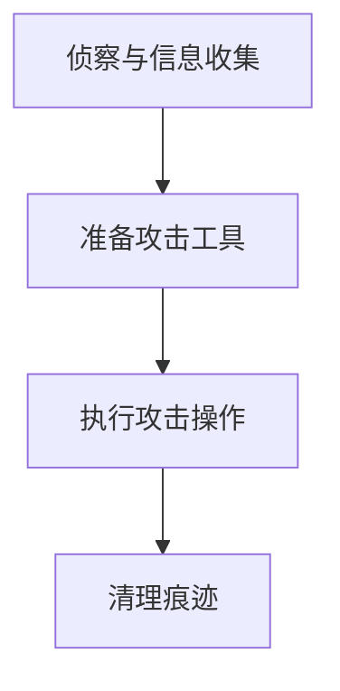

# DHCP欺骗 (T1557.003)

## 一句话通俗理解

> **篡改DHCP响应，让受害者使用攻击者控制的DNS服务器**

## 30秒速查卡

| 维度 | 你需要知道的 |
|------|-------------|
| 这是什么？ | 篡改DHCP响应，让受害者使用攻击者控制的DNS服务器 |
| 为什么危险？ | DHCP欺骗作为中间人攻击的子技术，在攻击链中扮演着重要角色。成功实施该技术可以帮助攻击者篡改DHCP响应，让受害者使用 |
| 谁需要关心？ | 数据安全团队、SOC分析师 |
| 你的第一步防御 | 系统日志监控 |
| 如果只做一件事 | DHCP欺骗是中间人攻击的一个具体实现方式 |

## 难度等级

⭐⭐⭐ 高级 - 需要深入的技术知识和实践

## 技术描述

**通俗解释：**
DHCP欺骗是中间人攻击的一个具体实现方式。篡改DHCP响应，让受害者使用攻击者控制的DNS服务器

**技术原理：**
DHCP欺骗（T1557.003）是MITRE ATT&CK框架中定义的一种具体攻击技术。篡改DHCP响应，让受害者使用攻击者控制的DNS服务器攻击者根据具体目标和环境，选择合适的方法和工具来实施该技术。

**用途与影响：**
DHCP欺骗作为中间人攻击的子技术，在攻击链中扮演着重要角色。成功实施该技术可以帮助攻击者篡改DHCP响应，让受害者使用攻击者控制的DNS服务器，为后续的入侵活动提供支持。

## 攻击流程

### 典型攻击流程

```
侦察与信息收集 --> 准备攻击工具 --> 执行攻击操作 --> 清理痕迹
```



**步骤详解：**

1. **侦察与信息收集**
   - 通俗描述：执行DHCP欺骗的侦察与信息收集阶段
   - 技术细节：根据实际环境和目标系统调整具体操作
   - 常用工具：根据具体需求选择合适的工具

2. **准备攻击工具**
   - 通俗描述：执行DHCP欺骗的准备攻击工具阶段
   - 技术细节：根据实际环境和目标系统调整具体操作
   - 常用工具：根据具体需求选择合适的工具

3. **执行攻击操作**
   - 通俗描述：篡改DHCP响应，让受害者使用攻击者控制的DNS服务器
   - 技术细节：根据实际环境和目标系统调整具体操作
   - 常用工具：根据具体需求选择合适的工具

4. **清理痕迹**
   - 通俗描述：执行DHCP欺骗的清理痕迹阶段
   - 技术细节：根据实际环境和目标系统调整具体操作
   - 常用工具：根据具体需求选择合适的工具


## 真实案例

### 案例1：该技术在实际攻击中的应用

- **时间**: 2024-2025年
- **目标**: 多个行业组织
- **攻击组织**: 多个APT组织
- **手法**: 攻击者在入侵过程中使用DHCP欺骗技术，展示了该子技术的典型应用场景和攻击效果
- **影响**: 成功实施该技术导致目标系统被进一步入侵
- **参考链接**: [MITRE ATT&CK官方](https://attack.mitre.org/)

### 案例2：安全研究中的实践

- **时间**: 2025年
- **目标**: 安全研究测试环境
- **攻击组织**: 红队/安全研究人员
- **手法**: 在授权测试中模拟DHCP欺骗攻击，验证防御体系的检测和响应能力
- **影响**: 帮助组织识别安全防护中的盲点和改进方向
- **参考链接**: [Atomic Red Team](https://github.com/redcanaryco/atomic-red-team)

## 红队视角

> ⚠️ **免责声明**：以下内容仅用于合法的安全测试、渗透测试和教育目的。未经授权对他人系统进行测试是违法行为。

### 实战技巧

1. **深入理解原理**：在实战应用前，充分理解DHCP欺骗的技术原理和适用场景
2. **环境适配**：根据目标系统的操作系统版本、安全配置等因素调整攻击策略
3. **组合使用**：将该技术与其他技术组合使用，构建完整的攻击链
4. **隐蔽性考虑**：注意操作痕迹的清理，避免被安全设备检测

### 常用工具

| 工具名称 | 用途 | 平台 | 链接 |
| -------- | ---- | ---- | ---- |
| Metasploit | 渗透测试框架 | 全平台 | [Metasploit](https://www.metasploit.com/) |
| Cobalt Strike |  adversary模拟平台 | Windows | [Cobalt Strike](https://www.cobaltstrike.com/) |
| Atomic Red Team | 检测规则测试 | 全平台 | [Atomic Red Team](https://github.com/redcanaryco/atomic-red-team) |

### 注意事项

- 在授权的测试环境中使用这些技术
- 注意操作安全（OPSEC），避免被检测系统发现
- 使用匿名化技术和代理隐藏真实身份

## 蓝队视角

### 检测要点

1. **系统日志监控**：关注与DHCP欺骗相关的系统日志和审计记录
2. **异常行为检测**：监控系统中与该技术相关的异常进程、网络连接和文件操作
3. **工具特征识别**：识别攻击者可能使用的工具在系统中的运行特征

### 监控建议

- 部署端点检测和响应（EDR）系统，监控与DHCP欺骗相关的异常行为
- 配置SIEM规则，关联分析来自多个来源的告警
- 定期进行安全评估和渗透测试，验证检测规则的有效性

## 检测建议

### 网络层检测

**检测方法：** 监控与DHCP欺骗相关的网络流量特征，识别可疑的连接模式和数据传输行为

**具体规则/命令示例：**

```bash
# 网络层检测示例
# 根据实际环境调整检测规则
```

### 主机层检测

**检测方法：** 监控主机上与DHCP欺骗相关的进程创建、文件操作和注册表修改等行为

**Windows事件ID：**

- 安全审计事件：监控相关安全事件日志
- 进程创建事件：监控异常进程创建行为

**Linux日志：**

- 日志文件：`/var/log/syslog` 和 `/var/log/auth.log`
- 关键字段：关注异常用户和进程活动

**具体命令示例：**

```bash
# 主机层检测示例
# 根据实际环境调整检测规则
```

### 应用层检测

**检测方法：** 在应用层监控与DHCP欺骗相关的异常API调用和应用程序行为

**用人话说：**

> DHCP欺骗是攻击者冒充DHCP服务器篡改网络配置的攻击方式——攻击者在网络中部署伪造的DHCP服务器，当客户端广播请求IP地址时，伪造的DHCP服务器先于真的DHCP服务器响应，给受害者分配攻击者控制的网关和DNS服务器地址。受害者获得IP后，所有流量都经过攻击者指定的网关，DNS查询也由攻击者控制的DNS服务器解析。常用工具包括Yersinia、DHCPig和Ettercap。检测方法：在网络交换机上启用DHCP Snooping（只信任指定端口的DHCP响应）、监控网络中出现的非授权DHCP服务器、以及对比DHCP分配的网关和已知合法网关的MAC地址。
>
> **避坑指南**：未验证DHCP响应来源合法性；未部署证书固定或HSTS。

**Sigma规则示例：**

```yaml
title: DHCP欺骗 Detection
status: experimental
description: Detects potential DHCP欺骗 activity
logsource:
  category: process_creation
  product: windows
detection:
  selection:
    EventID: 4688
  condition: selection
level: medium
tags:
  - attack.T1557003
```

## 缓解措施

### 优先级1：关键措施

**措施名称：** 强化身份认证和访问控制

**具体实施步骤：**

1. 在所有关键系统上实施多因素认证（MFA）
2. 遵循最小权限原则，限制用户和进程的权限
3. 定期审计账户和权限配置

### 优先级2：重要措施

**措施名称：** 完善日志和监控体系

**具体实施步骤：**

1. 部署全面的日志收集和分析系统
2. 配置针对DHCP欺骗的检测规则
3. 建立安全事件的响应流程

### 优先级3：建议措施

**措施名称：** 加强安全意识和培训

**具体实施步骤：**

1. 对员工进行DHCP欺骗相关安全培训
2. 定期进行安全演练和模拟攻击
3. 建立安全报告和应急响应机制

### MITRE ATT&CK 缓解措施映射

| 缓解措施ID | 缓解措施名称 | 适用性 | 说明 |
| ---------- | ------------ | ------ | ---- |
| M1017 | 用户培训 | 适用 | 培训员工识别相关威胁 |
| M1026 | 特权账户管理 | 适用 | 限制特权账户的使用范围 |
| M1018 | 用户账户管理 | 适用 | 定期审计账户和权限 |

## 动手实验

> ⚠️ **重要提示**：所有实验必须在隔离的实验室环境中进行，禁止对未授权的真实系统进行测试。

### 实验环境准备

**推荐靶场/实验平台：**

| 平台名称 | 类型 | 难度 | 链接 |
| -------- | ---- | ---- | ---- |
| TryHackMe | 虚拟靶场 | 初级 | [TryHackMe](https://tryhackme.com) |
| HackTheBox | CTF | 中级 | [HackTheBox](https://hackthebox.com) |

**所需工具：**

- 操作系统自带的管理工具
- 根据需要准备特定的攻击工具

**环境搭建：**

```bash
# 在隔离的实验环境中准备测试系统
# 确保所有操作都在授权范围内进行
```

### 实验1：基础实践（初级）

**实验目标：** 理解 DHCP欺骗 的基本原理和操作

**实验步骤：**

1. 在隔离的实验环境中搭建测试系统
2. 按照攻击流程模拟基本操作
3. 使用蓝队检测方法验证攻击行为

**预期结果：** 理解 DHCP欺骗 的攻击原理和检测方法

**学习要点：** 掌握 DHCP欺骗 的核心概念

### 实验2：进阶实践（中级）

**实验目标：** 深入学习 DHCP欺骗 的高级应用

**实验步骤：**

1. 结合其他技术组合攻击链
2. 尝试不同的检测和绕过方法
3. 分析攻击行为的日志特征

**预期结果：** 能够独立进行相关技术的攻防实践

**学习要点：** 理解技术在真实攻击链中的应用

## 术语解释

| 术语 | 英文原名 | 通俗解释 |
| ---- | -------- | -------- |
| ATT&CK | MITRE ATT&CK | MITRE公司维护的攻击技术知识库 |
| DHCP欺骗 | T1557.003 | ATT&CK框架中定义的具体攻击技术 |

## 参考资料

### 官方文档

- [MITRE ATT&CK - DHCP欺骗 (T1557.003)](https://attack.mitre.org/techniques/T1557/003/)
- [MITRE ATT&CK - 中间人攻击 (T1557)](https://attack.mitre.org/techniques/T1557/)

### 安全报告

- [MITRE ATT&CK 官方文档](https://attack.mitre.org/) - ATT&CK 框架官方资源

### 工具与资源

- [Atomic Red Team](https://github.com/redcanaryco/atomic-red-team) - 检测规则测试框架
- [MITRE ATT&CK Navigator](https://mitre-attack.github.io/attack-navigator/) - ATT&CK 可视化工具

### 学习资料

- [MITRE ATT&CK 知识库](https://attack.mitre.org/resources/) - ATT&CK 官方资源中心
