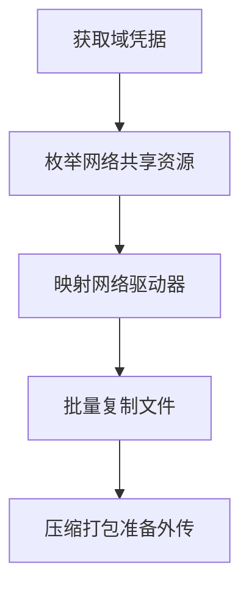

# 从网络共享驱动收集数据 (T1602)

## 一句话通俗理解

攻击者通过网络访问了公司内部共享文件夹——就像你可以访问公司公共盘一样，攻击者也能读取这些共享目录中的文件。

## 30秒速查卡

| 维度 | 你需要知道的 |
|------|-------------|
| 这是什么？ | 攻击者通过网络访问了公司内部共享文件夹——就像你可以访问公司公共盘一样，攻击者也能读取这些共享目录中的文件。 |
| 为什么危险？ | 网络共享驱动通常包含大量部门和项目共享的文件——项目文档、共享资料、常用工具、配置文件。一次网络共享驱动的数据窃取可以让 |
| 谁需要关心？ | 数据安全团队、SOC分析师 |
| 你的第一步防御 | 异常的网络共享枚举 |
| 如果只做一件事 | 公司内部通常有很多"共享文件夹"或"共享盘"（如Z盘、公共共享目录），员工可以通过网络访问这些共享盘 |

## 难度等级

⭐⭐ 中级（需要一定基础）

## 技术描述

从网络共享驱动收集数据（T1602）是MITRE ATT&CK框架中收集战术的一种技术。

**通俗解释：**
公司内部通常有很多"共享文件夹"或"共享盘"（如Z盘、公共共享目录），员工可以通过网络访问这些共享盘中的文件。如果攻击者控制了内网中的一台电脑（或者窃取了某个员工的域凭据），他就可以像正常的域用户一样访问网络上的共享文件夹，把里面的公司共享文档全部复制走。

**技术原理：**

1. **SMB/CIFS协议访问**：使用Windows的SMB协议（端口445）访问网络共享，读取文件
2. **利用域凭据**：使用窃取的域用户凭据通过Kerberos或NTLM认证访问共享
3. **枚举网络共享**：扫描内网中开放的SMB共享，列出可访问的共享目录
4. **NFS协议访问**：在Linux/Unix环境中，使用NFS协议挂载远程共享目录

**用途与影响：**
网络共享驱动通常包含大量部门和项目共享的文件——项目文档、共享资料、常用工具、配置文件。一次网络共享驱动的数据窃取可以让攻击者获取到整个部门甚至整个团队的工作成果。

## 子技术列表

**该技术共有 2 个子技术：**

| 子技术ID | 中文名称 | 通俗解释 |
|----------|----------|----------|
| T1602.001 | 通过SMB/Windows共享收集 | 使用SMB协议访问Windows共享文件夹中的数据 |
| T1602.002 | 通过网络设备管理收集 | 从网络设备（路由器、交换机、防火墙）的存储中收集数据 |

<details>
<summary><strong>展开查看各子技术详细说明</strong></summary>

各子技术详细说明请参阅独立文档：

- [T1602.001 - 通过SMB/Windows共享收集](./T1602/T1602.001-SMB-Windows Share Collection-通过SMB-Windows共享收集.md) — 通过Windows的网络邻居功能访问公司内部共享目录，下载共享中的文件。
- [T1602.002 - 通过网络设备管理收集](./T1602/T1602.002-Network Device Management Collection-通过网络设备管理收集.md) — 攻击者登录了公司路由器或交换机的管理界面，从这些网络设备中下载配置文件和日志。

</details>

## 攻击流程

### 典型攻击流程

```
获取域凭据 --> 枚举网络共享资源 --> 映射网络驱动器 --> 批量复制文件 --> 压缩打包准备外传
```



**步骤详解：**

1. **获取域凭据**
   - 通俗描述：通过网络钓鱼或密码嗅探获得一个域用户的账号密码
   - 技术细节：从LSASS内存中提取NTLM哈希，破解或使用哈希传递（Pass-the-Hash）
   - 常用工具：Mimikatz、Responder

2. **枚举网络共享资源**
   - 通俗描述：搜索网络中有哪些共享文件夹可用
   - 技术细节：使用`net view`或PowerShell的`Get-SmbShare`列出网络共享
   - 常用工具：`net view \\dc /all`、`Get-SmbShare`、`ShareFinder`

3. **映射网络驱动器**
   - 通俗描述：将共享文件夹映射为一个本地盘符（如Z盘）
   - 技术细节：使用`net use Z: \\server\share`建立连接
   - 常用工具：`net use`、`New-PSDrive`

4. **批量复制文件**
   - 通俗描述：从映射的网络驱动器中将文件批量复制到本地
   - 技术细节：使用`Copy-Item -Recurse`或`robocopy`递归复制
   - 常用工具：`robocopy`、`Copy-Item`、`xcopy`

5. **压缩打包准备外传**
   - 通俗描述：将复制下来的文件夹打包后准备传输
   - 技术细节：在本地创建ZIP压缩包，准备通过C2通道外传
   - 常用工具：`Compress-Archive`、7-Zip

## 真实案例

### 案例1：DragonForce APT - SMB共享文件批量窃取（2025年3月）

- **时间**: 2025年3月（发现时间）
- **目标**: 东南亚政府机构和军事组织
- **攻击组织**: DragonForce
- **手法**: DragonForce APT组织在获得域管理员凭据后，使用`net use`命令和`robocopy`工具批量复制网络共享驱动中的文件。攻击者首先使用`net view`枚举所有域服务器上的共享目录，然后使用`robocopy \\server\share C:\staging\data /E /COPY:DAT /R:0`将共享中的全部文件和权限属性复制到本地临时目录。DragonForce特别关注了包含"project"、"salary"、"personnel"等关键字的共享目录。窃取的数据达到数百GB，包括政府项目文件、人员信息表等。
- **影响**: 东南亚政府机构的内部共享文件和人事记录被大量窃取
- **参考链接**: [DragonForce APT Analysis - SOCRadar 2025](https://socradar.io/dragonforce-apt-threat-actor-profile/)

### 案例2：WannaCry勒索软件 - 通过SMB漏洞传播并加密共享文件（2017年，持续影响）

- **时间**: 2017年至今
- **目标**: 全球使用SMB的企业组织
- **攻击组织**: Lazarus Group（据分析）
- **手法**: WannaCry利用MS17-010（EternalBlue）漏洞通过SMB协议在内网中传播。一旦感染了一台主机，WannaCry会枚举局域网中所有开放的SMB共享，主动加密共享目录中的文件（包括`ADMIN$`、`C$`等管理共享）。虽然WannaCry是勒索软件（加密数据而非窃取），但它展示了攻击者如何通过网络共享访问来操作数据——攻击者可以读取、复制或加密共享驱动器上的任何文件。
- **影响**: 全球150个国家的30万台电脑受到影响，共享文件被加密
- **参考链接**: [WannaCry SMB Exploit Analysis - NCSC](https://www.ncsc.gov.uk/news/wannacry-ransomware)

### 案例3：Zerologon (CVE-2020-1472) 攻击后的网络共享数据窃取（2020-2023）

- **时间**: 2020年-2023年
- **目标**: 全球使用Active Directory的企业
- **攻击组织**: 多个威胁团伙
- **手法**: 攻击者利用Zerologon漏洞（CVE-2020-1472）获得域控制器管理员权限后，使用`dir \\dc\SYSVOL`等命令枚举域控制器的默认共享`SYSVOL`和`NETLOGON`。随后攻击者使用域管理员凭据登录所有域成员服务器，使用`net view`和`Get-SmbShare`枚举所有网络共享，使用`robocopy`批量复制共享中的文件。攻击者特别关注了文件服务器和SQL服务器上的共享目录（如`\\fileserver\data`、`\\sqlserver\backup`），窃取了大量包含客户数据、财务信息和系统配置的文件。
- **影响**: 全球数千家企业通过网络共享被窃取了大量内部数据
- **参考链接**: [Zerologon Exploitation - CrowdStrike 2021](https://www.crowdstrike.com/blog/zerologon-exploitation-in-the-wild/)

## 红队视角

> ⚠️ **免责声明**：以下内容仅用于合法的安全测试、渗透测试和教育目的。未经授权对他人系统进行测试是违法行为。

### 实战技巧

1. **使用PowerShell枚举所有网络共享**
   ```powershell
   # 枚举当前域中的所有SMB共享
   Get-SmbShare | Select-Object Name, Path, Description
   
   # 或者远程枚举（需要管理员权限）
   Invoke-Command -ComputerName FileServer -ScriptBlock { Get-SmbShare }
   ```

2. **使用SMBMap批量发现和下载**
   SMBMap是专门针对SMB共享的工具，可以批量枚举和下载：
   ```bash
   smbmap -H 192.168.1.100 -u domain\user -p password -R -A "*.xlsx" --depth 10
   ```

3. **使用Pass-the-Hash访问共享**
   如果只获得了NTLM哈希而不是明文密码，使用Impacket的`smbclient.py`进行哈希传递访问：
   ```bash
   impacket-smbclient domain/user@192.168.1.100 -hashes LM:NTLM
   ```

### 常用工具

| 工具名称 | 用途 | 平台 | 链接 |
|----------|------|------|------|
| robocopy | 高可靠性文件复制工具 | Windows | 系统内置 |
| PowerView | PowerShell域枚举工具集 | Windows | https://github.com/PowerShellMafia/PowerSploit |
| SMBMap | SMB共享枚举和文件传输 | 跨平台 | https://github.com/ShawnDEvans/smbmap |
| Impacket | Python网络协议工具包 | 跨平台 | https://github.com/fortra/impacket |
| net use | Windows网络驱动器映射 | Windows | 系统内置 |

### 注意事项

- SMB协议可以使用`net use`命令建立连接，连接会被Windows凭据管理器缓存
- 访问网络共享会产生大量的网络流量和安全日志（Event ID 5140）
- 某些共享（如`C$`、`ADMIN$`）需要管理员权限才能访问
- SMB 3.0+启用了加密，但大多数组织仍在使用SMB 2.0或更高版本，安全设备可以监控其传输内容

## 蓝队视角

### 检测要点

1. **异常的网络共享枚举**
   - 日志来源：Event ID 5140（网络共享对象访问）
   - 关注字段：访问的共享名（`\*\*`）、发起访问的源IP
   - 异常特征：一个账户短时间内枚举了多台服务器上的多个共享

2. **大量文件的批量复制**
   - 日志来源：Event ID 5145（网络共享对象检查）
   - 关注字段：访问的文件数量和传输大小、访问类型（ReadData）
   - 异常特征：非工作时间从文件服务器共享中批量读取大量文件

3. **net use命令的异常使用**
   - 日志来源：Sysmon Event ID 1（进程创建）
   - 关注字段：`net use`命令的执行、映射的目标共享路径
   - 异常特征：非IT人员在后半夜执行`net use`命令映射域管理员共享

### 监控建议

- 启用对SMB文件访问的审计（Event ID 5140和5145）
- 配置SIEM告警规则检测单账户在短时间内的异常共享枚举行为
- 监控`net use`命令在非管理计算机上的执行
- 对文件服务器启用异常文件访问告警

## 检测建议

### 网络层检测

**网络流量特征：**
- 监控SMB2/SMB3协议中的异常批量文件读取操作（单一会话的大量Read请求）
- 检测单一源IP到文件服务器的并发SMB会话数超过正常阈值
- 监控SMB协议的数据量异常峰值（远超正常文件访问的系统基线）
- 检测针对NETLOGON、SYSVOL等敏感共享目录的批量文件复制行为
- 监控非Windows系统（Linux/macOS）发起的SMB连接访问共享文件

**具体命令示例：**
```bash
# 检测SMB连接的高并发数（单个IP到文件服务器的多个会话）
Get-NetTCPConnection | Where-Object { $_.RemotePort -eq 445 } | Group-Object RemoteAddress | Where-Object { $_.Count -gt 10 } | Sort-Object Count -Descending

# 通过安全日志分析SMB共享访问事件
Get-WinEvent -FilterHashtable @{LogName='Security'; ID=5140} | Group-Object { $_.Properties[8].Value } | Sort-Object Count -Descending | Select-Object -First 20
```

**示例（Suricata/IDS规则）：**
```
# 检测SMB共享驱动器批量文件读取 - 高并发SMB Read请求
alert tcp $HOME_NET any -> $HOME_NET 445 (
    msg:"T1602 - 网络共享驱动数据 - SMB批量文件读取";
    flow:to_server;
    content:"|ff|SMB|2e 00 00 00 00 00 00 00 00 00 00 00 00 00|";
    dsize:>100;
    threshold:type both, track by_src, count 30, seconds 60;
    sid:1016021; rev:1;
)
```

### 主机层检测

**Windows事件ID：**
- Event ID 5140：网络共享对象访问
- Event ID 5145：网络共享对象检查
- Sysmon Event ID 1：进程创建（检测`net use`、`robocopy`）
- Sysmon Event ID 3：网络连接（检测SMB端口445连接）

**具体命令示例：**
```bash
# 检测最近映射的网络驱动器
Get-WmiObject Win32_NetworkConnection | Select-Object LocalName, RemoteName, Status

# 检测域控制器上的共享访问事件
Get-WinEvent -FilterHashtable @{LogName='Security'; ID=5140} |
    Where-Object { $_.Message -match 'SYSVOL|NETLOGON' -and $_.Message -notmatch 'SYSTEM' }
```

### 应用层检测

**用人话说：**

> 网络共享驱动数据收集专门针对网络附加存储（NAS）和文件服务器——攻击者通过SMB/NFS协议访问共享文件夹中的敏感数据。企业常用共享驱动器存放部门文档，攻击者可以用net use连接到这些共享并批量下载。还可以通过SMB的Windows共享收集访问ADMIN$和C$等管理共享，以及路由器、交换机、防火墙等网络设备的配置备份。检测方法：监控非文件服务器对共享驱动器的批量文件访问、来自非IT部门的IP连接网络设备的SMB共享、以及设备配置文件（.cfg、.conf、.nvram）被异常读取。
>
> **避坑指南**：忽略SMB管理共享异常访问；未启用PowerShell脚本块日志；忽略异常Kerberos票据请求。

**Sigma规则示例：**
```yaml
title: SMB共享批量文件访问检测
status: experimental
description: 检测单账户在短时间内在多个SMB共享上的大量文件访问
logsource:
    category: process_creation
    product: windows
detection:
    selection:
        CommandLine|contains:
            - 'robocopy'
            - 'net use'
            - 'Copy-Item'
    condition: selection
level: medium
tags:
    - attack.t1602
    - attack.t1602.001
```

## 缓解措施

### 优先级1：关键措施

**措施名称：** SMB协议安全和共享权限控制

**具体实施步骤：**
1. 禁用SMB 1.0协议（CVE-2017-0143等漏洞的高危版本）
2. 实施最小权限原则，只给用户分配必要共享文件夹的访问权限
3. 对高敏感共享设置更严格的ACL权限

### 优先级2：重要措施

**措施名称：** 网络分段

**具体实施步骤：**
1. 隔离管理共享（ADMIN$、C$）只允许管理员的计算机访问
2. 将文件服务器放入单独的网络VLAN
3. 实施基于IP地址的防火墙规则限制对SMB端口的访问

### 优先级3：建议措施

**措施名称：** SMB加密和签名

**具体实施步骤：**
1. 启用SMB加密（SMB 3.0+）
2. 要求SMB签名以防止NTLM中继攻击
3. 禁用Guest账户对共享的访问

### MITRE ATT&CK 缓解措施映射

| 缓解措施ID | 缓解措施名称 | 适用性 | 说明 |
|------------|-------------|--------|------|
| M0935 | 最小权限原则 | 适用 | 限制共享访问权限 |
| M0937 | 网络分段 | 适用 | 隔离文件服务器的网络访问 |
| M0927 | SMB安全加固 | 适用 | 启用SMB签名和加密 |

## 动手实验

> ⚠️ **重要提示**：所有实验必须在隔离的实验室环境中进行，禁止对未授权的真实系统进行测试。

### 实验环境准备

**所需工具：**
- Windows域环境（至少一台域控制器和一台成员服务器）
- PowerShell

### 实验1：使用PowerShell枚举和访问网络共享（中级）

**实验目标：** 在域环境中枚举网络共享并访问文件

**实验步骤：**
1. 在域中的Windows虚拟机上打开PowerShell
2. 枚举网络共享：
   ```powershell
   # 列出所有域中的SMB共享
   Get-SmbShare | Format-Table Name, Path, Description
   
   # 查看DC上的默认共享
   net view \\dc /all
   ```
3. 映射网络驱动器：
   ```powershell
   net use Z: \\dc\SYSVOL
   dir Z:\
   ```

**预期结果：** 成功列出网络共享并映射驱动器

**学习要点：** 理解攻击者如何在内网中定位和访问网络共享资源

## 术语解释

| 术语 | 英文原名 | 通俗解释 |
|------|----------|----------|
| SMB | Server Message Block | 服务器消息块协议，Windows系统间共享文件和打印机的标准协议 |
| 共享 | Share | 通过网络提供给其他计算机访问的文件夹 |
| 映射驱动器 | Map Drive | 将网络共享文件夹分配一个盘符（如Z盘），使其像本地硬盘一样使用 |
| ACL | Access Control List | 访问控制列表，控制哪个用户能读或写某个文件或文件夹 |
| NTLM哈希 | NTLM Hash | Windows密码的加密表示，可用于在网络认证中替代密码本身 |

## 参考资料

### 官方文档

- [MITRE ATT&CK - T1602](https://attack.mitre.org/techniques/T1602/)
- [MITRE ATT&CK - T1602.001](https://attack.mitre.org/techniques/T1602/001/)
- [MITRE ATT&CK - T1602.002](https://attack.mitre.org/techniques/T1602/002/)

### 安全报告

- [DragonForce APT Analysis - SOCRadar 2025](https://socradar.io/dragonforce-apt-threat-actor-profile/)
- [WannaCry Analysis - NCSC](https://www.ncsc.gov.uk/news/wannacry-ransomware)
- [Zerologon Exploitation - CrowdStrike](https://www.crowdstrike.com/blog/zerologon-exploitation-in-the-wild/)

### 工具与资源

- [PowerShell SMB Module](https://docs.microsoft.com/en-us/powershell/module/smbshare/)
- [Impacket](https://github.com/fortra/impacket) - Python网络协议工具包
- [SMBMap](https://github.com/ShawnDEvans/smbmap) - SMB共享枚举工具
