# 命令与控制 (TA0011)

## 一句话理解

命令与控制就像攻击者手里的遥控器——通过它远程指挥被黑掉的电脑干活，就像用遥控器操纵无人机一样。

## 战术概述

命令与控制（Command and Control，简称 C2 或 C&C）是 MITRE ATT&CK 框架中攻击链"收网"阶段的战术，编号为 TA0011。

**通俗解释：**
攻击者成功入侵一台电脑后，就像在目标大楼里安插了一个"内应"。但如果不能和这个内应通话，入侵就毫无意义——无法下达指令、无法偷取数据。命令与控制就是建立这个通话渠道的技术。攻击者用各种方法与被黑的电脑保持联系，就像间谍用无线电和总部通信一样。C2 通道越隐蔽，攻击者能在目标网络中潜伏的时间就越长。

**在攻击中的作用：**
命令与控制是攻击链中承上启下的关键环节。没有 C2，攻击者只能做一次性破坏（如植入病毒让系统瘫痪），无法实现持续监控、反复窃取数据、横向移动等高级目标。几乎所有重大安全事件（如 SolarWinds 供应链攻击、勒索软件攻击）都依赖 C2 通道维持对目标系统的长期控制。C2 通道的质量直接决定了攻击者能在目标网络中"存活"多久。

**包含的技术类型：**
- **应用层协议 C2**（[T1071](T1071-Application-Layer-Protocol.md)）：把指令藏在 HTTP、DNS、邮件等正常网络协议中
- **代理与跳板**（[T1090](T1090-Proxying.md)、[T1095](T1095-Non-Application-Layer-Protocol.md)、[T1572](T1572-Protocol-Tunneling.md)）：通过多层转发隐藏真实 C2 服务器
- **加密与混淆**（[T1001](T1001-Data-Obfuscation.md)、[T1132](T1132-Data-Encoding.md)、[T1573](T1573-Encrypted-Channel.md)）：给 C2 数据"加密打包"逃避检测
- **动态隐藏**（[T1205](T1205-Traffic-Signaling.md)、[T1568](T1568-Dynamic-Resolution.md)、[T1665](T1665-Hide-Infrastructure.md)）：让 C2 基础设施像变色龙一样变化
- **备用通道**（[T1008](T1008-Fallback-Channels.md)、[T1104](T1104-Multi-Stage-Channels.md)）：主通道被阻断后自动切换备用方案
- **第三方服务滥用**（[T1102](T1102-Web-Service.md)、[T1219](T1219-Remote-Access-Tools.md)、[T1659](T1659-Content-Injection.md)）：利用合法服务托管 C2 指令
- **离线通道**（[T1092](T1092-Communication-Through-Removable-Media.md)）：使用 USB 等物理介质在隔离网络间传递指令

## 战术在攻击链中的位置

### 攻击链全景图

```mermaid
graph LR
    A["侦察<br/>TA0043"] --> B["资源开发<br/>TA0042"]
    B --> C["初始访问<br/>TA0001"]
    C --> D["执行<br/>TA0002"]
    D --> E["持久化<br/>TA0003"]
    E --> F["权限提升<br/>TA0004"]
    F --> G["隐蔽<br/>TA0005"]
    G --> H["防御削弱<br/>TA0112"]
    H --> I["凭证访问<br/>TA0006"]
    I --> J["发现<br/>TA0007"]
    J --> K["横向移动<br/>TA0008"]
    K --> L["收集<br/>TA0009"]
    L --> M["命令与控制<br/>TA0011"]
    M --> N["渗漏<br/>TA0010"]
    N --> O["影响<br/>TA0040"]

    style M fill:#ff6b6b,stroke:#333,stroke-width:3px,color:#fff
```

### 当前战术的角色

命令与控制是攻击链的"中枢神经"——攻击者通过它就像大脑通过神经控制身体一样操纵被黑的电脑。没有 C2，前面的所有攻击步骤都白费力气；有了 C2，攻击者就能持续窃取数据、部署更多恶意软件、横向渗透更多系统。C2 通道的隐蔽性和可靠性直接影响整个攻击行动的成败。

### 前置战术

- **执行（TA0002）**：攻击者需要先在目标系统上运行恶意代码，才能建立 C2 连接。没有"执行"就没有"遥控"的基础。
- **持久化（TA0003）**：攻击者通常需要确保恶意软件在系统重启后仍然存活，C2 通道才能长期维持。

### 后续战术

- **渗漏（TA0010）**：建立 C2 通道后，攻击者就可以把窃取的数据通过同一通道传出去。
- **影响（TA0040）**：攻击者通过 C2 通道下发勒索加密、数据破坏等最终攻击指令。

## 技术索引表

| 技术ID | 中文名称 | 难度 | 子技术数 | 一句话理解 | 文档状态 |
|--------|----------|:----:|:--------:|------------|----------|
| [T1071](./T1071-Application-Layer-Protocol.md) | 应用层协议 | ⭐⭐ | 5 | 把C2指令藏在HTTP、DNS等正常网络流量中，就像在人群中传纸条 | ✅ 已完成 |
| [T1092](./T1092-Communication-Through-Removable-Media.md) | 通过可移动介质通信 | ⭐ | 0 | 用U盘在隔离网络间传递指令，像"人肉快递"送情报 | ✅ 已完成 |
| [T1659](./T1659-Content-Injection.md) | 内容注入 | ⭐⭐⭐ | 0 | 篡改正常网页内容来藏C2指令，就像把情报贴在公告栏上 | ✅ 已完成 |
| [T1132](./T1132-Data-Encoding.md) | 数据编码 | ⭐ | 2 | 把C2数据改头换面（如Base64），让监控系统认不出来 | ✅ 已完成 |
| [T1001](./T1001-Data-Obfuscation.md) | 数据混淆 | ⭐⭐ | 4 | 用各种手法把C2数据伪装成正常流量，像给情报穿上迷彩服 | ✅ 已完成 |
| [T1568](./T1568-Dynamic-Resolution.md) | 动态解析 | ⭐⭐⭐ | 3 | 让C2地址像变色龙一样随时变化，黑名单根本来不及更新 | ✅ 已完成 |
| [T1573](./T1573-Encrypted-Channel.md) | 加密通道 | ⭐⭐ | 2 | 给C2通信加把锁，就算被截获也看不懂内容 | ✅ 已完成 |
| [T1008](./T1008-Fallback-Channels.md) | 备用通道 | ⭐⭐ | 0 | 主C2通道断了就自动切备用，像手机的自动漫游 | ✅ 已完成 |
| [T1665](./T1665-Hide-Infrastructure.md) | 隐藏基础设施 | ⭐⭐⭐ | 0 | 把C2服务器藏在CDN、云服务后面，让防御方找不到真实位置 | ✅ 已完成 |
| [T1105](./T1105-Ingress-Tool-Transfer.md) | 工具导入 | ⭐ | 0 | 通过C2通道给被黑系统传送更多攻击工具 | ✅ 已完成 |
| [T1104](./T1104-Multi-Stage-Channels.md) | 多阶段通道 | ⭐⭐⭐ | 0 | 分阶段建立C2连接，一开始只传少量数据，确认安全后才大干一场 | ✅ 已完成 |
| [T1095](./T1095-Non-Application-Layer-Protocol.md) | 非应用层协议 | ⭐⭐ | 0 | 用ICMP（Ping）等底层协议传C2数据，防火墙很难拦截 | ✅ 已完成 |
| [T1571](./T1571-Non-Standard-Port.md) | 非标准端口 | ⭐ | 0 | 在没人注意的端口上跑C2流量，比如把HTTPS跑在8081端口 | ✅ 已完成 |
| [T1572](./T1572-Protocol-Tunneling.md) | 协议隧道 | ⭐⭐⭐ | 0 | 把C2数据打包成另一种协议，像把信藏在牛奶盒里 | ✅ 已完成 |
| [T1090](./T1090-Proxying.md) | 代理 | ⭐⭐ | 3 | 通过中间服务器转发C2流量，就像找中间人传话 | ✅ 已完成 |
| [T1219](./T1219-Remote-Access-Tools.md) | 远程访问工具 | ⭐ | 0 | 用TeamViewer等合法工具远程控制，假装是IT运维 | ✅ 已完成 |
| [T1205](./T1205-Traffic-Signaling.md) | 流量信令 | ⭐⭐⭐ | 2 | 用特殊的敲门暗号激活C2通道，平时看起来完全正常 | ✅ 已完成 |
| [T1102](./T1102-Web-Service.md) | Web服务 | ⭐⭐ | 3 | 用GitHub、Twitter等公共网站传C2指令，混在正常流量中 | ✅ 已完成 |

### 统计信息

- **技术总数**：19 个
- **子技术总数**：33 个
- **已完成文档**：19 个
- **进行中文档**：0 个
- **待编写文档**：0 个

## 推荐阅读顺序

### 入门阶段（第1-2周）

> 适合零基础的安全爱好者，从最简单、最直观的技术开始。

**前置知识：** 基本的网络概念（TCP/IP、HTTP、DNS），会使用命令行。

**推荐阅读：**

1. **[远程访问工具 (T1219)](./T1219-Remote-Access-Tools.md)** - 最容易理解的C2技术——就是TeamViewer、AnyDesk这种你平时就在用的远程桌面软件。理解了这个，就懂了C2的核心思想。
2. **[数据编码 (T1132)](./T1132-Data-Encoding.md)** - Base64编码你肯定见过，把二进制数据变成文本串。这是C2通信最基本的伪装手段。
3. **[非标准端口 (T1571)](./T1571-Non-Standard-Port.md)** - 最简单的绕过防火墙的方法——换个端口号。理解端口的概念后这个技术秒懂。
4. **[工具导入 (T1105)](./T1105-Ingress-Tool-Transfer.md)** - 理解C2通道建好后攻击者如何"运货"进来。这是攻击从"进门"到"干活"的关键步骤。

**学习建议：**
- 在自己电脑上试试用 nc（netcat）建立简单的网络连接
- 用 Wireshark 抓包看看常见的 HTTP、DNS 流量长什么样
- 重点理解"客户端-服务器"通信模型

### 进阶阶段（第3-4周）

> 适合有一定基础的学习者，开始接触更复杂的技术。

**前置知识：** 了解加密基础（对称/非对称加密）、代理技术、DNS 协议细节。

**推荐阅读：**

1. **[应用层协议 (T1071)](./T1071-Application-Layer-Protocol.md)** - C2的"主力军"，理解攻击者如何把指令藏在HTTP、DNS、邮件等协议中。看完这个就理解了大部分C2通信的基本模式。
2. **[加密通道 (T1573)](./T1573-Encrypted-Channel.md)** - C2通信为什么要加密？怎么加密？对称和非对称加密在C2中怎么用？看完你就明白为什么安全设备难以检测C2流量。
3. **[代理 (T1090)](./T1090-Proxying.md)** - 代理是C2架构的基石。从简单的HTTP代理到复杂的域名前置（Domain Fronting），理解C2如何"躲猫猫"。
4. **[Web服务 (T1102)](./T1102-Web-Service.md)** - 攻击者用GitHub、Twitter、Google Drive传C2指令？听起来离谱但真实存在。这个技术展示了攻击者的"创造性思维"。
5. **[数据混淆 (T1001)](./T1001-Data-Obfuscation.md)** - 比单纯编码更高级的手法——插入垃圾数据、隐写术、协议模仿。C2流量的"七十二变"。

**学习建议：**
- 搭建一个简单的C2实验环境（可以用Sliver或Cobalt Strike试用版）
- 学习使用 Wireshark 分析加密和未加密的C2流量差异
- 尝试在 AWS/Azure 上搭建代理服务器

### 高级阶段（第5-6周）

> 适合有较好技术基础的学习者，深入理解复杂技术原理。

**前置知识：** 深入理解 DNS 协议、加密算法、网络架构设计、操作系统底层知识。

**推荐阅读：**

1. **[动态解析 (T1568)](./T1568-Dynamic-Resolution.md)** - DGA（域名生成算法）是C2"不死"的秘诀——每天生成数百个域名，总有一个能用。理解这个技术就理解了为什么C2很难彻底清除。
2. **[协议隧道 (T1572)](./T1572-Protocol-Tunneling.md)** - DNS隧道、ICMP隧道…把一种协议的数据装进另一种协议里传输。这是绕过严格网络限制的终极手段。
3. **[多阶段通道 (T1104)](./T1104-Multi-Stage-Channels.md)** - 高级C2不会"一步到位"，而是分阶段建立连接，每个阶段用不同的协议和加密方式。理解多阶段架构是理解APT攻击的关键。
4. **[隐藏基础设施 (T1665)](./T1665-Hide-Infrastructure.md)** - 攻击者如何把C2服务器藏得无影无踪？CDN、域名前置、流量过滤…层层隐藏让防御者无从下手。
5. **[流量信令 (T1205)](./T1205-Traffic-Signaling.md)** - 最隐蔽的C2技术——用特定的"敲门暗号"激活C2通道。平时看起来完全正常，只有收到特定信号才开始通信。

**学习建议：**
- 在虚拟机中搭建完整的C2攻击链（从初始访问到数据窃取）
- 学习使用 Suricata/Zeek 编写检测C2流量的规则
- 研究真实的APT报告（Mandiant、Kaspersky、Unit 42），追踪C2基础设施

## 参考资料

### 官方文档

- [MITRE ATT&CK - Command and Control](https://attack.mitre.org/tactics/TA0011/)
- [MITRE ATT&CK Enterprise Matrix](https://attack.mitre.org/matrices/enterprise/)

### 学习资源

- [C2 通信模式分析 - Securelist](https://securelist.com/) - Kaspersky 的威胁情报分析
- [Malleable C2 配置文件 - Cobalt Strike](https://www.cobaltstrike.com/help-malleable-c2) - C2 流量定制化的权威参考
- [Sliver C2 框架 - Bishop Fox](https://github.com/BishopFox/sliver) - 开源 C2 框架
- [Mythic C2 框架](https://github.com/its-a-feature/Mythic) - 另一个流行的开源 C2 框架
- [Unit 42 - C2 基础设施分析](https://unit42.paloaltonetworks.com/) - Palo Alto 网络威胁研究

### 相关工具

- [Cobalt Strike](https://www.cobaltstrike.com/) - 商业渗透测试框架，被广泛模拟和恶意使用
- [Sliver](https://github.com/BishopFox/sliver) - 开源的 C2 框架
- [Mythic](https://github.com/its-a-feature/Mythic) - 多用户 C2 平台
- [Havoc C2](https://github.com/HavocFramework/Havoc) - 现代 C2 框架
- [Chisel](https://github.com/jpillora/chisel) - HTTP 隧道工具
- [Frp](https://github.com/fatedier/frp) - 快速反向代理
- [dnscat2](https://github.com/iagox86/dnscat2) - DNS 隧道工具
- [socat](http://www.dest-unreach.org/socat/) - 多功能隧道工具
