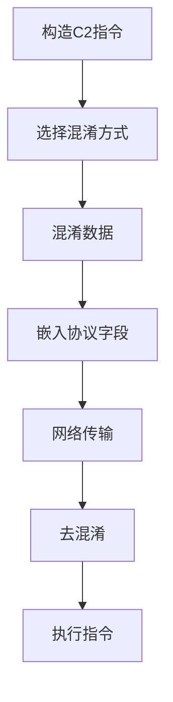

# 数据混淆 (T1001)

## 一句话通俗理解

就像给情报穿上迷彩服——攻击者用各种手段让C2数据看起来像是正常的网络流量，或者干脆让它消失在视线中。

## 难度等级

- ⭐⭐ 中级（需要一定基础）

## 技术描述

数据混淆（Data Obfuscation）是 MITRE ATT&CK 框架中命令与控制战术下的一种重要技术，编号为 T1001。

**通俗解释：**
如果C2数据在网络上"素颜"传输——二进制数据、固定格式、明显的特征——安全设备一眼就能认出来并将其拦截。数据混淆就是给C2数据"化妆"和"变装"，让它看起来像正常的业务数据或随机噪声。这就像把机密文件伪装成普通商业邮件来寄送。

**技术原理：**
数据混淆比单纯的编码更"聪明"。它不仅改变数据的格式，还通过多种手段让数据在外观上模仿合法流量：
1. 插入垃圾数据：在真实C2数据中混入随机生成的填充字节，改变流量特征
2. 协议模仿：让C2流量看起来像 HTTP API 调用、WebSocket 消息、MQTT 物联网通信等
3. 隐写术：把C2指令藏在图片、音频等数字媒体文件中
4. 格式变换：将C2数据映射到看似合法的字段值中（如UUID、时间戳、哈希值）

**用途与影响：**
混淆技术使基于签名的检测系统（IDS/IPS）难以建立有效的检测规则。攻击者通过不断改变混淆方式，可以使同一个C2框架在被检测到后快速"变脸"以绕过规则。Cobalt Strike 的 Malleable C2 配置文件就是专门用来控制流量混淆方式的工具。

## 子技术列表

**该技术共有 4 个子技术：**

| 子技术ID | 中文名称 | 通俗解释 |
|----------|----------|----------|
| T1001.001 | 垃圾数据 | 在真实数据中混入随机字节，改变流量统计特征 |
| T1001.002 | 隐写术 | 把C2指令藏在图片、音频文件中，表面看是完全正常的文件 |
| T1001.003 | 协议模仿 | 让C2流量装成 HTTP API、WebSocket 等合法协议的样子 |
| T1001.004 | 镜像回弹 | 没有新技术，该子技术已被 MITRE 移除 |

<details>
<summary><strong>展开查看各子技术详细说明</strong></summary>

各子技术详细说明请参阅独立文档：

- [T1001.001 - 垃圾数据](./T1001/T1001.001-Junk-Data.md) — 在真情报中掺假信息，让情报看起来像没用的废话。
- [T1001.002 - 隐写术](./T1001/T1001.002-Steganography.md) — 把字条藏在画里——C2指令藏在图片的像素点中，肉眼看不出来。
- [T1001.003 - 协议模仿](./T1001/T1001.003-Protocol-Impersonation.md) — 让C2指令"穿上"合法协议的"制服"，混在正常流量中。

</details>

## 攻击流程

### 典型攻击流程

```
构造C2指令 --> 选择混淆方式 --> 混淆数据 --> 嵌入协议 --> 传输 --> 去混淆 --> 执行
```



**步骤详解：**

1. **构造C2指令**
   - 通俗描述：攻击者生成要执行的命令
   - 技术细节：命令按预设协议格式打包
   - 常用工具：C2框架

2. **选择混淆方式**
   - 技术细节：根据C2配置选择垃圾数据填充、协议模仿、隐写等方式
   - 常用工具：Malleable C2 配置文件、自定义混淆模块

3. **混淆数据**
   - 技术细节：应用选择的混淆算法处理原始数据
   - 常用工具：自定义工具

4. **嵌入协议字段**
   - 技术细节：混淆后的数据放入 HTTP/DNS 等协议字段
   - 常用工具：C2框架

## 真实案例

### 案例1：Cobalt Strike — Malleable C2 流量混淆（2024年Unit 42分析）

- **时间**: 2024年（持续活跃）
- **目标**: 全球多行业
- **攻击组织**: 多个APT组织
- **手法**: Palo Alto Networks Unit 42 在2024年6月发布报告，详细分析了攻击者利用公开仓库中的 Malleable C2 配置文件进行C2流量混淆的情况。攻击者从公开代码仓库中复制 ocsp.profile 等Malleable C2配置，仅修改少量参数（如User-Agent、URI路径）就生成了定制的C2流量。这些配置使 Cobalt Strike Beacon 的 HTTP 流量伪装成 Microsoft CryptoAPI 的正常通信。其中一个样本使用 `www.consumershop.lenovo.com.cn` 作为前端域名，实际C2服务器却是 `cdnhwcggk22[.]com`。攻击者通过修改 HTTP GET/POST 请求的 URI、自定义 HTTP 头字段等方式，使每个样本的流量特征各不相同，传统签名检测完全失效。
- **影响**: 大量组织被入侵，基于签名的检测方案难以有效防御
- **参考链接**: [Unit 42 - Attackers Exploiting Public Cobalt Strike Profiles](https://unit42.paloaltonetworks.com/attackers-exploit-public-cobalt-strike-profiles/)

### 案例2：BumbleBee — JSON 数据混淆（2021-2023年）

- **时间**: 2021-2023年
- **目标**: 全球企业网络
- **攻击组织**: BumbleBee（初始访问代理）
- **手法**: BumbleBee 恶意软件在 HTTP C2 通信中使用 JSON 数据混淆。C2请求和响应的格式模仿合法的 SaaS API 请求——包含 `user_id`、`session_token`、`timestamp`、`version` 等字段。真实的C2指令数据（如 `exec command`、`upload file`）被 Base64 编码后嵌入到 `data` 字段中。BumbleBee 还使用 AES-128 加密编码后的载荷，使 DLP 和防火墙在不解密的情况下无法识别真正的通信内容。
- **影响**: 多个企业网络被入侵，作为勒索软件的初始访问通道
- **参考链接**: [MITRE ATT&CK - S1109](https://attack.mitre.org/software/S1109/)

### 案例3：Vice Society 勒索软件 — 图片隐写术C2（2022-2023年）

- **时间**: 2022-2023年
- **目标**: 全球教育、医疗、制造行业
- **攻击组织**: Vice Society
- **手法**: Vice Society 在攻击中使用隐写术（T1001.002）隐藏C2指令。攻击者在受感染系统上每隔数分钟下载一张看似无害的JPEG图片（托管在公开的CDN或正常网站上）。图片的像素最低有效位（LSB）编码了 Base64 编码的加密C2指令。恶意软件解码图像、提取LSB、Base64解码然后AES解密获得真实的指令载荷。由于图片本身是合法的风景或产品图片，网络安全设备很难识别其中的隐写数据。
- **影响**: 多个教育机构和医疗机构被勒索
- **参考链接**: [MITRE ATT&CK - S0626](https://attack.mitre.org/software/S0626/)

## 红队视角

> ⚠️ **免责声明**：以下内容仅用于合法的安全测试、渗透测试和教育目的。未经授权对他人系统进行测试是违法行为。

### 实战技巧

1. **协议模仿的细节**
  HTTP 头字段的顺序也很重要。不同的 Web 服务器和框架有不同的 Header 顺序。模仿特定的 Web 服务器（如 IIS、Nginx、Apache）时，注意头字段的排列顺序。

2. **垃圾数据的策略**
  不要在所有请求中添加固定量的垃圾数据。垃圾数据的比例应在每次请求中动态变化（如 10%-30%），避免被基于数据长度的检测发现。

3. **Malleable C2 配置**
  Cobalt Strike 的 Malleable C2 配置文件是最强大的流量混淆工具之一。可以自定义HTTP方法、URI、Header、Cookie、POST body 的每个字节。

### 常用工具

| 工具名称 | 用途 | 平台 | 链接 |
|----------|------|------|------|
| Cobalt Strike | Malleable C2 配置文件自定义 | Windows/Linux | https://www.cobaltstrike.com/ |
| OpenStego | 图片隐写工具 | 跨平台 | https://www.openstego.com/ |
| Steghide | JPEG/BMP/WAV隐写 | Linux | http://steghide.sourceforge.net/ |

### 注意事项

- 协议模仿需要深入了解目标网络中的合法流量特征
- 隐写术有容量限制——一张图片能隐藏的数据量有限
- 垃圾数据会增加流量大小，可能触发基于数据量的检测规则

## 蓝队视角

### 检测要点

1. **HTTP 流量统计异常**
   - 日志来源：Web 代理日志
   - 关注字段：Content-Length、Content-Type、请求频率
   - 异常特征：POST body 大小异常（包含垃圾数据）、Content-Type 与实际内容不匹配

2. **隐写检测**
   - 日志来源：网络流量捕获、文件下载日志
   - 关注字段：下载的图片文件、其后续使用方式
   - 异常特征：频繁下载特定图片、下载图片后立即被非浏览器进程读取

### 监控建议

- 部署基于行为的检测而非仅签名检测
- 监控频繁下载图片后立即被进程操作的行为
- 使用机器学习流量分析检测协议模仿的细微偏差

## 检测建议

### 网络层检测

**检测方法：** 分析 HTTP 流量的纵深统计特征。

**示例（Suricata规则）：**
```
alert http $HOME_NET any -> $EXTERNAL_NET any (msg:"异常大小的POST请求"; flow:to_server; content:"POST"; http_method; dsize:>10000; sid:1000004; rev:1;)
```

### 主机层检测

监控图片文件和应用程序对混淆数据的处理行为。

| 检测层面 | 检测方法 | 数据来源 | 检测规则示例 |
|---------|---------|---------|-------------|
| 文件系统 | 图片文件异常修改 | Windows Event ID 4663 | 监控图片文件（.jpg/.png）被非图像处理程序打开或修改 |
| 进程 | 隐写工具执行检测 | Sysmon Event ID 1（进程创建） | 监控steghide/outguess/openpuff等隐写工具的进程创建 |
| 内存 | C2 payload内存扫描 | EDR内存扫描 | 检测进程内存中被解码的C2配置（如Cobalt Strike beacon配置指纹） |

**Windows事件检测规则：**
```powershell
# 检测图片被非预期进程访问
Get-WinEvent -FilterHashtable @{LogName='Security';ID=4663} | Where-Object {$_.Message -match "\.jpg|\.png" -and $_.Message -notmatch "explorer|photoviewer"}

# 检测高熵值文件创建（混淆C2载荷）
Get-WinEvent -FilterHashtable @{LogName='Security';ID=4663} | Where-Object {($_.Message -match "\.tmp|\.dat") -and (Get-FileHash $_.Properties[6].Value).Hash.Length -gt 64}
```

### 应用层检测

通过Sigma规则和YARA规则检测C2通信中的数据混淆行为。

**YARA规则示例：**
```yaml
rule detect_high_entropy_c2_data {
    meta:
        description = "检测可能存在混淆/编码的C2通信数据"
        author = "ATTCK知识库"
        date = "2026-06-11"
    strings:
        $base64 = /[A-Za-z0-9+\/]{40,}={0,2}/  // 高长度base64字符串
        $hex = /[0-9A-Fa-f]{32,}/  // 高长度hex字符串
        $padding = "=="
    condition:
        #base64 > 3 or #hex > 3
}
```

**Sigma规则示例：**
```yaml
title: 高熵值HTTP请求体检测（数据混淆）
status: experimental
description: 检测HTTP请求体中熵值过高的数据，可能是经过混淆的C2数据
logsource:
    category: network
    product: zeek
detection:
    selection:
        http_method: "POST"
        http_content_type|contains: "image/"
    filter:
        dsize: "<50000"
    condition: selection and not filter
level: medium
tags:
    - attack.t1001
    - attack.defense_evasion
```

```yaml
title: C2流量隐写检测（Content-Type不符）
status: experimental
description: 检测Content-Type声明为图片但实际请求体不符合图片格式的HTTP流量
logsource:
    category: network
    product: zeek
detection:
    selection:
        http_method: "POST"
        http_content_type|contains: 
            - "image/jpeg"
            - "image/png"
            - "image/gif"
    filter:
        http_content_length: "<200"
    condition: selection and not filter
level: medium
```

## 缓解措施

### 优先级1：关键措施

**措施名称：** 部署行为分析而非仅签名检测

**具体实施步骤：**
1. 部署 NTA/NDR 工具建立流量基线
2. 配置基于统计异常的告警规则（如请求体大小分布、内容熵值基线）
3. 使用机器学习模型检测异常流量模式（如随机User-Agent、非常规HTTP方法组合）

**配置示例：**
```python
# 示例：使用scikit-learn建立HTTP请求体熵值基线
from scipy.stats import entropy
import numpy as np

def detect_anomalous_entropy(payload, baseline_mean=4.5, baseline_std=0.5):
    """检测单个HTTP请求体的熵值是否异常偏高"""
    entropy_value = entropy(np.frombuffer(payload.encode(), dtype=np.uint8))
    z_score = (entropy_value - baseline_mean) / baseline_std
    return z_score > 3  # 超过3个标准差视为异常
```

### 优先级2：重要措施

**措施名称：** HTTP 流量安全检查

**具体实施步骤：**
1. 部署 HTTP 代理检查 Content-Type 与内容的实际匹配程度
2. 配置请求体大小异常告警（如声明为图片但请求体超过500KB）
3. 对POST请求体执行MIME类型嗅探，与声明的Content-Type交叉验证

**配置示例：**
```bash
# Squid代理配置：阻止Content-Type声明为图片但请求体过大的POST请求
acl image_post method POST
acl image_post req_mime_type ^image/
acl oversized_content http_reply_content_length > 500000
http_access deny image_post oversized_content
```

### 优先级3：建议措施

**措施名称：** 威胁情报和行为基线关联

**具体实施步骤：**
1. 将已知C2框架的混淆特征（Cobalt Strike Malleable C2、Sliver、Havoc等）导入检测规则
2. 监控TLS证书中的异常特征（如私有证书指纹、自签名证书、通配符证书的异常使用）
3. 定期更新JA3/JA3S指纹库，识别已知恶意C2工具的TLS握手特征

**措施名称：** YARA规则部署

**具体实施步骤：**
1. 在EDR/网络检测设备上部署C2混淆检测YARA规则
2. 定期更新规则库，覆盖最新C2框架的混淆变种
3. 关联YARA告警与网络流量元数据，构建完整的C2检测视图

### MITRE ATT&CK 缓解措施映射

| 缓解措施ID | 缓解措施名称 | 适用性 | 说明 |
|------------|-------------|--------|------|
| M0931 | 网络监控 | 适用 | 部署网络流量监控和异常检测 |
| M0940 | 文件完整性监控 | 部分适用 | 监控图片等文件的异常修改 |

## 动手实验

> ⚠️ **重要提示**：所有实验必须在隔离的实验室环境中进行，禁止对未授权的真实系统进行测试。

### 实验1：使用隐写术隐藏数据（初级）

**实验目标：** 学习在图片中隐藏数据。

**实验步骤：**
1. 准备一张图片和一个文本文件
2. 使用 steghide 将文本文件嵌入图片
3. 提取隐藏的数据

### 实验2：分析 Malleable C2 配置文件（高级）

**实验目标：** 理解 Cobalt Strike 的流量混淆原理。

**实验步骤：**
1. 从公开仓库下载 Malleable C2 配置文件
2. 分析配置文件的各个参数
3. 理解每个参数如何改变C2流量特征

### 实验3：基于熵值的C2混淆流量检测（中级）

**实验目标：** 编写简单的Python脚本检测基于熵值的C2混淆流量。

**实验环境：** Python 3 + Scapy

**实验步骤：**
1. 从Wireshark pcap文件提取HTTP POST请求体
2. 计算每个请求体的香农熵值
3. 设置阈值，标记熵值超过4.5的请求为可疑
4. 在测试流量（含Cobalt Strike模拟流量）上验证检测效果

```python
import scapy.all as scapy
from scipy.stats import entropy
import numpy as np

def analyze_http_entropy(pcap_file):
    packets = scapy.rdpcap(pcap_file)
    for pkt in packets:
        if pkt.haslayer(scapy.Raw) and pkt.haslayer(scapy.TCP):
            payload = pkt[scapy.Raw].load
            if len(payload) > 100:
                entropy_val = entropy(np.frombuffer(payload, dtype=np.uint8))
                if entropy_val > 4.5:
                    print(f"可疑C2流量: 熵值 {entropy_val:.2f}, 长度 {len(payload)}")
```

## 术语解释

| 术语 | 英文原名 | 通俗解释 |
|------|----------|----------|
| 混淆 | Obfuscation | 让数据看起来不像原来的样子，但不一定需要密钥还原 |
| 隐写术 | Steganography | 把秘密消息藏在图片、音频等载体文件中的技术 |
| Malleable C2 | Malleable C2 | 可塑的C2配置，可以自定义C2流量的每个细节 |
| LSB | Least Significant Bit | 像素的最低有效位，修改后肉眼看不出来 |
| 熵值 | Entropy | 数据随机程度的度量，高熵数据通常是加密或混淆过的 |

## 参考资料

### 官方文档

- [MITRE ATT&CK - T1001](https://attack.mitre.org/techniques/T1001/)

### 安全报告

- [Unit 42 - Public Cobalt Strike Profiles (2024)](https://unit42.paloaltonetworks.com/attackers-exploit-public-cobalt-strike-profiles/)

### 工具与资源

- [Cobalt Strike Malleable C2 文档](https://www.cobaltstrike.com/help-malleable-c2)
