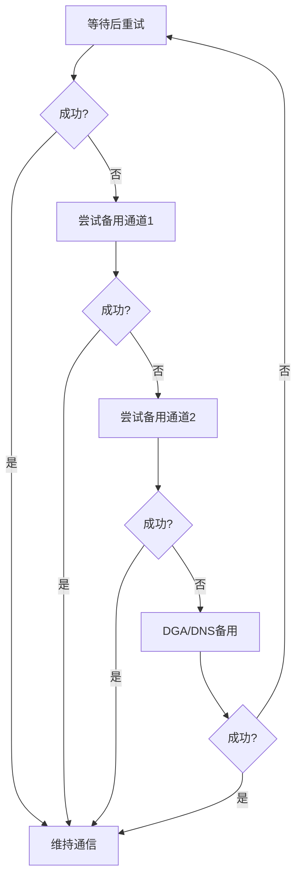

# 备用通道 (T1008)

## 一句话通俗理解

就像手机没信号时自动切换到另一个运营商——攻击者的主C2通道断了，恶意软件会自动尝试备用通道，确保"失联"后还能找回来。

## 难度等级

- ⭐⭐ 中级（需要一定基础）

## 技术描述

备用通道（Fallback Channels）是 MITRE ATT&CK 框架中命令与控制战术下的重要弹性技术，编号为 T1008。

**通俗解释：**
攻击者知道C2通道随时可能被安全团队或执法部门切断——域名被封、IP被屏蔽、DNS被劫持。所以他们在恶意软件中预设了"B计划"：一个按优先级排列的C2列表。主通道不通就试第二个，第二个不通就试第三个，直到连上为止。就像开车出门，一条路被封了就走备选路线。

**技术原理：**
备用通道机制通常包含：
1. 优先级列表：恶意软件内置多个C2地址（域名或IP），按优先级排序，优先连接主C2
2. 指数退避：连接失败后等待越来越长的时间再重试（如1分钟→2分钟→4分钟→8分钟）
3. 协议切换：主通道用HTTP，备用通道切换到DNS或P2P
4. DGA备用：当所有硬编码C2都失效时，使用DGA生成动态域名作为最后的"救命稻草"

**用途与影响：**
备用通道使防守方难以通过"切掉"单一C2服务器来完全阻断攻击者的控制。高级恶意软件（如TrickBot、Emotet）即使在多次国际执法行动后仍能恢复C2通信，正是因为其多层备用设计。

## 子技术列表

**该技术没有子技术。**

## 攻击流程

### 典型攻击流程

```
连接主C2 --> 失败? --> 尝试备用1 --> 失败? --> 尝试备用2 --> ... --> 全部失败? --> 指数退避重试
```



**步骤详解：**

1. **连接主C2**
   - 通俗描述：恶意软件先尝试连接预设的主C2服务器
   - 技术细节：按硬编码的优先级列表尝试连接
   - 常用工具：标准HTTP/HTTPS/DNS库

2. **连接失败处理**
   - 通俗描述：连接失败后不放弃，等待一段时间再试不同地址
   - 技术细节：使用指数退避策略
   - 常用工具：自定义重试逻辑

3. **备用通道切换**
   - 通俗描述：更换不同协议或不同域名
   - 技术细节：HTTP→HTTPS→DNS→P2P逐步切换
   - 常用工具：多协议支持模块

## 真实案例

### 案例1：TrickBot — 多层备用C2架构（2016-2022年）

- **时间**: 2016-2022年
- **目标**: 全球金融机构、企业
- **攻击组织**: TrickBot
- **手法**: TrickBot 设计了高度冗余的备用C2架构：硬编码的C2 IP列表（按优先级排序）→ 从C2定期下载更新的C2列表 → DGA生成备用域名 → 通过代理连接C2。2020年微软联合执法部门进行的 TrickBot 基础设施清除行动中，虽然大量C2服务器被关闭，但由于其多层备用机制，部分受感染系统很快恢复了C2通信。
- **影响**: 多次执法行动后仍存活，造成数十亿美元损失
- **参考链接**: [MITRE ATT&CK - S0266](https://attack.mitre.org/software/S0266/)

### 案例2：Emotet — P2P 备用通道（2014-2021年）

- **时间**: 2014-2021年
- **目标**: 全球个人和企业用户
- **攻击组织**: Emotet
- **手法**: Emotet 使用复杂的备用C2架构，包含多个备用C2服务器和P2P节点地址。当主C2不可用时，Emotet 自动切换到P2P模式，使用受感染系统之间的互相通信作为通道。2021年1月欧盟刑警组织的执法行动虽然关闭了Emotet基础设施，但部分节点在清理后仍尝试通过P2P备用通道恢复通信。
- **影响**: 全球最大的僵尸网络之一，被多次执法打击
- **参考链接**: [MITRE ATT&CK - S0367](https://attack.mitre.org/software/S0367/)

### 案例3：Cobalt Strike — Malleable C2 备用通道

- **时间**: 2012年至今
- **目标**: 全球多行业
- **攻击组织**: 多个APT组织
- **手法**: Cobalt Strike 的 Beacon 支持灵活的备用通道配置：主HTTP C2 → 备用HTTPS C2 → DNS TXT 查询。Malleable C2 配置文件中可以定义多个通信端点。"sleep"和"jitter"参数控制重试频率，避免在切换过程中产生可识别的流量模式。
- **影响**: C2弹性设计的行业参考标准
- **参考链接**: [MITRE ATT&CK - S0154](https://attack.mitre.org/software/S0154/)

### 案例4：GlassWorm僵尸网络 — 区块链+Web服务多层备用C2（2025-2026年）

- **时间**: 2025年10月至2026年5月
- **目标**: 全球开源软件生态系统、软件开发者
- **攻击组织**: GlassWorm（网络犯罪集团）
- **手法**: GlassWorm僵尸网络设计了史上最具弹性的备用C2架构之一，包含4条完全不同的通信通道：（1）**Solana区块链**（主通道）——攻击者将C2地址编码在Solana交易的备注字段中，这些记录不可篡改且无法删除；（2）**Google Calendar**（备用通道1）——Base64编码的C2路径存储在日历事件的标题中；（3）**BitTorrent DHT网络**（备用通道2）——配置数据根据硬编码的公钥存储在P2P网络中；（4）**传统VPS服务器**（备用通道3）——托管实际载荷和指令。当主通道（Solana）被监控时，恶意软件自动切换到Google Calendar读取指令；当Google Calendar被封禁时，转向BitTorrent DHT网络；最后回退到VPS服务器。2026年5月，CrowdStrike联合Google和Shadowserver Foundation同时对4条通道实施了同步阻断，才成功破坏了这个僵尸网络。GlassWorm通过恶意OpenVSX扩展、VS Code插件、GitHub仓库和npm包感染开发者机器，窃取加密货币钱包和云凭据。
- **影响**: 超过300个GitHub仓库被感染，开发者生态系统受到严重威胁
- **参考链接**: [CrowdStrike GlassWorm破坏行动](https://www.crowdstrike.com/en-us/blog/inside-crowdstrike-takedown-of-a-developer-targeting-botnet/) | [SecurityWeek GlassWorm报道](https://www.securityweek.com/glassworm-botnet-disrupted/)

## 红队视角

> ⚠️ **免责声明**：以下内容仅用于合法的安全测试、渗透测试和教育目的。未经授权对他人系统进行测试是违法行为。

> ⚠️ **免责声明**：以下内容仅用于合法的安全测试。

### 实战技巧

1. **多层备用优先级**
   设置协议切换优先级：HTTPS（隐蔽性高）→ DNS（穿透性强）→ 域名前置（高信誉）→ P2P（去中心化）。

2. **指数退避策略**
   初始重试间隔不要小于60秒，避免被检测为"疯狂重试"的异常行为。

### 常用工具

| 工具名称 | 用途 | 平台 | 链接 |
|----------|------|------|------|
| Cobalt Strike | 多备用通道支持 | Windows/Linux | https://www.cobaltstrike.com/ |
| Sliver | 备用协议栈 | 跨平台 | https://github.com/BishopFox/sliver |

### 注意事项

- 过多的备用通道会增加恶意软件的复杂度
- 备用通道的切换过程可能产生特征流量

## 蓝队视角

### 检测要点

1. **重试模式检测**
   - 日志来源：网络流量日志
   - 异常特征：终端快速连续尝试连接多个不同域名/IP

2. **协议切换检测**
   - 异常特征：从HTTPS突然切换到DNS TXT查询

### 监控建议

- 监控终端连接失败后的重试行为和模式
- 检测协议切换的突变

## 检测建议

### 网络层检测

**检测方法：** 分析终端的连接失败和重试模式。

**Sigma规则示例：**
```yaml
title: C2备用通道切换检测
status: experimental
description: 检测终端快速切换多个C2域名的行为
logsource:
    category: network
    product: dns
detection:
    selection:
        QueryName|re: ".*(failover|backup|fallback).*"
    condition: selection
level: medium
tags:
    - attack.t1008
```

## 缓解措施

### 优先级1：关键措施

**措施名称：** 全面的出口过滤

**具体实施步骤：**
1. 实施白名单出站规则
2. 部署 DNS 过滤
3. 定期更新威胁情报

### MITRE ATT&CK 缓解措施映射

| 缓解措施ID | 缓解措施名称 | 适用性 | 说明 |
|------------|-------------|--------|------|
| M0931 | 网络监控 | 适用 | 监控连接重试模式 |
| M0950 | DNS 安全 | 适用 | 部署DNS安全 |

## 动手实验

> ⚠️ **重要提示**：所有实验必须在隔离的实验室环境中进行，禁止对未授权的真实系统进行测试。

### 实验1：配置 C2 备用通道（中级）

**实验目标：** 使用 Sliver 配置多备用C2通道。

**实验步骤：**
1. 配置 HTTP 和 DNS 两种C2通道
2. 关闭 HTTP 端口观察自动切换
3. 分析切换过程中的流量特征

## 术语解释

| 术语 | 英文原名 | 通俗解释 |
|------|----------|----------|
| 备用通道 | Fallback Channel | 主C2失效后使用的替代通信通道 |
| 指数退避 | Exponential Backoff | 失败后等待时间越来越长的重试策略 |
| P2P | Peer to Peer | 点对点通信，不依赖中心服务器 |

## 参考资料

### 官方文档

- [MITRE ATT&CK - T1008](https://attack.mitre.org/techniques/T1008/)
