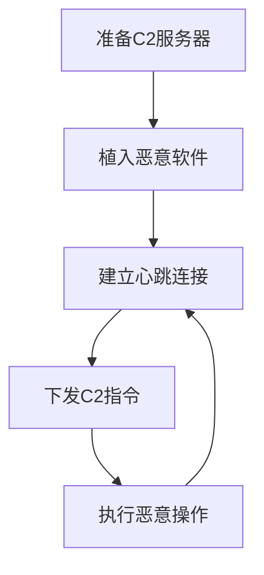

# 应用层协议 (T1071)

## 一句话通俗理解

就像在人群中传纸条——攻击者把C2指令藏在HTTP、DNS这些正常网络协议中，混在正常的网络流量里传递。

## 难度等级

- ⭐⭐ 中级（需要一定基础）

## 技术描述

应用层协议（Application Layer Protocol）是 MITRE ATT&CK 框架中命令与控制战术下的核心基础技术，编号为 T1071。

**通俗解释：**
企业网络中每时每刻都有海量的网络流量在传输——员工浏览网页（HTTP/HTTPS）、查询域名（DNS）、收发邮件（SMTP/IMAP）、传输文件（FTP/SMB）。攻击者利用了这些"合法流量"作为掩护，把攻击指令伪装成正常的网络请求。就像地下党把情报藏在报纸的夹层中一样，C2 指令就藏在看似正常的网络数据包里。

**技术原理：**
攻击者使用标准的应用层协议来传输 C2 指令和响应数据。以最常见的 HTTP C2 为例，攻击流程如下：

1. 受感染系统定期向 C2 服务器发送 HTTP GET 或 POST 请求（即"心跳"或"信标"）
2. C2 指令编码在 HTTP 请求的各个字段中：URI 路径、Cookie、POST 请求体、自定义 Header 等
3. C2 服务器的响应也藏在 HTTP 响应中：200 OK 状态码的响应体、set-cookie 字段、重定向响应等
4. 恶意软件解析响应内容，提取实际指令并执行

**用途与影响：**
应用层协议 C2 是最常见、最有效的 C2 通信方式。由于这些协议是企业网络的"必需品"，安全团队不能简单地封锁它们。攻击者通过模仿正常流量，使 C2 通信在大量合法流量中"隐身"。据安全厂商统计，超过 80% 的 APT 攻击使用 HTTP/HTTPS 协议作为 C2 通道。

## 子技术列表

**该技术共有 5 个子技术：**

| 子技术ID | 中文名称 | 通俗解释 |
|----------|----------|----------|
| T1071.001 | Web协议 | 使用 HTTP/HTTPS，最常用的 C2 方式，像假装在上网其实在传指令 |
| T1071.002 | 文件传输协议 | 用 FTP、SMB 等文件共享协议，C2 指令伪装成文件传输操作 |
| T1071.003 | 邮件协议 | 用 SMTP/IMAP/POP3 收发邮件传指令，适合邮件流量大的单位 |
| T1071.004 | DNS | 用 DNS 查询和响应传数据，防火墙很难拦截 |
| T1071.005 | SMB | 用 Windows 文件共享协议传 C2 指令，适合内网横向移动 |

<details>
<summary><strong>展开查看各子技术详细说明</strong></summary>

### T1071.001 - Web协议

**通俗理解：** 把C2指令伪装成正常的网页请求，假装在浏览网页其实在传数据。

**详细说明：**
Web协议是最主流的C2通信方式。攻击者将C2数据编码在 HTTP 请求的各个位置：URI 路径（如 `/api/status?id=base64编码的指令`）、Cookie 字段、POST 请求体（JSON/XML格式）、自定义 Header。使用 HTTPS 加密后，网络监控设备只能看到加密的 TLS 流量，无法检查具体内容。Cobalt Strike、Sliver、Mythic 等主流 C2 框架默认使用 Web 协议通信。

### T1071.002 - 文件传输协议

**通俗理解：** 假装在传文件，其实在传C2指令。

**详细说明：**
使用 FTP、SFTP、WebDAV 等文件传输协议。攻击者将 C2 指令伪装成文件名、文件内容或文件元数据（如创建时间、文件大小）。受感染系统定期"下载更新"或"上传日志"，实际是在交换 C2 数据。

### T1071.003 - 邮件协议

**通俗理解：** 用发邮件的方式传C2指令，因为邮件通常不会被拦截。

**详细说明：**
使用 SMTP（发邮件）和 IMAP/POP3（收邮件）协议。攻击者向特定的邮箱账户发送包含编码指令的邮件，恶意软件登录该邮箱读取指令。指令可以藏在邮件主题、正文、附件文件名或邮件头中。

### T1071.004 - DNS

**通俗理解：** 用查域名的方式传C2指令，所有网络都允许DNS查询。

**详细说明：**
DNS 是网络基础设施协议，几乎不会被防火墙拦截。攻击者将数据编码在 DNS 查询的子域名中（如 `base64数据.c2domain.com`），C2 服务器通过 DNS 响应（TXT 记录、A 记录）返回指令。DNS 隧道传输速度慢但极其隐蔽。

### T1071.005 - SMB

**通俗理解：** 用 Windows 文件共享功能传C2指令，适合内网传播。

**详细说明：**
利用 Windows 的 SMB 协议和命名管道（Named Pipe）进行 C2 通信。在 Windows 域环境中，SMB 流量非常普遍，攻击者的 C2 流量混在其中极难分辨。Cobalt Strike 的 SMB Beacon 就是使用命名管道通过 SMB 协议通信。

</details>

## 攻击流程

### 典型攻击流程

```
准备C2服务器 --> 植入恶意软件 --> 建立心跳连接 --> 下发C2指令 --> 执行恶意操作
```



**步骤详解：**

1. **准备C2服务器**
   - 通俗描述：攻击者搭建一台控制服务器，配置好 Web 服务，准备接收受感染系统的连接
   - 技术细节：配置 Nginx/Apache 作为 C2 前端，设置 SSL 证书启用 HTTPS，配置 Cobalt Strike/Mythic/Sliver 的 C2 配置文件
   - 常用工具：Cobalt Strike、Mythic、Sliver、Nginx、Let's Encrypt

2. **植入恶意软件**
   - 通俗描述：通过钓鱼邮件、漏洞利用等方式在目标电脑上运行恶意程序
   - 技术细节：恶意软件通常是一个"下载器"（Downloader），体积很小，只负责连接 C2 下载更大的 payload
   - 常用工具：各种钓鱼框架、漏洞利用工具包

3. **建立心跳连接**
   - 通俗描述：被黑的电脑每隔一段时间向 C2 服务器发送"报平安"的信号
   - 技术细节：发送 HTTP GET 请求到 C2 的特定 URI，请求头包含预定义的 User-Agent、Cookie 等特征。C2 服务器若无指令下发，返回 404 或空响应
   - 常用工具：Cobalt Strike Beacon、Metasploit Meterpreter

4. **下发C2指令**
   - 通俗描述：攻击者通过 C2 服务器向被黑的电脑发送具体指令
   - 技术细节：指令编码在 HTTP 响应中（如 200 OK 的 body、set-cookie 值、302 重定向位置等）。恶意软件解析响应，提取指令并执行
   - 常用工具：shell 命令执行、文件上传下载、进程注入

5. **执行恶意操作**
   - 通俗描述：被黑电脑执行攻击者的指令，如窃取文件、安装更多恶意软件
   - 技术细节：执行结果同样编码后通过下一次心跳请求返回给 C2 服务器
   - 常用工具：Mimikatz、AnyDesk、各种后门工具

## 真实案例

### 案例1：APT41 — 基于 HTTPS 的多行业供应链攻击（2024年）

- **时间**: 2023年-2024年7月
- **目标**: 全球航运物流、媒体娱乐、科技、汽车行业
- **攻击组织**: APT41（Wicked Panda / Winnti）
- **手法**: APT41 在 2024 年的大规模攻击活动中使用 HTTPS 作为主要 C2 通信协议。攻击者通过 Web Shell（ANTSWORD、BLUEBEAM）植入 DUSTPAN 下载器，后者从 C2 服务器通过 HTTPS 下载 BEACON 后门。BEACON 使用 Cloudflare Workers 和自建基础设施作为 HTTPS C2 通道，C2 流量伪装成正常的 Cloudflare API 调用。APT41 还利用受感染的 Google Workspace 账户作为 C2 中继，使流量看起来是对 Google 服务的正常 HTTPS 访问。Mandiant 和 Google TAG 的报告显示，APT41 在 2024 年成功入侵了分布在意大利、西班牙、台湾、泰国、土耳其和英国等多个国家的组织。
- **影响**: 大量企业敏感数据被窃取，包括航运记录、客户数据、知识产权
- **参考链接**: [Google Cloud - APT41 Has Arisen From the DUST](https://cloud.google.com/blog/topics/threat-intelligence/apt41-arisen-from-dust)

### 案例2：Earth Baxia — 定制化 Cobalt Strike 的 HTTPS C2（2024年）

- **时间**: 2024年6月-8月
- **目标**: 台湾政府机构、亚太地区电信和能源行业
- **攻击组织**: Earth Baxia（疑似中国背景）
- **手法**: Earth Baxia 使用鱼叉钓鱼邮件和 GeoServer 漏洞（CVE-2024-36401）获取初始访问权限，然后部署定制化的 Cobalt Strike 变种。这些变种修改了内部签名和配置结构，使用 HTTPS 协议与 C2 服务器通信。C2 流量托管在阿里云和香港的服务器上，使用了经过修改的 Malleable C2 配置文件来模仿正常的 HTTP API 流量。攻击者还使用了一个名为 EAGLEDOOR 的新后门，支持多种通信协议进行 C2。Trend Micro 的报告显示，该组织在 2024 年 6 月至 8 月期间活跃，目标涉及多个亚太国家。
- **影响**: 政府机构敏感数据泄露，关键基础设施部门受影响
- **参考链接**: [Trend Micro - Earth Baxia Uses Spear-Phishing](https://www.trendmicro.com/en/research/24/i/earth-baxia-spear-phishing-and-geoserver-exploit.html)

### 案例3：Goffee 组织 — Mythic 和 Sliver 的 C2 通信（2024-2025年）

- **时间**: 2024年-2025年9月
- **目标**: 俄罗斯组织，包括军工企业
- **攻击组织**: Goffee（Paper Werewolf）
- **手法**: Goffee 组织在 2024-2025 年的攻击活动中广泛使用 Mythic 和 Sliver C2 框架。在 Windows 系统上，他们使用 Mythic 的 MiRat 代理通过 HTTPS 进行 C2 通信，采用多阶段 DLL 侧加载技术隐藏 payload。在 Linux 系统上，他们使用 Sliver 通过 Nim 编写的加载器部署。Goffee 还开发了 DQuic（基于 QUIC 协议的 UDP 隧道工具）和 BindSycler（SSH 隧道工具）来增强 C2 通信的隐蔽性。该组织的 C2 基础设施使用俄罗斯 IP 地址和国内托管商，以绕过基于地理位置的流量过滤。PT Security 的报告追踪了该组织从 2024 年初到 2025 年 9 月的持续活动。
- **影响**: 俄罗斯军工企业业务中断，敏感信息泄露
- **参考链接**: [PT Security - Goffee Group Attacks](https://global.ptsecurity.com/en/research/pt-esc-threat-intelligence/fortune-telling-on-goffee-grounds/)

### 案例4：APT29（Cozy Bear）— DNS over HTTPS 和自定义协议 C2

- **时间**: 2020-2022年
- **目标**: 美国联邦政府机构、IT 公司、智库
- **攻击组织**: APT29（Cozy Bear / NOBELIUM）
- **手法**: APT29 在 SolarWinds 供应链攻击中使用复杂的多层 C2 通信。初始阶段的 SUNBURST 后门使用 DNS C2 通道，通过将数据编码在 DNS TXT 查询中注册感染状态。确认目标有价值后，切换到 HTTPS C2 通道，将指令编码在伪造的 HTTP 请求头中。最终通过下载 Teardrop（Cobalt Strike 加载器）建立第三个独立的 HTTPS 通道进行深度操作。
- **影响**: 美国多个政府机构被入侵，包括财政部和商务部
- **参考链接**: [MITRE ATT&CK - G0016](https://attack.mitre.org/groups/G0016/)

## 红队视角

> ⚠️ **免责声明**：以下内容仅用于合法的安全测试、渗透测试和教育目的。未经授权对他人系统进行测试是违法行为。

### 实战技巧

1. **选择合适的 User-Agent**
   不要使用默认的 User-Agent 字符串（如 `Mozilla/4.0`），观察目标网络环境中主流浏览器的真实 User-Agent，模仿真实用户。也可以使用目标组织常用软件的 User-Agent（如 Microsoft Teams、OneDrive 同步客户端）。

2. **C2 心跳频率设置**
   不要使用固定的心跳间隔。使用 jitter（抖动）参数让心跳间隔在一定范围内随机变化。例如设置为 `sleep 60s, jitter 30%`，实际心跳间隔在 42-78 秒之间随机，避免被基于时间规律的检测发现。

3. **利用合法的 API 端点**
   将 C2 流量伪装成对常见云服务的 API 调用。例如模拟 Microsoft Graph API 的请求格式，或伪装成 Slack/Teams 的 Webhook 回调。目标网络中这些服务的流量通常不受严格审查。

### 常用工具

| 工具名称 | 用途 | 平台 | 链接 |
|----------|------|------|------|
| Cobalt Strike | 商业C2框架，支持自定义Malleable C2配置文件 | Windows/Linux | https://www.cobaltstrike.com/ |
| Sliver | 开源C2框架，Bishop Fox开发 | 跨平台 | https://github.com/BishopFox/sliver |
| Mythic | 开源多用户C2平台 | Docker/Linux | https://github.com/its-a-feature/Mythic |
| Havoc C2 | 现代开源C2框架 | Windows/Linux | https://github.com/HavocFramework/Havoc |
| Metasploit | 渗透测试框架，含Meterpreter C2 | 跨平台 | https://www.metasploit.com/ |

### 注意事项

- 使用 APT 攻击中使用的 C2 技术进行授权测试前，必须获得目标系统的书面授权
- C2 流量的特征（User-Agent、心跳间隔、HTTP 头顺序）要尽量模仿真实业务流量
- 在生产环境中使用 C2 工具前，先修改默认配置和指纹特征
- 注意记录和保存所有 C2 通信日志，作为测试证据

## 蓝队视角

### 检测要点

1. **异常的 HTTP 请求模式**
   - 日志来源：Web 代理日志、防火墙日志
   - 关注字段：User-Agent、请求频率、请求 URI 模式、Content-Type
   - 异常特征：非主流浏览器的 User-Agent、固定间隔的 HTTP 请求（无 jitter）、请求 URI 包含长编码字符串

2. **DNS 查询异常**
   - 日志来源：DNS 服务器日志、网络流量捕获
   - 关注字段：查询域名长度、查询频率、记录类型
   - 异常特征：超长子域名（超过 30 字符）、高频率 TXT 记录查询、大量 NXDOMAIN 响应

3. **TLS 握手指纹异常**
   - 日志来源：网络流量捕获
   - 关注字段：JA3/JA3S 指纹、SSL 证书信息、TLS 版本
   - 异常特征：JA3 指纹与已知恶意工具匹配、自签名证书、TLS 版本与声称的客户端不匹配

### 监控建议

- 部署网络流量分析工具（如 Zeek、Suricata）建立流量基线，标记偏离基线的 HTTP/DNS 行为
- 使用 JA3/JA3S 指纹库识别已知 C2 框架的 TLS 握手特征
- 监控 DNS 查询中涉及新注册域名或高熵域名的行为
- 对 HTTP 请求进行频率分析，发现具有固定节奏的自动化请求

## 检测建议

### 网络层检测

**检测方法：** 分析 HTTP 请求的频率、User-Agent 和 URI 模式的异常。

**具体规则/命令示例：**

```
# 检测固定间隔的 HTTP 请求（可能的 C2 心跳）
使用 Zeek 的 HTTP 日志分析请求时间间隔，标记时间间隔标准差小于 x 的请求序列
```

**示例（Suricata规则）：**
```
alert http any any -> $HOME_NET any (msg:"C2 - 异常 User-Agent"; content:"User-Agent|3a 20|Mozilla/4.0"; http_header; sid:1000001; rev:1;)
```

### 主机层检测

**检测方法：** 监控进程创建链和网络连接行为。

**Windows事件ID：**
- 事件ID 4688：检测非标准进程发起网络连接（如 Office 进程启动网络连接）
- 事件ID 5156：监控出站网络连接的目的地址和端口

**具体命令示例：**
```bash
# PowerShell 检测定期网络连接的进程
Get-NetTCPConnection | Where-Object {$_.State -eq "Established" -and $_.RemotePort -eq 443}
```

### 应用层检测

**检测方法：** 使用 Sigma 规则检测 HTTP C2 流量模式。

**Sigma规则示例：**
```yaml
title: HTTP C2 心跳检测
status: experimental
description: 检测固定间隔的 HTTP 请求，可能是 C2 心跳
logsource:
    category: network
    product: zeek
detection:
    selection:
        http_method: "GET"
        uri|contains: "/api/"
    timeframe: 10m
    condition: selection | count() > 50
level: medium
tags:
    - attack.t1071
```

## 缓解措施

### 优先级1：关键措施

**措施名称：** 实施出站 Web 代理和 TLS 解密

**具体实施步骤：**
1. 部署正向代理服务器，强制所有 HTTP/HTTPS 出站流量经过代理
2. 配置 TLS 解密（SSL Inspection）检查加密流量内容
3. 仅允许经过授权的 User-Agent 和应用程序通过代理
4. 实施域名白名单，仅允许访问业务必需的域名

**配置示例：**
```
# Squid 代理配置示例
http_port 3128 ssl-bump cert=/etc/squid/ssl_cert/myCA.pem
ssl_bump peek all
ssl_bump bump all
acl blocked_domains dstdomain "/etc/squid/blocked_domains.txt"
http_access deny blocked_domains
```

### 优先级2：重要措施

**措施名称：** DNS 安全加固

**具体实施步骤：**
1. 部署 DNS 过滤服务（如 DNS sinkhole、Cisco Umbrella）
2. 配置 DNS 查询日志记录，定期分析异常 DNS 模式
3. 限制 DNS 查询仅能使用组织的 DNS 服务器

### 优先级3：建议措施

**措施名称：** 网络行为基线分析

**具体实施步骤：**
1. 部署 NTA（网络流量分析）工具建立正常流量基线
2. 配置异常流量告警规则
3. 定期审计网络流量中的异常模式

### MITRE ATT&CK 缓解措施映射

| 缓解措施ID | 缓解措施名称 | 适用性 | 说明 |
|------------|-------------|--------|------|
| M0937 | 网络过滤 | 适用 | 配置防火墙和应用层过滤规则 |
| M0931 | 网络监控 | 适用 | 部署网络流量监控和异常检测 |
| M0941 | 加密流量分析 | 适用 | 使用 TLS 解密检查加密 C2 流量 |

## 动手实验

> ⚠️ **重要提示**：所有实验必须在隔离的实验室环境中进行，禁止对未授权的真实系统进行测试。

### 实验环境准备

**推荐靶场/实验平台：**

| 平台名称 | 类型 | 难度 | 链接 |
|----------|------|------|------|
| TryHackMe - C2 模块 | 虚拟靶场 | 初级 | https://tryhackme.com/ |
| HackTheBox - C2 机器 | 虚拟靶场 | 中级 | https://www.hackthebox.com/ |
| 自建实验环境 | VMware/VirtualBox | 高级 | - |

**所需工具：**
- Sliver C2：开源 C2 框架，用作实验的控制端
- Wireshark：网络抓包工具
- 两台虚拟机（Kali Linux 作为攻击机，Windows/Linux 作为目标机）

**环境搭建：**
```bash
# 在 Kali 上安装 Sliver
sudo apt update && sudo apt install sliver -y
# 启动 Sliver 服务端
sliver-server
```

### 实验1：使用 HTTP C2 建立基本连接（初级）

**实验目标：** 使用 Sliver 框架建立一个基础的 HTTP C2 通道。

**实验步骤：**
1. 在 Kali 上启动 Sliver 服务器，生成 HTTP 模式的 payload
2. 将 payload 传输到目标虚拟机并执行
3. 在 Sliver 控制台观察 C2 心跳连接
4. 使用 Wireshark 抓包分析 HTTP C2 流量的特征

**预期结果：** 成功在攻击机和目标机之间建立 HTTP C2 通道，能观察到心跳包的特征。

**学习要点：** 理解 HTTP C2 的基本通信模式——心跳间隔、HTTP 请求结构、指令编码方式。

### 实验2：修改 C2 配置文件躲避检测（中级）

**实验目标：** 修改 Sliver 的 C2 配置，使流量看起来更像正常 HTTP 流量。

**实验步骤：**
1. 使用默认配置生成 HTTP C2 payload，观察其流量特征
2. 修改 Sliver 的 HTTP C2 配置（User-Agent、URI 路径、Jitter）
3. 对比修改前后的流量差异
4. 尝试使用 Suricata IDS 检测未修改的默认流量

**预期结果：** 修改配置后的 C2 流量更难被基于签名的规则检测到。

**学习要点：** 理解 C2 配置对隐蔽性的影响，学习如何自定义 C2 流量外观。

### 实验3：HTTPS C2 与 TLS 指纹分析（高级）

**实验目标：** 建立 HTTPS C2 通道并分析其 TLS 指纹特征。

**实验步骤：**
1. 为 Sliver C2 服务器配置 Let's Encrypt SSL 证书
2. 生成 HTTPS 模式的 payload 并执行
3. 使用 Wireshark 捕获 TLS 握手过程
4. 计算 JA3 指纹并与已知工具对比

**预期结果：** HTTPS C2 流量在应用层不可见，但 TLS 握手指纹可能泄露使用的 C2 框架。

**学习要点：** 理解 TLS 加密对 C2 检测的影响，学习 JA3 指纹分析技术。

## 术语解释

| 术语 | 英文原名 | 通俗解释 |
|------|----------|----------|
| 心跳/信标 | Beacon / Heartbeat | 被黑电脑定期向C2服务器发的"我还活着"的信号 |
| C2/C&C | Command and Control | 攻击者控制被黑电脑的通信渠道，像遥控器的信号 |
| JA3指纹 | JA3 Fingerprint | TLS握手的"指纹"，可以识别用的是什么C2工具 |
| Malleable C2 | Malleable C2 | 可定制的C2配置，让C2流量长得像任何你想像的流量 |
| Payload | Payload | 恶意软件的"有效载荷"，包含实际攻击功能的代码 |
| Stager | Stager | 小型下载器，只负责连接C2下载完整的恶意软件 |
| User-Agent | User-Agent | HTTP请求头中的"自我介绍"，告诉服务器我是啥浏览器 |
| Jitter | Jitter | 心跳间隔的随机变化，让心跳不那么规律 |
| NXDOMAIN | Non-Existent Domain | DNS查询返回"域名不存在"的错误码 |
| SSL Inspection | SSL/TLS Inspection | 安全设备解密和检查HTTPS流量的技术 |

## 参考资料

### 官方文档

- [MITRE ATT&CK - T1071](https://attack.mitre.org/techniques/T1071/)
- [MITRE ATT&CK - T1071.001 Web Protocols](https://attack.mitre.org/techniques/T1071/001/)
- [MITRE ATT&CK - T1071.004 DNS](https://attack.mitre.org/techniques/T1071/004/)

### 安全报告

- [Google Cloud - APT41 Has Arisen From the DUST (2024)](https://cloud.google.com/blog/topics/threat-intelligence/apt41-arisen-from-dust) - APT41 2024年HTTPS C2活动分析
- [Trend Micro - Earth Baxia (2024)](https://www.trendmicro.com/en/research/24/i/earth-baxia-spear-phishing-and-geoserver-exploit.html) - 定制Cobalt Strike HTTPS C2分析
- [PT Security - Goffee Group (2025)](https://global.ptsecurity.com/en/research/pt-esc-threat-intelligence/fortune-telling-on-goffee-grounds/) - Mythic/Sliver C2在俄攻击活动
- [Unit 42 - Public Cobalt Strike Profiles (2024)](https://unit42.paloaltonetworks.com/attackers-exploit-public-cobalt-strike-profiles/) - Cobalt Strike Malleable C2 配置分析

### 工具与资源

- [Cobalt Strike Malleable C2 文档](https://www.cobaltstrike.com/help-malleable-c2)
- [Sliver C2 框架](https://github.com/BishopFox/sliver)
- [Mythic C2 框架](https://github.com/its-a-feature/Mythic)
