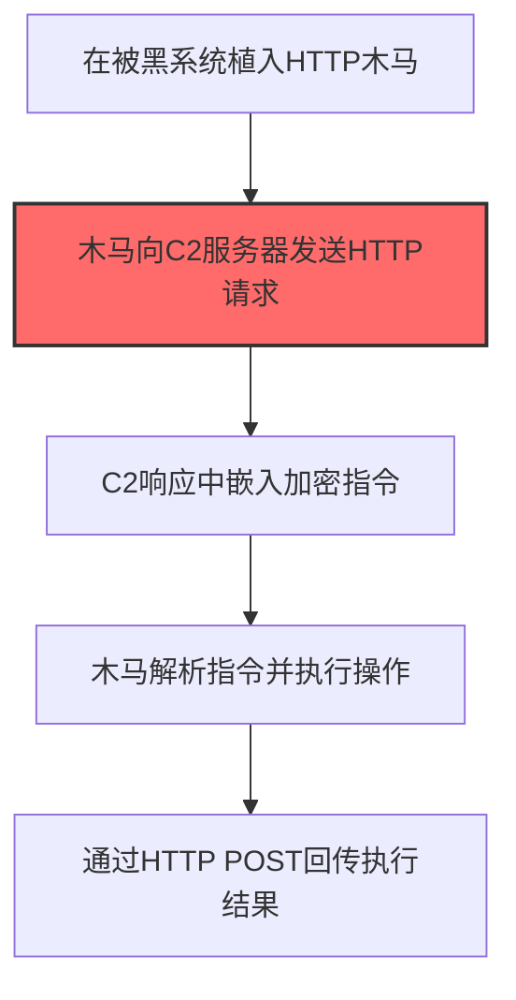

# Web协议 (T1071.001)

## 一句话通俗理解

> **使用 HTTP/HTTPS，最常用的 C2 方式，像假装在上网其实在传指令**

## 30秒速查卡

| 维度 | 你需要知道的 |
|------|-------------|
| 这是什么？ | 攻击者把远程控制指令藏在普通的网页浏览流量中，看起来就像在正常上网，其实在和攻击者服务器通信 |
| 为什么危险？ | HTTP/HTTPS流量是互联网上最常见的流量，防火墙不会拦截，安全设备很难从海量正常流量中分辨出C2通信 |
| 谁需要关心？ | 网络安全分析师、SOC监控人员、防火墙管理员 |
| 你的第一步防御 | 部署SSL/TLS解密设备，对HTTPS流量进行深度检测，识别异常的请求模式和域名 |
| 如果只做一件事 | 建立出站流量基线，重点关注那些"定时打卡"式的HTTP请求（每隔固定时间间隔就访问同一域名） |

## 难度等级

⭐⭐ 中级 - 需要一定的技术基础和经验

## 这是什么？

**Web协议**（T1071.001）是 **应用层协议**（T1071）的一个具体变体，属于 **命令与控制** 阶段的攻击技术。


> 🌐 **打个比方**：就像在正常的网页浏览里夹带私货——攻击者把C2数据伪装成普通的Web流量（HTTP/HTTPS），混入正常通信中。

### 具体怎么理解？

使用 HTTP/HTTPS，最常用的 C2 方式，像假装在上网其实在传指令

攻击者使用这种技术时，通常是在命令与控制阶段，想要达到特定的攻击目标。与父技术 T1071 相比，T1071.001 有自己独特的特点和使用场景。

### 为什么有效？

这种技术之所以有效，是因为：
1. **隐蔽性**：利用了正常系统功能或常见协议，不容易被发现
2. **技术门槛适中**：不需要特别高深的技术知识就能实施
3. **广泛适用**：可以在多种环境和系统中使用


## 真实攻击流程

### 典型场景

攻击者在 **命令与控制** 阶段使用 Web协议 技术，以下是典型的攻击步骤：



**步骤详解：**

1. **在被黑系统植入HTTP木马** - 通过初始访问在目标主机上部署支持HTTP通信的恶意载荷
2. **木马向C2服务器发送HTTP请求** - 定期向C2服务器发送看似正常的HTTP GET/POST请求（关键步骤）
3. **C2响应中嵌入加密指令** - C2服务器将攻击指令隐藏在HTTP响应体中，伪装为正常网页内容
4. **木马解析指令并执行操作** - 恶意载荷解密响应内容，执行文件收集、屏幕截图等操作
5. **通过HTTP POST回传执行结果** - 将执行结果通过HTTPS POST请求加密传输回C2服务器

## 真实案例

### 案例1：APT29 (Cozy Bear) — SolarWinds 供应链攻击中的多层 HTTPS C2（2020-2021年）

- **时间**: 2020年3月 - 2021年4月
- **目标**: 美国联邦政府机构（财政部、商务部、能源部、国土安全部）、IT 公司（SolarWinds、Microsoft、CrowdStrike）、智库和咨询公司
- **攻击组织**: APT29（Cozy Bear / NOBELIUM / UNC2452），俄罗斯对外情报局（SVR）背景
- **手法**: APT29 通过污染 SolarWinds Orion 软件的更新流程，在合法数字签名的 DLL（SolarWinds.Orion.Core.BusinessLayer.dll）中植入了 SUNBURST 后门。该后门采用**两阶段 C2 协议**，其中第二阶段完全依赖 HTTPS：
  - **第一阶段（DNS发现）**：受感染系统在潜伏期（最长2周）后，向 avsvmcloud[.]com 的子域名发送 DNS 查询，DNS 响应中的 CNAME 记录指向后续 HTTPS C2 服务器地址
  - **第二阶段（HTTPS C2 操作）**：恶意软件启动 HTTP 线程，使用 HTTP GET 和 POST 请求进行 C2 通信。关键细节包括：
    - **URI 模式**：GET 请求路径格式为 `/swip/upd/{随机文件名}.xml`（如 `SolarWinds.CortexPlugin.Nodes-5.2.1.xml`），伪装成 SolarWinds 组件更新请求
    - **请求头伪造**：HTTP 请求中添加 `If-None-Match` 头，其中编码了用户 ID，用于 C2 服务器识别不同受害主机
    - **数据编码**：POST 请求体使用 JSON 格式，包含 `userId`、`sessionId`、`steps` 三个字段。实际 C2 数据先经 DEFLATE 压缩，再单字节 XOR 加密，然后 Base64 编码后嵌入 JSON 的 `Message` 字段中
    - **心跳间隔**：每次调用间隔至少1分钟，受 `SetTime` 命令控制
    - **Content-Type 切换**：发送状态数据时使用 `application/json`；发送二进制数据（如文件窃取结果）时使用 `application/octet-stream`
    - **禁用证书验证**：SUNBURST 禁用了 HTTPS 证书验证（即接受任何 SSL 证书），使流量在传输层加密但无法验证服务器身份
  - **第三阶段**：确认目标价值后，攻击者通过 HTTPS 通道下发 Teardrop（Cobalt Strike 加载器），建立第三个独立的 HTTPS C2 通道进行深度横向移动和数据窃取
- **影响**: 约 18,000 个组织下载了被污染的 SolarWinds 更新，包括多个美国联邦政府机构、Fortune 500 企业。攻击者成功窃取了多个政府机构的内部数据，是美国历史上影响最大的供应链攻击事件之一
- **IOC示例**:
  - C2域名: `3mu76044hgf7shjf[.]appsync-api[.]eu-west-1[.]avsvmcloud[.]com`
  - URI路径: `/swip/upd/Orion.Wireless.UI-3.1.0.xml`
  - JA3指纹: `6734f4fbb3a6052511e6319a1d93bdc4`（SUNBURST HTTPS客户端）
- **参考链接**:
  - [Mandiant - SUNBURST Additional Technical Details](https://cloud.google.com/blog/topics/threat-intelligence/sunburst-additional-technical-details)
  - [Microsoft - Analyzing Solorigate](https://www.microsoft.com/en-us/security/blog/2020/12/18/analyzing-solorigate-the-compromised-dll-file-that-started-a-sophisticated-cyberattack-and-how-microsoft-defender-helps-protect/)
  - [MITRE ATT&CK - SUNBURST (S0559)](https://attack.mitre.org/software/S0559/)
  - [Symantec - SolarWinds C2 Process](https://symantec-enterprise-blogs.security.com/threat-intelligence/solarwinds-sunburst-command-control)

### 案例2：Lazarus Group — 全球加密货币和 Web3 行业定向攻击中的 HTTP C2（2022-2024年）

- **时间**: 2022年 - 2024年12月
- **目标**: 全球加密货币交易所、区块链开发公司、Web3 项目方、防务和能源行业
- **攻击组织**: Lazarus Group（Hidden Cobra / APT38），朝鲜侦察总局（RGB）背景
- **手法**: Lazarus Group 在多个并行活动中使用 HTTP/HTTPS 作为核心 C2 协议，展示了从基础 HTTP 信标到多层 C2 架构的完整技术谱系：
  - **活动1：Contagious Interview（伪造面试攻击）**
    - 攻击者在 LinkedIn 等平台冒充招聘人员，向加密货币公司员工发送伪造的面试邀请
    - C2 基础设施部署在 Windows Server 2019/2022 上，使用 Express.js 运行 HTTP 服务（端口 1244）
    - 植入物发送 HTTP GET/POST 请求到 C2 端点的令牌认证路径（如 `/c/{token}`、`/payl/{token}`）
    - C2 服务器按需下发模块化 payload：Chrome 密码窃取器、MetaMask 注入器、Tsunami 后门
    - IOC IPs: `147.124.213[.]232`、`66.235.168[.]238`、`216.250.251[.]87`

  - **活动2：QuiteRAT（基于 Python 的 HTTP C2 植入物）**
    - 利用 ManageEngine ServiceDesk 漏洞（CVE-2022-47966）获取初始访问
    - QuiteRAT 使用 HTTP GET 请求进行 C2 通信，URL 中包含扩展参数：
      - `mailid=<MD4前12字符>`：受害者 ID
      - `action=inbox|sent`：inbox 表示请求指令，sent 表示回传数据
      - `body=<Base64数据>`：C2 数据载荷
      - `session=<随机数>`：会话标识
    - 单次 HTTP 请求数据限制为 1,024 字节，超大数据分片传输
    - C2 服务器可下发 `receivemail` 指令让植入物切换到第二个 C2 URL，实现 C2 冗余

  - **活动3：HaoBao（HTTP POST 数据窃取）**
    - 植入物连接硬编码 C2 域名（如 `worker[.]co[.]kr`、`palgong-cc[.]co[.]kr`）
    - 收集的主机数据经 XOR（密钥 0x34）+ Base64 双重编码后，通过 HTTP POST 请求发送
    - POST 参数：`no`（计算机名\用户名）、`mode`（进程列表/注册表标志）

  - **C2 基础设施特征**：
    - 韩国 IIS Web 服务器被入侵后用作第一级 C2 代理（ASP webshell），转发流量到第二级 C2
    - 使用开放源码 C2 框架（DeimosC2 GoLang 版本）部署在 Linux 服务器上
    - 木马化的 Notepad++ 插件（WinInetLoader）通过 HTTP(S) 下载后续 payload，查询参数从三组预定义参数名中随机选取以躲避检测
- **影响**: Lazarus Group 通过 HTTP C2 通道控制受感染系统，实施了多起重大加密货币盗窃案（包括 Bybit 15 亿美元被盗案），累计窃取金额超过 30 亿美元。多个国家的国防和能源部门敏感数据被窃取
- **IOC示例**:
  - C2 IP/端口: `147.124.213[.]232:1244`、`66.235.168[.]238:1244`
  - C2 域名: `worker[.]co[.]kr`、`palgong-cc[.]co[.]kr`
  - C2 端点路径: `/c/{token}`、`/payl/{token}`、`/mailid=&lt;hash&gt;&action=inbox`
  - 文件哈希: `74c71671764610245a392f7e7444694c`（CommsCacher 下载器）
- **参考链接**:
  - [Red Asgard - Lazarus Contagious Interview C2 Infrastructure (2026)](https://redasgard.com/blog/hunting-lazarus-contagious-interview-c2-infrastructure)
  - [Cisco Talos - Lazarus QuiteRAT Analysis (2023)](https://blog.talosintelligence.com/lazarus-quiterat/)
  - [Cisco Talos - Lazarus CollectionRAT (2023)](https://blog.talosintelligence.com/lazarus-collectionrat/)
  - [AhnLab ASEC - Lazarus Windows Web Server C2 (2025)](https://asec.ahnlab.com/en/86687/)
  - [Virus Bulletin - Lazarus campaigns and backdoors 2022-2023](https://www.virusbulletin.com/uploads/pdf/conference/vb2023/papers/Lazarus-campaigns-and-backdoors-in-2022-2023.pdf)

## 红队视角

> ⚠️ **免责声明**：以下内容仅用于合法的安全测试、渗透测试和教育目的。未经授权对他人系统进行测试是违法行为。

### 实战技巧

1. **深入理解原理**：在实战应用前，充分理解Web协议的技术原理和适用场景
2. **环境适配**：根据目标系统的操作系统版本、安全配置等因素调整攻击策略
3. **组合使用**：将该技术与其他技术组合使用，构建完整的攻击链
4. **隐蔽性考虑**：注意操作痕迹的清理，避免被安全设备检测

### 常用工具

| 工具名称 | 用途 | 平台 | 链接 |
| -------- | ---- | ---- | ---- |
| Metasploit | 渗透测试框架 | 全平台 | [Metasploit](https://www.metasploit.com/) |
| Cobalt Strike |  adversary模拟平台 | Windows | [Cobalt Strike](https://www.cobaltstrike.com/) |
| Atomic Red Team | 检测规则测试 | 全平台 | [Atomic Red Team](https://github.com/redcanaryco/atomic-red-team) |

### 注意事项

- 在授权的测试环境中使用这些技术
- 注意操作安全（OPSEC），避免被检测系统发现
- 使用匿名化技术和代理隐藏真实身份

## 蓝队视角

### 检测要点

1. **系统日志监控**：关注与Web协议相关的系统日志和审计记录
2. **异常行为检测**：监控系统中与该技术相关的异常进程、网络连接和文件操作
3. **工具特征识别**：识别攻击者可能使用的工具在系统中的运行特征

### 监控建议

- 部署端点检测和响应（EDR）系统，监控与Web协议相关的异常行为
- 配置SIEM规则，关联分析来自多个来源的告警
- 定期进行安全评估和渗透测试，验证检测规则的有效性

## 检测建议

### 检测思路

检测 Web协议 的关键是识别异常行为模式。以下是三个层面的检测方法：

### 网络层检测

**方法**：监控网络流量中的异常模式

```bash
# 检测异常的网络连接和数据传输
# 根据具体协议和端口设置检测规则
```

### 主机层检测

**Windows事件ID**：
- 事件ID 4688：进程创建（监控可疑进程）
- 事件ID 4104：PowerShell执行（监控可疑脚本）

**Linux日志**：
- /var/log/auth.log：认证日志
- /var/log/syslog：系统日志

```bash
# 检测异常进程和命令执行
grep -i "suspicious" /var/log/auth.log
```

### 应用层检测

**用人话说：** Web协议（HTTP/HTTPS）是C2通信最常用的载体，因为绝大多数企业网络都放行443端口的HTTPS流量。攻击者让木马每隔一段时间（如60秒）向C2服务器发送一个HTTP请求，这叫"心跳"——看起来像正常浏览网页，实际上在拉取指令或回传数据。Cobalt Strike的Malleable C2配置文件可以自定义HTTP头部、Cookie和URI路径，让流量伪装成访问api.github.com或cdn.cloudflare.com的样子。检测难点在于HTTPS流量是加密的，安全设备只能看元数据（IP、端口、TLS指纹、请求频率），看不到内容。如果发现一台内网服务器每60秒精准访问同一个海外IP的443端口，且TLS握手时发送的SNI域名和证书域名不一致，说明很可能在走Web C2隧道。

**Sigma规则示例**：

```yaml
title: 检测Web协议
status: experimental
description: 检测可能的Web协议活动
logsource:
    category: process_creation
    product: windows
detection:
    selection:
        EventID: 4688
    condition: selection
level: medium
tags:
    - attack.T1071001
```


## 缓解措施

### 优先级1：关键措施

**限制攻击面**：减少暴露的服务和端口，降低被利用的风险

```bash
# 防火墙规则示例：只允许必要的出站连接
iptables -A OUTPUT -p tcp --dport 443 -j ACCEPT  # 允许HTTPS
iptables -A OUTPUT -p tcp --dport 80 -j ACCEPT   # 允许HTTP
iptables -A OUTPUT -p tcp -j DROP                 # 阻止其他TCP
```

### 优先级2：重要措施

**加强监控**：部署EDR和SIEM系统，实时监控异常行为

### 优先级3：建议措施

**安全意识培训**：教育员工识别相关攻击手法


## 动手实验

> ⚠️ **所有实验必须在隔离的实验室环境中进行**

### 实验1：理解基本原理（初级）

**目标**：理解 Web协议 的工作原理

**步骤**：
1. 在隔离环境中搭建测试系统
2. 使用基础工具模拟攻击行为
3. 观察系统日志和网络流量

**学习要点**：理解该技术的核心机制

### 实验2：实际操作（中级）

**目标**：掌握 Web协议 的实际使用方法

**步骤**：
1. 使用专业工具进行攻击模拟
2. 尝试不同的绕过技术
3. 分析检测日志的特征

**学习要点**：掌握工具使用和日志分析

### 实验3：防御验证（高级）

**目标**：验证检测规则的有效性

**步骤**：
1. 部署检测规则
2. 执行攻击模拟
3. 验证检测告警是否触发

**学习要点**：理解攻防对抗的实际效果


## 术语解释

| 术语 | 通俗解释 |
|------|---------|
| **ATT&CK** | MITRE公司维护的攻击技术知识库，像一本"黑客手法百科全书" |
| **Web协议** | T1071.001，ATT&CK框架中定义的一种具体攻击技术 |
| **应用层协议** | T1071，Web协议所属的父技术类别 |
| **命令与控制** | 攻击链中的一个阶段，攻击者在这个阶段的目标 |
| **C2** | 命令与控制，攻击者用来远程控制被入侵系统的"遥控器" |
| **EDR** | 端点检测与响应，部署在电脑上的安全监控软件 |


## 被引用情况

以下父技术文档引用了本子技术：

- [T1071 - 应用层协议](../T1071-Application-Layer-Protocol.md)

## 参考资料

### 官方文档

- [MITRE ATT&CK - Web协议 (T1071.001)](https://attack.mitre.org/techniques/T1071/001/)
- [MITRE ATT&CK - 应用层协议 (T1071)](https://attack.mitre.org/techniques/T1071/)

### 安全报告（APT案例来源）

- [Mandiant - SUNBURST Additional Technical Details (2020)](https://cloud.google.com/blog/topics/threat-intelligence/sunburst-additional-technical-details) — APT29 SolarWinds HTTPS C2 协议深度分析
- [Microsoft - Analyzing Solorigate (2020)](https://www.microsoft.com/en-us/security/blog/2020/12/18/analyzing-solorigate-the-compromised-dll-file-that-started-a-sophisticated-cyberattack-and-how-microsoft-defender-helps-protect/) — SUNBURST 后门 C2 通信机制详解
- [Symantec - SolarWinds C2 Process (2020)](https://symantec-enterprise-blogs.security.com/threat-intelligence/solarwinds-sunburst-command-control) — SUNBURST 命令与控制流程分析
- [Red Asgard - Lazarus Contagious Interview C2 (2026)](https://redasgard.com/blog/hunting-lazarus-contagious-interview-c2-infrastructure) — Lazarus HTTP C2 基础设施测绘
- [Red Asgard - Lazarus Real Blood on the Wire (2026)](https://redasgard.com/blog/hunting-lazarus-part4-real-blood-on-the-wire) — Lazarus C2 信标时序和 IOC 详情
- [Cisco Talos - Lazarus QuiteRAT Analysis (2023)](https://blog.talosintelligence.com/lazarus-quiterat/) — QuiteRAT HTTP C2 参数结构分析
- [Cisco Talos - Lazarus CollectionRAT (2023)](https://blog.talosintelligence.com/lazarus-collectionrat/) — Lazarus 使用 DeimosC2 开放框架
- [AhnLab ASEC - Lazarus Web Server C2 (2025)](https://asec.ahnlab.com/en/86687/) — Lazarus 入侵 IIS 服务器作为 C2 代理
- [Picus Security - Lazarus Group APT38 Explained](https://www.picussecurity.com/resource/blog/lazarus-group-apt38-explained-timeline-ttps-and-major-attacks) — Lazarus TTPs 全景分析

### 工具与资源

- [Atomic Red Team](https://github.com/redcanaryco/atomic-red-team) - 检测规则测试框架
- [MITRE ATT&CK Navigator](https://mitre-attack.github.io/attack-navigator/) - ATT&CK 可视化工具
- [Cobalt Strike Malleable C2 文档](https://www.cobaltstrike.com/help-malleable-c2) - C2 流量定制化配置参考
- [Sliver C2 框架](https://github.com/BishopFox/sliver) - 开源 C2 框架

### 学习资料

- [MITRE ATT&CK 知识库](https://attack.mitre.org/resources/) - ATT&CK 官方资源中心
- [MITRE ATT&CK - SUNBURST (S0559)](https://attack.mitre.org/software/S0559/) — SUNBURST 恶意软件 ATT&CK 条目
- [Virus Bulletin - Lazarus campaigns 2022-2023](https://www.virusbulletin.com/uploads/pdf/conference/vb2023/papers/Lazarus-campaigns-and-backdoors-in-2022-2023.pdf) — Lazarus HTTP(S) C2 深入技术分析
