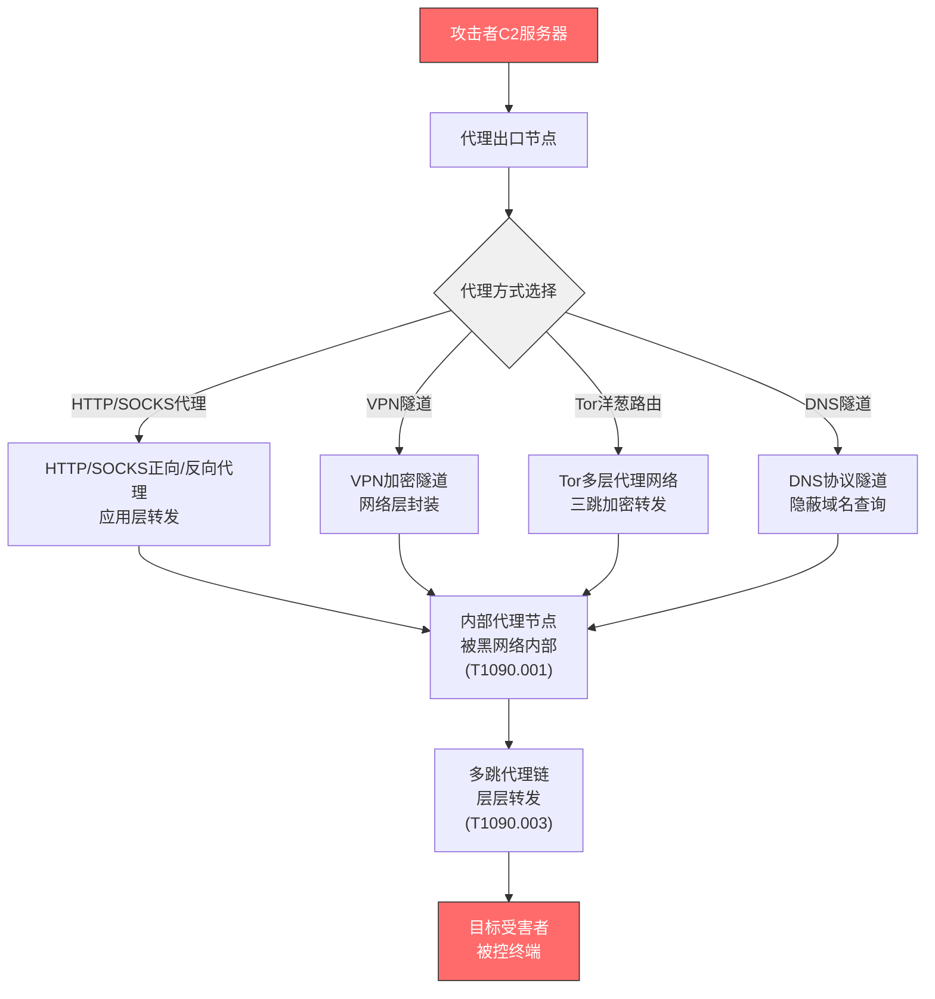

# 代理 (T1090)

## 一句话通俗理解

就像间谍通过多个人转发指令——攻击者利用代理服务器层层转发C2流量，让追踪者找不到真正的控制源。

## 难度等级

- ⭐⭐ 中级（需要一定基础）

## 技术描述

代理（Proxying）是 MITRE ATT&CK 框架中命令与控制战术下的一种技术，编号为 T1090。

**通俗解释：**
代理的核心思想是"不直接通信"。攻击者的C2服务器不直接与被黑的电脑通信，而是通过多台跳板机（代理）转发。每一跳只知道自己前一个和下一个节点的地址，不知道整个链路的拓扑。这样，即使某个代理节点被发现了，防御者也只能追溯到上一个代理，而找不到真正的C2服务器。

**技术原理：**
代理C2架构使用多层转发节点（跳板），每层代理解包后转发到下一层，形成"洋葱"结构：
- 终端（受害系统）连接代理节点1
- 代理节点1转发到代理节点2
- ...
- 代理节点N连接到真正的C2服务器
其中任意节点只持有相邻节点的信息。

**用途与影响：**
代理是APT组织和网络犯罪团伙最常用的C2隐藏技术之一。多层代理可以持续迷惑追踪者，增加横向移动的防范难度。在某些场景下也可以用来绕过基于IP的黑名单。

## 子技术列表

| 子技术ID | 子技术名称 | 一句话说明 |
|----------|-----------|-----------|
| T1090.001 | 内部代理 | 攻击者在被黑网络内部部署代理，转发内部流量 |
| T1090.002 | 外部代理 | 攻击者使用外部公开的代理服务转发C2流量 |
| T1090.003 | 多跳代理 | 攻击者使用多层代理链转发C2流量，每跳只知相邻节点 |

## 攻击流程



**步骤详解：**

1. **部署代理出口节点**
   - 攻击者首先在受控的外部服务器（VPS/云主机）上部署代理出口节点，作为C2流量的第一道转发层
   - 出口节点对外隐藏真实C2服务器的IP地址，成为防御方追踪的第一目标

2. **选择代理方式**
   - **HTTP/SOCKS代理**：最常见的代理方式，支持应用层协议转发。HTTP代理适合Web类C2，SOCKS代理支持TCP/UDP全协议转发，灵活性最高
   - **VPN隧道**：在网络层建立加密隧道，将所有流量封装在VPN协议中传输。防御方只能看到加密流量，无法区分C2通信与正常VPN流量
   - **Tor洋葱路由**：利用Tor网络的三跳加密机制，每层节点只知道自己的上下游，即使某个节点被监控也无法追踪到C2服务器
   - **DNS隧道**：将C2数据编码嵌入DNS查询和响应中，利用域名解析协议传输。由于DNS流量通常不会被严格审查，隐蔽性极高

3. **穿透内部网络**
   - 外部代理流量进入被黑网络内部后，通过内部代理节点（边缘设备、被控服务器）进一步分发，形成内外联动的代理网络
   - 内部代理作为"接地端"，负责将C2指令传递给具体的目标终端

4. **多跳代理链（可选）**
   - 高级攻击者会构建3-5跳的多层代理链：被控终端 → 内部代理 → 外部跳板1 → 外部跳板2 → ... → C2服务器
   - 每跳之间使用不同的协议和加密方式，即使某一跳被检测到，也无法定位完整链路
   - 链拓扑定期轮换，增加追踪难度

## 真实案例

### 案例1：APT29 — SCCM 内部代理 + VPS 跳板（2024年）

- **时间**: 2024年
- **目标**: 全球IT供应链
- **攻击组织**: APT29（Cozy Bear / NOBELIUM）
- **手法**: APT29 在2024年的攻击中利用被入侵组织的 Microsoft SCCM（系统中心配置管理器）部署内部代理。安全研究员发现APT29使用活动目录+非AD客户端的混合策略配置SCCM客户端，建立P2P更新通道作为内部代理。对外使用多个VPS（虚拟专用服务器）和合法的商业代理服务作为外部跳板。2024年11月披露的TEAMVIEWER活动也使用了多层代理架构。
- **影响**: 供应链攻击影响多个高价值目标
- **参考链接**: [dfir.ch - APT29 SCCM (2024-2025)](https://dfir.ch/posts/sccm_hierarchy/)

### 案例2：Lazarus Group — AWS/阿里云 多层代理（2023-2024年）

- **时间**: 2023-2024年
- **目标**: 加密货币行业
- **攻击组织**: Lazarus Group
- **手法**: Lazarus 使用 AWS 和阿里云上的 VPS 构建多层代理链，连接 C2 服务器和被入侵的加密货币交易所。代理链包括 3-5 跳：被入侵系统 → 阿里云 VPS → AWS VPS → ... → 真实 C2。代理间通信使用自制的加密协议，链拓扑定期更换。Lazarus 的代理基础设施经常利用被入侵的第三方 VPS 账户部署。
- **影响**: 数亿美元加密货币被盗
- **参考链接**: [TRM Labs - Lazarus (2024)](https://www.trmlabs.com/post/lazarus-group-uses-new-multi-hop-proxy-techniques)

### 案例3：Goffee — .onion 多层代理（2024-2025年）

- **时间**: 2024-2025年
- **目标**: 俄罗斯组织
- **攻击组织**: Goffee
- **手法**: Goffee 使用 .onion（Tor 隐藏服务）作为多层代理链的后端。在受感染系统上，DLL 侧加载启动 Mythic MiRat agent，该 agent 通过 HTTPS C2 连接到 Goffee 控制的 .onion 隐藏服务。.onion 服务将流量转发到 C2 后端，利用 Tor 网络提供的内置多层代理功能隐藏真实 C2 位置。所有 C2 基础设施通过 .onion 地址暴露。
- **影响**: 俄罗斯军工企业被入侵
- **参考链接**: [PT Security - Goffee Group (2025)](https://global.ptsecurity.com/en/research/pt-esc-threat-intelligence/fortune-telling-on-goffee-grounds/)

### 案例4：LockBit — 反向代理 + CDN 分发（2022-2024年）

- **时间**: 2022-2024年
- **目标**: 全球企业
- **攻击组织**: LockBit 勒索团伙
- **手法**: LockBit 使用反向代理架构分发 C2 流量。攻击者在一个中心C2服务器前部署多个反向代理节点（被入侵的服务器或VPS），每个代理节点向C2服务器建立出站连接（反向连接方式）。C2面板托管在反向代理后面的服务器上。即使一个代理节点被封锁，LockBit 仍可通过其他代理维持C2通信。他们还大量使用 CDN 服务（Cloudflare、Akamai）作为反向代理入口。
- **影响**: 全球数百家企业被勒索
- **参考链接**: [Trend Micro - LockBit Ransomware (2023)](https://www.trendmicro.com/vinfo/us/security/news/cybercrime-and-digital-threats/lockbit-ransomware)

## 红队视角

> ⚠️ **免责声明**：以下内容仅用于合法的安全测试、渗透测试和教育目的。未经授权对他人系统进行测试是违法行为。

> ⚠️ **免责声明**：以下内容仅用于合法的安全测试。

### 实战技巧

1. **代理链的"信任根"**
   将被黑网络的VPN或远程接入设备作为内部代理节点，流量从合法接入点流出。

2. **反向代理优势**
   代理节点向C2主动建立出站连接，防火墙规则放行的场景比入站连接多。

### 常用工具

| 工具名称 | 用途 | 平台 | 链接 |
|----------|------|------|------|
| 3proxy | 轻量级代理 | 跨平台 | https://3proxy.ru/ |
| socat | 多功能转发 | 跨平台 | http://www.dest-unreach.org/socat/ |
| Cobalt Strike | 内置代理功能 | Windows/Linux | https://www.cobaltstrike.com/ |

### 注意事项

- 代理链越长延迟越大
- 每增加一跳就增加一个被发现的风险点

## 蓝队视角

### 检测要点

1. **内部代理服务部署**
   - 日志来源：Sysmon Event ID 1（进程创建）、Windows Security Event ID 4688
   - 关注字段：命令行中包含代理工具关键词（socat、3proxy、plink等）
   - 异常特征：非IT管理员在非标准目录中安装或启动代理服务

2. **异常出站连接模式**
   - 日志来源：防火墙日志、网络流量日志
   - 关注字段：出站连接的目的IP、端口、连接频率
   - 异常特征：内网主机对外部多个VPS建立长期TCP连接，且目的IP地理位置分散

3. **多跳代理的延迟特征**
   - 日志来源：网络流量分析（NTA）工具
   - 关注字段：TCP连接的RTT（往返时间）、TTL值变化
   - 异常特征：从内网到外部目标的连接经过多跳中转，RTT明显高于正常值

4. **反向代理的异常入站连接**
   - 日志来源：Windows Event ID 5156（连接事件）
   - 关注字段：入站连接的源IP、端口
   - 异常特征：内部服务器上出现来自外部的不明入站连接，且关联了代理进程

### 监控建议

- 部署网络流量分析工具（如Zeek、Suricata）监控内部代理服务的部署和运行
- 建立内网主机出站连接的基线模型，标记偏离基线的连接模式
- 监控已知代理工具（socat、3proxy、plink、ncat）的非授权使用
- 对内部服务器上的监听端口进行定期扫描和审计，发现未授权的代理服务
- 使用EDR监控系统服务列表的变化，检测新注册的代理服务

## 检测建议

### 网络层检测

**检测方法：** 检测内部网络中的代理服务。

**Sigma规则示例：**
```yaml
title: 内部代理服务检测
status: experimental
logsource:
    product: windows
    service: sysmon
detection:
    selection:
        EventID: 1
        Image|endswith: '.exe'
        CommandLine|contains:
            - 'socat'
            - '3proxy'
            - 'plink'
    condition: selection
level: medium
tags:
    - attack.t1090
```

## 缓解措施

### 优先级1：关键措施

**措施名称：** 出站流量限制

**具体实施步骤：**
1. 限制内部系统直接访问外部代理服务，仅允许通过企业代理出站
2. 部署网络流量检测设备，监控异常的出站连接模式
3. 配置防火墙规则，阻止内网主机直连境外VPS和已知代理服务IP

### 优先级2：重要措施

**措施名称：** 代理服务管控

**具体实施步骤：**
1. 使用EDR/应用白名单技术，禁止非授权安装代理工具（socat、3proxy等）
2. 定期扫描内网主机上的监听端口，发现未授权的代理服务
3. 监控系统服务列表的变化，对新增的代理服务及时告警

### 优先级3：建议措施

**措施名称：** 网络分段与流量审计

**具体实施步骤：**
1. 实施网络微分段，限制不同安全区域之间的流量
2. 部署网络流量审计系统，保留至少90天的网络连接日志
3. 建立内网主机的网络行为基线，使用UEBA技术检测异常的连接模式

### MITRE ATT&CK 缓解措施映射

| 缓解措施ID | 缓解措施名称 | 适用性 | 说明 |
|------------|-------------|--------|------|
| M0937 | 网络过滤 | 适用 | 限制内部系统直连外部代理 |
| M0931 | 网络监控 | 适用 | 部署NTA工具检测代理流量模式 |
| M1026 | 特权账户管理 | 适用 | 限制安装代理服务的权限 |
| M1033 | 应用白名单 | 部分适用 | 阻止非授权代理工具的运行 |
| M1030 | 网络分段 | 适用 | 网络微分段限制代理横向传播 |

## 动手实验

> ⚠️ **重要提示**：所有实验必须在隔离的实验室环境中进行，禁止对未授权的真实系统进行测试。

### 实验1：搭建 SOCKS 代理链（中级）

**实验目标：** 通过 SOCKS 代理链转发流量。

**实验步骤：**
1. 在 VPS1 上配置 SOCKS5 代理
2. 在 VPS2 上配置 SOCKS5 代理
3. 配置代理链：本地 → VPS1 → VPS2 → 目标
4. 验证链的可追溯性

## 术语解释

| 术语 | 英文原名 | 通俗解释 |
|------|----------|----------|
| SOCKS代理 | SOCKS Proxy | 通用的网络代理协议，支持TCP和UDP |
| 反向代理 | Reverse Proxy | 位于服务器前的中介节点 |
| 跳板 | Jump Host | 用于中转流量的中间服务器 |

## 参考资料

### 官方文档

- [MITRE ATT&CK - T1090](https://attack.mitre.org/techniques/T1090/)

### 安全报告

- [PT Security - Goffee (2025)](https://global.ptsecurity.com/en/research/pt-esc-threat-intelligence/fortune-telling-on-goffee-grounds/)
