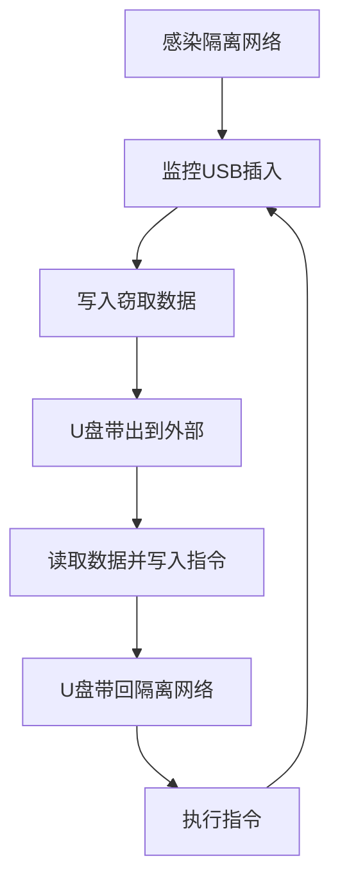

# 通过可移动介质通信 (T1092)

## 一句话通俗理解

就像用U盘在两个不联网的电脑之间"人肉快递"传递情报——攻击者通过U盘在隔离网络和外界之间传递C2指令。

## 难度等级

- ⭐ 初级（新手可学）

## 技术描述

通过可移动介质通信（Communication Through Removable Media）是 MITRE ATT&CK 框架中命令与控制战术下的一种特殊技术，编号为 T1092。

**通俗解释：**
有些高安全级别的网络（如军事网络、核设施控制系统）与互联网完全物理隔离（称为"气隙网络"或"物理隔离网络"），攻击者无法通过网络直接连接到这些系统。但攻击者发现了一个"漏洞"——即使是最安全的隔离网络，有时也需要通过U盘等可移动介质来传输数据。攻击者就利用这个通道：把C2指令写入U盘，然后让不知情的内部人员把U盘插到隔离网络的电脑上，恶意软件读取指令并执行。

**技术原理：**
1. 攻击者先通过某种方式（如社会工程、内部人员配合）感染了隔离网络中的一台电脑
2. 恶意软件在受感染电脑上监控可移动介质的插入事件
3. 当有人插入U盘时，恶意软件将C2输出数据（如窃取的文件、状态报告）写入U盘的隐藏区域
4. 当这个U盘被带到外界（插入联网电脑）时，攻击者读取其中的数据
5. 攻击者将要下发的指令写入同一个U盘
6. U盘再次被插入隔离网络时，恶意软件读取并执行指令

**用途与影响：**
这种技术虽然通信延迟极高（通常数小时甚至数天才能完成一次通信），但对于物理隔离的高价值目标（如核设施、军事指挥系统）来说，这是攻击者能建立的"唯一"C2通道。著名的 Stuxnet 病毒就是通过这种方式控制和更新的。

## 子技术列表

**该技术没有子技术。**

## 攻击流程

### 典型攻击流程

```
感染隔离网络 --> 监控USB插入 --> 写入窃取数据 --> U盘带出 --> 读取数据并写入指令 --> U盘带回 --> 执行指令
```



**步骤详解：**

1. **感染隔离网络**
   - 通俗描述：攻击者通过供应链攻击、内部人员或其它方式在隔离网络中植入恶意软件
   - 技术细节：通常通过被污染的软件更新、受感染的U盘初始感染，或利用允许的数据交换通道（如光盘、安全网关）
   - 常用工具：特制的恶意软件、供应链攻击工具

2. **监控USB插入**
   - 通俗描述：恶意软件在后台监视USB设备的插入事件
   - 技术细节：注册 Windows 的 WM_DEVICECHANGE 消息或使用 WMI 监控 USB 设备插入，检测到 U 盘后等待几秒（等待驱动加载）再开始操作
   - 常用工具：Windows API、WMI 查询

3. **写入窃取数据**
   - 通俗描述：恶意软件把窃取的数据悄悄写到U盘上
   - 技术细节：数据写入隐藏文件（如 `System Volume Information` 系统文件夹）、修改文件的时间戳属性存储数据（ADS - 备用数据流）、或将数据写入未分配空间
   - 常用工具：自定义恶意软件模块

4. **U盘带出到外部**
   - 通俗描述：不知情的员工把U盘带出隔离区域，插入联网电脑
   - 技术细节：依靠员工正常的工作流程——很多人会在隔离网络和办公网络之间使用同一个U盘
   - 常用工具：无（依赖物理移动）

5. **读取数据并写入指令**
   - 通俗描述：攻击者从U盘读取窃取的数据，然后写入新的指令
   - 技术细节：攻击者的程序扫描U盘寻找隐藏数据，提取后写入编码的C2指令
   - 常用工具：自定义读取工具

6. **U盘带回隔离网络"
   - 通俗描述：U盘被重新插入隔离网络
   - 技术细节：等待下一次USB插入事件
   - 常用工具：无

7. **执行指令**
   - 通俗描述：恶意软件检测到U盘，读取新的指令并执行
   - 技术细节：解析指令文件的编码数据，执行其中的命令
   - 常用工具：自定义恶意软件

## 真实案例

### 案例1：Stuxnet — 通过 USB 更新攻击伊朗核设施（2007-2010年）

- **时间**: 2007-2010年
- **目标**: 伊朗纳坦兹铀浓缩工厂的离心机控制系统
- **攻击组织**: 疑似美国/以色列联合开发（奥林匹克运动会行动）
- **手法**: Stuxnet 是首个通过可移动介质进行 C2 通信的已知高级威胁。纳坦兹工厂的离心机控制系统与互联网完全物理隔离。攻击者通过感染工程技术人员使用的U盘，将 Stuxnet 带入内部网络。由于隔离网络无法通过互联网接收指令，攻击者使用USB介质作为"飞马"传递更新后的攻击载荷。Stuxnet 利用 Windows 的 LNK 漏洞（CVE-2010-2568）自动执行，当U盘插入后无需用户操作即可运行。攻击代码通过修改离心机的转速参数，物理摧毁了约1000台离心机。
- **影响**: 约1000台IR-1离心机被物理损坏，伊朗核计划被延迟约2年
- **参考链接**: [MITRE ATT&CK - S0389](https://attack.mitre.org/software/S0389/)

### 案例2：Agent.BTZ — USB 驱动的军方网络入侵（2008年）

- **时间**: 2008年
- **目标**: 美国军方中央司令部网络
- **攻击组织**: 疑似俄罗斯情报机构
- **手法**: Agent.BTZ（又名"SillyFDC"）通过USB闪存盘在美军中央司令部的秘密网络中传播并维持C2通信。恶意软件利用 Windows 的 autorun.inf 功能自动执行。当U盘连接到网络隔离的系统时，恶意软件读取C2指令文件并执行。该恶意软件还使用USB设备作为中间存储，在被感染系统和受控读取站之间传递数据。这次入侵极其严重，美军最终全面禁止了所有USB设备在军事网络上的使用。
- **影响**: 美军中央司令部网络严重受损，军方全面禁用USB设备
- **参考链接**: [MITRE ATT&CK - S0029](https://attack.mitre.org/software/S0029/)

### 案例3：TRITON（Trisis）— 石化厂安全系统的离线C2（2017年）

- **时间**: 2017年
- **目标**: 中东某石化厂的关键安全仪表系统（SIS）
- **攻击组织**: 疑似俄罗斯背景的 Xenotime 组织
- **手法**: TRITON 恶意软件针对施耐德电气的 Triconex 安全仪表系统（SIS），这是保护工厂免受灾难性事故的关键安全系统。攻击者通过工程工作站的 USB 端口上传 TRITON 框架组件，操作员通过可移动介质在安全仪表系统和其他系统之间传递数据。C2 通道本质上是物理介质在工程工作站间的转移。攻击者试图修改安全仪表系统的逻辑，可能导致工厂在异常情况下无法安全停机。
- **影响**: 中东石化厂的安全仪表系统被入侵，可能造成灾难性后果
- **参考链接**: [MITRE ATT&CK - S1009](https://attack.mitre.org/software/S1009/)

### 案例4：APT37 Ruby Jumper — USB桥接气隙网络（2025-2026年）

- **时间**: 2025年12月至2026年2月
- **目标**: 韩国政府、军事、国防研究机构的气隙网络
- **攻击组织**: APT37（ScarCruft / Ruby Sleet，朝鲜国家背景）
- **手法**: APT37在名为"Ruby Jumper"的行动中使用了5种新发现的恶意软件组件，专门设计用于突破气隙网络。攻击链开始于恶意LNK文件（伪装成朝鲜新闻文章）通过鱼叉式钓鱼邮件投递。执行后，第一阶段的RESTLEAF植入物利用Zoho WorkDrive云存储作为C2通道。随后部署SNAKEDROPPER，它在目标系统上安装便携式Ruby运行时并建立持久化。关键组件是THUMBSBD——一个专门设计用于桥接气隙网络的后门。THUMBSBD监控USB可移动介质的插入事件，当检测到U盘插入时，自动收集系统信息（硬件诊断、运行进程、网络配置、完整文件树）并将其写入USB的隐藏文件夹。当U盘被带到联网机器时，这些数据被读取，攻击者的指令被写入同一USB设备。当U盘重新插入气隙网络时，THUMBSBD读取并执行新指令。另一个组件VIRUSTASK负责感染可移动介质——它将合法文件替换为恶意LNK快捷方式，实现自我传播。最终载荷FOOTWINE和BLUELIGHT提供键盘记录、音视频捕获等监视功能。
- **影响**: 成功入侵了多个气隙隔离的政府和研究网络，标志着APT37在气隙突破能力上的重大升级
- **参考链接**: [Zscaler ThreatLabz Ruby Jumper分析](https://www.zscaler.com/blogs/security-research/apt37-adds-new-capabilities-air-gapped-networks) | [BleepingComputer APT37报道](https://www.bleepingcomputer.com/news/security/apt37-hackers-use-new-malware-to-breach-air-gapped-networks/)

## 红队视角

> ⚠️ **免责声明**：以下内容仅用于合法的安全测试、渗透测试和教育目的。未经授权对他人系统进行测试是违法行为。

### 实战技巧

1. **利用 ADS 隐藏数据**
   Windows 的 NTFS 文件系统支持备用数据流（Alternate Data Streams），可以将数据隐藏在正常文件后面，用 `dir` 命令看不到，需要特殊工具才能发现。

2. **伪装系统文件夹**
   将恶意文件写入 `System Volume Information`（系统卷信息）或 `$Recycle.Bin`（回收站）等系统隐藏目录，普通用户不会检查这些位置。

3. **触发方式选择**
   使用 LNK 漏洞或 autorun.inf 不如直接在恶意软件中监控 USB 插入事件可靠。现代 Windows 已禁用自动运行功能。

### 常用工具

| 工具名称 | 用途 | 平台 | 链接 |
|----------|------|------|------|
| USB 设备监控工具 | 监控USB插拔事件 | Windows | Windows API |
| ADS 隐藏工具 | 使用备用数据流隐藏数据 | Windows | sysinternals stream |
| LNK 漏洞利用工具 | 利用快捷方式漏洞自动执行 | Windows | Metasploit 模块 |

### 注意事项

- 物理隔离网络的实际渗透测试需要极高的授权级别
- 在测试环境中模拟时，必须先获得环境所有者的明确书面授权
- 不要在实际的气隙网络环境中进行测试

## 蓝队视角

### 检测要点

1. **USB 设备连接事件监控**
   - 日志来源：Windows 事件日志（Event ID 4656、4663、6416）
   - 关注字段：设备实例ID、卷序列号、文件操作类型
   - 异常特征：USB 连接后立即出现大量文件读取或写入操作

2. **隐藏文件创建**
   - 日志来源：Sysmon 事件日志、文件系统审计
   - 关注字段：文件属性、文件路径
   - 异常特征：在系统隐藏目录（如 System Volume Information）中创建新文件

3. **Autorun 相关活动**
   - 日志来源：注册表审计、文件创建事件
   - 关注字段：注册表项、文件路径
   - 异常特征：USB 连接后创建 autorun.inf 或 LNK 文件

### 监控建议

- 通过组策略启用 USB 设备的详细日志记录
- 部署端点检测和响应（EDR）系统监控 USB 事件
- 定期审计可移动介质的使用情况

## 检测建议

### 主机层检测

**检测方法：** 监控 USB 设备连接事件和后继进程行为。

**Windows事件ID：**
- 事件ID 4656：文件句柄请求
- 事件ID 4663：文件访问尝试
- 事件ID 6416：新设备安装
- 事件ID 4690：对系统安全对象的操作

**具体命令示例：**
```powershell
# 查询 USB 设备连接日志
Get-WinEvent -FilterHashtable @{LogName='Microsoft-Windows-Partition/Diagnostic'; ID=1006}
```

### 网络层检测

**检测方法：** 可移动介质 C2 主要在主机层检测，网络层检测有限。

### Sigma规则示例

**Sigma规则示例：**
```yaml
title: USB设备连接后可疑进程执行
status: experimental
description: 检测USB设备插入后立即启动的可疑进程，可能是通过可移动介质传递的C2植入
logsource:
    category: process_creation
    product: windows
detection:
    selection:
        EventID: 4688
        NewProcessName|contains:
            - "cmd.exe"
            - "powershell.exe"
            - "wscript.exe"
        ParentProcessName|contains: "rundll32.exe"
    timeframe: 5m
    condition: selection
level: medium
tags:
    - attack.t1092
    - attack.execution
```

## 缓解措施

### 优先级1：关键措施

**措施名称：** 禁用 USB 自动运行功能

**具体实施步骤：**
1. 通过组策略禁用所有 USB 设备的自动运行
2. 配置注册表禁用 Autorun 功能
3. 禁用不必要的 USB 存储设备

**配置示例：**
```
# 组策略配置路径
计算机配置 > 管理模板 > Windows 组件 > 自动播放策略 > 关闭自动播放
```

### 优先级2：重要措施

**措施名称：** 实施 USB 设备控制

**具体实施步骤：**
1. 使用设备控制软件限制未经授权的 USB 设备
2. 仅允许经过加密和认证的 USB 设备
3. 对 USB 设备进行数据加密

### 优先级3：建议措施

**措施名称：** 安全数据交换流程

**具体实施步骤：**
1. 部署安全数据交换网关进行介质扫描
2. 使用数据二极管（Data Diode）单向传输数据
3. 建立 USB 介质使用审计制度

### MITRE ATT&CK 缓解措施映射

| 缓解措施ID | 缓解措施名称 | 适用性 | 说明 |
|------------|-------------|--------|------|
| M1040 | 外设控制 | 适用 | 控制和监控外设访问 |
| M1037 | 用户培训 | 适用 | 培训用户识别和报告异常USB行为 |

## 动手实验

> ⚠️ **重要提示**：所有实验必须在隔离的实验室环境中进行，禁止对未授权的真实系统进行测试。

### 实验环境准备

**所需工具：**
- 两台虚拟机（Windows 10/11）
- USB 模拟工具或实际 USB 设备
- Process Monitor（Sysinternals）
- 自定义脚本

### 实验1：监控 USB 连接事件（初级）

**实验目标：** 学习监控和审计 USB 设备连接。

**实验步骤：**
1. 在 Windows 虚拟机中打开事件查看器
2. 连接 USB 设备，观察事件日志变化
3. 使用 PowerShell 查询 USB 相关事件

**预期结果：** 看到 USB 设备连接的详细日志。

### 实验2：创建隐藏文件（中级）

**实验目标：** 模拟通过 USB 隐藏传输数据。

**实验步骤：**
1. 在 USB 上创建隐藏文件
2. 使用 ADS 隐藏数据
3. 学习如何检测这些隐藏数据

**预期结果：** 了解数据隐藏原理和检测方法。

## 术语解释

| 术语 | 英文原名 | 通俗解释 |
|------|----------|----------|
| 可移动介质 | Removable Media | USB闪存盘、SD卡等可以插拔的存储设备 |
| 气隙网络 | Air-gapped Network | 与互联网完全物理隔离的网络，像孤岛一样 |
| ADS | Alternate Data Stream | NTFS文件系统的隐藏数据流，可以在正常文件后面藏数据 |
| 自动运行 | Autorun | 插入U盘后自动执行程序的Windows功能 |
| LNK漏洞 | LNK Vulnerability | 利用Windows快捷方式文件自动执行代码的漏洞 |

## 参考资料

### 官方文档

- [MITRE ATT&CK - T1092](https://attack.mitre.org/techniques/T1092/)

### 安全报告

- [Stuxnet USB 传播分析](https://www.welivesecurity.com/2010/10/04/stuxnet-usb-spread/)
- [Agent.BTZ - 美国军方网络入侵](https://attack.mitre.org/software/S0029/)
- [TRITON 恶意软件分析](https://attack.mitre.org/software/S1009/)
