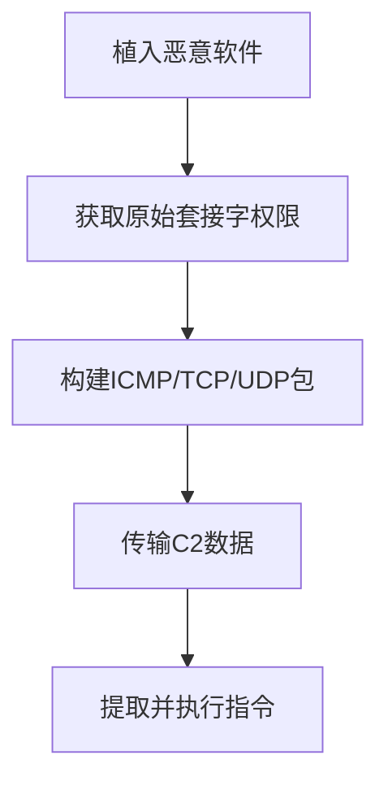

# 非应用层协议 (T1095)

## 一句话通俗理解

就像不走正门走地道——攻击者不用HTTP等应用层协议，而是用ICMP（Ping命令）等底层网络协议传输C2数据，避开应用层防火墙的检查。

## 难度等级

- ⭐⭐ 中级（需要一定基础）

## 技术描述

非应用层协议（Non-Application Layer Protocol）是 MITRE ATT&CK 框架中命令与控制战术下的一种技术，编号为 T1095。

**通俗解释：**
大多数网络安全设备只检查应用层协议（HTTP、DNS、SMTP等），对底层网络协议（ICMP、TCP、UDP）的内容检查较少。攻击者就利用这个"盲区"——把C2指令藏在 ICMP Ping 请求的数据部分、TCP 包的头部字段或 UDP 包的数据段中。这些协议通常是网络正常运行所必需的，防火墙很少拦截。

**技术原理：**
应用层协议在OSI模型的第7层工作，而非应用层协议使用的是第3层（网络层）和第4层（传输层）：
- **ICMP隧道**：在ICMP Echo Request/Reply（Ping）的数据字段中编码C2指令和数据
- **TCP原始套接字**：利用TCP头部的标志位、序列号等字段编码数据
- **UDP隧道**：在UDP数据包的数据段中编码C2 payload

**用途与影响：**
非应用层协议可以绕过基于应用层的流量检查和DPI（深度包检测）。ICMP 隧道特别有效，因为大多数网络环境允许 ICMP 通过而不检查其内容。但这类通信的带宽通常较低，适合低频C2指令传输。

## 子技术列表

**该技术没有子技术。**

## 攻击流程

### 典型攻击流程

```
植入恶意软件 --> 准备原始套接字 --> 构建ICMP/TCP包 --> 传输C2数据 --> 提取指令
```



**步骤详解：**

1. **植入恶意软件**
   - 通俗描述：在被黑系统上运行支持底层协议通信的恶意软件
   - 技术细节：恶意软件需要原始套接字权限
   - 常用工具：ICMPDoor、自定义后门

2. **构建协议包**
   - 通俗描述：将C2指令编码到ICMP Echo请求的数据段
   - 技术细节：构造自定义的 ICMP/TCP/UDP 包
   - 常用工具：原始套接字API

3. **传输与提取**
   - 技术细节：接收端解包提取指令
   - 常用工具：自定义解析代码

## 真实案例

### 案例1：Lazarus Group — ICMP 隧道 C2（2017-2019年）

- **时间**: 2017-2019年
- **目标**: 全球金融机构、加密货币交易所
- **攻击组织**: Lazarus Group
- **手法**: Lazarus 使用 ICMPDoor 恶意软件建立ICMP隧道C2。恶意软件在 ICMP Echo Request/Reply 的数据字段中嵌入C2指令，经过 XOR 加密。数据包大小和频率模拟真实 Ping 操作以规避检测。ICMP 隧道在代理或NAT环境中特别有效，因为ICMP通常不被代理转发。
- **影响**: 多家金融机构和加密货币交易所被入侵
- **参考链接**: [MITRE ATT&CK - G0032](https://attack.mitre.org/groups/G0032/)

### 案例2：Turla — ICMP 和 TCP 原始套接字 C2（2008-2018年）

- **时间**: 2008-2018年
- **目标**: 全球政府、军事、外交机构
- **攻击组织**: Turla（Snake / Uroburos）
- **手法**: Turla 使用 ICMP 和 TCP 原始套接字建立C2通道。早期版本通过ICMP Echo Request的数据段传递指令，Turla 的恶意软件创建隐藏的ICMP隧道，定期向C2发送Ping请求并接收编码在Ping Reply中的指令。同时使用TCP原始套接字发送自定义TCP包，完全绕过应用层。
- **影响**: 全球政府机构长期被监控
- **参考链接**: [MITRE ATT&CK - G0010](https://attack.mitre.org/groups/G0010/)

### 案例3：PlugX — UDP 非标准 C2（2012-2020年）

- **时间**: 2012-2020年
- **目标**: 东南亚政府、军事、媒体机构
- **攻击组织**: PlugX
- **手法**: PlugX RAT 支持使用 UDP 协议进行C2通信。在TCP端口被封锁的环境中，PlugX切换到UDP通道，将编码后的C2命令和响应嵌入UDP数据包。使用自定义加密和编码机制。TCP和UDP双协议支持使PlugX能在多种网络限制下保持通信。
- **影响**: 多个东南亚国家政府机构被入侵
- **参考链接**: [MITRE ATT&CK - S0013](https://attack.mitre.org/software/S0013/)

### 案例4：ExCobalt GoRed — ICMP和DNS隧道C2通信（2024年）

- **时间**: 2024年（2024年3月发现，最早可追溯到2023年7月）
- **目标**: 俄罗斯多个行业的组织（金融、政府、工业）
- **攻击组织**: ExCobalt（从Cobalt犯罪团伙演变而来的网络犯罪集团）
- **手法**: ExCobalt集团使用名为GoRed的Go语言后门进行C2通信。GoRed的一个显著特征是其使用ICMP和DNS隧道的组合进行C2通信。攻击者将C2指令编码在ICMP Echo Request/Reply的数据包数据段中——这些数据包的大小和频率被精心调整以模拟正常的Ping流量。当ICMP通道被阻断时，GoRed自动切换到DNS隧道，将数据编码在DNS查询请求中。此外，GoRed还支持WSS（WebSocket Secure）和QUIC协议作为额外的C2通道，提供了多层次的通信弹性。GoRed通过RPC协议与C2服务器通信，具有凭据收集、数据窃取、系统侦察和执行任意命令的能力。恶意软件通过创建以"BB."开头的环境变量来维持持久化。C2服务器域名包括leo.rpm-bin.link、sula.rpm-bin.link、lib.rest等。
- **影响**: 多家俄罗斯组织机构被入侵，敏感凭据和数据被盗
- **参考链接**: [Positive Technologies ExCobalt分析](https://global.ptsecurity.com/research/pt-esc-threat-intelligence/excobalt-gored-the-hidden-tunnel-technique/) | [Cybersecurity News GoRed报道](https://cybersecuritynews.com/gored-dns-icmp-tunneling-c2-communication/)

## 红队视角

> ⚠️ **免责声明**：以下内容仅用于合法的安全测试、渗透测试和教育目的。未经授权对他人系统进行测试是违法行为。

> ⚠️ **免责声明**：以下内容仅用于合法的安全测试。

### 实战技巧

1. **ICMP 数据包大小**
   标准 Ping 数据包为32字节。C2通信时使用这个默认大小，避免引起注意。固定大小和频率模拟正常ICMP流量。

2. **原始套接字权限**
   Windows Vista+ 默认限制非管理员使用原始套接字。Linux 需要 CAP_NET_RAW 权限。

### 常用工具

| 工具名称 | 用途 | 平台 | 链接 |
|----------|------|------|------|
| ICMPDoor | ICMP隧道工具 | 跨平台 | 开源 |
| Ping Tunnel | ICMP隧道 | Linux | https://github.com/udhos/pingtunnel |
| socat | 多功能隧道 | 跨平台 | http://www.dest-unreach.org/socat/ |

### 注意事项

- ICMP 隧道带宽极低，不适合大量数据传输
- 原始套接字在受限环境中可能不可用

## 蓝队视角

### 检测要点

1. **ICMP 异常检测**
   - 关注字段：ICMP数据包大小、频率、payload内容
   - 异常特征：固定大小且非标准的ICMP数据包、高频率Ping

2. **原始套接字监控**
   - 异常特征：非管理员程序创建原始套接字

## 检测建议

### 网络层检测

**检测方法：** 分析 ICMP 流量的异常模式。

**示例（Suricata规则）：**
```
alert icmp any any -> $HOME_NET any (msg:"异常ICMP数据包大小"; dsize:>100; sid:1000005; rev:1;)
```

### 主机层检测

**检测方法：** 监控原始套接字的创建。

### Sigma规则示例

**Sigma规则示例：**
```yaml
title: ICMP隧道检测（异常流量模式）
status: experimental
description: 检测ICMP数据包大小和频率异常，可能指示ICMP隧道C2通信
logsource:
    category: network
    product: zeek
detection:
    selection:
        protocol: icmp
        icmp_type: 8
    condition: selection
    timeframe: 5m
    | count() > 100
    or dsize > 100
level: medium
tags:
    - attack.t1095
    - attack.command_and_control
```

## 缓解措施

### 优先级1：关键措施

**措施名称：** 限制 ICMP 出站流量

**具体实施步骤：**
1. 在网络边界限制 ICMP Echo Request 出站
2. 启用ICMP深度检测

### MITRE ATT&CK 缓解措施映射

| 缓解措施ID | 缓解措施名称 | 适用性 | 说明 |
|------------|-------------|--------|------|
| M0937 | 网络过滤 | 适用 | 限制ICMP和原始套接字流量 |

## 动手实验

> ⚠️ **重要提示**：所有实验必须在隔离的实验室环境中进行，禁止对未授权的真实系统进行测试。

### 实验1：使用 ICMP 隧道（中级）

**实验目标：** 搭建简单的 ICMP 隧道。

**实验步骤：**
1. 在两台Linux虚拟机之间配置ICMP隧道
2. 通过隧道传输文件
3. 使用 Wireshark 分析ICMP数据包内容

## 术语解释

| 术语 | 英文原名 | 通俗解释 |
|------|----------|----------|
| ICMP | Internet Control Message Protocol | 互联网控制消息协议，Ping命令就使用它 |
| 原始套接字 | Raw Socket | 可以构造任意网络包的特殊套接字 |
| OSI模型 | OSI Model | 网络通信的七层模型 |

## 参考资料

### 官方文档

- [MITRE ATT&CK - T1095](https://attack.mitre.org/techniques/T1095/)
