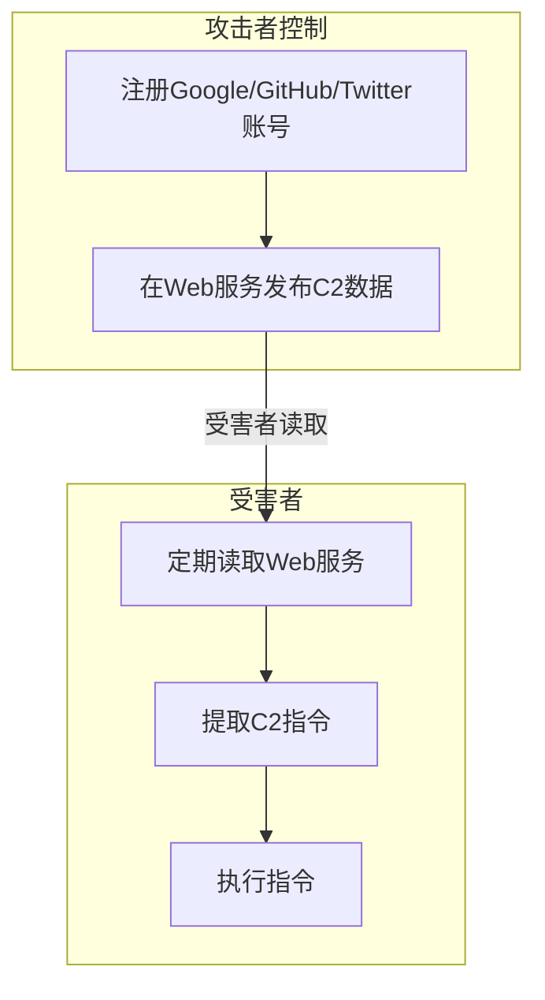

# Web服务 (T1102)

## 一句话通俗理解

就像间谍在公共留言板上用隐形墨水发消息——攻击者利用谷歌文档、博客评论区等Web服务隐藏C2指令，让防御者以为只是普通的上网流量。

## 难度等级

- ⭐⭐ 中级（需要一定基础）

## 技术描述

Web服务（Web Service）是 MITRE ATT&CK 框架中命令与控制战术下的一种技术，编号为 T1102。

**通俗解释：**
攻击者不自己搭建C2服务器，而是把C2指令藏在"第三方Web服务"中——比如在Google Docs里写一篇文档、在Twitter上发一条推文、在博客评论区留一条评论。被黑的电脑定期去读取这些公开的Web服务内容，从中提取C2指令。因为流量指向的都是日常使用的知名Web服务，防火墙几乎不可能封锁。

**技术原理：**
- **基础原理**：攻击者利用公开或半公开Web服务作为C2数据载体
- **数据流**：C2服务器 → 第三方Web服务（发布内容）→ 被黑系统（读取内容）
- **通信方向**：可以是单向（受害者只读）或双向（受害者通过Web服务的API写入数据回复）

**用途与影响：**
因为谷歌、微软、Twitter等服务是企业网络的"必要服务"，将它们列入白名单或允许其流量很正常。Web服务通道几乎不可封锁，通信也完全混合在正常的服务流量中。其隐蔽性极高但响应速度较慢，因为要等待周期性检查。

## 子技术列表

| 子技术ID | 子技术名称 | 一句话说明 |
|----------|-----------|-----------|
| T1102.001 | 死户解析 | 攻击者利用废弃的网站或博客发布C2指令，受害者定期访问获取 |
| T1102.002 | 双向通信 | 攻击者和受害者通过Web服务的API实现双向C2通信 |
| T1102.003 | One-Way Communication | 单向通信，受害者只读地获取C2指令 |

## 攻击流程

### 典型攻击流程

```
注册Web服务 --> 发布C2数据 --> 受害者读取 --> 提取指令 --> 执行
```



**步骤详解：**

1. **注册Web服务**
   - 通俗描述：攻击者创建Google/GitHub/Twitter账号
   - 技术细节：匿名注册，不使用真实身份

2. **发布C2数据**
   - 技术细节：C2指令编码后发布

3. **受害者读取**
   - 技术细节：恶意软件定期访问Web服务API/URL

## 真实案例

### 案例1：Goffee — Slack/Telegram/Cloudflare Workers C2（2024-2025年）

- **时间**: 2024-2025年
- **目标**: 俄罗斯组织
- **攻击组织**: Goffee
- **手法**: Goffee 在2024-2025年的攻击中大量使用第三方Web服务作为C2通道。Mythic agent 将C2指令编码为Slack消息中的特定格式，通过Slack API读取；同时使用Telegram bot API作为备用C2通道。Cloudflare Workers 作为C2前端，将请求转发到后端C2。Goffee还在多个阶段使用 OneDrive 和 Google Drive 作为文件传输通道。
- **影响**: 俄罗斯军工企业被入侵
- **参考链接**: [PT Security - Goffee Group (2025)](https://global.ptsecurity.com/en/research/pt-esc-threat-intelligence/fortune-telling-on-goffee-grounds/)

### 案例2：C3RB3R Stealer — Telegram bot C2（2024年）

- **时间**: 2024年
- **目标**: 全球个人用户
- **攻击组织**: C3RB3R
- **手法**: C3RB3R 信息窃取恶意软件使用 Telegram bot API 作为C2通道。恶意软件在被感染系统上收集凭证、浏览器数据、加密货币钱包等信息后，通过 Telegram bot API 发送到攻击者的Telegram群组。攻击者通过 Telegram bot 发送控制指令——被感染的系统通过轮询bot的更新来接收指令。所有通信通过 Telegram 的公共API，流量与正常Telegram使用无法区分。
- **影响**: 大量用户凭证和加密货币被盗
- **参考链接**: [Zscaler - C3RB3R (2024)](https://www.zscaler.com/blogs/security-research/c3rb3r-infostealer)

### 案例3：TAG-100 — Google Drive + GitHub C2（2024年）

- **时间**: 2024年
- **目标**: 全球外交、政府机构
- **攻击组织**: TAG-100（Google追踪）
- **手法**: TAG-100 使用 Google Drive 作为"死户解析"（dead drop resolver）通道——C2地址编码后存储在Google Drive文档中。恶意软件初始执行时从Google Docs读取加密的C2地址。后续阶段使用 GitHub Pages 作为备用C2信道。Google TAG 的报告显示，TAG-100 还滥用多个其他Web服务（包括Pastebin、Blogger等）构建冗余的C2基础设施。每个Web服务通道使用不同的加密密钥。
- **影响**: 全球多个外交机构被入侵
- **参考链接**: [Google TAG - Threat Horizons (2024)](https://cloud.google.com/blog/topics/threat-intelligence/)

### 案例4：PASS-Driven — AWS/Azure API + SMTP C2（2024-2025年）

- **时间**: 2024-2025年
- **目标**: 全球企业
- **攻击组织**: 中国背景APT
- **手法**: PASS-Driven 使用多个合法Web服务传递C2指令。主要C2：Gmail SMTP（被感染邮箱通过邮件发送/接收C2指令）。备用C2：AWS API Gateway（攻击者在AWS上创建API代理，受害者向API发送HTTP请求）。第三通道：Cloudflare Pages（托管静态JSON配置作为C2指令载体）。PASS-Driven 还利用 Microsoft Graph API 读取OneNote笔记本中的加密数据作为备用。
- **影响**: 全球多个企业被入侵
- **参考链接**: [Unit 42 - PASS-Driven (2025)](https://unit42.paloaltonetworks.com/pass-driven-malware/)

## 红队视角

> ⚠️ **免责声明**：以下内容仅用于合法的安全测试、渗透测试和教育目的。未经授权对他人系统进行测试是违法行为。

> ⚠️ **免责声明**：以下内容仅用于合法的安全测试。

### 实战技巧

1. **Web服务选择**
   选择目标环境中必然允许的Web服务。如果目标使用Google Workspace，优先使用Google服务。

2. **频率控制**
   受害者轮询Web服务的频率设为5-15分钟，与正常用户行为一致。

### 常用工具

| 工具名称 | 用途 | 平台 | 链接 |
|----------|------|------|------|
| Slack API | 消息型C2 | 跨平台 | https://api.slack.com/ |
| Telegram Bot API | bot型C2 | 跨平台 | https://core.telegram.org/bots/api |
| Google Drive API | 文件型C2 | 跨平台 | https://developers.google.com/drive/ |

### 注意事项

- Web服务C2响应速度较慢（受轮询间隔限制）
- 服务账号可能被提供商封禁

## 蓝队视角

### 检测要点

1. **API调用异常**
   - 日志来源：Web代理日志
   - 异常特征：非常规的API调用（如非业务系统的Google Drive API调用）

2. **服务账号行为异常**
   - 异常特征：服务账号在非工作时间访问非业务用的Web服务

### 监控建议

- 监控 Web 代理日志中的异常 API 调用
- 建立正常服务使用基线

## 检测建议

### 网络层检测

**检测方法：** 检测异常 Web API 调用。

**Sigma规则示例：**
```yaml
title: 异常 Web API 调用
status: experimental
logsource:
    category: proxy
detection:
    selection:
        url|contains:
            - 'api.telegram.org'
            - 'slack.com/api'
        user_agent|contains:
            - 'Python'
            - 'curl'
            - 'Go-http'
    condition: selection
level: medium
tags:
    - attack.t1102
```

## 缓解措施

### 优先级1：关键措施

**措施名称：** API 调用监控

**具体实施步骤：**
1. 建立Web服务API调用基线
2. 监控异常API访问

### MITRE ATT&CK 缓解措施映射

| 缓解措施ID | 缓解措施名称 | 适用性 | 说明 |
|------------|-------------|--------|------|
| M0931 | 网络监控 | 适用 | 监控Web服务API流量 |

## 动手实验

> ⚠️ **重要提示**：所有实验必须在隔离的实验室环境中进行，禁止对未授权的真实系统进行测试。

### 实验1：模拟 Telegram bot C2（中级）

**实验目标：** 使用Telegram bot API模拟C2通信。

**实验步骤：**
1. 创建Telegram bot
2. bot发送加密的C2指令
3. 受害者系统读取指令

## 术语解释

| 术语 | 英文原名 | 通俗解释 |
|------|----------|----------|
| 死户解析 | Dead Drop Resolver | 利用废弃的Web服务存储C2地址的解析方式 |
| 轮询 | Polling | 定期检查是否有新数据 |
| API | Application Programming Interface | 应用程序编程接口 |

## 参考资料

### 官方文档

- [MITRE ATT&CK - T1102](https://attack.mitre.org/techniques/T1102/)

### 安全报告

- [PT Security - Goffee Group (2025)](https://global.ptsecurity.com/en/research/pt-esc-threat-intelligence/fortune-telling-on-goffee-grounds/)
- [Unit 42 - PASS-Driven (2025)](https://unit42.paloaltonetworks.com/pass-driven-malware/)
- [Zscaler - C3RB3R (2024)](https://www.zscaler.com/blogs/security-research/c3rb3r-infostealer)
