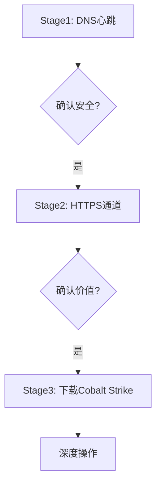

# 多阶段通道 (T1104)

## 一句话通俗理解

就像间谍接头分三步走——先确认身份，再交换暗号，最后才交出情报。攻击者分阶段建立C2连接，每个阶段用不同的通道。

## 难度等级

- ⭐⭐⭐ 高级（需要深入技术知识）

## 技术描述

多阶段通道（Multi-Stage Channels）是 MITRE ATT&CK 框架中命令与控制战术下的一种高级技术，编号为 T1104。

**通俗解释：**
高级攻击者不会"一步到位"建立完整的C2连接。他们把C2通信拆成多个阶段：第一阶段只发送少量心跳数据，像"探路"；确认安全后进入第二阶段，使用更复杂的协议；第三阶段才下载完整的攻击工具。这种"逐步推进"的方式让安全系统很难在一次检测中就发现完整的攻击意图。

**技术原理：**
典型的多阶段C2架构：
- 第一阶段（Stage 1）：初始beacon，简单的心跳检测，从C2接收加密的指示。流量模式简单、体积小，检测难度高。
- 第二阶段（Stage 2）：在收到特定指令后激活，建立额外的通信通道，使用不同的协议和加密方式。
- 第三阶段（Stage 3+）：用于专门的工具传输、数据渗漏等高带宽操作。

各阶段使用不同的基础设施，任一阶段的发现不会影响整体。不同阶段可能使用完全不同的协议和加密方式。

## 子技术列表

**该技术没有子技术。**

## 攻击流程

### 典型攻击流程

```
Stage1: 简单心跳 --> Stage2: 复杂协议 --> Stage3: 工具下载 --> 深度操作
```



**步骤详解：**

1. **Stage1 - DNS心跳**
   - 通俗描述：被黑电脑通过DNS查询发送"我还活着"的信号
   - 技术细节：将系统信息Base64编码后作为子域名查询
   - 常用工具：自定义DNS通道

2. **Stage2 - HTTPS通道**
   - 技术细节：使用HTTPS协议建立加密C2通道
   - 常用工具：自定义HTTP/S协议

3. **Stage3 - 下载工具"
   - 技术细节：下载完整的C2框架（如Cobalt Strike Beacon）
   - 常用工具：Cobalt Strike、Mythic

## 真实案例

### 案例1：SUNBURST — 三阶段C2架构（2020年）

- **时间**: 2020年
- **目标**: 美国政府机构、科技公司
- **攻击组织**: APT29
- **手法**: SUNBURST使用高度精细的三阶段C2架构。Stage1：DNS C2通道注册感染状态，使用DGA生成域名，DNS查询嵌入Base64编码的系统指纹。Stage2：确认系统有价值后切换到HTTPS C2，通过伪造的HTTP请求头编码指令。Stage3：下载Teardrop（Cobalt Strike loader），在内存中注入完整的Beacon，建立第三个独立通道。
- **影响**: SolarWinds供应链攻击，影响极大
- **参考链接**: [MITRE ATT&CK - S0557](https://attack.mitre.org/software/S0557/)

### 案例2：TrickBot — 三阶段C2架构（2016-2022年）

- **时间**: 2016-2022年
- **目标**: 全球金融机构
- **攻击组织**: TrickBot
- **手法**: Stage1：HTTP POST发送系统信息，C2返回JSON配置（备用C2列表、插件地址）。Stage2：下载加密的插件DLL（浏览器凭证窃取、RDP扫描）。Stage3：插件建立独立C2通道，专门传输窃取的数据。
- **影响**: 全球银行系统严重受损
- **参考链接**: [MITRE ATT&CK - S0266](https://attack.mitre.org/software/S0266/)

### 案例3：Goffee — Mythic/Sliver 多阶段部署（2024-2025年）

- **时间**: 2024-2025年
- **目标**: 俄罗斯组织
- **攻击组织**: Goffee
- **手法**: Goffee组织在2024-2025年的攻击中使用多阶段C2。Windows系统：通过DLL侧加载启动 Mythic MiRat 代理，建立HTTPS C2。Linux系统：使用 Nim 编写的 Infinity Loader 解密并执行 Sliver payload，Sliver 再建立独立的加密C2通道。Goffee还使用 DQuic（QUIC隧道）和 BindSycler（SSH隧道）作为额外阶段。
- **影响**: 俄罗斯军工企业被入侵
- **参考链接**: [PT Security - Goffee Group (2025)](https://global.ptsecurity.com/en/research/pt-esc-threat-intelligence/fortune-telling-on-goffee-grounds/)

## 红队视角

> ⚠️ **免责声明**：以下内容仅用于合法的安全测试、渗透测试和教育目的。未经授权对他人系统进行测试是违法行为。

> ⚠️ **免责声明**：以下内容仅用于合法的安全测试。

### 实战技巧

1. **阶段间延迟**
   在不同阶段之间加入随机延迟（数小时到数天），模拟人类操作行为，避免被自动化检测发现。

2. **阶段隔离**
   每个阶段使用不同的C2基础设施和协议，确保单一阶段的暴露不会影响全局。

### 常用工具

| 工具名称 | 用途 | 平台 | 链接 |
|----------|------|------|------|
| Cobalt Strike | 多阶段Beacon | Windows/Linux | https://www.cobaltstrike.com/ |
| Mythic | 多agent支持 | Docker | https://github.com/its-a-feature/Mythic |
| Sliver | 多协议支持 | 跨平台 | https://github.com/BishopFox/sliver |

## 蓝队视角

### 检测要点

1. **通信模式突变**
   - 异常特征：从简单DNS心跳突变到大量HTTPS数据上传
   - 监控：建立终端的通信模式基线，标记突变

2. **进程创建链**
   - 异常特征：下载器创建新进程执行下载的工具

### 监控建议

- 监控通信模式的阶段变化
- 检测进程创建链中的异常

## 检测建议

### 网络层检测

**检测方法：** 监控C2通信从简单心跳到复杂指令的阶段变化特征，包括协议切换、数据包大小突变和通信间隔模式变化。

**具体规则/命令示例：**
```
# 检测C2通信的阶段性变化
zeek -r traffic.pcap | awk '{print $1, $3, $6}' | sort | uniq -c | awk '$1 > 50 && $1 < 500'

# 检测HTTP心跳到数据外传的流量突变
suricata -r traffic.pcap --rule "alert tcp $HOME_NET any -> $EXTERNAL_NET $HTTP_PORTS (msg:\"C2 Stage Transition\"; content:\"POST\"; http_method; sid:1000033;)"
```

### Sigma规则示例：
```yaml
title: 多阶段C2通信检测
status: experimental
description: 检测从简单心跳到复杂通信的突变
logsource:
    category: network
    product: zeek
detection:
    selection:
        http_method: "POST"
        request_body_size: ">10000"
    condition: selection
level: medium
tags:
    - attack.t1104
```

## 缓解措施

### 优先级1：关键措施

**措施名称：** 持续网络监控

**具体实施步骤：**
1. 部署NTA/NDR工具
2. 建立流量基线
3. 配置阶段切换检测

### MITRE ATT&CK 缓解措施映射

| 缓解措施ID | 缓解措施名称 | 适用性 | 说明 |
|------------|-------------|--------|------|
| M0931 | 网络监控 | 适用 | 监控通信模式变化 |

## 动手实验

> ⚠️ **重要提示**：所有实验必须在隔离的实验室环境中进行，禁止对未授权的真实系统进行测试。

### 实验1：模拟多阶段C2通信（高级）

**实验目标：** 使用 Sliver 搭建多阶段C2通道。

**实验步骤：**
1. 第一阶段：配置 HTTPS beacon，仅发送系统指纹
2. 第二阶段：手动批准后，切换到 MTLS beacon
3. 第三阶段：使用扩展功能下载额外工具
4. 在 WireShark 中观察三个阶段的不同流量特征

## 术语解释

| 术语 | 英文原名 | 通俗解释 |
|------|----------|----------|
| 阶段 | Stage | C2通信的不同逻辑步骤 |
| Beacon | Beacon | C2心跳信号，定期发送 |
| 加载器 | Loader | 负责在内存中加载和执行payload的工具 |

## 参考资料

### 官方文档

- [MITRE ATT&CK - T1104](https://attack.mitre.org/techniques/T1104/)
