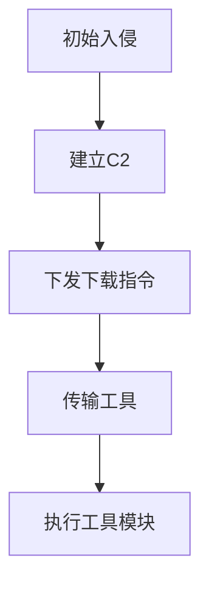

# 工具导入 (T1105)

## 一句话通俗理解

就像小偷进门后从背包里掏出更多作案工具——攻击者通过已经建立的C2通道，把更多攻击工具传送到被黑的电脑上。

## 难度等级

- ⭐ 初级（新手可学）

## 技术描述

工具导入（Ingress Tool Transfer）是 MITRE ATT&CK 框架中命令与控制战术下的一种基础技术，编号为 T1105。

**通俗解释：**
初始入侵时使用的恶意软件通常很小（只有几百KB的"下载器"），只负责建立C2连接。接下来，攻击者需要通过C2通道向被黑电脑传输更多工具——密码窃取器、横向移动工具、键盘记录器等等。这就像先派一个侦察兵潜入目标建筑，然后侦察兵打开后门让大部队进来。工具导入就是"打开后门让大部队进来"的步骤。

**技术原理：**
1. 初始 payload（下载器）建立基础C2通道
2. 攻击者通过C2通道发送指令，指示受感染系统下载后续 payload
3. 后续工具从C2服务器或第三方存储（云服务、CDN）下载
4. 工具下载使用与主C2相同的协议和通道，或使用独立的下载通道
5. 新工具可能直接在内存中执行，不在磁盘上留下痕迹

**用途与影响：**
工具导入是攻击链中从"初始访问"过渡到"纵深操作"的关键步骤。没有它，攻击者只能做有限的操作。通过工具导入，攻击者可以按需部署特定功能的模块化工具，减少初始payload的检测面。

## 子技术列表

**该技术没有子技术。**

## 攻击流程

### 典型攻击流程

```
初始入侵 --> 建立C2 --> 下发下载指令 --> 传输工具 --> 执行模块
```



**步骤详解：**

1. **初始入侵**
   - 通俗描述：通过钓鱼邮件或漏洞利用在被黑电脑上运行下载器
   - 技术细节：下载器体积小（通常<500KB），功能单一
   - 常用工具：各种初始访问手段

2. **建立C2**
   - 通俗描述：下载器连接C2服务器
   - 技术细节：建立HTTPS/DNS等C2连接
   - 常用工具：Cobalt Strike stager、Metasploit

3. **下发下载指令**
   - 通俗描述：C2服务器返回指令，指示下载更多工具
   - 技术细节：指令包含下载地址、加密密钥、执行方式
   - 常用工具：C2框架

4. **传输工具**
   - 通俗描述：从C2服务器下载加密的工具包
   - 技术细节：通过HTTPS下载，AES解密，在内存中加载
   - 常用工具：C2框架的下载功能

## 真实案例

### 案例1：Bumblebee — 模块化HTTPS工具传输（2022-2023年）

- **时间**: 2022-2023年
- **目标**: 全球企业网络
- **攻击组织**: Bumblebee（初始访问代理）
- **手法**: Bumblebee 通过 HTTPS C2通道传输额外模块。初始DLL payload建立C2连接后，以JSON格式发送系统信息。C2返回包含加密模块URL的响应，Bumblebee通过同一HTTPS通道下载加密的DLL模块（包括信息窃取、键盘记录、横向移动模块），在内存中解密执行。每个模块是独立的payload，仅在需要时按需下载。
- **影响**: 多个企业网络被入侵，作为勒索软件的前置通道
- **参考链接**: [MITRE ATT&CK - S0094](https://attack.mitre.org/software/S0094/)

### 案例2：Cobalt Strike — Stager+Stage架构（持续活跃）

- **时间**: 2012年至今
- **目标**: 全球多行业
- **攻击组织**: 多个APT组织
- **手法**: Cobalt Strike 的"stager+stage"分离架构。初始stager（几百字节）仅建立HTTPS连接，从C2下载完整的Beacon DLL（AES加密传输）。后续工具（Kiwi/Mimikatz、PortScan、PowerShell脚本）通过已建立的Beacon通道按需下发执行。2024年Unit 42的报告显示，攻击者从公开仓库复制Malleable C2配置，使stager的流量特征各不相同。
- **影响**: 最受欢迎的C2框架，被全球攻击者大量使用
- **参考链接**: [Unit 42 - Public Cobalt Strike Profiles (2024)](https://unit42.paloaltonetworks.com/attackers-exploit-public-cobalt-strike-profiles/)

### 案例3：APT29 — SUNBURST 多阶段工具传输（2020年）

- **时间**: 2020年
- **目标**: 美国政府机构
- **攻击组织**: APT29
- **手法**: SUNBURST 后门通过SolarWinds更新通道建立C2后，接收加密指令下载 TEARDROP（Cobalt Strike loader），后者再从C2下载完整的Cobalt Strike Beacon到内存执行。整个工具传输链使用了高度定制的加密协议和多层编码。
- **影响**: SolarWinds供应链攻击影响约18000个组织
- **参考链接**: [MITRE ATT&CK - S0557](https://attack.mitre.org/software/S0557/)

### 案例4：APT41 — DUSTPAN + BEACON 工具链（2024年）

- **时间**: 2023-2024年
- **目标**: 全球航运物流、媒体、科技行业
- **攻击组织**: APT41
- **手法**: APT41 在2024年的攻击中使用 Web Shell 执行 certutil.exe 从C2服务器下载 DUSTPAN 下载器。DUSTPAN 随后通过 HTTPS 从C2加载加密的 BEACON 后门到内存。BEACON 使用 ChaCha20 加密，通过 Cloudflare Workers 作为C2通道。Mandiant 的报告显示，APT41 还使用 DUSTTRAP（另一个加载器）从受感染的 Google Workspace 账户下载 payload。
- **影响**: 多个行业数十家组织被入侵
- **参考链接**: [Google Cloud - APT41 Has Arisen From the DUST](https://cloud.google.com/blog/topics/threat-intelligence/apt41-arisen-from-dust)

## 红队视角

> ⚠️ **免责声明**：以下内容仅用于合法的安全测试、渗透测试和教育目的。未经授权对他人系统进行测试是违法行为。

> ⚠️ **免责声明**：以下内容仅用于合法的安全测试。

### 实战技巧

1. **分段传输**
   大型工具分割成小块传输，避免单次传输产生大量流量。设置传输间隔，模拟正常网络活动。

2. **内存执行**
   使用反射加载技术直接加载工具到内存，避免写入磁盘。Cobalt Strike 的 `execute-assembly` 和 `inject` 命令支持内存执行。

### 常用工具

| 工具名称 | 用途 | 平台 | 链接 |
|----------|------|------|------|
| Cobalt Strike | stager+stage架构 | Windows/Linux | https://www.cobaltstrike.com/ |
| Sliver | 按需加载扩展 | 跨平台 | https://github.com/BishopFox/sliver |
| Mythic | 模块化agent | Docker | https://github.com/its-a-feature/Mythic |

### 注意事项

- 传输大型文件可能触发基于流量的检测规则
- 内存执行虽然隐蔽，但部分EDR可以检测

## 蓝队视角

### 检测要点

1. **进程创建链异常**
   - 日志来源：Windows Event ID 4688
   - 异常特征：非标准进程（如Office程序）启动网络下载行为

2. **文件下载异常**
   - 异常特征：从非常规来源下载可执行文件

### 监控建议

- 监控进程创建链中的异常父子关系
- 部署应用白名单限制非授权程序执行

## 检测建议

### 网络层检测

**检测方法：** 监控非浏览器进程下载可执行文件的HTTP/S流量，以及PowerShell、BITSAdmin等工具下载载荷的文件类型和大小特征。

**具体规则/命令示例：**
```
# 检测非浏览器进程的EXE/DLL下载
suricata -r traffic.pcap --rule "alert tcp $HOME_NET any -> $EXTERNAL_NET $HTTP_PORTS (msg:\"Non-Browser EXE Download\"; content:\".exe\"; http_uri; nocase; sid:1000034;)"

# 检测工具传输的流量特征
zeek -r traffic.pcap http.log | grep -E "powershell|bitsadmin|certutil" | grep -v "microsoft.com"
```

### 主机层检测

**检测方法：** 监控非标准进程的网络连接和文件下载。

**Sigma规则示例：**
```yaml
title: 异常进程下载可执行文件
status: experimental
description: 检测非浏览器进程的EXE下载行为
logsource:
    category: process_creation
    product: windows
detection:
    selection:
        Image|endswith: '.exe'
        CommandLine|contains: 'http'
    condition: selection
level: high
tags:
    - attack.t1105
```

## 缓解措施

### 优先级1：关键措施

**措施名称：** 应用白名单

**具体实施步骤：**
1. 配置 AppLocker 或 WDAC
2. 限制脚本执行策略
3. 部署EDR监控内存加载

### MITRE ATT&CK 缓解措施映射

| 缓解措施ID | 缓解措施名称 | 适用性 | 说明 |
|------------|-------------|--------|------|
| M0950 | 应用白名单 | 适用 | 限制未授权程序执行 |

## 动手实验

> ⚠️ **重要提示**：所有实验必须在隔离的实验室环境中进行，禁止对未授权的真实系统进行测试。

### 实验1：模拟工具下载（初级）

**实验目标：** 使用 Sliver 的下载功能传输工具。

**实验步骤：**
1. 在Sliver中生成HTTP模式的payload
2. 执行payload建立C2连接
3. 使用 upload/download 命令传输文件

## 术语解释

| 术语 | 英文原名 | 通俗解释 |
|------|----------|----------|
| Stager | Stager | 小型下载器，只负责连接C2下载完整的恶意软件 |
| 反射加载 | Reflective Loading | 直接从内存加载DLL，不写入磁盘 |
| Payload | Payload | 恶意软件的有效载荷部分 |

## 参考资料

### 官方文档

- [MITRE ATT&CK - T1105](https://attack.mitre.org/techniques/T1105/)

### 安全报告

- [Google Cloud - APT41 (2024)](https://cloud.google.com/blog/topics/threat-intelligence/apt41-arisen-from-dust)
