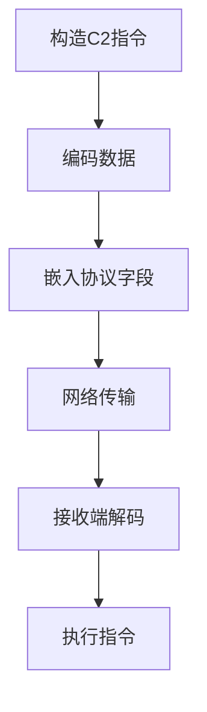

# 数据编码 (T1132)

## 一句话通俗理解

就像用密码本把情报翻译成数字代码——攻击者把C2指令进行Base64等编码转换，让监控系统认不出这是攻击指令。

## 难度等级

- ⭐ 初级（新手可学）

## 技术描述

数据编码（Data Encoding）是 MITRE ATT&CK 框架中命令与控制战术下的基础技术，编号为 T1132。

**通俗解释：**
二进制数据就像"乱码"，在网络中传输可能被安全系统识别为异常或截断。攻击者先把二进制C2指令编码成文本格式（最常见的是 Base64），然后再通过网络发送。这就像把一份机密文件翻译成摩斯密码，就算被人看到也以为是普通信号。编码和加密不同——编码的目标不是保密，而是让数据能在网络中顺利传输并绕过简单的检测规则。

**技术原理：**
1. 攻击者构造C2指令（如"下载并执行某个文件"），这是二进制格式
2. 使用 Base64、Base32、Hex 等编码算法将二进制数据转换成纯文本格式
3. 编码后的数据嵌入到 HTTP 请求的 URI、POST body、Cookie、DNS 查询域名等位置传输
4. 接收方（被黑的电脑或C2服务器）解码这些文本，还原为原始指令执行
5. 多次编码（如 Base64→Base64 二次编码）或编码组合（如 Hex+Base64）可进一步增加检测难度

**用途与影响：**
编码是C2通信中最基础的"伪装"手段。几乎所有恶意软件都会对C2数据进行某种形式的编码。虽然编码本身很容易被解码（不像加密需要密钥），但它能绕过基于原始字节流的简单检测规则。结合其他混淆技术，编码可以使C2流量的特征与正常流量难以区分。

## 子技术列表

**该技术共有 2 个子技术：**

| 子技术ID | 中文名称 | 通俗解释 |
|----------|----------|----------|
| T1132.001 | 标准编码 | 使用 Base64、Base32、Hex 等公开编码算法，编程语言自带支持 |
| T1132.002 | 非标准编码 | 使用自定义编码表（如打乱字符顺序的Base64），没有公开的编码特征 |

<details>
<summary><strong>展开查看各子技术详细说明</strong></summary>

各子技术详细说明请参阅独立文档：

- [T1132.001 - 标准编码](./T1132/T1132.001-Standard-Encoding.md) — 用常见的编码方式给C2数据"化妆"。
- [T1132.002 - 非标准编码](./T1132/T1132.002-Non-Standard-Encoding.md) — 用自己发明的密码表编码，让别人更难破解。

</details>

## 攻击流程

### 典型攻击流程

```
构造C2指令 --> 编码数据 --> 嵌入协议字段 --> 网络传输 --> 接收端解码 --> 执行指令
```



**步骤详解：**

1. **构造C2指令**
   - 通俗描述：攻击者生成要下发的命令，如"收集系统信息"
   - 技术细节：命令以二进制格式打包，包含命令类型、参数、序列号等字段
   - 常用工具：C2框架自动处理

2. **编码数据**
   - 通俗描述：把二进制指令转换成文本格式
   - 技术细节：使用 Base64 编码将二进制数据映射到 `[A-Za-z0-9+/=]` 字符集，使数据看起来像随机文本
   - 常用工具：openssl、Python base64 库

3. **嵌入协议字段"
   - 通俗描述：把编码后的数据放进网络请求的特定位置
   - 技术细节：编码数据放入 HTTP URI 参数（`?data=base64字符串`）、POST body（JSON格式）、Cookie 值等
   - 常用工具：C2框架自动生成

4. **网络传输**
   - 通俗描述：通过网络发送伪装后的数据包
   - 技术细节：使用 HTTPS 加密传输，使编码数据在传输过程中不可见
   - 常用工具：标准网络协议

5. **接收端解码**
   - 通俗描述：收到数据后还原成原始指令
   - 技术细节：从协议字段中提取编码数据，使用相同的算法反向解码得到原始指令
   - 常用工具：内置解码函数

## 真实案例

### 案例1：Flax Typhoon — DNS C2 使用 Base32 编码（2023年）

- **时间**: 2023年
- **目标**: 全球政府机构、高校、研究机构
- **攻击组织**: Flax Typhoon（疑似中国背景）
- **手法**: Flax Typhoon 恶意软件使用 DNS over HTTPS（DoH）进行C2通信，使用 Base32 编码将C2指令转换为 DNS TXT 记录查询的子域名。攻击者选择 Base32 而非 Base64 是因为DNS域名不区分大小写且不允许某些特殊字符。Base32 编码的字母表全部为大写字母和数字（A-Z、2-7），天然适配 DNS 域名字符限制。编码格式为：`<base32_data>.<unique_id>.<c2_domain>`。这种方法使C2查询看起来像是正常的 DNS 解析请求。
- **影响**: 全球多个政府和学术机构数据泄露
- **参考链接**: [MITRE ATT&CK - G1025](https://attack.mitre.org/groups/G1025/)

### 案例2：APT28（Fancy Bear）— XMPP 协议中的 Base64 编码（2016-2021年）

- **时间**: 2016-2021年
- **目标**: 全球政府、军事、媒体组织
- **攻击组织**: APT28（Fancy Bear / Sofacy）
- **手法**: APT28 在 X-Agent 恶意软件中使用 Base64 编码封装C2指令。当攻击者需要通过被感染主机的 XMPP（Jabber）即时消息服务发送C2命令时，恶意软件将二进制命令编码为 Base64 字符串嵌入 XMPP 消息的 `<body>` 元素中。编码后的命令看起来像随机字符序列，在即时消息流量中不易识别。APT28 还使用 Base64 URL-safe 变体（将 `+` 和 `/` 替换为 `-` 和 `_`）编码C2数据嵌入 HTTP URI 参数。
- **影响**: 多个国家政府机构被入侵，大量外交和军事文件被窃取
- **参考链接**: [MITRE ATT&CK - G0007](https://attack.mitre.org/groups/G0007/)

### 案例3：ChromeLoader — 自定义 Base85 编码（2022-2023年）

- **时间**: 2022-2023年
- **目标**: 全球 Chrome 浏览器用户
- **攻击组织**: ChromeLoader
- **手法**: ChromeLoader 广告劫持恶意软件使用非标准 Base85（Ascii85）编码——攻击者修改了标准 Base85 的字符表，将可打印字符集重新排列顺序。解码器内置在恶意软件中，使用逆向字符表解码C2服务器下发的JSON配置。这种自定义编码使 ChromeLoader 的C2流量在流量分析中呈现独特但不被公开规则集识别的编码指纹，传统的签名检测无法发现。
- **影响**: 全球数百万 Chrome 用户的浏览器被劫持，搜索结果被重定向
- **参考链接**: [MITRE ATT&CK - S1068](https://attack.mitre.org/software/S1068/)

## 红队视角

> ⚠️ **免责声明**：以下内容仅用于合法的安全测试、渗透测试和教育目的。未经授权对他人系统进行测试是违法行为。

### 实战技巧

1. **选择合适的编码**
   HTTP 环境中优先使用 Base64URL（URL安全的变体），避免 `+`、`/`、`=` 等特殊字符被 URL 编码或过滤。DNS 环境中使用 Base32，因为 DNS 域名不区分大小写且限制了特殊字符。

2. **多次编码混淆**
   使用 Base64 → Hex 的双重编码可以有效绕过基于正则表达式的 Base64 检测规则。第一次编码将数据变成Base64，第二次变成Hex，解码时需要先Hex再Base64。

3. **动态编码表**
   在恶意软件中硬编码多套编码表，每次通信随机选择一套，或根据时间/日期决定使用哪套，增加检测难度。

### 常用工具

| 工具名称 | 用途 | 平台 | 链接 |
|----------|------|------|------|
| openssl enc | 编码工具 | 跨平台 | OpenSSL 内置 |
| base64 | Linux Base64 编解码 | Linux | 系统内置 |
| Python base64 | Python Base64 库 | 跨平台 | Python 标准库 |
| CyberChef | 在线编码解码工具 | Web | https://gchq.github.io/CyberChef/ |

### 注意事项

- 仅使用编码（无加密）时，流量数据可被任何截获者解码——不要传输敏感信息
- 编码会增加数据大小（Base64 增加约 33%），注意控制 payload 大小
- 自定义编码要避免产生特征的字节分布模式

## 蓝队视角

### 检测要点

1. **高熵字符串检测**
   - 日志来源：HTTP 日志、DNS 日志
   - 关注字段：URI 参数、POST body、Cookie 值
   - 异常特征：出现长度异常的随机字符串、Shannon 熵值高于正常文本

2. **Base64 特征检测**
   - 日志来源：Web 代理日志
   - 关注字段：字符串结尾、字符集范围
   - 异常特征：字符串以 `=` 结尾（Base64 填充符）、只包含 `A-Za-z0-9+/= ` 字符集且长度是 4 的倍数

3. **DNS 编码检测**
   - 日志来源：DNS 服务器日志
   - 关注字段：子域名长度、字符分布
   - 异常特征：子域名包含 Base32 特征字符（大写字母+数字）、子域名超过 30 字符

### 监控建议

- 部署内容解码和重建能力（将编码数据解码后检查）
- 使用熵值分析检测异常的高熵数据段
- 监控 DNS 查询中的异常长子域名

## 检测建议

### 网络层检测

**检测方法：** 分析网络流量中的高熵数据和编码特征。

```
# 检测 URI 参数中的 Base64 编码字符串
字符串长度>50、只包含A-Za-z0-9+/=、以=结尾
```

**示例（Suricata规则）：**
```
alert http any any -> $HOME_NET any (msg:"URI中可能的Base64编码C2数据"; content:"?"; http_uri; pcre:"/[\?&]data=[A-Za-z0-9+\/]{50,}=?/"; sid:1000003; rev:1;)
```

### 主机层检测

**检测方法：** 监控使用编码库的异常进程。

**Windows事件ID：**
- 事件ID 4688：检测使用 certutil.exe 进行 Base64 编码的异常行为

**具体命令示例：**
```bash
# 检测 certutil 的 Base64 解码使用（合法运维也使用，需结合上下文）
certutil -decode <输入文件> <输出文件>
```

### 应用层检测

**Sigma规则示例：**
```yaml
title: 异常的高熵 HTTP 参数
status: experimental
description: 检测 HTTP 参数中出现异常的高熵值
logsource:
    category: web
    product: generic
detection:
    selection:
        param_name: "data"
        param_length: ">100"
    condition: selection
level: medium
tags:
    - attack.t1132
```

## 缓解措施

### 优先级1：关键措施

**措施名称：** 部署内容解码和检测

**具体实施步骤：**
1. 在网络网关处部署支持内容解码的检测设备
2. 配置规则解码常见的编码（Base64、Base32、Hex）
3. 对解码后的内容进行恶意模式匹配检查

### 优先级2：重要措施

**措施名称：** 应用层深度检测

**具体实施步骤：**
1. 启用 WAF/IPS 的应用层解码功能
2. 配置内容安全检查策略

### MITRE ATT&CK 缓解措施映射

| 缓解措施ID | 缓解措施名称 | 适用性 | 说明 |
|------------|-------------|--------|------|
| M0931 | 网络监控 | 适用 | 部署网络流量监控和异常检测 |
| M0937 | 网络过滤 | 部分适用 | 配置应用层过滤规则 |

## 动手实验

> ⚠️ **重要提示**：所有实验必须在隔离的实验室环境中进行，禁止对未授权的真实系统进行测试。

### 实验环境准备

**所需工具：**
- Python3
- CyberChef（可选）
- Wireshark

### 实验1：Base64 编解码操作（初级）

**实验目标：** 掌握 Base64 编解码的基本操作。

**实验步骤：**
1. 使用 Python 对字符串进行 Base64 编码
2. 观察编码后的字符串特征
3. 解码还原原始数据

**预期结果：** 理解 Base64 编码的工作原理和特征。

### 实验2：在 HTTP 请求中隐藏编码数据（中级）

**实验目标：** 将编码后的C2指令嵌入 HTTP 请求。

**实验步骤：**
1. 构造一个包含编码指令的 HTTP GET 请求
2. 使用 Wireshark 抓包观察
3. 编写解码脚本提取指令

**预期结果：** 理解如何在实际网络流量中传输编码数据。

## 术语解释

| 术语 | 英文原名 | 通俗解释 |
|------|----------|----------|
| Base64 | Base64 Encoding | 把二进制数据变成文本的编码方式，结果只包含A-Za-z0-9+/= |
| Base32 | Base32 Encoding | 类似Base64但结果只含大写字母和数字，适合DNS域名 |
| Hex/十六进制 | Hexadecimal | 每个字节变成两位十六进制数（如FF、1A），直观但数据量翻倍 |
| 熵值 | Entropy | 衡量数据"随机程度"的指标，高熵通常意味着加密或编码数据 |
| 编码表 | Encoding Table | 编码使用的"密码表"，定义了二进制值到字符的映射关系 |

## 参考资料

### 官方文档

- [MITRE ATT&CK - T1132](https://attack.mitre.org/techniques/T1132/)
- [MITRE ATT&CK - T1132.001](https://attack.mitre.org/techniques/T1132/001/)
- [MITRE ATT&CK - T1132.002](https://attack.mitre.org/techniques/T1132/002/)
