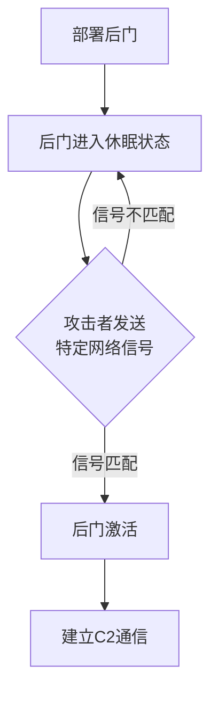

# 流量信号 (T1205)

## 一句话通俗理解

就像特工用"敲三下门、停一下、再敲两下"的暗号进入秘密据点——攻击者发送特定序列的网络包来激活被黑电脑上的C2后门。

## 难度等级

- ⭐⭐⭐ 高级（需要深入技术知识）

## 技术描述

流量信号（Traffic Signaling）是 MITRE ATT&CK 框架中命令与控制战术下的一种高级技术，编号为 T1205。

**通俗解释：**
被黑电脑上的后门软件平时是"休眠"的——它不监听任何端口，也不主动出站连接。只有攻击者向目标系统发送指定序列的网络包（特定端口、顺序、数据特征的组合）后，后门才被"唤醒"，开始建立C2连接。这种技术让后门在休眠时完全隐形（没有端口、没有进程、没有连接），RST扫描和端口扫描都无法发现它。

**技术原理：**
- **端口敲门**（T1205.001）：预先定义端口连接序列（如TCP 1234→2345→3456），后门监控系统日志或抓包接口检测序列匹配后开放临时端口
- **套接字过滤器**（T1205.002）：后门在系统底层设置过滤器，捕获符合特定特征的网络包后触发C2行为

## 子技术列表

| 子技术ID | 子技术名称 | 一句话说明 |
|----------|-----------|-----------|
| T1205.001 | 端口敲门 | 攻击者按顺序访问特定端口来"敲门"，后门检测到正确序列后激活 |
| T1205.002 | 套接字过滤器 | 后门在底层设置过滤器捕获符合特征的网络包，匹配后触发激活 |

## 攻击流程

### 典型攻击流程

```
部署后门 --> 后门休眠 --> 发送信号 --> 后门激活 --> C2通信
```



**步骤详解：**

1. **部署后门**
   - 通俗描述：在被黑系统上安装带端口敲门的后门
   - 技术细节：后门只监控网络包，不监听端口

2. **休眠状态**
   - 技术细节：无开放端口，无出站连接

3. **发送信号**
   - 技术细节：发送特定序列的网络包

4. **激活后门**
   - 技术细节：后门开放端口或建立出站连接

## 真实案例

### 案例1：Cobalt Strike — 端口敲门 beacon 配置（持续活跃）

- **时间**: 2012年至今
- **目标**: 全球多行业
- **攻击组织**: 多个APT组织
- **手法**: Cobalt Strike 的 Malleable C2 配置文件支持端口敲门功能。攻击者可以配置 beacons 在接收特定序列的TCP连接后激活，或者在特定HTTP请求头匹配后触发C2行为。Malleable C2配置中还可以设置"metadata"参数作为额外的过滤器。
- **影响**: Cobalt Strike是最广泛使用的C2框架之一
- **参考链接**: [Cobalt Strike - Malleable C2](https://hstechdocs.helpsystems.com/manuals/cobaltstrike/current/usermanual/content/topics/malleable-c2_4_configuration.htm)

### 案例2：Crimson RAT — 端口敲门激活（2023-2024年）

- **时间**: 2023-2024年
- **目标**: 中东政府机构
- **攻击组织**: Crimson（疑与Transparent Tribe关联）
- **手法**: Crimson RAT 使用端口敲门技术隐藏C2通道。RAT在被感染的系统上运行后，进入监听状态但不开放端口。攻击者发送特定的TCP序列（通常是2-4个不同端口的连接）触发RAT激活。激活后RAT向外连接到一个预定义的C2服务器。端口敲门序列和C2地址在RAT编译时硬编码。
- **影响**: 中东政府机构系统被长期监控
- **参考链接**: [Zscaler - Crimson RAT (2023)](https://www.zscaler.com/blogs/security-research/crimson-rat)

### 案例3：Derusbi — 端口敲门后门（2010-2020年）

- **时间**: 2010-2020年
- **目标**: 全球政府、军事机构
- **攻击组织**: 多个APT组织
- **手法**: Derusbi 后门家族的一个变种使用端口敲门来隐藏C2活动。后门在Windows系统上作为服务安装，默认处于非活动状态。当攻击者向目标IP发送指定序列的UDP数据包后，后门被激活并开始监听TCP端口。端口敲门序列包括5个不同的UDP数据包。如果在12小时内没有收到敲门信号，后门自动返回休眠。
- **影响**: 主要针对政府机构
- **参考链接**: [Mandiant - Derusbi](https://www.mandiant.com/resources/derusbi)

## 红队视角

> ⚠️ **免责声明**：以下内容仅用于合法的安全测试、渗透测试和教育目的。未经授权对他人系统进行测试是违法行为。

> ⚠️ **免责声明**：以下内容仅用于合法的安全测试。

### 实战技巧

1. **敲门序列设计**
   使用3-5个端口敲门，序列设计避免频繁重试。使用TCP SYN包和UDP包组合增加隐蔽性。

2. **套接字过滤器实现**
   使用libpcap或Windows Filtering Platform。

### 常用工具

| 工具名称 | 用途 | 平台 | 链接 |
|----------|------|------|------|
| knockd | 端口敲门工具 | Linux | https://github.com/jvinet/knock |
| Cobalt Strike | 内置端口敲门 | Windows/Linux | https://www.cobaltstrike.com/ |

### 注意事项

- 端口敲门序列可能被入侵检测系统重放
- 实现不当可能导致敲门序列在传输中被篡改

## 蓝队视角

### 检测要点

1. **异常端口连接序列**
   - 日志来源：防火墙日志
   - 异常特征：短时间内对多个不同端口的失败连接

2. **套接字过滤器的安装**
   - 异常特征：非网络程序安装网络过滤器

### 监控建议

- 监控短时间内的多端口连接模式
- 检查异常的套接字过滤器

## 检测建议

### 网络层检测

**检测方法：** 检测异常的端口连接序列。

**Snort规则示例：**
```
alert tcp $EXTERNAL_NET any -> $HOME_NET 1000:2000 (msg:"可能的端口敲门序列"; flags:S,12; threshold:type both, track by_src, count 5, seconds 10; sid:1000002;)
```

### Sigma规则示例

**Sigma规则示例：**
```yaml
title: 端口敲门序列检测（流量信令）
status: experimental
description: 检测短时间内对多个不同端口的连接尝试，可能是C2端口敲门信令
logsource:
    category: network
    product: zeek
detection:
    selection:
        proto: tcp
    timeframe: 10s
    condition: selection | count() by src_ip > 5
level: high
tags:
    - attack.t1205
    - attack.command_and_control
```

## 缓解措施

### 优先级1：关键措施

**措施名称：** 端口敲门序列检测

**具体实施步骤：**
1. 部署端口敲门检测规则
2. 限制非常用端口的访问

### MITRE ATT&CK 缓解措施映射

| 缓解措施ID | 缓解措施名称 | 适用性 | 说明 |
|------------|-------------|--------|------|
| M0937 | 网络过滤 | 适用 | 监控端口敲门活动 |

## 动手实验

> ⚠️ **重要提示**：所有实验必须在隔离的实验室环境中进行，禁止对未授权的真实系统进行测试。

### 实验1：配置端口敲门（高级）

**实验目标：** 配置 knockd 实现端口敲门激活。

**实验步骤：**
1. 在 Linux 服务器安装 knockd
2. 配置敲门序列
3. 使用 knock 客户端发送序列
4. 验证端口开放

## 术语解释

| 术语 | 英文原名 | 通俗解释 |
|------|----------|----------|
| 端口敲门 | Port Knocking | 通过访问特定端口序列激活服务 |
| 套接字过滤器 | Socket Filter | 捕获特定网络包的底层机制 |

## 参考资料

### 官方文档

- [MITRE ATT&CK - T1205](https://attack.mitre.org/techniques/T1205/)
